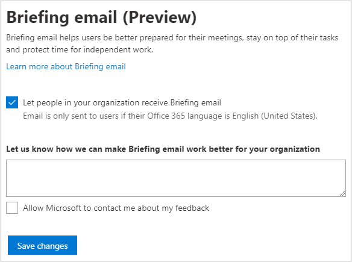

---

title: Configure Briefing email
description: Steps for admins to configure Briefing email for their organization
author: madehmer
ms.author: v-mideh
ms.topic: article
localization_priority: normal 
ms.prod: mya
ms.collection: M365-analytics
manager: scott.ruble
audience: Admin
---

# Configure Briefing email

As the admin, you can configure Briefing email for your organization at the [user](#user-level-configuration) or [tenant level](#tenant-level-configuration). You can set the default state for all users in your tenant as opted in or opted out in the Microsoft 365 admin center, or you can enable or disable the Briefing email for a specific user or multiple users with PowerShell.

## Prerequisites

Confirm the following before configuring access:

* **Exchange or Global admin role** - You must have either an Exchange Administrator or a Global Administrator role to configure users for Briefings.
* **Licensed users only** - Users get access to the Briefing email only if they have licenses that include the Exchange Online service plan.
* **Understand data privacy** - See the [Privacy guide](be-privacy.md) to understand how privacy is built into Briefing emails and to learn what you can configure to address your organization's specific privacy requirements.

## User-level configuration

Confirm the following additional prerequisites. Then you can use the Exchange Online PowerShell V2 module to set Briefing email access [for one user](#set-access-for-one-user) or [for multiple users](#set-access-for-multiple-users).

### Additional prerequisites

* **Install the required module** - [Install the Exchange Online PowerShell V2 module](https://docs.microsoft.com/powershell/exchange/exchange-online/exchange-online-powershell-v2/exchange-online-powershell-v2#install-and-maintain-the-exchange-online-powershell-v2-module).
* **.NET Framework** - You must have [.NET Framework 4.7.2](https://dotnet.microsoft.com/download/dotnet-framework) or the latest available version installed.

> [!Important]
> Before configuring access, confirm you're connected to [Exchange Online](https://docs.microsoft.com/powershell/exchange/exchange-online/exchange-online-powershell-v2/exchange-online-powershell-v2?view=exchange-ps#connect-to-exchange-online-using-the-exo-v2-module).

### Set access for one user

To enable or disable Briefing email for a specific user, use the Exchange Online PowerShell V2 module and the following command line, where you replace "joe@contoso.com" with your applicable username and organization:

```powershell
Set-UserBriefingConfig -Identity joe@contoso.com [-Enabled [<$true | $false>]
```

- If you set the **Enabled** parameter to **$false**, the Briefing email will be **Off** for that user. The user will not be able to override this setting or opt-in to the Briefing email.
- If you set the **Enabled** parameter to **$true**, the Briefing email will be **On** for that user. Users can then opt-out from [cortana.office.com](https://cortana.office.com). If no action occurs, this setting applies by default.

> [!Note]
> When **Enabled** is set as **$true**, people who had previously unsubscribed will continue to be opted out and will not receive any Briefings until they opt back in at [cortana.office.com](https://cortana.office.com).

For example, to get the current state of the Briefing email flag for "joe@contoso.com," you'd use:

```powershell
Get-UserBriefingConfig -Identity joe@contoso.com
```

### Set access for multiple users

You can also enable or disable Briefing email for multiple users with a PowerShell script that iterates through the users, changing the value one user at a time. Use the following script to:

* Create a .csv file with all users that were processed with their current status.
* List the user principal name for each user.
* Set the specified **Enabled** parameter for each user.

1. Create a comma-separated value (.csv) text file that contains the Identity of the users you want to configure. For example:

   ```powershell
   Identity
   ClaudeL@contoso.com
   LynneB@contoso.com
   ShawnM@contoso.com
   ```

2. Specify the location of the input .csv file, the output .csv file, and the value of **Enabled** to **$true** or **$false** for each user:

   ```powershell
   $inFileName="<path and file name of the input .csv file that contains the users, example: C:\admin\Users2Opt-in.csv>"
   $outFileName="<path and file name of the output .csv file that records the results, example: C:\admin\Users2Opt-in-Done.csv>"
   $briefingEmailMode = $true

   $users=Import-Csv $inFileName
   ForEach ($user in $users)
   {
   $user.identity
   $upn=$user.identity
   Set-UserBriefingConfig –Identity $upn -Enabled $briefingEmailMode
   Get-UserBriefingConfig –Identity $upn | Export-Csv $outFileName -Append
   }
   ```

3. Run the resulting commands at the Exchange Online PowerShell V2 module command prompt.

## Tenant-level configuration

> [!Note]
> Users can choose to opt out or back in at any time at [cortana.office.com](https://cortana.office.com). After you change the Briefing setting in the admin center, it will take 24 hours for the new setting change to take effect.

As the admin, use the following steps to change the setting for Briefing email at the tenant level. This setting is enabled by default, so that all users who have an Exchange Online license and their Office language is English will receive the Briefing email.

Users can unsubscribe individually from within any Briefing email they receive. If you disable the Briefing email at the tenant level, users in your organization will not receive the Briefing email, but individual users can override this tenant-level setting. To completely prevent a user from receiving the Briefing email, you must disable the Briefing email for that user with PowerShell.

### To configure access for a tenant

1. Sign in to the [Microsoft 365 admin center](https://admin.microsoft.com/Adminportal).
2. Make sure you're using the new admin center. To do this, if the switch in the upper right of the page reads **Try the new admin center**, select it so that it reads **The new admin center**:

    

3. In the left pane, expand **Settings**, and then select **Org Settings**.
4. Under **Org Settings**, select **Briefing email (Preview)**.
5. Select or deselect the checkbox for **Let people in your organization receive the Briefing email**, and then select **Save changes**. If you deselect the checkbox, all users in your organization will not receive Briefing email and individual users can override this setting.

   

<!--### To configure access in PowerShell

You can enable or disable the Briefing email for all users in your organization at the tenant level. Use the following Exchange Online PowerShell cmdlets to set the tenant default:

  ```powershell
  Set-OrganizationIntelligenceConfig [-BriefingEmailDefault [<"Opt-in" | "Opt-out">]
  ```

   * If you set **BriefingEmailDefault** parameter to **Opt-out**, the Briefing email will be Off by default for your organization. Users can then opt-in at [cortana.office.com](https://cortana.office.com).
   * If you set **BriefingEmailDefault** parameter to **Opt-in**, the Briefing email will be On by default for your organization. Users can then opt-out at [cortana.office.com](https://cortana.office.com). If no action is taken, this setting applies by default.

To get the current state of the Briefing email setting, use:

```powershell
Get-OrganizationIntelligenceConfig
```
-->
## Related topics

* [Briefing email overview](be-overview.md)
* [Use the Exchange Online PowerShell V2 module](https://docs.microsoft.com/powershell/exchange/exchange-online/exchange-online-powershell-v2/exchange-online-powershell-v2)
