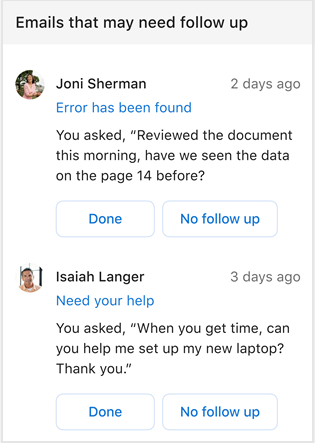

---

ROBOTS: NOINDEX,NOFOLLOW
title: Follow up on email with the Briefing email
description: Learn how to use the Briefing email to follow up on any outstanding emails
author: madehmer
ms.author: madehmer
ms.topic: article
localization_priority: normal 
ms.prod: mya

---
# Follow up on email

This section shows what you asked for from someone else in an email and might not have followed up on yet. You can select the email heading to open it and review or follow up on it.

If you get the [Adaptive email version](be-overview.md#adaptive-or-html-version), you can also do the following:

* If you got what you needed or followed up, select **Done**.
* Or if the suggestion isn’t actionable or you weren’t expecting a response to your request, select **No follow-up** to help improve future suggestions.

In the following example, you’d select **Need your help** to open and follow up on that email or select **Done** if Isaiah had already helped you with your laptop.

   

## Related topics

[Briefing email overview](be-overview.md)