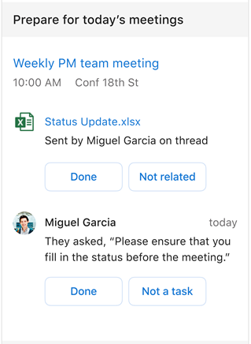

---

ROBOTS: NOINDEX,NOFOLLOW
title: Prepare for meetings with the Briefing email
description: Learn how to use the Briefing email to prepare for upcoming meetings
author: madehmer
ms.author: madehmer
ms.topic: article
localization_priority: normal 
ms.prod: mya

---
# Prepare for upcoming meetings

In this section of your Briefing email, you’ll see today's first three meetings chronologically that have at least one suggested action. You can select the meeting heading to open the meeting details or select a document that’s related to the upcoming meeting to open and view it.

With the [Adaptive email version](be-overview.md#adaptive-or-html-version), you can also do the following to help prepare for today's meetings:

* If you got what you needed or you've already followed up on this item, select **Done**.
* Or if the suggestion isn’t related or actionable, select **Not related** or **Not a task** to help improve future suggestions.

In the following example, you’d select **Weekly PM meeting** to open the meeting details or select the related **Status update** document to open and view it.

   

<!-- ## Reschedule for low acceptance

As a meeting organizer, your Briefing alerts you to a meeting that is at risk of having low attendance.

Meetings with low attendance may be less productive because decisions can't be made without key decision-makers in attendance. You might have to repeat the meeting or share similar information again for those who do not attend.

### Why am I seeing this?

* You are the organizer of the meeting.
* 50 percent or more of required invitees have declined the invitation.
* The meeting duration is less than eight hours.
* The meeting is set as “busy.”
* The meeting has less than 30 invitees.
* The meeting occurs on the same day as your latest Briefing email.

You can select **Reschedule** to open the meeting invite and schedule it for a different time.

## Add Teams link

When scheduling a meeting, a common mistake is forgetting to include online meeting information for remote attendees. Online meeting access is important because it:

* Enables you to include remote collaborators or those working in other locations.
* Helps meetings start on time.
* Enables you to record meetings and present information to remote attendees.
* Having a single-select correction also saves you time and stress before and at the start of meetings.

### Why am I seeing this?

* You are the organizer of the meeting.
* You have an active Teams license.
* The meeting currently does not have a Teams or Skype for Business online meeting link.
* The meeting duration is one hour or less.
* The meeting is set as “busy.”
* The meeting occurs on the same day as the most recent Briefing email.

When you select **Add Teams**, Cortana adds a Teams meeting link to the meeting invite for you, so you don't have to open the meeting to add it and automatically sends an updated invite to all invitees.

## Add agenda

Agenda can help attendees understand what to expect out of a meeting, what prep is required, and what the outcome of the meeting should be. It’s a key step and a best practice for meeting preparation.

### Why am I seeing this?

* You are the organizer of the meeting.
* The meeting body was empty (does not include any text related to a Teams online meeting link).

Selecting **Add agenda** sends a reply to the scheduled meeting.

## RSVP to a meeting with no conflicts

It is a best practice to let organizers know if you will attend their meeting so that they can plan accordingly. Briefing focuses on smaller meetings where it might be more likely that your attendance is required.

### Why am I seeing this?

* You are a required attendee of the meeting.
* You have not responded to the invitation.
* If the meeting is not recurring and the meeting instance does not conflict with another meeting.
* If the meeting is recurring and the meeting series does not conflict with another meeting series.
* The meeting has equal to or less than 18 invitees.
* The meeting duration is less than eight hours.
* The meeting occurs on the same day as this Briefing email.

You can **Accept** or **Decline** a meeting in the Briefing email. If the meeting is recurring, **Accept** and **Decline** are for the series. **Accept** and **Decline** are sent as a response to the organizer. After declining, you can still see and interact with content for this meeting in the Briefing email.

## RSVP to a meeting with conflicts

Again, it’s best to let organizers know if you will attend their meeting so they can plan accordingly.

### Why am I seeing this?

* You were invited to or have organized two non-declined meetings that overlap for 15 minutes or more, except for the following:

   * Meetings with more than one conflict.
   * Meetings that were both organized by you.
   * Meetings that you already replied to the invite with a custom message.
   * Cases where both meetings are recurring (but Briefing will still show the meeting conflict in the meeting details section).

* If you are an attendee and are a required attendee for either of the overlapping meetings.
* If you are an attendee and the meeting has equal to or less than 18 invitees in each of the overlapping meetings.
* The meeting duration of each of the overlapping meetings is less than eight hours.
* The meetings occur on the same day as the Briefing email.

You will see the following actions for a meeting depending on the type of conflict you have with the meeting.

|Scenario |Meeting details |Reason |Action |
|---------|----------------|-------|-------|
|Late reply	|This meeting conflicts with [Meeting title] at [start time] to [end time]. |Let [organizer] know if you will be late |Reply
|Leave early reply |This meeting conflicts with [Meeting title] at [start time] to [end time]. |Let [organizer] know if you need to leave early. |Reply|
|Decline or late reply |This meeting conflicts with [Meeting title] at [start time] to [end time]. |Let [organizer] know if you can’t make it or if you will be late. |Decline or Reply
|Decline or leave early reply	|This meeting conflicts with [Meeting title] at [start time] to [end time]. |Let [organizer] know if you can’t make it or if you will need to leave early. |	Decline or Reply |
|Accept or decline |This meeting conflicts with [Meeting title] at [start time] to [end time]. |Let [organizer] know if you will attend. |Accept or Decline |

Selecting **Accept** or **Decline** accepts or declines the meeting invite (even if it is a recurring meeting) and sends the response to the organizer. Selecting **Reply** opens a response to the meeting invite.
-->
## Related topics

[Briefing email overview](be-overview.md)
