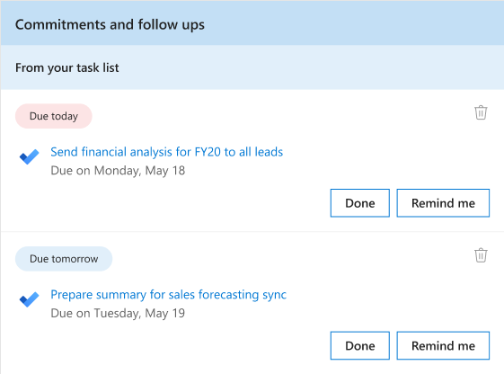
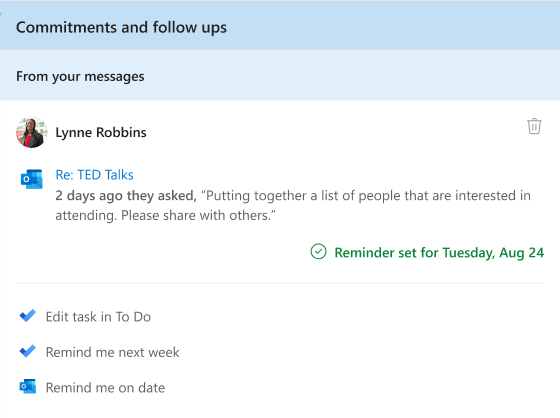

---

title: Follow up on tasks with the Briefing email
description: Learn how to use the Briefing email to get today's tasks done
author: madehmer
ms.author: v-mideh
ms.topic: article
localization_priority: normal 
ms.prod: Mya

---
# Follow up on tasks

For **Commitments and follow-ups** in your Briefing, you'll see one or more of the following based on your recent email activity:

* **Commitment** - Something you promised or committed to do for someone else in an email.
* **Request** - Something another person asked you to do in an email.
* **Follow-up** - Something you asked for from someone else in an email.

If you get the [Adaptive email version](be-overview.md#adaptive-or-html-version), you can also do the following:

* If the related task is already done, select **Done**.
* Depending on your use of the To Do feature, you select either **Remind me tomorrow** or **Add to To Do** for the related task.
* To remove it from your list, select the **Delete** (trashcan) icon.

In the following example, you’d select **Done** to confirm you’ve already done the task related to **TED Talks**. Or you could select **Remind me tomorrow** to get a reminder in your next day's briefing email.

Or if you use the To Do feature, you could select **Add to To Do**.

## Related topics

[Briefing email overview](be-overview.md)