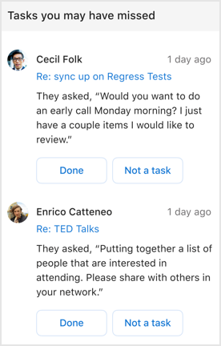

---

ROBOTS: NOINDEX,NOFOLLOW
title: Follow up on tasks with the Briefing email
description: Learn how to use the Briefing email to get today's tasks done
author: madehmer
ms.author: madehmer
ms.topic: article
localization_priority: normal 
ms.prod: mya

---
# Follow up on tasks

In the **Tasks you may have missed** section of your Briefing email, a task can be one of the following that you got and might have missed in email:

* **Commitment** - something you promised or committed to do for someone else in an email
* **Request**- something another person asked you to do in an email
* **Follow-up** - something you asked for from someone else in an email

If you get the [Adaptive email version](be-overview.md#adaptive-or-html-version), you can also do the following:

* If the related task is already done, select **Done**.
* Or if the task suggested is not an actionable task, select **Not a task** to help improve future suggestions.

In the following example, you’d select **TED Talks** to open the email from Enrico or select **Done** to confirm you’ve already done the related task.

   

## Related topics

[Briefing email overview](be-overview.md)