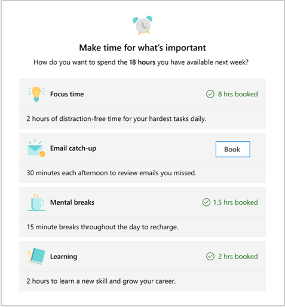

---

title: Plan your week with the Briefing email
description: Learn how to use the Briefing email to schedule time to focus, catch up on email, and more
author: madehmer
ms.author: v-mideh
ms.topic: article
localization_priority: normal 
ms.prod: Mya

---
# Plan time for the week

If you get the [Adaptive email version](be-overview.md#adaptive-or-html-version), you'll see a **What do you want to set aside time for** section in a Briefing email about next week. This helps you plan the week ahead for important activities, such as time management habits that improve long term productivity and wellbeing.

Select **Book** next one or more of the following to schedule it for the week:

* **Focus time** - Suggests up to two-hour blocks of time available on your calendar for uninterrupted focused work. When scheduled, your status shows as "focusing" and notifications are silenced.
* **Catch up on messages** - Suggests a 30-minute block of time to catch up on email and chats.
* **Take a break** - Suggests a 15-minute block of time twice a day to disconnect and recharge.
* **Learning** - Suggests up to a two-hour block of time to learn a new skill and grow your career.

This section will also reference and list any already scheduled time in your calendar for these activities.

In the following, you’d select **Book** for **Catch up on messages** to schedule you as **busy** during that time each day during your work week.

   

## Related topics

[Briefing email overview](be-overview.md)
