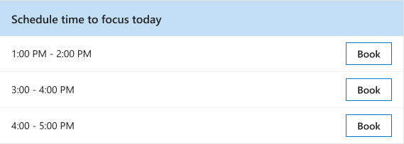

---

title: Book time with the Briefing email
description: Learn how to use the Briefing email to schedule time for what's most important
author: madehmer
ms.author: v-mideh
ms.topic: article
localization_priority: normal 
ms.prod: Mya

---
# Make time for what's important

If you get the [Adaptive email version](be-overview.md#adaptive-or-html-version), you can use this section to schedule time for the day or plan ahead for the week's top-priority work.

In the **Make time for what's important** section of your Briefing email, select **Book** next one or more of the following to schedule it:

* **Focus time** - Suggests up to two-hour blocks of time available on your calendar for uninterrupted focused work. When scheduled, your status shows as "focusing" and notifications are silenced.
* **Email catch-up** - Suggests 30-minute blocks of time to catch up on email and chats.
* **Mental breaks** - Suggests 15-minute blocks of time twice a day disconnect and recharge.
* **Learning** - Suggests up to two-hour blocks of time to learn a new skill and grow your career.

This section will also reference and list any already scheduled time in your calendar.

In the following example, you’d select **Book** next to **3:00 PM – 4:00 PM** to schedule you as **busy** during that time on today’s calendar.

   

## Related topics

[Briefing email overview](be-overview.md)