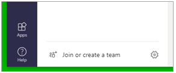
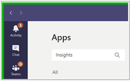

# Install the Microsoft Viva Insights app

This section describes how to install the Microsoft Viva Insights app for yourself. (If you are an admin who is tasked with installing the Viva Insights app for an organization, see [Admin tasks](teams-app-admin-tasks.md).)  

1. Open Microsoft Teams on the web or in a desktop client. 

2. At the bottom of the Microsoft Teams app bar (on the left), select **Apps**: 

   
 
3. In the search field under **Apps**, type **Insights**:
   
   

4. Select the **Insights** app:

   

5. Select **Add for me**:

   

This adds the app to all the places where you might use Microsoft Teams, including the Teams desktop client, Teams on the web, and Teams on a mobile device.   

> [!Note] 
> You can also locate the Insights app through this link: https://aka.ms/InsightsTeamsApp. 

### Pin the app 

After you pin a Teams app, it appears on the Teams app bar (the left navigation bar). 

#### On desktop and web client 

1. Select **More** (the ellipsis) on the Microsoft Teams app bar.  

2. Right-click any app icon and select **Pin** () to make and keep your app visible in the Teams app bar. 
   
   

> [!Tip] 
> You can reorder apps in the Teams app bar by dragging and dropping icons. For more information about pinning and unpinning apps in Microsoft Teams, see [Pin an app for easy access](https://support.microsoft.com/en-us/office/pin-an-app-for-easy-access-3045fd44-6604-4ba7-8ecc-1c0d525e89ec). 
 
#### On the iOS and Android mobile platforms

1. Select **More** (the ellipsis) on the Microsoft Teams app bar.  

2. Select **Reorder** and drag and drop the app so it is no longer in the More section. 

   

3. Select **Done** to save your changes. 

## Related topics

[Microsoft Viva Insights app &ndash; Overview](teams-app.md)
