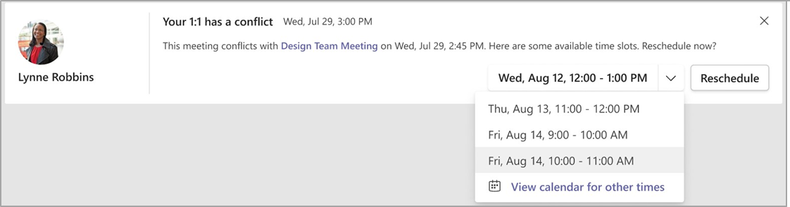
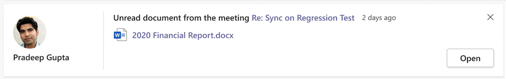
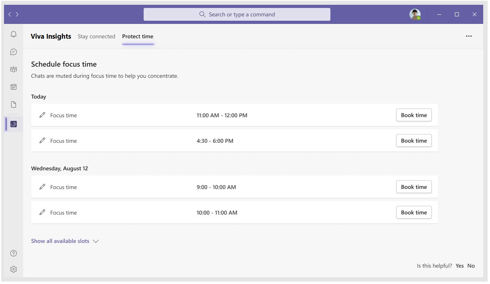

# Use the Insights app 

The Teams insights app comes with a range of features that you can find by selecting one of the following tabs:

* [Stay connected](#stay-connected) 
* [Protect time](#protect-time-tab) 

> [!Note] 
> As you use the Teams insights app, you can provide feedback about the app to Microsoft. To learn how, see [How can I send feedback to Microsoft about the Insights app?](#q4-how-can-i-send-feedback-to-microsoft-about-the-insights-app).

### Stay connected  

Insights in the **Stay connected** tab help you stay connected with your collaborators and improve your productivity. 
   
   

The **Stay connected** tab can contain insights such as the following: 

* [Identify and pin important collaborators](#identify-and-pin-important-collaborators)  
* [Set up 1:1 meeting reminders](#set-up-11-meeting-reminders) 
* [1:1 meeting suggestions](#11-meeting-suggestions) 
* [Reschedule a 1:1 in case of conflict](#reschedule-a-11-in-case-of-conflict) 
* [Stay on top of outstanding task suggestions](#stay-on-top-of-outstanding-task-suggestions) 
* [Catch up on unread documents shared with you](#catch-up-on-unread-documents-shared-with-you) 
* [@Mentions for pinned important contacts](#-for-pinned-important-contacts) 
* [Upcoming meetings that need your RSVP](#upcoming-meetings-that-need-your-rsvp) 
 
#### Identify and pin important collaborators  

You might receive insights from various people but some items might deserve more attention than others. For example, an outstanding task suggestion from your manager or a message from a key customer would likely be of higher priority.  

Based on your collaboration patterns, you can pin some of your contacts as important. All insights from pinned important contacts are shown with higher priority at the top of the page.  

To pin a contact, select the **pin** icon on the bottom left below the contact’s name: 
   
   

To unpin a contact, select the **unpin** icon: 
   
   

#### Set up 1:1 meeting reminders 

While staying in touch with top collaborators can be difficult, a quick 1:1 meeting with key contacts can help you nurture your professional network. Teams insights can help you set a target 1:1 meeting frequency for each contact and provide  you with meeting recommendations if you are falling out of touch.  

In the following example, if Lynne was an important colleague, you could set up a monthly 1:1 meeting target with Lynne by selecting the **people** icon and then selecting the **Monthly** reminder frequency. Insights will keep track of your meetings with Lynne and if you have not had a 1:1 with Lynne for a month, it will suggest setting up a 1:1 meeting and help you schedule it. 

If you want to remove the 1:1 meeting target, you can select the **people** icon and select **None**. If you are a manager, Insights will automatically suggest a biweekly 1:1 meeting with your direct report.  
   
   

#### 1:1 meeting suggestions 

If you’ve set up a target 1:1 meeting cadence with your colleague through the Insights app and are falling out of the set cadence, Insights will remind you to set up a 1:1 meeting and help you schedule it.  

In the following example, you can select one of the proposed meeting times and then select **Send invite** to send a meeting invitation to Lynne. Insights will only show meeting time blocks when both of you are available to meet. If none of the suggested time blocks work, you can select **View calendar for other items** to open the Teams calendar and schedule a meeting on your own. 
   
   

#### Reschedule a 1:1 in case of conflict  

Insights also helps you follow through on your intent to have 1:1 meeting with your colleagues. If, for some reason, the 1:1 meeting invitation you sent to your colleague has a conflict, Insights will help you quickly reschedule the meeting. 

In the following example, if your meeting with Lynne has a conflict, Insights will remind you of the conflict ahead of time and you can quickly choose a new time for the 1:1 meeting and select **Reschedule** to move the meeting invitation. 
   
   

#### Stay on top of outstanding task suggestions 

It is easy to lose track of commitments that you've made to your colleagues in email. This insight helps you make sure that nothing falls through the cracks by reminding you of tasks that you've agreed to do. It is based on emails that you've sent and requests from your colleagues during the last 14 days of email communication, and includes: 

* **Commitments** &ndash; Something that you promised or committed to do for someone else in an email 
* **Requests** &ndash; Something that another person asked you to do in an email 
* **Follow-ups** &ndash; Something that you asked for from someone else in an email 

In the following example, you can select **Re: Sync up on Regression Tests** to open the email in which you can follow up or select **Done** to confirm that you’ve already followed up.  
   
   

#### Catch up on unread documents shared with you 

Have you searched for that document that you planned to read but you just cannot find it? With so many documents shared across meetings and emails, it can be difficult to stay caught up on documents shared by your colleagues. With this insight you can see a list of the shared OneDrive and SharePoint documents that you need to catch up on.  

In the following example, to open the document, select **Open**. To open the email through which the document was shared, select **Re: Sync on Regression Test**. 
   
   

#### @Mentions for pinned important contacts 

@Mention is a common way to tag colleagues on important work items. Insights can help you quickly triage recent @Mentions from pinned contacts so that you are caught up on important conversations and tasks in Teams. In the following example, select **Go to comment** to open the conversation and follow up. 
   
   

#### Upcoming meetings that need your RSVP 

Let your colleagues know if you can join their meeting so that they can run effective meetings. Meeting attendance information helps meeting organizers better plan and prepare for meetings, and reschedule if needed.  

In the following example, select **Sync on Proposal** to open the meeting invitation for more context on the meeting and then select **Accept** to accept (or **Decline** to decline) the meeting invitation. 
   
   

### Protect time tab 

Research shows that on average it takes 23 minutes to refocus on a task after a distraction, and constant distraction during focused work can cause higher stress, lower productivity, and bad mood. Further, it can be hard to go deep on challenging work if you have only small chunks of time to focus between meetings or are easily distracted by incoming emails and chats. Blocking a few hours every day to focus without interruptions can help you make progress on your important tasks and projects. 

Insights can help you protect time for focused work and minimize notifications (and thus distraction) by Teams and Skype for business chats and calls during your focus time. 

In the following example, select **Book Time** to reserve the time slot for focused work. If you don’t need the time anymore, you can select **Remove slot** to free up your calendar. You can also select edit (the pencil icon) to change the name of the focus time block; this automatically updates the subject of this focus-time booking on your calendar. 
   
  

 