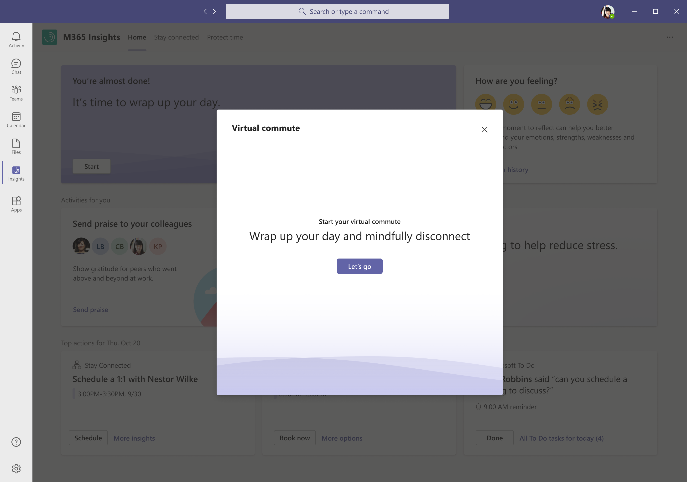

---

title: Viva Insights - virtual commute 
description: Microsoft Viva Insights app -- Use the virtual commute feature
author: paul9955
ms.author: v-pausch
ms.topic: article
localization_priority: normal 
ms.prod: Mya

---

# Use the Microsoft Viva Insights virtual commute feature 

You can start the virtual commute feature from either of two places, the [Up-next card](#up-next-card) or the [Protect time](#protect-time) feature. 

## Up-next card

The Up-next card reads, "It's time to wrap up your day" to indicate that you can start your virtual commute now. 

This message appears at the following times:

 * If you've configured virtual commute reminders, the message appears 30 minutes before the time that you configured. For information about making this and other settings, see [Insights app settings](teams-app-settings.md). 
 * If you have not configured virtual commute reminders, the message appears 30 minutes before the end of your workday as [scheduled in Outlook](https://outlook.office.com/calendar/options/calendar/view/appearance). 

## Protect time

### Start a virtual commute

On the **Protect time** page, under **Ready to wrap up?**, select **Start**.

  

This causes your virtual commute to start immediately. For information about the virtual commute experience, see [virtual commute steps](#virtual-commute-steps).

Starting a virtual commute this way does not affect the scheduled days and time of day that you set in [Set up virtual commute](#set-up-virtual-commute).

#### Set up virtual commute

The first time that you open the protect-time feature, you will be prompted to schedule your virtual-commute reminders:

  

On this card, choose the days on which you want to see the virtual-commute reminder and the time of day, and then select **Set reminder**. 

[!INCLUDE [Virtual commute notes](includes/virtual-commute-details.md)]

If you need to adjust these settings at any time, you can do so on the **Settings** page. For more information, see [Settings > Virtual commute](teams-app-settings.md#virtual-commute).

#### Virtual commute steps

After you begin your virtual commute by selecting **Start** on the **Protect time** page, the sequence starts. It consists of the following steps. All steps are optional; to skip a step, select **Next**. 

1. On the start page, select **Let's go**:

     

2. **Review and close out current tasks** &ndash; Virtual commute shows you your tasks on the Microsoft To-Do list whose due date is today or that have a reminder set for today. (If you currently have no tasks, this step is not shown and you go directly to **Add new tasks**.)

   In this step, you can mark each task as complete (select "**It's done**") or set a reminder:
 
      
 
   If you do set a reminder, it will appear in the following places:
    * In your Microsoft To Do list.
    * In your Briefing email, if you are subscribed to receive Briefing emails. 
     * On the To Do card on the **Home** page; it appears here only on the day after you set the reminder.
 
   Select **Next**.

3. **Add new tasks** &ndash; Use this step to add tasks to your list. There are two reasons to add them to your list:
 
   * If you have work-related tasks that are top of mind, adding them to a list holds them for you in a reliable spot so that you can mentally let them go during your personal time.

   * Adding them here puts them directly into Microsoft To Do, complete with reminders set, so that you don't forget about them.

   

   Tasks that you add on this page will appear in two places:

   * If you subscribe to the Cortana briefing email, you'll see your tasks there.

   * If you add a task today, it will appear tomorrow on the **Microsoft To-Do** card on the **Home** page:

     

   After you've finished adding tasks &ndash; or if you have no tasks to add &ndash; select **Next**. 

4. **Preview of tomorrow** &ndash; This step shows you the events (such as meetings) that are on your schedule for tomorrow:

   

   The purpose of this step is to reduce surprises so that you can be prepared for all that's on your schedule. You can accept, decline, or cancel meetings to make final decisions about your schedule for the next day. When finished, select **Next**.

5. **Opportunity for reflection** &ndash; At the end of your workday, this step lets you reflect on your feelings, just as you would by using the [Reflect](viva-insights-reflect.md) feature on the Home page:

   

   Select the emoji that best represents how you're currently feeling. The card gives you feedback to acknowledge your choice, which you can view before you select **Next**. This optional step helps you build the healthy habit of checking in with yourself.

6. **Take a minute to breathe** &ndash; This step offers a short video (with sound) that you can experience while taking some relaxing breaths:
 
   

   When you're finished, select **Next**. 

7. **Completion** &ndash; Complete your virtual commute. 

   

   Select **Done**.

<!-- NOTE FOR WAVE 3: HEADSPACE, A 3RD-PARTY MEDITATION APP, WILL APPEAR HERE WHEN IT'S AVAILABLE. WE'LL NEED TO ENABLE SOUND FOR IT FIRST. THIS FEATURE BELONGS TO PETER B. [30:00] -->

## Related topics

[Microsoft Viva Insights app &ndash; Overview](teams-app.md)

[Microsoft Viva Insights app &ndash; Protect time](viva-insights-protect-time.md) 
 