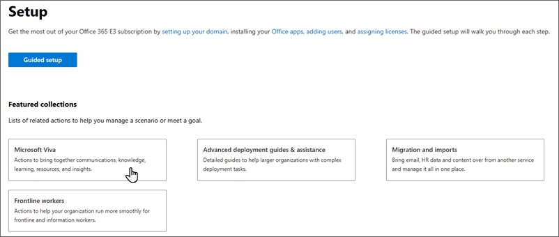
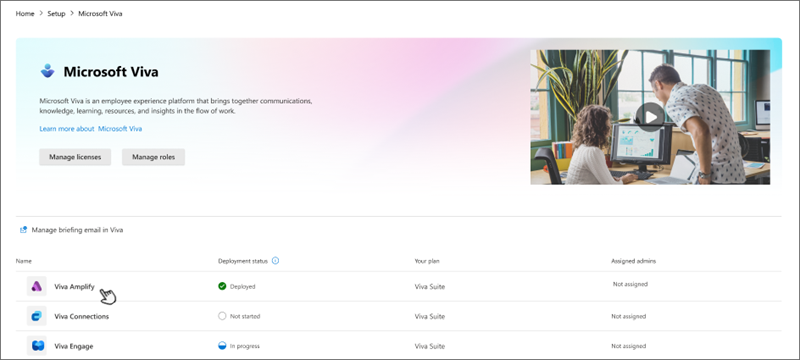
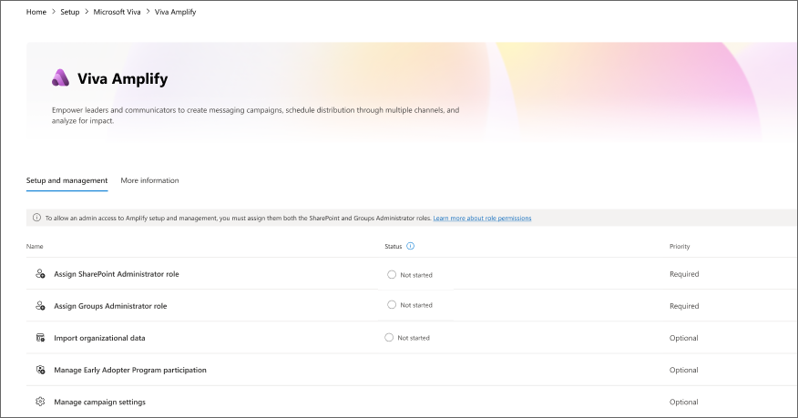

# Set up Microsoft Viva Amplify

Viva Amplify centralizes campaign management, publishing, and reporting so corporate communicators can reach and engage all employees meaningfully. By using multi-channel publishing, communicators can reach employees across channels such as Outlook, Teams, and SharePoint. Users can create and manage organization-wide campaigns to help inform organizations, create alignment, and inspire action – all from one place. Employees continue to see relevant messages in their existing preferred channels.

Viva Amplify is a web experience and is automatically enabled for users with the required licensing.

## Licensing for Viva Amplify

The **Viva Amplify** and **Viva Amplify - Organizational data** service plans are enabled for licensed users of the following products:

- Microsoft Viva [Learn more about setting up Microsoft Viva](/viva/setup-microsoft-viva)
- Microsoft Viva Employee Communities & Communications
- Microsoft Viva for Faculty
- Microsoft Viva with Glint add-on
- Microsoft Viva with Glint add-on for Faculty

## Prerequisites

Campaigns are stored in the associated users' OneDrive for Business. Therefore, users need to have OneDrive for Business in place to be able to create campaigns in Viva Amplify. [Learn how to set up OneDrive for your organization](/microsoft-365/admin/setup/set-up-file-storage-and-sharing).

## Product limitations

- **Vanity URLs**: At launch, Viva Amplify may have limitations when used with vanity URLs. If your company has a vanity URL, reach out to your support contact to discuss the best approach for rolling out our product within your organization.
- **Localization** At launch, Viva Amplify is available exclusively in English. More languages are planned for future releases.

### Assign admin roles

>[!IMPORTANT]
>Users need both SharePoint admin and Groups admin roles to be able to manage settings in Viva Amplify.

First, familiarize yourself with [roles in Viva Amplify.](viva-amplify-roles.md)

1. Sign into your Microsoft 365 admin center and choose **Setup**.

1. Under **Featured collections** choose **Microsoft Viva**.

    .

1. Select **Viva Amplify**.

    

1. This takes you to the **Setup and management** tab.

    

1. Choose **Assign SharePoint Administrator Role**.

1. Search for a user by entering their name or email.

1. Select the user(s) for whom you want to assign the **SharePoint Administrator** role.

1. Choose **Assign Groups Administrator Role**.

1. Search for a user by entering their name or email.

1. Select the user(s) for whom you want to assign the Groups Administrator role.

1. Select **Add**.

You can also assign roles from your Microsoft 365 admin center by navigating to **Roles** > **Role assignment**.

## Manage organizational data

>[!NOTE]
>This capability is currently only available for private preview customers. General availability is coming soon.

Amplify provides reporting data for metrics such as read rates on emails, view rates on SharePoint pages, interactions with Teams posts, and more. Importing your organizational data can enhance your Amplify reports by giving you further insight into use and impact.

Organizational Data is descriptive information about employees related to their employment in their organization. Organizational Data in Microsoft 365 combines organizational data uploaded with Microsoft 365 data to power certain capabilities in applications. This feature offers the capability to enrich the Microsoft 365 User Profile by ingesting organizational data that resides in external systems (such as CRM systems or HR systems) and fills in the gaps of nonexistent or stale user profile data and enable richer experiences in Viva and Microsoft 365 services.

[Learn more about using Organizational Data in Microsoft Viva.](/viva/organizational-data)

## Manage campaign settings

>[!IMPORTANT]
>Viva Amplify campaigns are set as private by default because campaigns are designed to be a private collaborative space for campaign team members to work and build their communications. Changing this setting is not recommended.

### Manage campaign creation

Viva Amplify is designed so that users with a wide range of roles, such as project managers who do regular status reports for stakeholders, can benefit from using campaigns. You can use the admin controls in Amplify to restrict who can create campaigns:

- The default setting enables everyone in the organization to create campaigns with Amplify.
- You can choose to only allow specific people or security groups to create campaigns.

1. Sign into your Microsoft 365 admin center and choose **Setup**.

1. Under **Featured collections** choose **Microsoft Viva**.

1. Select **Viva Amplify**.

1. This step takes you to the **Setup and management** tab.

1. Choose **Manage campaign settings**.

1. If you only want specific people or groups to be able to create campaigns, choose **Only selected people or security groups.** Type a name or email address to add a person or group.

>[!NOTE]
>If you choose this option, Amplify will create a security group in Microsoft Entra that contains the selected users.

>[!IMPORTANT]
>Users who you want to be able to create campaigns need to have **Site creation** and **Group creation** permissions in SharePoint. [Learn how to assign these permissions in the SharePoint admin center.](/sharepoint/manage-site-creation)

## Manage campaigns in the SharePoint admin center

As with SharePoint sites, Viva Amplify campaigns can be managed in the **Active sites** page of your SharePoint admin center. Here, you can view campaigns in your organization. [Learn more about managing sites and campaigns.](/sharepoint/manage-sites-in-new-admin-center)

## Manage approval workflows

Viva Amplify approvals are supported by the Approvals app in Teams. You need to set up Approvals in Teams to be able to use approvals in Amplify. [Learn how to set up Approvals in Teams](/microsoftteams/approval-admin).

## Delete campaigns

As a Global admin or SharePoint admin, you can delete a Viva Amplify campaign using the same method you would use to delete a SharePoint site. Deleted campaigns are stored for a set amount of time based on your organization's retention policies. [Learn more about how to delete a campaign](/sharepoint/delete-site-collection).

>[!IMPORTANT]
>Make sure to notify the campaign owner and any subsite owners before you delete a campaign so they can move their data to another location if needed.

Deleting a campaign deletes everything within it, including:

- Campaign publications
- Document libraries and files
- Lists and list data
- Campaign settings and history
- Any subsites and their contents

## Restore a previously deleted campaign

>[!NOTE]
>You need SharePoint administrator permissions to restore a deleted campaign.

Just like with SharePoint sites, you can restore deleted Viva Amplify campaigns. [Learn more about how to restore a deleted campaign](/sharepoint/restore-deleted-site-collection).

## Manage sensitivity labels for campaigns

Viva Amplify campaigns adhere to the same sensitivity label classifications that govern SharePoint sites. If sensitivity labels were enabled for your organization for your Microsoft Team sites, Microsoft 365 groups, and SharePoint sites, it can also be applied to Viva Amplify campaigns. [Learn more about sensitivity labels](/purview/sensitivity-labels-teams-groups-sites).
