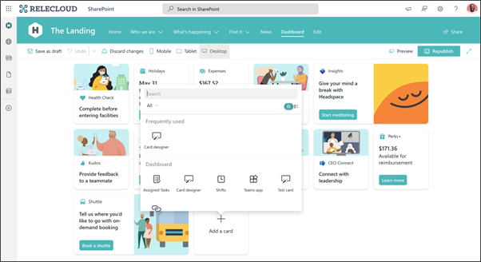
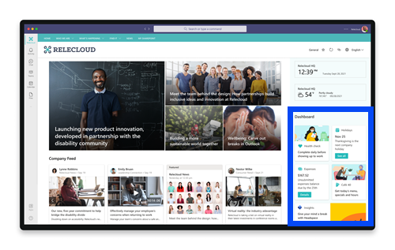

# Build Viva Connections 

After deciding which tasks, audiences, and resources to promote using Viva Connections in the [planning phase](plan-viva-connections.md), you're ready to move onto the building phase. 

You know you're ready to move onto the building phase if you've met the following requirements and have reviewed best practices:

- You’ve got a home site, global navigation setup, and modernized sites (if needed and only for sites related to tasks in the Viva Connections Dashboard)
- The most valuable tasks and processes can be completed using Viva Connections
- Considerations have been made for specific audiences
- You have an adoption and launch plan along with success metrics

**Steps in the build phase:**
[Step 1: Create a Viva Connections Dashboard](##step-1-:-create-a-viva-connections-dashboard)
Step 2: Enable the Viva Connections app in Microsoft Teams 
Step 3: Ensure high-traffic sites and portals are healthy  
Step 4: Test and refine the experience 

## Create your organization's instance of Viva Connections
Start by creating the Viva Connections Dashboard. Then, you'll select settings for the mobile app. Next, you will make sure content that’s on the home site and linked to cards on the Dashboard can be accessed by the right audiences and offers the ideal viewing experience. Lastly, you will test and refine the experience before launching to the rest of the organization. 

## Step 1: Create a Viva Connections Dashboard
The Dashboard brings it all together – it provides a personalized landing experience and is designed to be the central destination where everyone can discover your organization's resources and complete daily tasks. 

   

1. Start by [creating the Dashboard](create-dashboard.md). 
2. Next, [apply audience targeting](/viva/connections/create-dashboard#apply-audience-targeting-to-cards) to Dashboard cards to give your users an experience tailored to their role and interests. 
3. Once you feel confident in the Dashboard design, **Publish** the Dashboard.

   

4. Once you publish the Dashboard, you will be able to use the [Dashboard web part](/SharePoint/use-dashboard-web-part-on-home-site). Consider using the Dashboard web part on the home site or other high-traffic portals.

## Step 2: Enable the Viva Connections app in the Microsoft Teams admin center and choose mobile settings
The Viva Connections app creates a custom app in Microsoft Teams. Your organization’s custom app will appear as a branded company app in the Microsoft Teams app center. Once the app is added, your organization’s icon will appear in the Teams app bar in the desktop and mobile Microsoft Teams app. Users *won't* see the app by default if you don’t pre-install and pre-pin. [Learn more about app setup policies in the Teams admin center](/MicrosoftTeams/teams-app-setup-policies#:~:text=Arrange%20the%20apps%20in%20the%20order%20that%20you,to%20appear%20in%20Teams%2C%20and%20then%20select%20Save.).

After you've created the Dashboard, you're ready to [add the Viva Connections app in the Microsoft Teams Admin Center](/viva/connections/add-viva-connections-app). Add the Viva Connections app, and then customize app settings to add your organization's logo, pre-install, and pre-pin the app for end users.

## Step 3: Ensure high-traffic content provides an ideal viewing experience
For a smooth launch, you'll want to make sure information can be easily accessed and that high-traffic sites and pages are high-performing. 

1. As a first step, [test the performance of the home site](/sharepoint/portal-health) to ensure an optimal viewing experience. 
2. Then, check the performance for SharePoint sites that will receive a high amount of traffic. For example, sites that relate to human resources, organizational news, and popular services like transportation or café menus. 
3. Then, [share the home site with the entire organization](https://support.microsoft.com/office/share-a-site-958771a8-d041-4eb8-b51c-afea2eae3658) before launching. Next, make sure that the target audiences for the cards in the Viva Connections Dashboard are shared with the right audiences. 
4. Consider using the [Portal launch scheduler](/microsoft-365/enterprise/portallaunchscheduler) to monitor performance for high-traffic sites that are being shared for the first time.

## Step 4: Test and refine the Viva Connections experience
Before sharing Viva Connections with the rest of your organization, recruit a small group of users to test and refine popular workflows to ensure end-users have a great experience using Viva Connections for the first time. Consider recruiting specific people from different audiences to complete popular tasks. Make improvements until the experience is ideal for the rest of the organization.

**Best practices for testing:**
- Use the approved web browser for your organization
- Test Viva Connections on a desktop device and mobile device
- Make sure all the links are active and there aren’t any dead ends
- Pay attention to labels on Dashboard cards and buttons – will they make sense to the rest of the organization?
- Evaluate the quality and effectiveness of icons and images
- Check for performance issues like slow loading times or missing images
- Ask testers about the [navigation experience](/sharepoint/information-architecture-modern-experience)
- Test with [early adopters and champions](https://adoption.microsoft.com/roles/champion/) and capture their feedback

## Next, launch Viva Connections for your organization

After [planning](plan-viva-connections.md), building, and testing Viva Connections, it’s time to let the rest of the organization know that it's available for use. [Learn more about how to launch Viva Connections.](launch-viva-connections.md)
