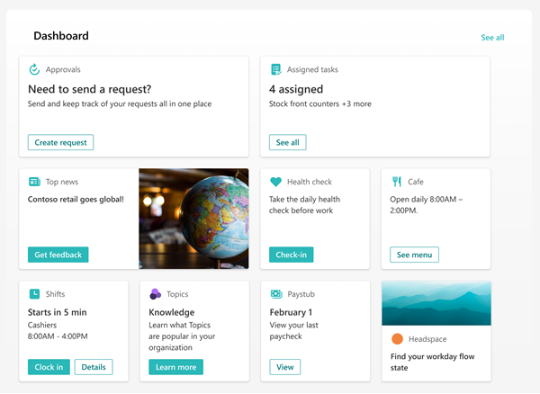

# Create a Viva Connections dashboard and add cards

The Viva Connections dashboard provides fast and easy access to information and job-related tasks. Content on the dashboard can be targeted to users in specific roles, markets, and job functions.
The dashboard consists of cards that engage viewers with existing Microsoft Teams apps, Viva apps and services, third-party apps, custom solutions using the SharePoint Framework (SPFx) framework, internal links, and external links. 

> [!NOTE]
> Content in this article reflects the [latest release of the Viva Connections desktop experience](https://techcommunity.microsoft.com/t5/microsoft-viva-blog/new-experiences-for-viva-connections-are-now-rolling-out/ba-p/3729071) that will become available to all customers by the end of March 2023. Some users in your organization may see the new experience before others.  

**This article includes:**

- [Edit the dashboard and add cards](#edit-the-dashboard).
- [Add the Approvals card](#add-the-approvals-card).
- [Add an Assigned tasks card](#add-the-assigned-tasks-card).
- [Add a customized card using Card designer](#design-your-own-card-with-a-quick-view).
- [Add a Teams app card](#add-a-teams-app-card).
- [Add a third-party card or Microsoft app](#add-a-third-party-card-or-microsoft-app).
- [Add the Top news cards](#add-the-top-news-card).
- [Add a Shifts card](#add-a-shifts-card).
- [Add a Viva Learning card](#add-a-viva-learning-card).
- [Add a Viva Topics card](#add-a-viva-topics-card).
- [Add a Web link card](#add-a-web-link-card).
- [Apply audience targeting to cards](#apply-audience-targeting-to-cards).
- [Preview your dashboard to see how it will display for different audiences and devices](#preview-your-dashboard-to-see-how-it-will-display-for-different-audiences).
- [Add the dashboard to your home site using the Dashboard web part](#use-the-dashboard-web-part-for-viva-connections).
- [Get more information about how links and Single sign-on works](#how-urls-and-single-sign-on-works).

## Edit the dashboard 
The Viva Connections dashboard can be edited right from Microsoft Teams. You’ll need member or owner level permissions to get started.

>[!NOTE]
> - When setting up Viva Connections for the first time, you’ll be asked to choose a set of default cards based on the intended audience. 
> - You can choose mobile and desktop views interchangeably as you’re authoring.
> - Image recommendations for cards in the dashboard: medium cards should be 300x150 to 400x200 with 2:1 aspect ratio and large cards 300x300 to 400x400 with 1:1 aspect ratio to prevent stretching in the mobile app.
> - Image URLS in card properties must be an absolute URL for the link to work in the mobile app.
> - It's recommended to limit the number of cards to about 20 on the dashboard for the best viewing experience.

1.	Navigate to the Viva Connections app in Teams.
2.	Next, select **Edit** in the dashboard section.
3.	Select **+ Add a card**.
4.	Select **Edit** (pencil icon) for each card to edit properties like the label, icon, image, and audience targeting settings where applicable. 
5.	Select **Delete** (trash can icon) to remove cards.
6.	Preview the experience on all devices to ensure usability before publishing or republishing. 
7.	**Publish** or **Republish** when you are done to share the edits with others.

## How to edit the dashboard from SharePoint when you have a home site

If your organization has a [SharePoint home site](home-site-plan.md), you have the option to set up and edit the dashboard from the home site or in Microsoft Teams. You’ll need [edit permissions](/sharepoint/customize-sharepoint-site-permissions) for the home site.

> [!VIDEO https://www.microsoft.com/en-us/videoplayer/embed/RE53Joj]

 
 

>[!NOTE]
>Images are an important aspect to making your cards rich and inviting. If you're a SharePoint admin, we recommend enabling a Content Delivery Network (CDN) to improve performance for getting images. Consider when storing images that /siteassets is by default a CDN source when Private CDN is enabled while /style library is the default source when the Public CDN is enabled. [Learn more about CDNs](/office365/enterprise/content-delivery-networks).  

1. From the home site, select the **Settings** gear at the top-right of the page.
2. Select **Manage Viva Connections**.
3. Select the **+ Create dashboard** or **View dashboard** button.
4. Select **+ Add a card**.
5. Select the type of card you want to add from the dashboard card toolbox and then follow the steps below to set up each type of card. As you’re building the dashboard, you can preview its appearance in mobile and desktop for different audiences.
6. When you're done adding cards and [applying targeting to specific audiences](use-audience-targeting-in-viva-connections.md), **Preview** the experience to ensure an ideal viewing experience.
7. Once you’re satisfied with how the dashboard looks in preview, select **Publish** or **Republish** at the top-right of your dashboard to make it available for use on your home site, in Teams, and in Teams mobile app. 

## Available dashboard cards

   |Card Name    |Toolbox icon   | Description  |
   |:------------|:-------------:|:--------------|
   |[Approvals](#add-the-approvals-card) |  | Use [Approvals](/power-automate/get-started-approvals) for vacation requests, sign-off on documents, and approve expense reports     |
   |[Assigned Tasks](#add-the-assigned-tasks-card) |  |   Use [Tasks](https://support.microsoft.com/office/assign-and-track-tasks-in-teams-56014efe-3283-4f13-a57f-1157c5e25f1f) to manage your team's work, assign tasks, and track tasks     |
   |[Card designer](#design-your-own-card-with-a-quick-view) |  | Create your own cards and quick views using the [adaptive cards framework](/adaptive-cards/templating/)|
   |[Shifts](#add-a-shifts-card)     | | Display information about the next or current shift from the Shifts app in Teams          |
   |[Teams app card](#add-a-teams-app-card) |  |   Use to open a Teams personal app or bot specified by the dashboard author     |
   |[Third-party cards](#add-a-third-party-card-or-microsoft-app) | Varies |    Use cards that integrate [third-party services](https://cloudpartners.transform.microsoft.com/resources/viva-app-integration)     |
   |[Top news card](#add-the-top-news-card)    |  |   Set up the Top news card to [surface boosted news from SharePoint](https://support.microsoft.com/office/boost-news-from-organization-news-sites-46ad8dc5-8f3b-4d81-853d-8bbbdd0f9c83)     |
   |[Viva Learning](#add-a-viva-learning-card)    |  |  Provide a link to the Viva Learning app that can be targeted to show to certain audiences.  |
   |[Viva Topics](#add-a-viva-topics-card)    | :::image type="icon" source="../media/knowledge-management/viva-topics-cards-toolbox.png"::: |  Use Viva Topics cards to encourage knowledge discoverability, engagement, and sharing. |
   |[Web link](#add-a-web-link-card)    |  |  Access a site without leaving the Viva Connections app  |
 

## Add the Approvals card

The Approvals card connects to [Approvals in Microsoft Teams](https://support.microsoft.com/office/what-is-approvals-a9a01c95-e0bf-4d20-9ada-f7be3fc283d3) and is a way to streamline all of your requests and processes with your team or partners. You'll be able to create new approvals, view the ones sent your way, and see all of your previous approvals in one place.

1. While in edit mode, click **+ Add a card** from the dashboard.

2. Select **Approvals** from the dashboard toolbox.

   

3. Select the pencil icon to **Edit** the card. In the property pane that opens on the right, choose your card size from the **Card size** drop-down list.

   

4. If you want to target your card to specific audiences (that is, only audience you specify will see the card in the dashboard), select one or more groups to target. For more information on audience targeting, see [Audience targeting](#apply-audience-targeting-to-cards).

## Add the Assigned tasks card

The Assigned tasks card enables automatic display of information to users about their assigned tasks. This information is retrieved from the [Tasks app in Teams](https://support.microsoft.com/office/assign-and-track-tasks-in-teams-56014efe-3283-4f13-a57f-1157c5e25f1f).

1. While in edit mode, click **+ Add a card** from the dashboard.

2. Select **Assigned Tasks** from the dashboard toolbox.

   

3. In the property pane on the right, choose your card size from the **Card size** drop-down list.

   

4. If you want to target your card to specific audiences (that is, only audience you specify will see the card in the dashboard), select one or more groups to target. For more information on audience targeting, see [Audience targeting](#apply-audience-targeting-to-cards).

## Design your own card with a quick view

You can choose the **Card designer** option to design your own card that includes a quick view. To do this, you should be familiar with JSON and Adaptive Card templates. For more information, see [Adaptive Cards Templating](/adaptive-cards/templating/).

1. While in **edit** mode, select **+ Add a card** from the dashboard.

2. Select **Card designer**.

   :::image type="content" alt-text="This screenshot shows the icon to select to add a Card designer card." source="../media/connections/card-designer-card-icon.png":::

3. In the **property** pane, select your card options.

   

4. From the **Card size** drop-down list, choose either **Medium** or **Large**.
   A medium-sized card allows you to add one button, while a large-sized card allows you to add two buttons.

5. Enter a title for your card in the **Title** text box. 
6. Enter a URL in the **Icon** text box. This URL is the icon's location.
7. Select a template type from one of the following options in the **Template type** drop-down list:
    - **Text**: Provides you the option to add only a heading.
    - **Text and image**: Provides you the option to add a heading and an image.
    - **Text and description**: Provides you the option to add your own heading and a description, but without an image option.
8. Depending on the template type you’ve chosen, enter values for the properties. For example, if you have chosen the **Text and description** template type, you have to enter values for the **Heading** and **Description** properties in their respective text boxes.

   >[!NOTE]
   >If you want a specific property to display that allows users to enter a value, but that property is not displayed, choose a different template type.

9. Toggle **Enable card action** to **On** if you want the card to either go to a link or show a quick view when the user selects it. 

   > [!IMPORTANT]
   > The quick view will need to be set up first (see the Add a quick view section below).

10. Set the number of buttons to be displayed under **Number of buttons**. 
    For a medium-sized card, you can show only 1 button. For a large-sized card you can show 1 or 2 buttons.

1. Enter values for the following properties of the button:
    - **Title**: Title for the button.
    - **Action**: The result on clicking the button.
    - **Link**: The URL of the destination the user is directed to, on clicking the button.

## Set up a quick view

Under **Quick view layout and data**, enter JSON template code for your quick view layout, and add the code for the data you want to use. For more information on templating and data with some examples, see [Adaptive Cards Templating](/adaptive-cards/templating/). You can find more examples at [Adaptive Cards](/adaptive-cards/).

If you want to target your card to specific audiences (that is, only audiences you specify will see the card in the dashboard), select one or more groups to target. For more information on audience targeting, see [Audience targeting](#apply-audience-targeting-to-cards).

## Add a Teams app card

A Teams app card allows you to create a card for an existing Teams app. 

1. While in **edit** mode, select **+ Add a card** from the dashboard.

2. Select **Teams app** from the web toolbox.

   :::image type="content" alt-text="This screenshot shows the icon to select to add a Teams app card." source="../media/connections/teams-app-icon.png":::

3. In the **property** pane on the right side of the page, select your options.

   

4. Select a size for the card from the **Card size** drop-down list.
5.  Search for the Teams app you want to use, and then select it from the list.
6.  Set the card-display options:
    - Enter a title for the card in the **Card title** text box. (This title won't change your page title; it is the title that will be displayed on the top of the card.)
    - Enter a description for the card in the **Card description** text box. This description will be displayed in larger text under the title.
7. If you want to target your card to specific audiences (that is, only audience you specify will see the card in the dashboard), select one or more groups to target. For more information on audience targeting, see [Audience targeting](#apply-audience-targeting-to-cards).

## Add a third party card or Microsoft app

The Viva Connections dashboard and mobile experience can be extended and customized using cards, which are based on [adaptive cards](https://adaptivecards.io/) and the [SharePoint Framework (SPFx)](/sharepoint/dev/spfx/sharepoint-framework-overview). These adaptive cards are used to display data, complete tasks, and connect to Teams Apps, Websites, and mobile apps on Viva Connections. They provide a low-code solution to bring your line-of-business apps into the dashboard. 

To create custom experiences on Viva Connections dashboard and Viva Connections Mobile App, developers must use the SPFx to create custom ACEs. To learn more about creating ACEs, see the following tutorial: [Build your first SharePoint Adaptive Card Extension](/sharepoint/dev/spfx/viva/get-started/build-first-sharepoint-adaptive-card-extension). Learn more about [Viva Connections extensibility.](/sharepoint/dev/spfx/viva/overview-viva-connections)

### Add a 3rd party card
There are three ways to get third-party apps and solutions integrated with the Viva Connections dashboard. Below is an example of a third-party card.

#### Option 1: Discover and request apps from the Viva Connections card toolbox
Third-party cards and an entry point to browse more cards in the app store will automatically display in the card toolbox. Depending on your level of permissions, you may need to request the app before it can be used on the dashboard. [Learn more about managing third-party apps](/sharepoint/use-app-catalog).

 >[!NOTE]
> - This feature will become available to all customers by the end of January 2023.
> - Site owners managing the Viva Connections dashboard will need to request third-party apps before they are available in the card toolbox.
> - Some third-party apps require a service plan agreement with your organization.

   :::image type="content" alt-text="This screenshot is of the card toolbox section that displays third party cards." source="../media/connections/third-party-card-toolbox.png":::

1.	While in edit-mode, select **+ Add** card from the dashboard. 
2.	You’ll see third-party options in the **Suggested cards** section. Select one of the cards that’s displayed or browse more cards by selecting **Add more cards**.
3.	Request the cards you’d like to add to the toolbox and the requests will be sent to the App Catalog Admin for their approval.
4.	You will receive an email to confirm if your request has been approved or denied.
5.	Once your request has been approved, refresh the page  and you’ll see the new card display in the toolbox.

#### Option 2: Acquire the app from a Microsoft AppSource or the SharePoint store
You can acquire apps from third- party developers by browsing the [Microsoft AppSource](https://appsource.microsoft.com/en-us/marketplace/apps?product=sharepoint) or [SharePoint store](https://techcommunity.microsoft.com/t5/microsoft-sharepoint-blog/explore-and-deploy-sharepoint-framework-solutions-from-partners/ba-p/2645289) (recommended).

- If you are building a dashboard, you can [request the app directly](https://techcommunity.microsoft.com/t5/microsoft-sharepoint-blog/explore-and-deploy-sharepoint-framework-solutions-from-partners/ba-p/2645289), but you will need approval from an admin of the tenant-level app catalog to continue with the installation
- If you are an **admin** of a tenant-level app catalog, you can deploy business apps directly.

[Get step-by-step guidance](https://techcommunity.microsoft.com/t5/microsoft-sharepoint-blog/explore-and-deploy-sharepoint-framework-solutions-from-partners/ba-p/2645289) on how to request and deploy an app, and add an app to your site. For tenant admin, [learn how to manage apps](/sharepoint/use-app-catalog#work-with-sharepoint-store-apps) in the App Catalog.

#### Option 2: Acquire the app directly from the third-party developer

 >[!NOTE]
 > SharePoint administrative permissions are required to complete this task.

You can request apps directly from the Viva Connections third-party developers and partners. Admin permissions are required to [add the app to tenant level app catalog.](/sharepoint/use-app-catalog) 

### Add a Microsoft app as a card on the dashboard

A Microsoft app card allows you to create a card that links to Microsoft apps e.g., Shifts, Approvals, Task. Microsoft apps cards will be available out of the box when Viva Connections is enabled.

1. While in edit mode, select **+ Add a card** from the dashboard.

2. Select the Microsoft App you want to add from the web toolbox.

   

3. Select your options in the property pane on the right side of the page.

4. When you **Republish**, the card will appear on your dashboard.

## Add the Top news card
Set up the Top news card to surface [boosted news from SharePoint](https://support.microsoft.com/office/boost-news-from-organization-news-sites-46ad8dc5-8f3b-4d81-853d-8bbbdd0f9c83). News that has been boosted will prominently display in the Top news card.

1. While in **edit** mode, select **+ Add a card** from the dashboard.

2. Select **Top news** from the web toolbox.

    

3. In the property pane on the right, choose your card size from the **Card size** drop-down list.

4. If you want to target your card to specific audiences (that is, only audience you specify will see the card in the dashboard), select one or more groups to target. For more information on audience targeting, see [Audience targeting](#apply-audience-targeting-to-cards).

## Add a Shifts card

The Shifts card shows users information about their next or current shift from the Shifts app in Teams. They can also clock in and out and track break time when Time clock is enabled in Teams. 

1. While in edit mode, select **+ Add a card** from the dashboard.

2. Select **Shifts** from the dashboard toolbox.

   

3. In the property pane on the right, choose your card size from the **Card size** drop-down list.

4. If you want to target your card to specific audiences (that is, only audience you specify will see the card in the dashboard), select one or more groups to target. For more information on audience targeting, see [Audience targeting](#apply-audience-targeting-to-cards).

## Add a Viva Learning card

The [Viva Learning](/viva/learning/overview-viva-learning) card provides users quick-links to recommended trainings, and can be set to target specific trainings to certain individuals. By clicking the Viva Learning link, users can easily access their required trainings.

Content in the cards is dynamic and will change according to settings in Viva Learning. Below are three examples of Viva Learning card states that display different information depending on the viewer and Viva Learning settings.

      

1. While in edit mode, select **+ Add a card** from the dashboard.

2. Select **Viva Learning** from the dashboard toolbox.

    

3. In the property pane on the right, choose your card size from the **Card size** drop-down list.

    

4. If you want to target your card to specific audiences (that is, only audience you specify will see the card in the dashboard), select one or more groups to target. For more information on audience targeting, see [Audience targeting](#apply-audience-targeting-to-cards).

## Add a Viva Topics card

Viva Topics has two different cards. The **Viva Topics Contribute card** can be used to reach people who are known knowledge managers and are already engaged with topics and knowledge areas. Topics and knowledge areas are dynamically displayed in the card based on the viewers interests, current projects, and expertise. The **Viva Topics Discover card** can be used to view topics and knowledge areas for people who could be interested in learning more or contributing to a topic. 

[Learn more about the two different cards](/viva/topics/viva-topics-card-viva-connections).

 

## Add a Web link card

Add a web link card when you want your users to go to an internal or external link on a web site. 

1. While in **edit** mode, select **+ Add a card** from the dashboard.

2. Select **Web link** from the web toolbox.

   :::image type="content" alt-text="This screenshot shows the icon to select to add a web link card." source="../media/connections/web-link-icon.png":::

3. In the property pane on the right side of the page, select your options.

   

4. Select a size for the card from the **Card size** drop-down list.
5. Enter the URL for your link in the **Link** text box. 
6. Set the card-display options:
   - Enter a title for the card in the **Card title** text box. (This title won't change your page title; it is the title that will be displayed on the top of the card.)
   - Enter a description for the card in the **Card description** text box. This description will be displayed in larger text under the title.
3. Under **Thumbnail**, select one of the following options:
   - **Auto-selected**: This option when chosen automatically displays an image at the top of your card that comes from your page.
   - **Custom image**: This option when chosen enables the **Change** button.  You can select this button to choose an image you want to use.
4. Under **Card icon**, select one of the following options that enable the icon to be displayed on the left side of the card title:
   - **Auto-selected**: This option when chosen automatically displays a built-in icon associated with the page.
   - **Custom image**: This option when chosen enables the **Change** button.  You can select this button to choose an image you want to use.
    - **Icon**: This option when chosen enables the **Change** button.  You can select this button to choose from a set of stock icons.
5. If you want to target your card to specific audiences (that is, only the audience you specify will see the card in the dashboard), select one or more groups to target from the **Audiences to target**. For more information on audience targeting, see [Audience targeting](#apply-audience-targeting-to-cards).

## Apply audience targeting to cards
[Audience targeting can be applied throughout](use-audience-targeting-in-viva-connections.md) the Viva Connections experience, including cards on the dashboard. Audience targeting creates a personalized viewing experience by filtering the most important content to specific groups. Use audience targeting to: 

- Create custom views for distinct roles and regions. 
- Generate as many different views as needed to create unique experiences. 
- Ensure the most important content is seen by the intended audience. 

### Set the target audiences for a card

1. If your page is not already in **edit** mode, select **Edit** at the top-right of the dashboard page.
2. Select the card you want to target to one or more audiences, and select the **Edit card** pencil from the toolbar on the left.
3. In the property pane on the right, under **Audiences to target**, type or search for the audience group(s) you want to target.

    >[!NOTE] 
    > If you've selected an audience group that you recently created or changed, it may take some time to see targeting applied for that group.

4. When a card is successfully audience targeted, you’ll see a **people** icon in the lower-left corner of the card.

   

### Preview your dashboard to see how it will display for different audiences

After creating or editing cards on the dashboard, make sure you preview the experience for each audience and on both desktop and mobile devices. What you see in *preview mode* approximates how the dashboard will display for certain audiences and devices. When you apply audience targeting to cards, you can preview how different people will view the dashboard depending on the audience or device. While in preview-mode, make sure: 

- There aren’t any physical gaps between cards that may appear while previewing different audiences and devices. If you see gaps, rearrange cards so that every audience and device will have a high-quality viewing experience. 
- Icons, graphics, and images are easy to identify and understand. 
- Buttons and links are active and go to their intended destinations. 
- Labels and description text are helpful, easy to read, and make sense for the intended audience. 
 
#### To preview different audiences:

   1. While in edit mode, select **Preview** on the top right.

      

   2. Open the **Select audiences to preview as** drop-down list. (if no cards are audience targeted, you will see a disabled **Audience targeting** label).

      :::image type="content" alt-text="This screenshot shows the audience targeting group label." source="../media/connections/preview-audiences.png":::

   3. Search for and select a group. Once added, the group will be selected by default. You can select the group again in the **Select audiences to preview as** drop-down list to de-select it.

      

   - Cards that targeted to a specific group will display.
   - When one or more audiences are selected, cards that *do not* have audience targeting applied will also display.
   - If no audiences are targeted, only cards that *are not* audience targeted will display. If there aren't any cards with audience targeting applied, none will display.
   - If you are not part of one of the audiences you've selected, you will only see cards that are not audience targeted. If none are audience targeted, you won't see any cards.

   #### Examples:

   In the following example, the preview is set for mobile devices and highlights the different views that can be created from a single dashboard.

   | View 1                  | View 2                 | 
   | :-------------------: | :-------------------: |
   | |  | 
   

## Use the Dashboard web part for Viva Connections

> [!NOTE] 
> - After editing content on the dashboard, it may take several minutes until the new content is available in the Dashboard web part.
> - For best results, we recommend placing the Dashboard web part in a right vertical section.

Once a dashboard is authored and published, you can use the Dashboard web part to display it on your home site. You can add the web part to any section on your page.  

When added, it will automatically be populated with the cards from the existing dashboard on your site. You'll be able to set the maximum number of cards you want to display. [Learn how to use the Dashboard web part](/sharepoint/use-dashboard-web-part-on-home-site).

## How URLs and single Sign-on works
For some cards, you will use links to URLs. Depending on the location of the content, links to URLs may display content in Microsoft Teams or elsewhere and [Single sign-on (SSO)](/azure/active-directory/manage-apps/what-is-single-sign-on) behavior can differ. Get more information about how links to URLs and SSO behave depending on the location of the content you are linking to.

> [!NOTE] 
> When SSO is not supported, users will be asked to enter their login credentials.

| Content source | Opens URL to… | Supports SSO          |
| :------------------- | :------------------- |:----------------|
| SharePoint Link  | SharePoint or Teams      | Yes      |
| Teams App  | Teams  | No             |
| Microsoft  Forms   | Device's browser   | Yes    |
| Yammer       | Yammer or Teams     | Yes   |
| PowerApps   | Teams      | Yes  |
| Power Portals  | Teams | Yes  |
| Stream  | Teams | Yes    |
| External Links  | Teams | No  |

## More resources

[Step-by-step guide to setting up Viva Connections](viva-connections-setup-guide.md)

[Learn more about how to plan a dashboard](plan-viva-connections.md#step-2-plan-for-viva-connections)

