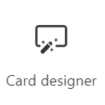
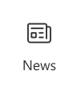
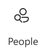
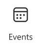
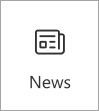

# Create a Viva Connections dashboard and add cards

The Viva Connections dashboard provides fast and easy access to information and job-related tasks. Content on the dashboard can be targeted to users in specific roles, markets, and job functions.
The dashboard consists of cards that engage viewers with existing Microsoft Teams apps, Viva apps and services, third-party apps, custom solutions using the SharePoint Framework (SPFx) framework, internal links, and external links.

**This article includes:**

- [Edit the dashboard and add cards](#edit-the-dashboard).
- [Add the Approvals card](#add-the-approvals-card).
- [Add an Assigned tasks card](#add-the-assigned-tasks-card).
- [Use the Card designer to create your own interactive dashboard cards](#design-your-own-card-with-the-card-designer).
- [Add a Teams app card](#add-a-teams-app-card).
- [Add a third-party card or Microsoft app](#add-a-third-party-card-or-microsoft-app).
- [Add the News card](#add-the-news-card).
- [Add the People card](#add-the-people-card).
- [Add the Events card](#add-the-events-card).
- [Add a Shifts card](#add-a-shifts-card).
- [Add a Viva Learning card](#add-a-viva-learning-card).
- [Add a Topics card](#add-a-topics-card).
- [Add a Web link card](#add-a-web-link-card).
- [Apply audience targeting to cards](#apply-audience-targeting-to-cards).
- [Preview your dashboard to see how it displays for different audiences and devices](#preview-your-dashboard-to-see-how-it-displays-for-different-audiences).
- [Add the dashboard to your Viva Connections site using the Dashboard web part](#use-the-dashboard-web-part-for-viva-connections).
- [Get more information about how links and Single sign-on works](#how-urls-and-single-sign-on-works).

## Edit the dashboard

The Viva Connections dashboard can be edited right from Microsoft Teams. You need member or owner level permissions to get started.

> [!NOTE]
>
> - When setting up Viva Connections for the first time, you’ll be asked to choose a set of default cards based on the intended audience.
> - You can choose mobile and desktop views interchangeably as you’re authoring.
> - Image recommendations for cards in the dashboard: medium cards should be 300x150 to 400x200 with 2:1 aspect ratio and large cards 300x300 to 400x400 with 1:1 aspect ratio to prevent stretching in the mobile app.
> - Image URLS in card properties must be an absolute URL for the link to work in the mobile app.
> - It's recommended to limit the number of cards to about 20 on the dashboard for the best viewing experience.
> - Users will be able to [customize their dashboard on Viva Connections mobile](https://support.microsoft.com/office/753e0607-0bfd-4712-ad7e-18490dd565a2#bkmk_customize-viva-connections-mobile-dashboard) by reordering, hiding, and showing cards. These changes only affect the mobile experience for the user and will not affect their desktop or tablet experience.

1. Navigate to the Viva Connections app in Teams.
2. Next, select **Edit** in the dashboard section.
3. Select **+ Add a card**.
4. Select **Edit** (pencil icon) for each card to edit properties like the label, icon, image, and audience targeting settings where applicable.
5. Select **Delete** (trash can icon) to remove cards.
6. Preview the experience on all devices to ensure usability before publishing or republishing.
7. **Publish** or **Republish** when you're done to share the edits with others.

## How to edit the dashboard from SharePoint when you have a home site

If your organization has a [SharePoint home site](home-site-plan.md), you can set up and edit the dashboard from the SharePoint home site or in Microsoft Teams. You need [edit permissions](/sharepoint/customize-sharepoint-site-permissions) for the SharePoint home site to make changes.

> [!VIDEO https://www.microsoft.com/en-us/videoplayer/embed/RE53Joj]

 
 

> [!NOTE]
>Images are an important aspect to making your cards rich and inviting. If you're a SharePoint admin, we recommend enabling a Content Delivery Network (CDN) to improve performance for getting images. Consider when storing images that /siteassets is by default a CDN source when Private CDN is enabled while /style library is the default source when the Public CDN is enabled. [Learn more about CDNs](/office365/enterprise/content-delivery-networks).  

1. From the SharePoint home site, select the **Settings** gear at the top-right of the page.
2. Select **Manage Viva Connections**.
3. Select the **+ Create dashboard** or **View dashboard** button.
4. Select **+ Add a card**.
5. Select the type of card you want to add from the dashboard card toolbox and then use the instructions within this article to set up each type of card. As you’re building the dashboard, you can preview its appearance in mobile and desktop for different audiences.
6. When you're done adding cards and [applying targeting to specific audiences](use-audience-targeting-in-viva-connections.md), **Preview** the experience to ensure an ideal viewing experience.
7. Once you’re satisfied with how the dashboard looks in preview, select **Publish** or **Republish** at the top-right of your dashboard to make it available for use on your home site, in Teams, and in the Teams mobile app.

## Available dashboard cards

   |Card Name    |Toolbox icon   | Description  |
   |:------------|:-------------:|:--------------|
   |[Approvals](#add-the-approvals-card) |  | Use [Approvals](/power-automate/get-started-approvals) for vacation requests, sign off on documents, and approve expense reports.     |
   |[Assigned Tasks](#add-the-assigned-tasks-card) |  |   Use [Tasks](/microsoftteams/manage-planner-app) to manage your team's work, assign tasks, and track tasks.     |
   |[Card designer](#design-your-own-card-with-the-card-designer) |  | Create your own cards or use quick views for a more interactive experience utilizing the [adaptive cards framework.](/adaptive-cards/templating/)|
   |[Shifts](#add-a-shifts-card)     | | Display information about the next or current shift from the Shifts app in Teams.          |
   |[Teams app card](#add-a-teams-app-card) |  |   Use to open a Teams personal app or bot specified by the dashboard author.     |
   |[Third-party cards](#add-a-third-party-card-or-microsoft-app) | Varies |    Use cards that integrate [third-party services.](https://cloudpartners.transform.microsoft.com/resources/viva-app-integration)     |
   |[News card](#add-the-news-card)    |  |   Promote news from various sources that you wish to prominently display, including [boosted news from SharePoint.](https://support.microsoft.com/office/boost-news-from-organization-news-sites-46ad8dc5-8f3b-4d81-853d-8bbbdd0f9c83)     |
   |[People card](#add-the-people-card)    |  |   Provide an option to look up contact information and directly chat, email, or call with others in your organization.     |
   |[Events card](#add-the-events-card)    |  |   View and join upcoming events within your organization.     |
   |[Viva Learning](#add-a-viva-learning-card)    |  |  Provide a link to the Viva Learning app that can be targeted to show to certain audiences.  |
   |[Topics](#add-a-topics-card)    | :::image type="icon" source="../media/knowledge-management/viva-topics-cards-toolbox.png"::: |  Use Topics cards to encourage knowledge discoverability, engagement, and sharing. |
   |[Web link](#add-a-web-link-card)    |  |  Access a site without leaving the Viva Connections app  |

## Design your own card with the card designer

Use the Card Designer to create cards that can link to other sites, open media, display a location, open a teams app, and more. Card designer gives users the ability to quickly build "custom" cards without the need for custom code by using a template with the option to create a secondary view, also called a quick view.

Quick view is a powerful tool that enables the card designer to create cards that go beyond the traditional dashboard cards to create something interactive and informative using [Adaptive Card](https://adaptivecards.io/) JavaScript Object Notation (JSON). You'll be able to "code" a single quick view by using the power of Adaptive Card markup to make their cards dynamic. The result can be previewed within the card designer before sharing with others.

> [!NOTE]
>
> To design your own cards using quick view, you should be familiar with JSON and Adaptive Card templates. For more information, see [Adaptive Cards Templating](/adaptive-cards/templating/).

   :::image type="content" source="../media/connections/create-dashboard/card-designer-card-example.png" alt-text="Screenshot showing an example of a large card created with the card designer for celebrating birthdays with a button to congratulate displayed." lightbox="../media/connections/create-dashboard/card-designer-card-example.png":::

### Use a card template

The card designer has a set of card view templates that can be used to easily create cards with helpful information, links, and media. The following steps walk you through creating a new large sized card using the image template to create a link for users.

1. While in **edit** mode, select **+ Add a card** from the dashboard.

2. Select **Card designer**.

   :::image type="content" alt-text="This screenshot shows the icon to select to add a Card designer card." source="../media/connections/create-dashboard/card-designer-card-icon.png":::

3. After selecting the Card designer card, select the **Edit** icon to open the property pane.

4. As you create your card through selecting options, a preview of how the card looks will appear to the left of the options.

   :::image type="content" source="../media/connections/create-dashboard/card-designer-properties-overview.png" alt-text="Screenshot showing an overview of the card designer properties pane." lightbox="../media/connections/create-dashboard/card-designer-properties-overview.png":::

5. Under **Template type**, select one of three **templates** to apply:
    - **Heading**: Create a card with a simple heading.
    - **Image**: Create a card with a heading and image.
    - **Description**: Create a card with a heading and description.

   > [!NOTE]
   >
   > Buttons are disabled when selecting the Image template for a medium sized card, but a card action can still be assigned to trigger when the user selects the card.

    Depending on the template type chosen, fields matching the template type will populate in the **card content** section. For example, if you chose the Image template, you’ll be able to enter values for the Image and Heading properties in their respective text boxes.

6. Select a **card size**:
    - **Medium**: the default card size and allows you to add one button to the Heading and Description templates.
    - **Large**: takes the space of two medium cards together and allows the use of two buttons.

   :::image type="content" source="../media/connections/create-dashboard/card-designer-layout-and-size.png" alt-text="Screenshot showing options under the layout and size category in the properties pane.":::

7. Under **Card icon** select one of the following options:
    - **Custom image**: Select **custom image** then **Change** to upload your own image or select an existing image from your site or from an online source (for example, web search, OneDrive, Site).
    - **Library**: Select an icon from a pre-existing list of available icons.
   For example, select **Library** then **Change** to choose a new icon.

   > [!NOTE]
   >
   > When uploading custom images for your icons, it is recommended to use PNG images between 24x24 and 32x32 pixels.

8. Enter a **Title** to be displayed at the top of your card.

9. Enter a **Heading**.

10. Depending on the template type chosen, enter values for the properties corresponding to your selection below the heading field. For this example, the image template is being shown:

    - **Image**: Select **change** to upload your own image or select an existing image from your site or from an online source (for example, web search, OneDrive, Site).

       :::image type="content" source="../media/connections/create-dashboard/card-designer-adding-image.png" alt-text="Screenshot showing options under the card content category in the properties pane.":::

11. Under card action, select an action to be performed when a user selects the card. Depending on the action selected, more fields will appear to customize the action.

   > [!NOTE]
   >
   > The card action cannot be disabled.

   - **Show the quick view**: Select to use JSON code to create a more interactive dashboard card. If selected, the **Save** button changes to **Next**, which leads to more settings for customizing your quick view card. For steps on using quick view, refer to [add a quick view to a card](#add-a-quick-view-to-a-card).

   > [!NOTE]
   >
   > One quick view is available for each card, which can be opened as the card action, or by using a button.

   - **Go to a link**: Enter a URL that users will be directed to.
   - **Go to teams app**: the user will be directed to the specified teams app by the URL provided (admins can also use the appID to direct users to the appropriate Teams app. See the article on how to [Deep link to an application](/microsoftteams/platform/concepts/build-and-test/deep-link-application?tabs=teamsjs-v2#configure-deep-link-manually-using-your-app-id) for more information).

   For example, selecting **Go to a link** from the dropdown displays a field for entering the link.

12. Under **Link**, enter the **URL** you wish users to be directed to.

13. Buttons can be toggled on and off (where available). If enabled, the same values found under card action can be selected for the **Primary** and **Secondary** buttons.

    > [!NOTE]
    >
    > When using a medium sized card, only one button can be enabled using the heading or description template. The image template will disable the use of buttons when medium size is selected.

    For this example, the **Primary button** is set to direct users to the same link as the card action. The **Secondary button** is disabled.

    :::image type="content" source="../media/connections/create-dashboard/card-designer-set-card-actions.png" alt-text="Screenshot showing options under the actions category in the properties pane.":::

14. Under **Audiences to target** enter one or more groups to target so only those audiences specified see the card in the dashboard. See the article on [audience targeting in Viva Connections](/viva/connections/use-audience-targeting-in-viva-connections) for more information.

    :::image type="content" source="../media/connections/create-dashboard/card-designer-audience-targeting.png" alt-text="Screenshot showing options under the audience targeting category in the properties pane.":::

15. Select **Save** to save the updates to your card.

### Add a quick view to a card

Quick view allows you to add adaptive card JSON code to Dashboard cards to provide a more comprehensive, interactive, and engaging experience to users. By using static or dynamic data sources (like [SharePoint Representational State Transfer (REST) API](/sharepoint/dev/sp-add-ins/get-to-know-the-sharepoint-rest-service?tabs=csom#construct-rest-urls-to-access-sharepoint-resources) or [Microsoft Graph API](/graph/call-api)), cards can be created that provide information within the Connections experience, without the user having to navigate away.

To get started, follow the steps in [Use a card template](#use-a-card-template) up to selecting a **Card action**.

1. Under **card action** select **Show the quick view**.

2. Finish setting up your card by enabling or disabling buttons and selecting actions for active buttons.

   > [!NOTE]
   >
   > One quick view is available for each card, which can be opened as the card action, or by using a button.

3. Select **Next** to display the quick view layout.

4. A preview of how the card looks on the dashboard displays to the left of the options.

   :::image type="content" source="../media/connections/create-dashboard/card-designer-quickview-layout.png" alt-text="Screenshot selecting show the quick view from a dropdown of options under the actions category in the properties pane." lightbox="../media/connections/create-dashboard/card-designer-quickview-layout.png":::

   > [!NOTE]
   >
   > The [Adaptive Card designer](https://www.adaptivecards.io/designer/) tool can be used to help create the JSON Template and Data code for your card. For more information on the adaptive card structure and creating adaptive cards, see [Getting Started - Adaptive Cards](/adaptive-cards/authoring-cards/getting-started).

5. In the **Template JSON** field, enter your JSON code that contains the structure of your Adaptive Card.

   :::image type="content" source="../media/connections/create-dashboard/card-designer-template-json.png" alt-text="Screenshot showing the quick view options in the properties pane.":::

6. Under **Type of Content**, select one of the following options for your data set:
    - **Static**: displays static information and must be manually updated.
    - **Dynamic**: integrates with data sources from SharePoint API or Microsoft Graph to automatically update content.

   > [!NOTE]
   >
   > Selecting **Dynamic** content will display additional options allowing you to select the data source and API endpoint.

#### Selecting Static as the type of content

1. In the **Data JSON** field, enter your JSON code that contains the data to be displayed within your Adaptive Card.

2. In the **Audiences to target** field, enter any audiences you wish to target the card to.

3. Select **Save** to your updates.

   :::image type="content" source="../media/connections/create-dashboard/card-designer-static-content-preview.png" alt-text="Screenshot showing static content selected with the Data JSON field displayed in the properties pane and a preview of the finished card." lightbox="../media/connections/create-dashboard/card-designer-static-content-preview.png":::

#### Selecting Dynamic as the type of content with SharePoint as the data source

1. From the **Data Source** dropdown, select **SharePoint API**.

2. In the **API endpoint**, enter the REST URL endpoint you wish to use.

      For example, if you wanted to retrieve the title of a SharePoint site, you would enter `title` in the **API Endpoint** field (since `web/` is already part of the default prefix). See this article for more [examples of SharePoint REST endpoints](/sharepoint/dev/sp-add-ins/get-to-know-the-sharepoint-rest-service?tabs=csom#sharepoint-rest-endpoint-examples).

3. The **Data JSON response preview** will open and display the code used. A preview of how the card looks on the dashboard appears to the left of the property pane.

4. In the Audiences to target field, enter any audiences you wish to target the card to.

   :::image type="content" source="../media/connections/create-dashboard/card-designer-dynamic-sharepoint-api.png" alt-text="Screenshot showing dynamic content selected with SharePoint API as the endpoint and the Data JSON field displayed in the properties pane." lightbox="../media/connections/create-dashboard/card-designer-dynamic-sharepoint-api.png":::

5. Select **Save** to save your updates to your custom card.

#### Selecting Dynamic as the type of content with Microsoft Graph as the data source

1. From the **Data Source** dropdown, select **Microsoft Graph**.

2. Select the **Graph version** from the dropdown (where version is the target service version, usually 1.0).

3. In the **API endpoint**, enter the REST URL endpoint you wish to use.

    For example, if you wanted to retrieve the profile and photo of a specific user, you would enter the Microsoft Graph REST URL `me/photo/$value` in the **API Endpoint** field. See more [common use cases in 1.0 for Microsoft Graph REST API](/graph/api/overview?view=graph-rest-1.0&source=recommendations#common-use-cases&preserve-view=true) here.

4. The **Data JSON response preview** will open and display the code used and a preview of how the card looks on the dashboard appears to the left of the property pane.

5. In the **Audiences to target** field, enter any audiences you wish to target the card to.

   :::image type="content" source="../media/connections/create-dashboard/card-designer-dynamic-graph-api.png" alt-text="Screenshot showing dynamic content selected with Microsoft Graph API as the endpoint and the Data JSON field displayed in the properties pane." lightbox="../media/connections/create-dashboard/card-designer-dynamic-graph-api.png":::

6. Select **Save** to save updates to your custom card.

## Add the Approvals card

The Approvals card connects to [Approvals in Microsoft Teams](https://support.microsoft.com/office/what-is-approvals-a9a01c95-e0bf-4d20-9ada-f7be3fc283d3) and is a way to streamline all of your requests and processes with your team or partners. You can create new approvals, view the ones sent your way, and see all of your previous approvals in one place.

1. While in edit mode, select **+ Add a card** from the dashboard.

2. Select **Approvals** from the dashboard toolbox.

   

3. Select the pencil icon to **Edit** the card. In the property pane that opens on the right side of the screen, choose your card size from the **Card size** drop-down list.

   

4. Once you’re satisfied with how the dashboard looks in preview, select **Publish** or **Republish** at the top-right of your dashboard to make it available for use on your SharePoint home site, in Teams, and in the Teams mobile app.

## Add the Assigned tasks card

The Assigned tasks card enables automatic display of information to users about their assigned tasks. This information is retrieved from the [Tasks app in Teams](/microsoftteams/manage-planner-app).

1. While in edit mode, select **+ Add a card** from the dashboard.

2. Select **Assigned Tasks** from the dashboard toolbox.

   

3. In the property pane on the right, choose your card size from the **Card size** drop-down list.

   

4. To target your card to specific audiences (that is, only the audience you specify will see the card in the dashboard), select one or more groups to target. For more information on audience targeting, see [Audience targeting](#apply-audience-targeting-to-cards).

## Add a Teams app card

A Teams app card allows you to create a card for an existing Teams app.

1. While in **edit** mode, select **+ Add a card** from the dashboard.

2. Select **Teams app** from the web toolbox.

   :::image type="content" alt-text="This screenshot shows the icon to select to add a Teams app card." source="../media/connections/teams-app-icon.png":::

3. In the **property** pane on the right side of the page, select your options.

   

4. Select a size for the card from the **Card size** drop-down list.

5. Search for the Teams app you want to use, and then select it from the list.
6. Set the card-display options:
    - Enter a title for the card in the **Card title** text box. (This title won't change your page title; it's the title that will be displayed on the top of the card.)
    - Enter a description for the card in the **Card description** text box. This description will be displayed in larger text under the title.
7. If you want to target your card to specific audiences (that is, only the audience you specify will see the card in the dashboard), select one or more groups to target. For more information on audience targeting, see [Audience targeting](#apply-audience-targeting-to-cards).

## Add a third party card or Microsoft app

The Viva Connections dashboard and mobile experience can be extended and customized using cards, which are based on [adaptive cards](https://adaptivecards.io/) and the [SharePoint Framework (SPFx)](/sharepoint/dev/spfx/sharepoint-framework-overview). These adaptive cards are used to display data, complete tasks, and connect to Teams Apps, Websites, and mobile apps on Viva Connections. They provide a low-code solution to bring your line-of-business apps into the dashboard.

To create custom experiences on Viva Connections dashboard and Viva Connections Mobile App, developers must use the SPFx to create custom ACEs. To learn more about creating ACEs, see the following tutorial: [Build your first SharePoint Adaptive Card Extension](/sharepoint/dev/spfx/viva/get-started/build-first-sharepoint-adaptive-card-extension). Learn more about [Viva Connections extensibility.](/sharepoint/dev/spfx/viva/overview-viva-connections)

### Add a third party card

There are three ways to get third-party apps and solutions integrated with the Viva Connections dashboard. There are three ways to get third-party apps and solutions integrated with the Viva Connections dashboard. The following is an example of a third-party card.

#### Option 1: Discover and request apps from the Viva Connections card toolbox

Third-party cards and an entry point to browse more cards in the app store will automatically display in the card toolbox. Depending on your level of permissions, you may need to request the app before it can be used on the dashboard. [Learn more about managing third-party apps](/sharepoint/use-app-catalog).

> [!NOTE]
>
> - Site owners managing the Viva Connections dashboard will need to request third-party apps before they are available in the card toolbox.
> - Some third-party apps require a service plan agreement with your organization.

   :::image type="content" alt-text="This screenshot is of the card toolbox section that displays third party cards." source="../media/connections/third-party-card-toolbox.png":::

1. While in edit-mode, select **+ Add** card from the dashboard.
2. You’ll see third-party options in the **Suggested cards** section. Select one of the cards that’s displayed or browse more cards by selecting **Add more cards**.
3. Request the cards you’d like to add to the toolbox and the requests will be sent to the App Catalog Admin for their approval.
4. You'll receive an email to confirm if your request has been approved or denied.
5. Once your request has been approved, refresh the page, and you’ll see the new card display in the toolbox.

#### Option 2: Acquire the app from a Microsoft AppSource or the SharePoint store

- If you're building a dashboard, you can [request the app directly](https://techcommunity.microsoft.com/t5/microsoft-sharepoint-blog/explore-and-deploy-sharepoint-framework-solutions-from-partners/ba-p/2645289), but you'll need approval from an admin of the tenant-level app catalog to continue with the installation
- If you're an **admin** of a tenant-level app catalog, you can deploy business apps directly.
You can acquire apps from third- party developers by browsing the [Microsoft AppSource](https://appsource.microsoft.com/marketplace/apps?product=sharepoint) or [SharePoint store](https://techcommunity.microsoft.com/t5/microsoft-sharepoint-blog/explore-and-deploy-sharepoint-framework-solutions-from-partners/ba-p/2645289) (recommended).

[Get step-by-step guidance](https://techcommunity.microsoft.com/t5/microsoft-sharepoint-blog/explore-and-deploy-sharepoint-framework-solutions-from-partners/ba-p/2645289) on how to request and deploy an app, and add an app to your site. For tenant admin, [learn how to manage apps](/sharepoint/use-app-catalog#work-with-sharepoint-store-apps) in the App Catalog.

#### Option 2: Acquire the app directly from the third-party developer

 > [!NOTE]
 > SharePoint administrative permissions are required to complete this task.

You can request apps directly from the Viva Connections third-party developers and partners. Admin permissions are required to [add the app to tenant level app catalog.](/sharepoint/use-app-catalog)

### Add a Microsoft app as a card on the dashboard

A Microsoft app card allows you to create a card that links to Microsoft apps (For example: Shifts, Approvals, Task, etc.). Microsoft apps cards are available out of the box when Viva Connections is enabled.

1. While in edit mode, select **+ Add a card** from the dashboard.

2. Select the Microsoft App you want to add from the web toolbox.

   

3. Select your options in the property pane on the right side of the page.

4. When you **Republish**, the card will appear on your dashboard.

## Add the News card

Add the News card to the Viva Connections Dashboard to promote news from a variety of sources that you wish to prominently display, [including boosted news from SharePoint](https://support.microsoft.com/office/boost-news-from-organization-news-sites-46ad8dc5-8f3b-4d81-853d-8bbbdd0f9c83). If you choose any news posts that have been boosted, they will display in the News card for the duration of the boost period.

1. While in edit mode, select **+ Add a card** from the dashboard.

2. Select **News** from the dashboard toolbox.

    

3. Select the **edit pencil** to the left of the card to open the properties pane for the News card.

4. Add a title and select a card size.

5. To target your card to specific audiences (that is, only audiences you specify will see the card in the dashboard), select one or more groups to target. Refer to this article for more information on [Audience targeting](#apply-audience-targeting-to-cards).

6. For a news source, select one of the following options:

   - **Boosted posts**: Will display any SharePoint news post that has been boosted from the organization's news sites only. The word "Boosted" will display at the top of the card.  

   - **From this site**: Pulls news from the hub site that the current site is a part of.

   - **From all sites in this hub**: Pulls news from all sites within your SharePoint hub.

   - **Select sites**: Pulls news from one or more individual sites (if selected, a list of sites associated with your SharePoint hub will display).

   - **Recommended for current user**: will display news posts for the current user from people the user works with; managers in the chain of people the user works with, mapped against the user's own chain of management and connections; the user's top 20 followed sites; and the user's frequently visited sites.

        :::image type="content" source="../media/connections/news-card-properties.png" alt-text="Screenshot showing the News card properties pane.":::

## Add the People card

The People Search card will automatically retrieve contact information from members of your organization using [Microsoft Entra ID](/entra/fundamentals/new-name) (formerly Azure Active Directory). Users can access the People Search card to look up contact information and can jump into chat, email, or a call with the contact directly from the card view.

:::image type="content" source="../media/connections/people-card-demo.png" alt-text="Screenshot demonstrating the People card in action looking up contact information." lightbox="../media/connections/people-card-demo.png":::

1. While in edit mode, select **+ Add a card** from the dashboard.

2. Select **People** from the dashboard toolbox.

   

3. Select the **edit pencil** to the left of the card to open the properties pane for the People card.

4. In the property pane on the right, choose your card size from the **Card size** drop-down list.

5. To target your card to specific audiences (only audiences you specify will see the card in the dashboard), select one or more groups to target. For more information on audience targeting, see [Audience targeting](#apply-audience-targeting-to-cards).

   :::image type="content" source="../media/connections/people-card-properties.png" alt-text="Screenshot of the People card properties pane.":::

## Add the Events card

The events card can help your users stay informed and engaged with upcoming events in their organization, such as webinars, trainings, town halls, and celebrations. Users can view additional upcoming events or join via teams via the links on the Events card.  The card can be customized and even targeted to specific audiences so only relevant events are displayed.

The Events card is tied to the SharePoint Events web part. Site owners and members will need to access their SharePoint site and use the SharePoint Events web part to add events to their site. For more information, see the article on [using the Events web part](https://support.microsoft.com/office/5fe4da93-5fa9-4695-b1ee-b0ae4c981909).

:::image type="content" source="../media/connections/events-card-demo.png" alt-text="Screenshot demonstrating the Events card as it displays upcoming events." lightbox="../media/connections/events-card-demo.png":::

> [!NOTE]
> Recurring events are not supported, even if you manually set up a recurrence in the events list that you are using. You'll need to create a new event for each occurrence.

1. While in edit mode, select **+ Add a card** from the dashboard.

2. Select **Events** from the dashboard toolbox.

    

3. Select the **edit pencil** to the left of the card to open the properties pane for the Event card.

4. In the property pane on the right, choose your card size from the **Card size** drop-down list.

5. Enter a **Title** for the event card.

      :::image type="content" source="../media/connections/events-card-properties.png" alt-text="Screenshot of the Events card properties pane.":::

6. Under Content, select a **Source** for your events: **Events list on this site**, **This site**, **This site collection**, **Select sites**, or **All sites**. If your site is connected to a hub site, you will also have an option to select **All sites in the hub** or **Select sites from the hub**.

   > [!NOTE]
   >
   > - When you choose **Select sites**, you can search for the site you want to add, or select one or more sites from **Frequent sites**, or **Recent sites**. You can select up to 30 sites.
      >   - The **Select sites** option is not available in SharePoint Server, U.S. Government GCC High and DoD, and Office 365 operated by 21Vianet.
   > - If there is more than one **events list** on the site, you can select the one you want. If you don't have an existing list, the **Events** card creates an empty Events list for you, with the default settings of a Calendar list.
   > - If you choose to show events from multiple sites, and don't see all of your events displayed on the page, see [How events from multiple sites are found and displayed](https://support.microsoft.com/office/51891403-0ff7-44ab-b364-a44e86e50573).

7. If your list has **categories**, you can select one by which to filter the events you show.

8. Select a date range by which to filter your events in the **Date range** drop-down list. You can choose **All upcoming events** (the default), **This week**, **Next two weeks**, **This month**, or **This quarter**.

   :::image type="content" source="../media/connections/events-card-content.png" alt-text="Screenshot of the content section in the Events card properties pane." lightbox="../media/connections/events-card-content.png":::

9. Under the layout section, select how many events to be shown at once from the dropdown. Up to 30 events can be shown on one event card.

   :::image type="content" source="../media/connections/events-card-layout.png" alt-text="Screenshot of the layout section in the Events card properties pane.":::

10. To target your card to specific audiences (only audiences you specify will see the card in the dashboard), **enable audience targeting**. For more information on audience targeting, see [Audience targeting](#apply-audience-targeting-to-cards).

    :::image type="content" source="../media/connections/events-card-audience-targeting.png" alt-text="Screenshot of the audience targeting section in the Events card properties pane.":::

11. When finished with your selection, you can close the panel. Your settings will autosave.

## Add a Shifts card

The Shifts card shows users information about their next or current shift from the Shifts app in Teams. They can also clock in and out and track break time when Time clock is enabled in Teams.

1. While in edit mode, select **+ Add a card** from the dashboard.

2. Select **Shifts** from the dashboard toolbox.

   

3. In the property pane on the right, choose your card size from the **Card size** drop-down list.

4. To target your card to specific audiences (only audiences you specify will see the card in the dashboard), select one or more groups to target. For more information on audience targeting, see [Audience targeting](#apply-audience-targeting-to-cards).

## Add a Viva Learning card

The [Viva Learning](/viva/learning/overview-viva-learning) card provides users quick-links to recommended trainings, and can be set to target specific trainings to certain individuals. Users can easily access their required trainings by selecting the Viva Learning link.

Content in the cards is dynamic and changes according to settings in Viva Learning. The following are three examples of Viva Learning card states that display different information depending on the viewer and Viva Learning settings.

      

1. While in edit mode, select **+ Add a card** from the dashboard.

2. Select **Viva Learning** from the dashboard toolbox.

    

3. In the property pane on the right, choose your card size from the **Card size** drop-down list.

    

4. To target your card to specific audiences (that is, only audiences you specify will see the card in the dashboard), select one or more groups to target. For more information on audience targeting, see [Audience targeting](#apply-audience-targeting-to-cards).

## Add a Topics card

Topics has two different cards. The **Topics Contribute card** can be used to reach people who are known knowledge managers and are already engaged with topics and knowledge areas. Topics and knowledge areas are dynamically displayed in the card based on the viewers interests, current projects, and expertise. The **Topics Discover card** can be used to view topics and knowledge areas for people who could be interested in learning more or contributing to a topic.

[Learn more about the two different cards](/microsoft-365/topics/topics-card-viva-connections).

## Add a Web link card

Add a web link card when you want your users to go to an internal or external link on a web site.

1. While in **edit** mode, select **+ Add a card** from the dashboard.

2. Select **Web link** from the web toolbox.

   :::image type="content" alt-text="This screenshot shows the icon to select to add a web link card." source="../media/connections/web-link-icon.png":::

3. In the property pane on the right side of the page, select your options.

   

4. Select a size for the card from the **Card size** drop-down list.
5. Enter the URL for your link in the **Link** text box.
6. Set the card-display options:
   - Enter a title for the card in the **Card title** text box. (This title won't change your page title; it's the title that is displayed on the top of the card.)
   - Enter a description for the card in the **Card description** text box. This description is displayed in larger text under the title.
7. Under **Thumbnail**, select one of the following options:
   - **Auto-selected**: This option when chosen automatically displays an image at the top of your card that comes from your page.
   - **Custom image**: This option when chosen enables the **Change** button.  You can select this button to choose an image you want to use.
8. Under **Card icon**, select one of the following options that enable the icon to be displayed on the left side of the card title:
   - **Auto-selected**: This option when chosen automatically displays a built-in icon associated with the page.
   - **Custom image**: This option when chosen enables the **Change** button.  You can select this button to choose an image you want to use.
   - **Icon**: This option when chosen enables the **Change** button.  You can select this button to choose from a set of stock icons.
9. To target your card to specific audiences (that is, only audiences you specify will see the card in the dashboard), select one or more groups to target. For more information on audience targeting, see [Audience targeting](#apply-audience-targeting-to-cards).

## Apply audience targeting to cards

[Audience targeting can be applied throughout](use-audience-targeting-in-viva-connections.md) the Viva Connections experience, including cards on the dashboard. Audience targeting creates a personalized viewing experience by filtering the most important content to specific groups. Use audience targeting to:

- Create custom views for distinct roles and regions.
- Generate as many different views as needed to create unique experiences.
- Ensure the intended audience sees the most important content.

### Set the target audiences for a card

1. If your page isn't already in **edit** mode, select **Edit** at the top-right of the dashboard page.
2. Select the card you want to target to one or more audiences, and select the **Edit card** pencil from the toolbar on the left.
3. In the property pane on the right, under **Audiences to target**, type or search for the audience group(s) you want to target.

   > [!NOTE]
   > If you've selected an audience group that you recently created or changed, it may take some time to see targeting applied for that group.

4. When a card is successfully audience targeted, you’ll see a **people** icon in the lower-left corner of the card.

   

### Preview your dashboard to see how it displays for different audiences

After creating or editing cards on the dashboard, make sure you preview the experience for each audience and on both desktop and mobile devices. What you see in *preview mode* approximates how the dashboard displays for certain audiences and devices. When you apply audience targeting to cards, you can preview how different people view the dashboard depending on the audience or device. While in preview-mode, make sure:

- There aren’t any physical gaps between cards that may appear while previewing different audiences and devices. If you see gaps, rearrange cards so that every audience and device will have a high-quality viewing experience.
- Icons, graphics, and images are easy to identify and understand.
- Buttons and links are active and go to their intended destinations.
- Labels and description text are helpful, easy to read, and make sense for the intended audience.

#### To preview different audiences

   1. While in edit mode, select **Preview** on the top right.

      

   2. Open the **Select audiences to preview as** drop-down list. (if no cards are audience targeted, you'll see a disabled **Audience targeting** label).

      :::image type="content" alt-text="This screenshot shows the audience targeting group label." source="../media/connections/preview-audiences.png":::

   3. Search for and select a group. Once added, the group will be selected by default. You can select the group again in the **Select audiences to preview as** drop-down list to deselect it.

      

      - Cards that targeted to a specific group will display.
      - When one or more audiences are selected, cards that *don't* have audience targeting applied will also display.
      - If no audiences are targeted, only cards that *aren't* audience targeted will display. If there aren't any cards with audience targeting applied, none will display.
      - If you aren't part of one of the audiences you've selected, you'll only see cards that aren't audience targeted. If none of the cards are audience targeted, you won't see any cards.

#### Examples

In the following example, the preview is set for mobile devices and highlights the different views that can be created from a single dashboard.

| View 1                  | View 2                 |
| :-------------------: | :-------------------: |
| |  |

## Use the Dashboard web part for Viva Connections

> [!NOTE]
>
> - After editing content on the dashboard, it may take several minutes until the new content is available in the Dashboard web part.
> - For best results, we recommend placing the Dashboard web part in a right vertical section.

Once a dashboard is authored and published, you can use the Dashboard web part to display it on your Connections site. You can add the web part to any section on your page.  

When added, it will automatically be populated with the cards from the existing dashboard on your site. You can set the maximum number of cards you want to display. [Learn how to use the Dashboard web part](/sharepoint/use-dashboard-web-part-on-home-site).

## How URLs and single Sign-on works

For some cards, you'll use links to URLs. Depending on the location of the content, links to URLs may display content in Microsoft Teams or elsewhere and [Single sign-on (SSO)](/azure/active-directory/manage-apps/what-is-single-sign-on) behavior can differ. Get more information about how links to URLs and SSO behave depending on the location of the content you're linking to.

> [!NOTE]
> When SSO is not supported, users will be asked to enter their login credentials.

| Opens URL to… | On Teams mobile | On Teams desktop |
| :------------------- | :------------------- |:---------------|
| Teams App | Teams apps (like Shifts, Approvals, or Kudos) open within Teams and user doesn’t need to authenticate again.  | Teams apps (like Shifts, Approvals, or Kudos) open within Teams and user doesn’t need to authenticate again.  |
| Forms  | Forms open within Teams, user is asked to sign-in on the first time, and user doesn’t need to authenticate again if they stay signed in. | Forms open within Teams, user is asked to sign-in on the first time, and user doesn’t need to authenticate again if they stay signed in.            |
| Viva Engage | Viva Engage opens within Teams, user is asked to sign-in on the first time and user doesn’t need to authenticate again if they stay signed in.  | Opens a web browser session and the user might need to reauthenticate depending on browser and machine settings. |
| PowerApps  | PowerApps opens within Teams, user is asked to sign-in on the first time and user doesn’t need to authenticate again if they stay signed in. | Opens a web browser session and the user might need to reauthenticate depending on browser and machine settings. |
| Power Portals  | Power portals open within Teams, user is asked to sign-in on the first time and user doesn’t need to authenticate again if they stay signed in.  | Opens a web browser session and the user might need to reauthenticate depending on browser and machine settings.  |
| Stream   | Stream opens within Teams, user is asked to sign-in on the first time and user doesn’t need to authenticate again if they stay signed in.   | Opens a web browser session and the user might need to reauthenticate depending on browser and machine settings. |
| External Links  | Web view opens within Teams and the user might need to authenticate again (depending on the site.)  | Opens a web browser session and the user might need to reauthenticate depending on browser and machine settings.  |

## More resources

[Step-by-step guide to setting up Viva Connections](set-up-admin-center.md)

[Learn more about how to plan a dashboard](plan-viva-connections.md#step-1-plan-for-viva-connections)
