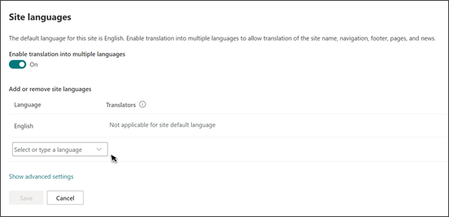
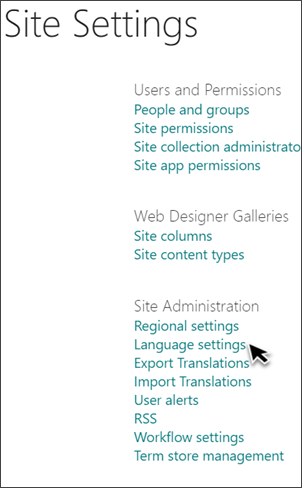
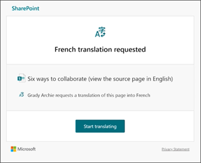

# Create a Viva Connections Dashboard in more than one language

Create a Viva Connections Dashboard that can be viewed in multiple languages. Start by enabling the multilingual experience, select languages, and assign translators.  

>[!NOTE] 
> The option to create a multilingual Dashboard is currently available for Private Preview customers only. This feature will become generally available in May 2022. 

## Step 1: Navigate to the Viva Connections Dashboard
1.	Navigate to your organization’s home site.
2.	Select **Settings**, and then **Manage Viva Connections**. Here, you will create a Dashboard and add cards for the first time or edit an existing Dashboard.

## Step 2: Enable the multilingual experience and choose languages in Site settings
1.	Select **Settings** from the top right, and then select **Site information**.
2.	At the bottom of the site information pane, select **View all site settings**.
3.	Under **Site Administration**, select **Language settings**.

     

4.	Under **Enable pages and news to be translated into multiple languages**, slide the toggle to **On**.

## Step 3: Select languages and assign translators
1.	Under **Add or remove site languages**, start typing a language name in **Select or type a language**, or choose a language from the dropdown. You can repeat this step to add multiple languages. You can add or remove languages from your site at any time by going back to this page.
2.	In the **Translator** column, start typing the name of a person you want to be a [translator](https://support.microsoft.com/office/create-multilingual-communication-sites-pages-and-news-2bb7d610-5453-41c6-a0e8-6f40b3ed750c?ui=en-us&rs=en-us&ad=us#bkmk_translators), and then select the name from the list.

     

3. Select **Save**.

>[!NOTE] 
> - Anyone in your organization's [Active Directory](/azure/active-directory/fundamentals/active-directory-whatis) can be assigned as a translator. People assigned as translators will not automatically be given appropriate permissions. When someone without edit permissions to the Dashboard tries to access the site, they will be directed to a web page where they can request access.
> - You can add or remove languages from your Dashboard at any time by going back to this settings page.
> - The default language of a Dashboard is set to the language chosen when the Dashboard is created. However, when English is among the supported languages, English is treated as the preferred language if the user's preferred language is not supported by the Dashboard. This is a known issue.

## Step 4: Create Dashboards in specific languages
Translators manually translate copies of the Dashboard into the language(s) specified. When you select a language and assign a translator, a copy of the Dashboard is created, and translators are notified in an email that a translation is requested. The email includes a link to a copy of the Dashboard. An email notification will be sent to the person who requested the translation when it's done. The translator will:

1.	Select the **Start translating** button in the email.

     

2.	Select **Edit** on the top right of the Dashboard and translate the content.

3.	When the translation is done, select **Save as draft** (if you're not ready to make it visible to readers) or, if the Dashboard is ready to be visible to everyone who is using that language on the site, select **Publish**.

>[!NOTE] 
> Some components of 2nd and 3rd party Dashboard cards (for example, the card name) may not be translatable. 

## Step 5: Add a translated Dashboard name and description

1.	To edit the description, from the Dashboard, select **Dashboard settings** in the command bar.
2.	**Edit** the Dashboard description.
3.	To edit the name of the Dashboard, navigate to **Settings**, and then **Site contents**, and then find the translated Dashboard in **Site pages**. Hover over the Dashboard that you want to rename and select the ellipsis **(...)** and then select **Rename.**

## Email notifications
Learn more about when and why the default Dashboard owner and assigned translators will receive emails when content is edited.

Email notifications are batched in 30-minute increments as needed. For example, when the first email related to a page is sent, and an update is made to the default language page, the next notification email or any others that need to be sent, will be batched, and sent after 30 minutes.

- When a translation Dashboard is created, an email is sent to the assigned translator(s) to request a translation. The email includes a Start translating button.

- When a translation Dashboard is published by a translator, an email is sent to the person who requested the translation.
- When an update is made to the default language Dashboard and saved as a draft or is published, an email is sent to the translator to notify them that an update to the translation Dashboard may be required.

## More tasks for your multilingual Dashboard
After you’ve created Dashboards in additional languages, learn more about how to confirm which languages are available, update translated versions, and delete translations that are no longer needed. 

### Confirm the languages the Dashboard can be viewed in
The status of the translation of the Dashboard (draft saved, published, and so on) is shown in the Translation pane next to each language. To see the status:

 
1.	Go to the default Dashboard.
2.	Select **Translation** at the top of the page.
3.	In the Translation pane on the right, the status of each language is shown, as well as a link to view the Dashboard in that specific language.

### Find a translated Dashboard
You can use the language dropdown at the top of the page, the translation panel, or find the Dashboard in the Pages library.

To find it in the Pages library, do this:

1.	Go to the Pages library for the home site.
2.	Find the Dashboard you want to delete in the language folder adjacent to the default language page. The folder can be identified by its 2- or 4-letter language code. For example, the French folder will be identified as "fr."

### Delete a version of the Dashboard for a specific language
To delete a translated Dashboard, you must perform a few additional steps to break the association between the default language Dashboard and the deleted Dashboard.
1.	Go to the **Pages library** for the Dashboard.
2.	Find the version of the Dashboard you want to delete in the language folder adjacent to the default language page. The folder can be identified by its 2- or 4-letter language code. For example, the French folder will be identified as "fr."
3.	Select the Dashboard you want within the folder, and then select the ellipsis (...) to the right of the selected page.
4.	Select **Delete**.
5.	After you've deleted the version of the Dashboard that’s no longer needed, go to the default language Dashboard, and select **Edit** at the top right. If you are not in edit mode, the rest of the steps will not work.
6.	Select **Translation** at the top of the page.
7.	In the Translation panel, you should see a message indicating that an association with the page has been removed.
8.	**Republish** the default language Dashboard.

### Update the Dashboard with new changes or edits
Make changes as needed over time to the Dashboard and select **Save as draft** or **Republish**. Then, the translator(s) for the translated Dashboard are notified in email that an update has been made so updates can be made to the individual translation pages as well.

### Update the default language page
When the default language Dashboard is updated, it must be republished. Then, the translator(s) for the translated Dashboard are notified in email that an update has been made so updates can be made to the individual translation pages. Translators will need to view the version history of the default Dashboard to see what content has changed.

## Translated Dashboards in the Dashboard web part
The [Dashboard web part](/sharepoint/use-dashboard-web-part-on-home-site) can be used once the Dashboard has been published. The Dashboard web part will display in the users preferred language (if different from the default language) if a translated Dashboard has been provided.
Note: 
 - Translation Dashboards must be approved and published before they will appear.
 - Some components of the 2nd party and 3rd party Dashboard cards (like the card name) may not be translatable. 

 ### More resources

[Set up the Viva Connections experience in a specific language](/viva/connections/viva-connections-language)

[Create the Viva Connections Dashboard](/viva/connections/create-dashboard)

[Create multilingual communication sites, pages, and news](https://support.microsoft.com/office/create-multilingual-communication-sites-pages-and-news-2bb7d610-5453-41c6-a0e8-6f40b3ed750c)
