# Customize and edit the Viva Connections home experience

The new [Viva Connections](viva-connections-overview.md) desktop design serves as a new home experience option that centers essential job tasks, personalized content, easy access to other Viva experiences, and better aligns with the mobile experience. [Learn more about the new Viva Connections home experience](https://techcommunity.microsoft.com/t5/microsoft-viva-blog/more-options-coming-soon-for-the-viva-connections-desktop/ba-p/3644419). 

Elements of the new Viva Connections home experience can be customized to fit your organization’s brand and the needs of your end users. Learn more about how to customize the banner, Dashboard content, and navigational links in Resources. Then, learn how to influence content in the Feed. Finally, learn how to manage access and permissions. 

>[!NOTE]
> - The new Viva Connections home experience will be available for [Targeted release](/microsoft-365/admin/manage/release-options-in-office-365) customers by the end of November 2022 and will become generally available to all customers in 2023.
> - If you already have Viva Connections set up, the new home design uses current content and settings (like audience targeting) from your Dashboard and Resources.
> - If your organization has a home site, you can choose to use it as the default home experience.
> - The new home experience uses a similar permission model to SharePoint and can be managed from Microsoft Teams. 
> - You must have member level permissions or higher to edit the new desktop experience.
> - If you haven’t set up Viva Connections yet, the default experience includes cards on the Dashboard but otherwise doesn’t impact [the mobile experience](/viva-connections-overview.md#the-viva-connections-mobile-experience).

## About the new Viva Connections home experience
The home experience focuses on the top tasks, tools, and resources that help people in your organization get their jobs done. The new design prominently features key elements to the [Viva Connections experience](https://support.microsoft.com/topic/introducing-microsoft-viva-3c1012cb-6c85-4d49-bd7f-b18a6e7873e0) - the Dashboard, Feed, and Resources. Content in these elements is filtered [using audience targeting to create a personalized experience](use-audience-targeting-in-viva-connections.md). 

| Desktop view         | Elements            |
| :------------------- | :------------------- |
| 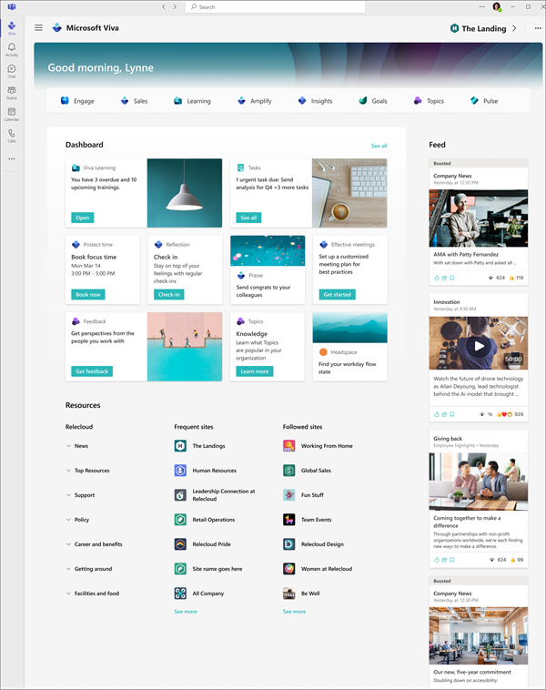  | - **Dashboard:** [The Dashboard](/viva-connections-overview.md#viva-connections-dashboard) is your employee’s digital toolset. It brings together the tools your employees need, enabling quick and easy access whether they are in the office or in the field.   - **Feed:** [The Feed](/viva-connections-overview.md#viva-connections-feed) delivers updates to the right people at the right time and is tightly integrated with Yammer, SharePoint news, and Stream to display a personalized feed, based on post-level targeting of the groups that employees belong to.   - **Resources:** [The Resources](/viva-connections-overview.md#viva-connections-resources) experience enables navigation across portals and destinations.   - **Navigational elements:** Located in the top-right and top-left corners, [navigational elements(https://go.microsoft.com/fwlink/?linkid=2208247) help viewers easily get to-and-from other landing pages and [other Viva experience](https://support.microsoft.com/topic/introducing-microsoft-viva-3c1012cb-6c85-4d49-bd7f-b18a6e7873e0). | 

### Summary of customizable elements 

| Elements            | Description           |
| :------------------- | :------------------- |
| 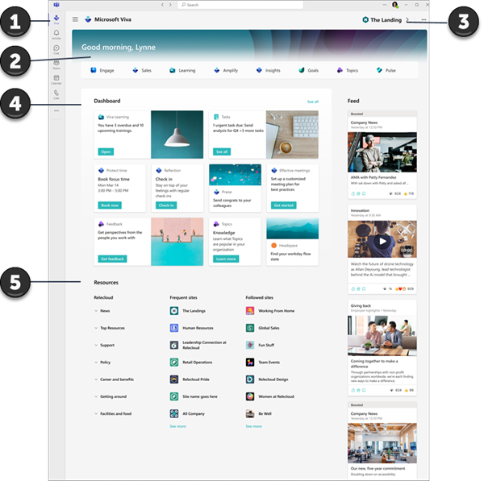  | 1. **App icon and label in the Teams app bar:** Customize the app name and label in the [Teams admin center](add-viva-connections-app.md).   2. **Banner image:** Upload a banner image and set the focal point to create a branded look.   3. **Entry point to secondary landing page:** A link to the preferred default desktop experience will automatically display here.   4. **Dashboard:** Customize with [cards and content](create-dashboard.md) specific to roles, regions, departments, and popular tasks.   **Resources:** Add navigational links and labels in the first column of the Resources section. Content in Frequent and Followed sites are dynamically displayed based on the viewers interests and activity. | 

### Summary of non-customizable elements 

| Elements            | Description            |
| :------------------- | :------------------- |
| 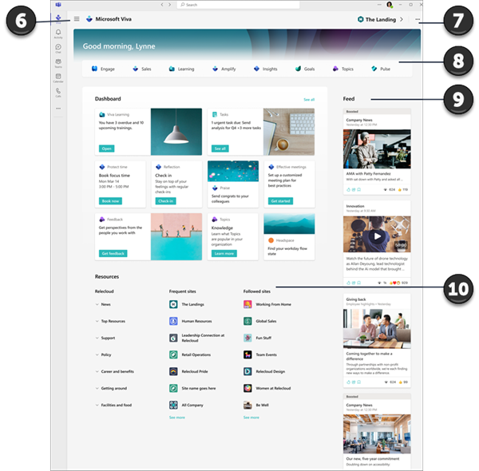  | 6. **Shared Viva navigation:** Helps viewers navigate between Viva experiences. Viva apps will automatically display in this menu when Viva licenses are detected.   7. **Ellipses menu:** Access more information about the home experience depending on your level of permissions.   8. **Viva navigational bar:** This provides an opportunity to discover [more Viva experiences](https://support.microsoft.com/topic/introducing-microsoft-viva-3c1012cb-6c85-4d49-bd7f-b18a6e7873e0) and gets automatically generated when Viva licenses are detected.   8. **Feed:** Content in the Feed is dynamically generated based on the sites and communities the user follows. [Learn more about how content in the Feed is sourced](/faqs-viva-connections-feed).   9. **Frequent sites and Followed sites:** Content in these sections are dynamically displayed based on the viewers interests and activity. |

## Get started customizing the experience
>[!NOTE]
> You must have member level permissions or higher to edit the new desktop experience.

### How to edit the Viva Connections desktop experience for the first time
If you already have Viva Connections setup, editors who have site owner or member permissions to the home site will automatically have owner or member permissions to the new home experience in Teams. People with member permissions or higher will automatically see **Edit** buttons in the home experience.

If you are setting it up for the first time, only owners of the SharePoint root site will be able to edit. When the home experience is edited for the first time, a SharePoint site on the backend will get created. You’ll want to assign (at least two) owners and members from this site to give permissions to others so they can edit the experience for the rest of the organization. Manage permissions from the backend site by going to **Settings > Permissions > Share** and assign owner or member level permissions. 

## Customize the app icon and label in the Teams app bar

## Customize the banner image
Change the banner image in the header and set the focal point for the image. The banner image only displays in the desktop app.

1.	Start by selecting Edit and then select Change image.
2.	Select the image you’d like to use and then select Reposition. 
3.	Once you are satisfied with the focal point, select Set focal point and then Save. There is no draft state for the banner image. It will be displayed for all users when you select Save.

>[!NOTE]
> - The greeting is automatically generated and cannot be customed.
> - Depending on your organization’s license type, you may see additional dynamic information displayed in the banner.
> - The Microsoft Viva icons and labels displayed below the greeting are automatically displayed based on the license that’s detected and cannot be customed. 

## Customize the Dashboard
The [Viva Connections Dashboard](/create-dashboard.md#overview-of-how-to-create-a-dashboard-and-add-cards) provides fast and easy access to information and job-related tasks. Add and edit cards that helps users quickly access the tools and resources they use in their day-to-day role. Cards on the Dashboard can be targeted to users based on specific roles, regions, and interests. Edits (including audience targeting settings) made to cards on the Dashboard will also automatically be applied to the [Dashboard web part](use-dashboard-web-part-on-home-site.md) and [the mobile experience](/viva-connections-overview.md#the-viva-connections-mobile-experience). 

Once [certain requirements are met](guide-to-setting-up-viva-connections.md), the Dashboard can be created and edited from your [home site.](home-site-plan.md) As you are building the Dashboard, you can see a preview of how it will display for targeted audiences and different devices. Then publish your Dashboard to make it available to users who have access to your home site. When you are done, you can add it to Microsoft Teams so that it's easily accessible from a mobile device and desktop. You can also add it to your home page using the [Dashboard web part.](/sharepoint/use-dashboard-web-part-on-home-site)

  

**This article includes:**

- [Create a Dashboard and add cards](#create-a-dashboard-and-add-cards)
- [Add the Approvals card](#add-the-approvals-card)
- [Add an Assigned tasks card](#add-the-assigned-tasks-card)
- [Add a customized card using Card designer](#design-your-own-card-with-a-quick-view)
- [Add a Teams app card](#add-a-teams-app-card)
- [Add a third-party card or Microsoft app](#add-a-third-party-card-or-microsoft-app)
- [Add the Top news cards](#add-the-top-news-card)
- [Add a Shifts card](#add-a-shifts-card)
- [Add a Viva Learning card](#add-a-viva-learning-card)
- [Add a Web link card](#add-a-web-link-card)
- [Apply audience targeting to cards](#apply-audience-targeting-to-cards)
- [Preview your Dashboard to see how it will display for different audiences and devices](#preview-your-dashboard-to-see-how-it-will-display-for-different-audiences)
- [Add the Dashboard to your home site using the Dashboard web part](#use-the-dashboard-web-part-for-viva-connections)
- [Get more information about how links and Single sign-on works](#how-urls-and-single-sign-on-works)

## Overview of how to create a Dashboard and add cards

> [!VIDEO https://www.microsoft.com/en-us/videoplayer/embed/RE53Joj]

 
 

## Create a Dashboard and add cards

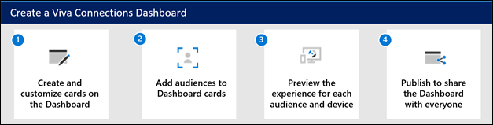

You’ll need [edit permissions](/sharepoint/customize-sharepoint-site-permissions) for the home site.

1. From the [home site,](home-site-plan.md) select the **Settings** gear at the top-right of the page.
2. Select **Manage Viva Connections**.
3. Select the **+ Create Dashboard** button.

   >[!NOTE]
   > - The Dashboard page opens in mobile view by default.
   > - You can choose Mobile and Desktop views interchangeably as you’re authoring.
   > - Image recommendations for cards in the Dashboard: medium cards should be 300x150 to 400x200 with 2:1 aspect ratio and large cards 300x300 to 400x400 with 1:1 aspect ratio in order to prevent stretching in the mobile app.
   > - Image URLS in card properties must be an absolute URL in order for the link to work in the mobile app.
   > - It's recommended to limit the number of cards to about 20 card on the Dashboard for the best viewing experience.

4. Select **+ Add a card**.

   

5. Select the type of card you want to add from the Dashboard card toolbox and then follow the steps below to set up each type of card. As you’re building the Dashboard, you can preview its appearance in mobile and desktop for different audiences.

   **Available cards:**

   |Card Name    |Toolbox icon   | Description  |
   |:------------|:-------------:|:--------------|
   |[Approvals](#add-the-approvals-card) | 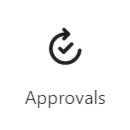 | Use [Approvals](/power-automate/get-started-approvals) for vacation requests, sign-off on documents, and approve expense reports     |
   |[Assigned Tasks](#add-the-assigned-tasks-card) | 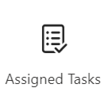 |   Use [Tasks](https://support.microsoft.com/office/assign-and-track-tasks-in-teams-56014efe-3283-4f13-a57f-1157c5e25f1f) to manage your team's work, assign tasks, and track tasks     |
   |[Card designer](#design-your-own-card-with-a-quick-view) | 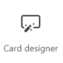 | Create your own cards and quick views using the [adaptive cards framework](/adaptive-cards/templating/)|
   |[Shifts](#add-a-shifts-card)     | | Display information about the next or current shift from the Shifts app in Teams          |
   |[Teams app card](#add-a-teams-app-card) |  |   Use to open a Teams personal app or bot specified by the Dashboard author     |
   |[Third-party cards](#add-a-third-party-card-or-microsoft-app) | Varies |    Use cards that integrate [third-party services](https://cloudpartners.transform.microsoft.com/resources/viva-app-integration)     |
   |[Top news card](#add-the-top-news-card)    | 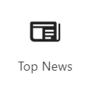 |   Set up the Top news card to [surface boosted news from SharePoint](https://support.microsoft.com/office/boost-news-from-organization-news-sites-46ad8dc5-8f3b-4d81-853d-8bbbdd0f9c83)     |
   |[Viva Learning](#add-a-viva-learning-card)    | 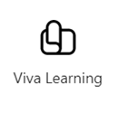 |  Provide a link to the Viva Learning app that can be targeted to show to certain audiences.  |
   |[Web link](#add-a-web-link-card)    | 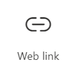 |  Access a site without leaving the Viva Connections app  |
 
6. When you're done adding cards and targeting audiences, preview the experience to ensure an ideal viewing experience.

7. Once you’re satisfied with how the Dashboard looks in preview, select **Publish** at the top-right of your Dashboard to make it available for use on your home site, in Teams, and in Teams mobile app. The view will default to Desktop view after you’ve published the Dashboard.

## Add the Approvals card

The Approvals card connects to [Approvals in Microsoft Teams](https://support.microsoft.com/office/what-is-approvals-a9a01c95-e0bf-4d20-9ada-f7be3fc283d3) and is a way to streamline all of your requests and processes with your team or partners. You'll be able to create new approvals, view the ones sent your way, and see all of your previous approvals in one place.

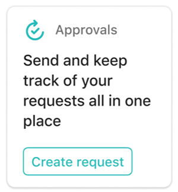

1. While in edit mode, click **+ Add a card** from the Dashboard.

2. Select **Approvals** from the Dashboard toolbox.

   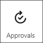

3. Select the pencil icon to **Edit** the card. In the property pane that opens on the right, choose your card size from the **Card size** drop-down list.

   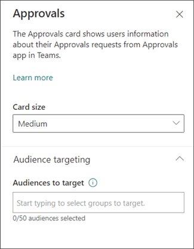

4. If you want to target your card to specific audiences (that is, only audience you specify will see the card in the dashboard), select one or more groups to target. For more information on audience targeting, see [Audience targeting](#apply-audience-targeting-to-cards).

## Add the Assigned tasks card

The Assigned tasks card enables automatic display of information to users about their assigned tasks. This information is retrieved from the [Tasks app in Teams](https://support.microsoft.com/office/assign-and-track-tasks-in-teams-56014efe-3283-4f13-a57f-1157c5e25f1f).

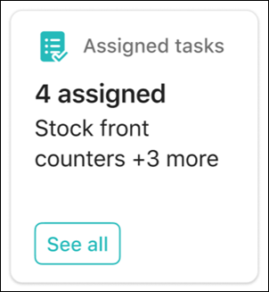

1. While in edit mode, click **+ Add a card** from the dashboard.

2. Select **Assigned Tasks** from the Dashboard toolbox.

   

3. In the property pane on the right, choose your card size from the **Card size** drop-down list.

   

4. If you want to target your card to specific audiences (that is, only audience you specify will see the card in the dashboard), select one or more groups to target. For more information on audience targeting, see [Audience targeting](#apply-audience-targeting-to-cards).

## Design your own card with a quick view

You can choose the **Card designer** option to design your own card that includes a quick view. To do this, you should be familiar with JSON and Adaptive Card templates. For more information, see [Adaptive Cards Templating](/adaptive-cards/templating/).

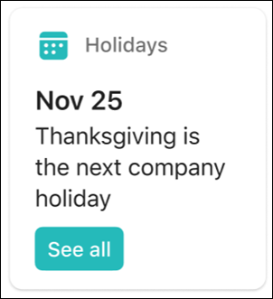

1. While in **edit** mode, select **+ Add a card** from the dashboard.

2. Select **Card designer**.

   

3. In the **property** pane, select your card options.

   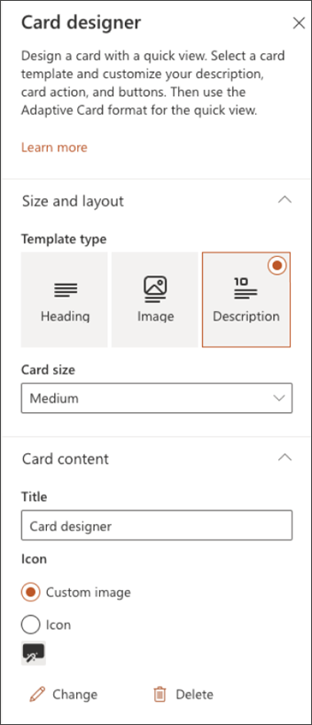

4. From the **Card size** drop-down list, choose either **Medium** or **Large**.
   A medium-sized card allows you to add one button, while a large-sized card allows you to add two buttons.

5. Enter a title for your card in the **Title** text box. 
6. Enter a URL in the **Icon** text box. This URL is the icon's location.
7. Select a template type from one of the following options in the **Template type** drop-down list:
    - **Text**: Provides you the option to add only a heading.
    - **Text and image**: Provides you the option to add a heading and an image.
    - **Text and description**: Provides you the option to add your own heading and a description, but without an image option.
8. Depending on the template type you’ve chosen, enter values for the properties. For example, if you have chosen the **Text and description** template type, you have to enter values for the **Heading** and **Description** properties in their respective text boxes.

   >[!NOTE]
   >If you want a specific property to display that allows users to enter a value, but that property is not displayed, choose a different template type.

9. Toggle **Enable card action** to **On** if you want the card to either go to a link or show a quick view when the user selects it. 

   > [!IMPORTANT]
   > The quick view will need to be set up first (see the Add a quick view section below).

10. Set the number of buttons to be displayed under **Number of buttons**. 
    For a medium-sized card, you can show only 1 button. For a large-sized card you can show 1 or 2 buttons.

1. Enter values for the following properties of the button:
    - **Title**: Title for the button.
    - **Action**: The result on clicking the button.
    - **Link**: The URL of the destination the user is directed to, on clicking the button.

## Set up a quick view

Under **Quick view layout and data**, enter JSON template code for your quick view layout, and add the code for the data you want to use. For more information on templating and data with some examples, see [Adaptive Cards Templating](/adaptive-cards/templating/). You can find more examples at [Adaptive Cards](/adaptive-cards/).

If you want to target your card to specific audiences (that is, only audiences you specify will see the card in the Dashboard), select one or more groups to target. For more information on audience targeting, see [Audience targeting](#apply-audience-targeting-to-cards).

## Add a Teams app card

A Teams app card allows you to create a card for an existing Teams app. 

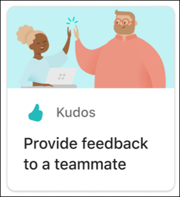

1. While in **edit** mode, select **+ Add a card** from the Dashboard.

2. Select **Teams app** from the web toolbox.

   

3. In the **property** pane on the right side of the page, select your options.

   

4. Select a size for the card from the **Card size** drop-down list.
5.  Search for the Teams app you want to use, and then select it from the list.
6.  Set the card-display options:
    - Enter a title for the card in the **Card title** text box. (This title won't change your page title; it is the title that will be displayed on the top of the card.)
    - Enter a description for the card in the **Card description** text box. This description will be displayed in larger text under the title.
7. If you want to target your card to specific audiences (that is, only audience you specify will see the card in the dashboard), select one or more groups to target. For more information on audience targeting, see [Audience targeting](#apply-audience-targeting-to-cards).

## Add a third party card or Microsoft app

The Viva Connections Dashboard and mobile experience can be extended and customized using cards, which are based on [adaptive cards](https://adaptivecards.io/) and the [SharePoint Framework (SPFx)](/sharepoint/dev/spfx/sharepoint-framework-overview). These adaptive cards are used to display data, complete tasks, and connect to Teams Apps, Websites, and mobile apps on Viva Connections. They provide a low-code solution to bring your line-of-business apps into the Dashboard. 

To create custom experiences on Viva Connections Dashboard and Viva Connections Mobile App, developers must use the SPFx to create custom ACEs. To learn more about creating ACEs, see the following tutorial: [Build your first SharePoint Adaptive Card Extension](/sharepoint/dev/spfx/viva/get-started/build-first-sharepoint-adaptive-card-extension). Learn more about [Viva Connections extensibility.](/sharepoint/dev/spfx/viva/overview-viva-connections)

### Add a 3rd party card
There are two ways to acquire third-party developers and partners solution package and add them on the Viva Connections dashboard.

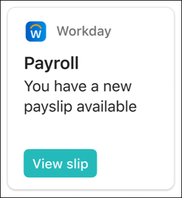

#### Option 1: Acquire the app from a Microsoft AppSource or the SharePoint store
You can acquire apps from third- party developers by browsing the [Microsoft AppSource](https://appsource.microsoft.com/en-us/marketplace/apps?product=sharepoint) or [SharePoint store](https://techcommunity.microsoft.com/t5/microsoft-sharepoint-blog/explore-and-deploy-sharepoint-framework-solutions-from-partners/ba-p/2645289) (recommended).

- If you are building a dashboard, you can [request the app directly](https://techcommunity.microsoft.com/t5/microsoft-sharepoint-blog/explore-and-deploy-sharepoint-framework-solutions-from-partners/ba-p/2645289), but you will need approval from an admin of the tenant-level app catalog to continue with the installation
- If you are an **admin** of a tenant-level app catalog, you can deploy business apps directly.

[Get step-by-step guidance](https://techcommunity.microsoft.com/t5/microsoft-sharepoint-blog/explore-and-deploy-sharepoint-framework-solutions-from-partners/ba-p/2645289) on how to request and deploy an app, and add an app to your site. For tenant admin, [learn how to manage apps](/sharepoint/use-app-catalog#work-with-sharepoint-store-apps) in the App Catalog.

#### Option 2: Acquire the app directly from the third-party developer

 >[!NOTE]
 > SharePoint administrative permissions are required to complete this task.

You can request apps directly from the Viva Connections third-party developers and partners. Admin permissions are required to [add the app to tenant level app catalog.](/sharepoint/use-app-catalog) 

### Add a Microsoft app as a card on the Dashboard

A Microsoft app card allows you to create a card that links to Microsoft apps e.g., Shifts, Approvals, Task. Microsoft apps cards will be available Out of the Box when Viva Connections is enabled.

1. While in edit mode, select **+ Add a card** from the Dashboard.

2. Select the Microsoft App you want to add from the web toolbox.

   

3. Select your options in the property pane on the right side of the page.

4. When you **Republish**, the card will appear on your dashboard.

## Add the Top news card
Set up the Top news card to surface [boosted news from SharePoint](https://support.microsoft.com/office/boost-news-from-organization-news-sites-46ad8dc5-8f3b-4d81-853d-8bbbdd0f9c83). News that has been boosted will prominently display in the Top news card.

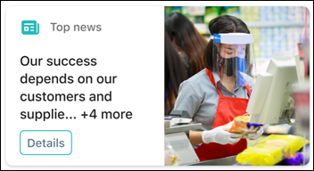

1. While in **edit** mode, select **+ Add a card** from the Dashboard.

2. Select **Top news** from the web toolbox.

    

3. In the property pane on the right, choose your card size from the **Card size** drop-down list.

4. If you want to target your card to specific audiences (that is, only audience you specify will see the card in the dashboard), select one or more groups to target. For more information on audience targeting, see [Audience targeting](#apply-audience-targeting-to-cards).

## Add a Shifts card

The Shifts card shows users information about their next or current shift from the Shifts app in Teams. They can also clock in and out and track break time when Time clock is enabled in Teams. 

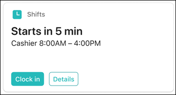

1. While in edit mode, select **+ Add a card** from the dashboard.

2. Select **Shifts** from the Dashboard toolbox.

   

3. In the property pane on the right, choose your card size from the **Card size** drop-down list.

4. If you want to target your card to specific audiences (that is, only audience you specify will see the card in the dashboard), select one or more groups to target. For more information on audience targeting, see [Audience targeting](#apply-audience-targeting-to-cards).

## Add a Viva Learning card

The [Viva Learning](/viva/learning/overview-viva-learning) card provides users quick-links to recommended trainings, and can be set to target specific trainings to certain individuals. By clicking the Viva Learning link, users can easily access their required trainings.

Content in the cards is dynamic and will change according to settings in Viva Learning. Below are three examples of Viva Learning card states that display different information depending on the viewer and Viva Learning settings.

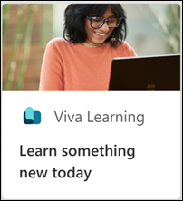    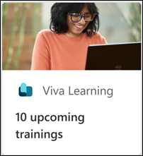  

1. While in edit mode, select **+ Add a card** from the Dashboard.

2. Select **Viva Learning** from the Dashboard toolbox.

    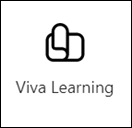

3. In the property pane on the right, choose your card size from the **Card size** drop-down list.

    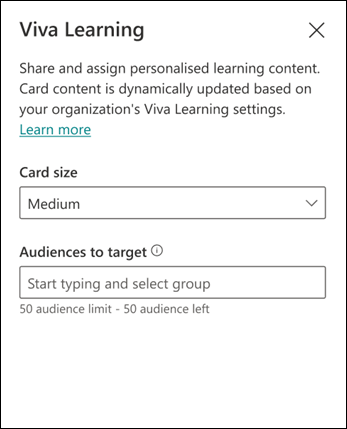

4. If you want to target your card to specific audiences (that is, only audience you specify will see the card in the dashboard), select one or more groups to target. For more information on audience targeting, see [Audience targeting](#apply-audience-targeting-to-cards).

## Add a Web link card

Add a web link card when you want your users to go to an internal or external link on a web site. 

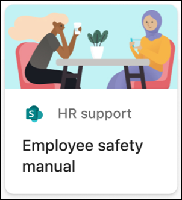

1. While in **edit** mode, select **+ Add a card** from the Dashboard.

2. Select **Web link** from the web toolbox.

   

3. In the property pane on the right side of the page, select your options.

   

4. Select a size for the card from the **Card size** drop-down list.
5. Enter the URL for your link in the **Link** text box. 
6. Set the card-display options:
   - Enter a title for the card in the **Card title** text box. (This title won't change your page title; it is the title that will be displayed on the top of the card.)
   - Enter a description for the card in the **Card description** text box. This description will be displayed in larger text under the title.
3. Under **Thumbnail**, select one of the following options:
   - **Auto-selected**: This option when chosen automatically displays an image at the top of your card that comes from your page.
   - **Custom image**: This option when chosen enables the **Change** button.  You can select this button to choose an image you want to use.
4. Under **Card icon**, select one of the following options that enable the icon to be displayed on the left side of the card title:
   - **Auto-selected**: This option when chosen automatically displays a built-in icon associated with the page.
   - **Custom image**: This option when chosen enables the **Change** button.  You can select this button to choose an image you want to use.
    - **Icon**: This option when chosen enables the **Change** button.  You can select this button to choose from a set of stock icons.
5. If you want to target your card to specific audiences (that is, only the audience you specify will see the card in the dashboard), select one or more groups to target from the **Audiences to target**. For more information on audience targeting, see [Audience targeting](#apply-audience-targeting-to-cards).

## Apply audience targeting to cards
[Audience targeting can be applied throughout](use-audience-targeting-in-viva-connections.md) the Viva Connections experience, including cards on the Dashboard. Audience targeting creates a personalized viewing experience by filtering the most important content to specific groups. Use audience targeting to: 

- Create custom views for distinct roles and regions. 
- Generate as many different views as needed to create unique experiences. 
- Ensure the most important content is seen by the intended audience. 

### Set the target audiences for a card

1. If your page is not already in **edit** mode, select **Edit** at the top-right of the Dashboard page.
2. Select the card you want to target to one or more audiences, and select the **Edit card** pencil from the toolbar on the left.
3. In the property pane on the right, under **Audiences to target**, type or search for the audience group(s) you want to target.

    >[!NOTE] 
    > If you've selected an audience group that you recently created or changed, it may take some time to see targeting applied for that group.

4. When a card is successfully audience targeted, you’ll see a **people** icon in the lower-left corner of the card.

   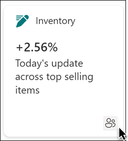

### Preview your dashboard to see how it will display for different audiences

After creating or editing cards on the Dashboard, make sure you preview the experience for each audience and on both desktop and mobile devices. What you see in *preview mode* approximates how the Dashboard will display for certain audiences and devices. When you apply audience targeting to cards, you can preview how different people will view the Dashboard depending on the audience or device. While in preview-mode, make sure: 

- There aren’t any physical gaps between cards that may appear while previewing different audiences and devices. If you see gaps, rearrange cards so that every audience and device will have a high-quality viewing experience. 
- Icons, graphics, and images are easy to identify and understand. 
- Buttons and links are active and go to their intended destinations. 
- Labels and description text are helpful, easy to read, and make sense for the intended audience. 
 
#### To preview different audiences:

   1. While in edit mode, select **Preview** on the top right.

      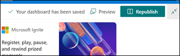

   2. Open the **Select audiences to preview as** drop-down list. (if no cards are audience targeted, you will see a disabled **Audience targeting** label).

      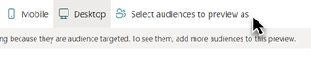

   3. Search for and select a group. Once added, the group will be selected by default. You can select the group again in the **Select audiences to preview as** drop-down list to de-select it.

      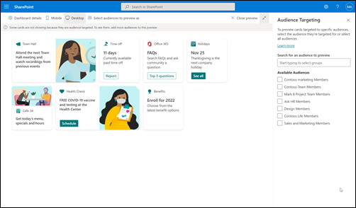

   - Cards that targeted to a specific group will display.
   - When one or more audiences are selected, cards that *do not* have audience targeting applied will also display.
   - If no audiences are targeted, only cards that *are not* audience targeted will display. If there aren't any cards with audience targeting applied, none will display.
   - If you are not part of one of the audiences you've selected, you will only see cards that are not audience targeted. If none are audience targeted, you won't see any cards.

   #### Examples:

   In the following example, the preview is set for mobile devices and highlights the different views that can be created from a single Dashboard.

   | View 1                  | View 2                 | 
   | :-------------------: | :-------------------: |
   |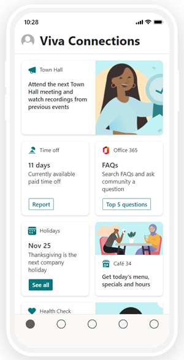 | 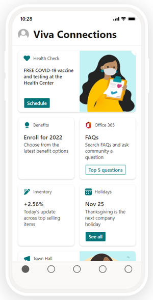 | 
   

## Use the Dashboard web part for Viva Connections

>[!NOTE] 
> - After editing content on the Dashboard, it may take several minutes until the new content is available in the Dashboard web part.
> - For best results, we recommend placing the Dashboard web part in a right vertical section.

Once a Dashboard is authored and published, you can use the Dashboard web part to display it on your home site. You can add the web part to any section on your page.  

When added, it will automatically be populated with the cards from the existing Dashboard on your site. You'll be able to set the maximum number of cards you want to display. [Learn how to use the Dashboard web part](/sharepoint/use-dashboard-web-part-on-home-site).

## How URLs and single Sign-on works
For some cards, you will use links to URLs. Depending on the location of the content, links to URLs may display content in Microsoft Teams or elsewhere and [Single sign-on (SSO)](/azure/active-directory/manage-apps/what-is-single-sign-on) behavior can differ. Get more information about how links to URLs and SSO behave depending on the location of the content you are linking to.

>[!NOTE] 
> When SSO is not supported, users will be asked to enter their login credentials.

| Content source | Opens URL to… | Supports SSO          |
| :------------------- | :------------------- |:----------------|
| SharePoint Link  | SharePoint or Teams      | Yes      |
| Teams App  | Teams  | No             |
| Microsoft  Forms   | Device's browser   | Yes    |
| Yammer       | Yammer or Teams     | Yes   |
| PowerApps   | Teams      | Yes  |
| Power Portals  | Teams | Yes  |
| Stream  | Teams | Yes    |
| External Links  | Teams | No  |

## More resources

[Step-by-step guide to setting up Viva Connections](guide-to-setting-up-viva-connections.md)

[Learn more about how to plan a Dashboard](plan-viva-connections.md#step-2-plan-for-viva-connections)
