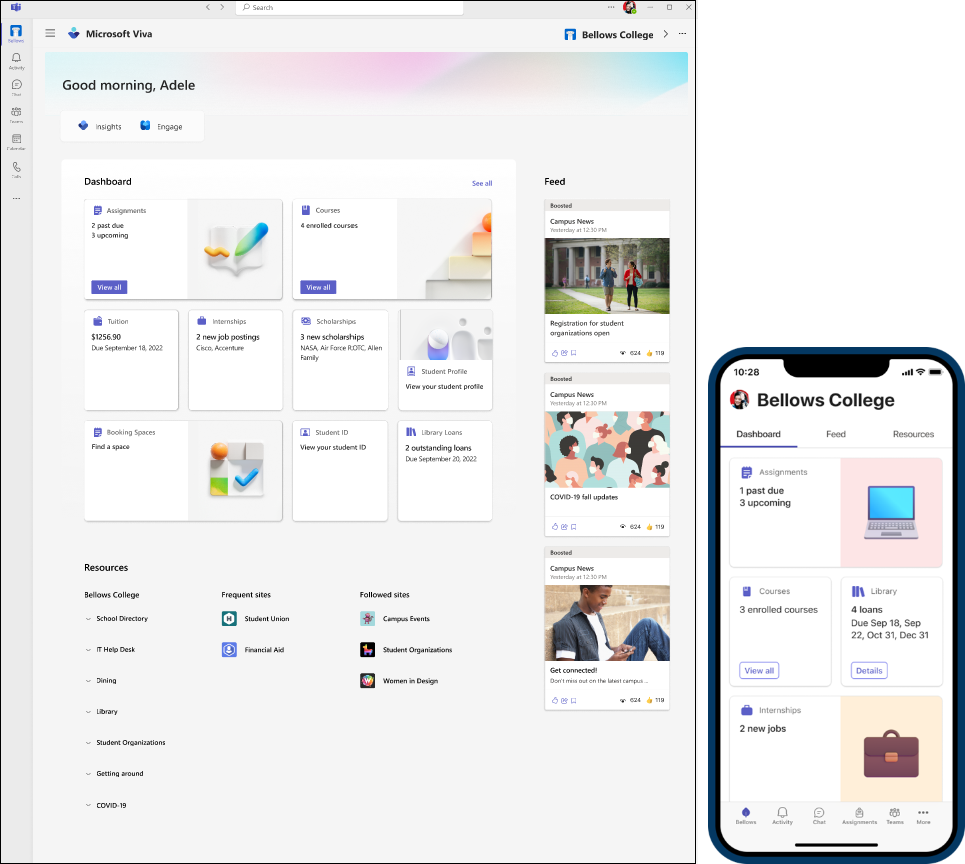
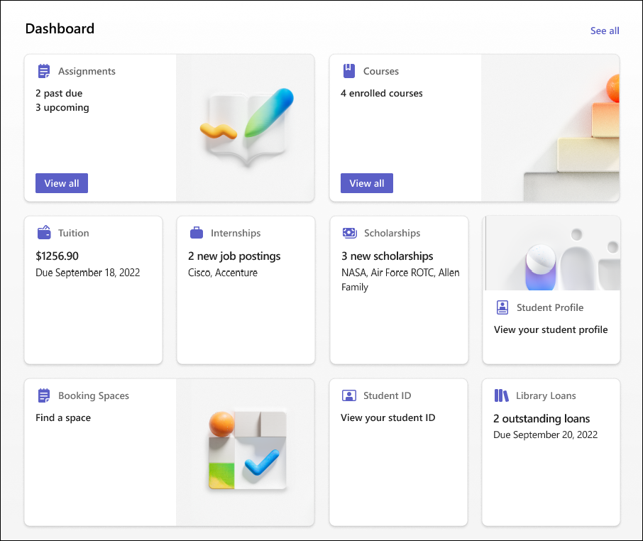
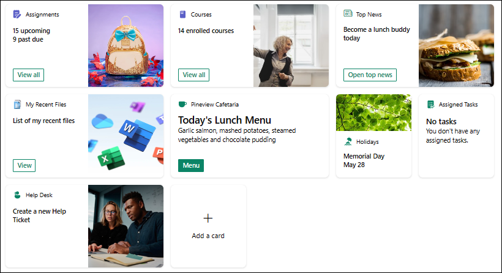
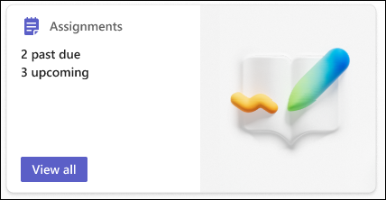
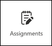
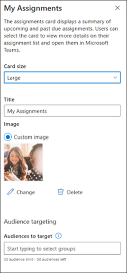
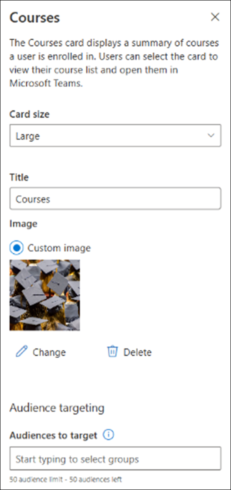
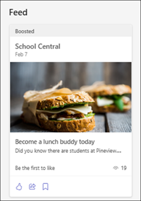

# Overview of Viva Connections for Education
Microsoft Viva Connections for Education is your gateway to a modern faculty, staff and student experience and is designed to keep everyone engaged and informed. It is a customizable app in Microsoft Teams that gives different audiences in your organization a personalized destination to discover other Viva apps your organization is licensed for, relevant news, conversations, and the tools they need to succeed. Viva Connections for Education provides a digital home for your users allowing them to stay connected with the organization and simplify their day-to-day experience.

Use the [quick guide to set up Viva Connections](viva/connections/viva-connections-setup-guide) or get [more detailed guidance on how to plan, build, and launch](viva/connections/plan-viva-connections).

**Viva Connections is:**
- An education experience app in Microsoft Teams that allows organizations to create unique experiences for different audiences like faculty, staff, students, educators, and researchers.
- A gateway to other Viva apps and services with the ability to curate specific content and tools by providing easy access to resources, tools, relevant news, and popular destinations.
- Built on existing capabilities in Microsoft 365 like SharePoint, Teams, [Viva Engage](viva/engage/overview) (formerly called Yammer), and Stream.
- Learn more about [Microsoft Viva](https://www.microsoft.com/microsoft-viva) and [Viva licensing](https://www.microsoft.com/en-us/microsoft-viva/pricing).

> [!NOTE]
> -	A home site is not a requirement for setting up Viva Connections, but some organizations may choose to use a home site in addition to Viva Connections to provide a secondary landing experience that’s more focused on organizational content. [Learn more about home sites and how they complement Viva Connections](/viva/connections/viva-connections-overview#how-sharepoint-home-sites-and-viva-connections-work-together).
> - Viva Connections is not currently supported on tablet devices. Check the [Microsoft 365 Roadmap](https://www.microsoft.com/microsoft-365/roadmap) for the status of tablet support.

## Components to Viva Connections

Viva Connections is comprised of three primary components - the dashboard, the feed, and resources. Components display slightly differently between desktop and mobile devices.

| Component                  | Description                 |
| :------------------- | :------------------- |
| **Dashboard**                | [The dashboard](create-dashboard.md) is the digital toolset that brings together the resources your users need whether they are on campus, at home, or on the go. The dashboard uses dynamic cards that they can interact with to do things like finding their assessment, their enrolled courses, available internships, accessing training materials, reviewing paystub information, or check and book a shuttle. It can also be used as a [web part on SharePoint home sites](use-dashboard-web-part-on-home-site.md).    Cards in the Viva Connections dashboard are based on [adaptive cards](https://adaptivecards.io/) and the [SharePoint Framework (SPFx)](/sharepoint/dev/spfx/sharepoint-framework-overview). They provide a low-code solution to bring your line-of-business apps into the dashboard. In addition, Viva Connections desktop combined with SharePoint home sites can also be further customized and extended using [SPFx web parts and extensions](/sharepoint/dev/spfx/viva/overview-viva-connections).  | 
| **Feed**               | The Viva Connections feed delivers updates to the right people at the right time with powerful targeting and scheduling capabilities. It's tightly integrated with Viva Engage, SharePoint news, and Stream to display a personalized feed, based on post-level targeting of the groups that your users belong to. It supports both centralized organizational communication scenarios and democratized news scenarios. It's available in the Viva Connections Teams app and can also be used on SharePoint sites using the  [Viva Connections feed web part](use-feed-web-part-for-viva-connections.md). | 
| **Resources**             | The Viva Connections resources experience enables way finding across popular destinations. It uses navigation elements from the [SharePoint global navigation](sharepoint-app-bar.md) and links can be [audience targeted.](use-audience-targeting-in-viva-connections.md) | 

### Viva Connections Dashboard

The Viva Connections dashboard enables you to create a curated experience using dashboard cards that give your users access to their most critical content and tools. These cards are designed to enable quick task completion either by interacting with a card directly or by opening a quick view in the dashboard. Think of the Viva Connections dashboard as a digital home and toolset for your users.

The Viva Connections dashboard is available on desktop, mobile platforms (iOS, Android), and as a [web part on SharePoint sites](/viva/connections/use-dashboard-web-part-on-home-site). This web part can be integrated into a SharePoint home site, which then is exposed as part of the Viva Connections for desktop experience in Teams.

### Anatomy of a dashboard

A dashboard is made of medium-sized and large-sized cards which users can interact with to get information or complete a task.

**Users can select cards or click the buttons on cards to do things like:**
- Displaying a quick view with more information or an input form
- Navigating to a SharePoint page
- Accessing a Teams app
- Integrate with third party apps and services, including other Viva apps.

Some cards can also reflect dynamic content that refreshes based on a user action or other event. For example, users can see new tasks assigned, assignments to complete, online lectures to join, library books to return or required training courses when they open the dashboard. 

**In this example, view the experience for a dashboard card that shows students their assignments to complete:**

> [!VIDEO https://microsoft-my.sharepoint-df.com/:v:/p/jesegher/ERZMHo7N4apJj38gOANSzOsBut-6xvBjsKYCK0wfjcyjuw?e=pK1Rf5]

The dashboard experience has been designed to be consistent across mobile platform and desktop, but there are some differences:

| Element | Mobile | Desktop |
| :----- | :----- | :----- |
|Dashboard | Displays as the default tab in the Viva Connections app in Teams. | It is prominently displayed in the desktop app and can be added to your SharePoint sites as a [web part](viva/connections/use-dashboard-web-part-on-home-site). |
|Dashboard layout | Fixed in portrait mode. Card sizes can be medium (which shows two cards on one row) or large (which shows one card on a row). | Can be portrait or landscape with varying numbers of cards on each row depending on whether the web part is used in a 1-, 2-, or 3-column page section layout. |
|Card UI | Native | HTML based |
|Card order | Same as in Desktop | Same as in Mobile |
|Card reflow | Same as in Desktop | Same as in Mobile |
|How many cards are shown | All cards without audience targeting plus audience-targeted cards where the viewer is part of the targeted audience. | The number of cards to show can be specified in the Dashboard web part settings, but which cards are shown may vary depending on audience targeting. |

### Dashboard authoring
The dashboard can be authored directly in the Viva Connections app in Teams desktop. If you are using a home site, the dashboard can also be authored from the SharePoint home site.

The layout of the dashboard, including the size of the cards (which can be individually set as medium or large) can be customized. The layout of the cards may look different depending on whether the dashboard is being viewed on mobile, desktop, or in the dashboard web part.

[Learn more about how to edit your dashboard.](viva/connections/create-dashboard#edit-the-dashboard)

### Dashboard cards

The Viva Connections dashboard comes with a set of built-in cards, but is also designed to enable SaaS providers, system integrators, and in-house development teams to create their own cards to meet their business needs.

Cards in the Viva Connections Dashboard are based on adaptive cards and the [SharePoint Framework (SPFx)](/sharepoint/dev/spfx/viva/get-started/build-first-sharepoint-adaptive-card-extension). They provide a low-code solution to bring your line-of-business apps into the Dashboard.
>
> [!NOTE]
> Education tenants have several unique Viva Cards, Teams assignments, and Teams classes.

[Learn more about how to add, remove, and edit dashboard cards](/viva/connections/create-dashboard).

#### Add an Assignments card

1. While in **edit** mode, select **+ Add a card** from the dashboard. 
2. Select **Assignments** from the web toolbox.

    
3. In the **property** pane on the right side of the page, select your options.
4. Select a size for the card from the **Card size** drop-down list.
5. Change the **title** if you want to rename the card.
6. If you want to add a custom image, you can do this under **Custom image**.
7. If you want to target your card to specific audiences (that is, only audience you specify will see the card in the dashboard), select one or more groups to target. For more information on audience targeting, see [Audience targeting](viva/connections/create-dashboard#apply-audience-targeting-to-cards).
8. When finished making your selections, close the property pane. Your changes will apply.

    

#### Add a Courses card

1. While in **edit** mode, select **+ Add a card** from the dashboard.
2. Select **Courses** from the web toolbox.

    

3. In the **property** pane on the right side of the page, select your options.
4. Select a size for the card from the **Card size** drop-down list.
5. Change the **title** if you want to rename the card.
6. If you want to add a custom image, you can do this under **Custom image**.
7. If you want to target your card to specific audiences (that is, only audience you specify will see the card in the dashboard), select one or more groups to target. For more information on audience targeting, see [Audience targeting](viva/connections/create-dashboard#apply-audience-targeting-to-cards).
8. When finished making your selections, close the property pane. Your changes will apply.

    

### Viva Connections feed

In the Viva Connections app, users will see a personalized feed with relevant information from across their organization.

The feed automatically balances fresh and engaging content with organizational communications to keep users interested, while also ensuring that they see the most important messages. Individual messages can be promoted to raise greater awareness among users by using [SharePoint’s news boost feature](https://support.microsoft.com/office/boost-sharepoint-news-from-organization-news-sites-46ad8dc5-8f3b-4d81-853d-8bbbdd0f9c83) and Viva Engage's (formerly called Yammer) "Featured" options. The feed requires usage of modern SharePoint or Yammer communities, but the best experience is delivered when both are used together.

### Feed content sources

Individual content items in the Feed will be displayed for a 30-day period. Users will see content aggregated from the following sources, provided they have permissions to access the content from that source:

- **SharePoint news**
    - News posts from the home site
    - News posts from organization news sites
    - News posts from communication and teams’ sites
- **Viva Engage Community Posts**
    - Posts to the organization's community
    - Featured posts.
    - Posts to communities that the user follows.
- **Stream (built on SharePoint)**
    - [Video news links](/viva/connections/video-news-links) on organization news sites
    - Video in a SharePoint news post

Learn more about using the [Feed web part for Viva Connections on SharePoint sites](/viva/connections/use-feed-web-part-for-viva-connections). For information on prioritizing SharePoint news posts in the feed, see [Using SharePoint news boost](https://support.microsoft.com/office/boost-news-from-organization-news-sites-46ad8dc5-8f3b-4d81-853d-8bbbdd0f9c83).