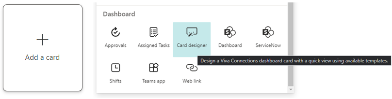

# Plan, build, and launch Microsoft Viva Connections for your organization

Use Viva Connections to engage and empower frontline workers and information workers across your organization. Viva Connections integrates Microsoft 365 apps and tools to create experiences that meet users where they are, keeps them updated on news and announcements, and provides access to resources from a desktop or mobile device. 

- Use this guide to prepare your organization for Viva Connections through the planning, building, and launching phases
- Learn more about the requirements before creating and customizing your organization’s instance of Viva Connections
- Discover planning considerations and best practices
- Get guidance for change management, adoption, and end-user training

Want to get started now? [Follow these steps to create your organization’s instance of Viva Connections](/viva/connections/guide-to-setting-up-viva-connections).  

## Review how to get Viva Connections for your organization
Learn more about the planning, building, and launching phases. Get guidance for each phase to ensure you meet the needs of your users and the organization. 

| Plan                 | Build                 | Launch         |
| :------------------- | :------------------- |:----------------|
| - Align stakeholders and business owners around common goals   - Identify key tasks and scenarios that can be supported by Viva Connections   - Prepare your SharePoint intranet to support your Viva Connections plan   - Prepare content for the Dashboard, the Feed, and Resources   - Create an adoption plan and change-management guide   - Include training for end-users   - Consider success metrics and plan for maintenance over time | - Create or update your organization’s home site   - Set up global navigation   - Modernize SharePoint sites and pages (as needed)   - Create a Viva Connections Dashboard   - Prepare the Viva Connections app for mobile   - Ensure high-traffic content can be accessed and is performant   - Test and refine the Viva Connections experience for key tasks and scenarios | - Announce your organization’s instance of Viva Connections at an all-team meeting   - Use communication tools like SharePoint news and Yammer communities to share details   - Consider hosting training events or office hours to make sure end-users get the most from Viva Connections|

## Step 1: Plan to meet technical requirements for Viva Connections
Viva Connections requires a SharePoint home site, customized global navigation in the SharePoint app bar, and modern SharePoint sites. 

| Requirement    | Description                 | 
| :------------------- | :------------------- |
| Create a home site  | A home site is a SharePoint communication site that acts as the front door to your organization’s intranet. [Home sites](/sharepoint/home-site-plan) are SharePoint communication sites that have additional capabilities such as the ability to prioritize news posted from the home site across the rest of the intranet. Once a home site is set, the news posted from that site will be prioritized across the intranet.     Learn more about how to think about [planning navigation on your home site](https://techcommunity.microsoft.com/t5/microsoft-sharepoint-blog/best-practices-for-using-global-navigation-in-the-sharepoint-app/ba-p/2361916) in combination with hub and global navigation. Then, get started [creating a home site](/sharepoint/home-site-plan). | 
| Set up global navigation |Once your home site is set up, you can enable and customize global navigation in the SharePoint app bar. Global navigation can only be edited by the site owners of the home site. In the Viva Connections desktop app, resources in the global navigation will display when the Viva Connections icon is selected in Teams. In the Viva Connections mobile app, resources in the global navigation will display in the “Resources” tab.    Learn more about how to [enable and customize global navigation](/sharepoint/sharepoint-app-bar). | 
| Audit, prioritize, and modernize sites | After you have identified the key scenarios for Viva Connections, you’ll need to identify content or sites that should be modernized if you are still using classic sites and pages. Not all content or classic SharePoint sites need to be modernized to take advantage of Viva Connections. Focus on the priority use cases that will need to be included in your organization’s instance of Viva Connections.    Learn more about [how to modernize content](/sharepoint/dev/transform/modernize-classic-sites#:~:text=Modernize%20your%20classic%20SharePoint%20sites%201%20Enable%20your,site%20transformation%20is%20transforming%20your%20site%20pages.%20) and [healthy portal guidance for high-traffic sites](/sharepoint/portal-health)| 

### Create a home site for your organization
Viva connections requires a [SharePoint home site](/viva/connections/home-site-plan) which is a communication site that has special capabilities. A home site is the front door to your organization’s intranet and a gateway to other popular portals that are relevant to the entire organization. Your home site will also be the landing experience for Viva Connections in the Microsoft Teams desktop app. 

   

Start small by identifying a handful of resources and functions that the home site can serve. Consider using a [customizable site template from the SharePoint look book called The Landing](https://lookbook.microsoft.com/details/c9300e94-6e83-471a-b767-b7878689e97e) to quickly get your home site up and running. Optionally, turn your home site into a [SharePoint hub site](/sharepoint/planning-hub-sites) to add an extra layer of navigation and increase the search scope. 

Learn more about [how to plan your home site](/sharepoint/home-site-plan) and [how to launch healthy SharePoint sites](/sharepoint/portal-health). 

### Set up global navigation in the SharePoint app bar 
Next, from the home site Settings icon, select [set up global navigation](/SharePoint/sharepoint-app-bar) to take advantage of full Viva Connections functionality. Design global navigation in a way that compliments and expands resources on the home site. 

[Learn more about navigation and information architecture in SharePoint](/sharepoint/information-architecture-modern-experience).

   

Navigational links that appear in the global navigation pane in the SharePoint app bar will also display in the Viva Connections app in Microsoft Teams. Content in global navigation will display in the “Resources” tab in the mobile app.

### Audit, prioritize, and modernize content to align with key scenarios and tasks
After defining the key scenarios and tasks in the planning phase, prepare for Viva Connections by ensuring priority content is located on modern SharePoint communication sites and team sites. Only modern sites will appear in the Microsoft Teams app. Classic sites will open in a separate browser window.

If you have many classic SharePoint sites make sure you focus on sites, pages, and content that are relevant to the Viva Connections experience. Sites and content that are unrelated to key tasks and scenarios can be modernized later.

**Sites that should be audited and prioritized:**
   - Sites that connect to cards on the Viva Connections Dashboard
   - Sites that are displayed in global navigation
   - Sites that frequently publish organizational news
   - Sites that help employees complete the most important day-to-day tasks or access important information

Use the [SharePoint modernization scanner](/sharepoint/dev/transform/modernize-scanner) to create a dashboard that helps you determine modernization readiness. Learn more about how to [transform classic sites to modern sites](/sharepoint/dev/transform/modernize-userinterface-site-pages), or consider [creating new modern sites using SharePoint site templates](https://support.microsoft.com/office/apply-and-customize-sharepoint-site-templates-39382463-0e45-4d1b-be27-0e96aeec8398). For popular sites that are expected to get a high amount of traffic (thousands of views per day) [learn more about best practices for high-performing sites and portals](/sharepoint/portal-health).

## Step 2: Plan for Viva Connections
Viva Connections is designed to help users complete high-priority tasks and access important information. This experience can be built on overtime as your organization adapts and scales. 

Viva Connections is comprised of 3 main parts – the Dashboard, the Feed, and Resources. These parts will display differently on desktop and mobile devices. [Learn more about the differences between the desktop and mobile experience](/connections/viva-connections-overview). 

- **Dashboard:** The Dashboard is your employee’s digital toolset. It brings together the tools your employees need, enabling quick and easy access whether they are in the office or in the field. 
- **Feed:** The Feed delivers updates to the right people at the right time and is tightly integrated with Yammer, SharePoint news, and Stream to display a personalized feed, based on post-level targeting of the groups that employees belong to. 
- **Resources:** The Resources experience enables wayfinding across platforms. It uses navigation elements from the SharePoint app bar, which can be [audience targeted](https://support.microsoft.com/office/target-navigation-news-files-links-and-web-parts-to-specific-audiences-33d84cb6-14ed-4e53-a426-74c38ea32293).

Table with images and bullet points

### Plan the Dashboard
Start by identifying the key scenarios that Viva Connections needs to support and identify owners of those employee experiences. Tasks and scenarios will be primarily supported by cards in the Viva Connections Dashboard that can be targeted to specific audiences using Microsoft 365 groups. Consider which groups of employees will need access to specific resources. 

Table with GIF and description

Common scenarios include view paystubs and vacation hours, submit help tickets, catch up on news, check daily lunch menus, find people in a directory, and shift management. Collaborate and align with business groups that manage these experiences to determine the best design.

**Popular scenarios that can be supported by Viva Connections:**

| General tasks    | Tasks for information workers   | Tasks for frontline workers  |
| :------------------- | :------------------- |:-------------------|
| - View pay and benefits   - Submit a ticket to the help desk   - Access lunch and café options   - Catch up on news and announcements | - Find people and team information   - Complete required training   - View company holidays | - View and manage shifts   - Access time sheets and popular forms   - View workplace policies and resources | 

#### Types of Dashboard cards:
As you plan, consider the different types of cards available. There are three different types of cards that can be used on the Viva Connections Dashboard. Some cards may take longer than other to implement or may require work on the backend to set up.
- **Out of the box cards:** These cards require very little configuring and include the [Link, Shifts, Teams, and Assigned tasks cards](/viva/connections/create-dashboard).
- **Adaptive extension cards:** Also known as ACE’s, are [cards that can be extended and customized](/sharepoint/dev/spfx/viva/get-started/build-first-sharepoint-adaptive-card-extension) using the SharePoint Framework (SPFx).  
- **Third-party cards:** These cards come from [third parties like Qualtrics, ServiceNow, and Workday](https://techcommunity.microsoft.com/t5/microsoft-viva-blog/viva-connections-welcomes-new-partners-and-opens-developer/ba-p/2540643).

#### Planning process

As you work with business owners and key stakeholders to align your Viva Connections design strategy, answer the following for each task:
- Who is the audience?
- What do users need to accomplish or learn?
- What tools or technology do they use today?
- What tools or technology do you want visitors to use to accomplish their key tasks?
- What information needs to be promoted?

#### Examples of different Dashboard design
The Dashboard should focus on the most important tasks. Tasks that are specific to certain audiences should be targeted to make sure users only see cards that are relevant to their day-to-day jobs.

#### Planning resources:
•	[Create and customize a Dashboard](/viva/connections/create-dashboard)
•	Learn more about [adaptive cards](https://adaptivecards.io/)and  [third-party cards](https://techcommunity.microsoft.com/t5/microsoft-viva-blog/viva-connections-welcomes-new-partners-and-opens-developer/ba-p/2540643)
•	Leverage existing [Microsoft 365 groups](https://support.microsoft.com/office/learn-about-microsoft-365-groups-b565caa1-5c40-40ef-9915-60fdb2d97fa2) or create news groups if needed so that you can quickly create cards and [target them to specific audiences](/viva/connections/create-dashboard#apply-audience-targeting-to-cards)

## Plan the Feed
The Feed brings communications from across the organization into one place where it can be easily viewed. This Feed helps keep frontline workers, information workers, and hybrid workers alike engaged and informed on important news and announcements.  This solution also gives content publishers a reliable method of distributing important news and information. 

   

### Tips on how to curate content that’s viewed in the Feed
The Feed is designed to be dynamic, personalized, and a place where the most relevant news and announcements can be consumed. The Feed relies on a constant flow of new content and the best experience contains a balance of organizational news, organic content, and curated content.
-  Publish SharePoint news from [official organizational news sources](/sharepoint/organization-news-site#:~:text=Use%20Microsoft%20PowerShell%20to%20specify%20a%20site%20as,organization%20news%20site%3A%20PowerShell%20Set-SPOOrgNewsSite%20-OrgNewsSiteUrl%20%3Csite%20URL%3E) like the [home site](/viva/connections/home-site-plan)
- [Use News boost to elevate the most important news](https://support.microsoft.com/office/boost-news-from-organization-news-sites-46ad8dc5-8f3b-4d81-853d-8bbbdd0f9c83#:~:text=1%20On%20your%20organization%20news%20site%2C%20open%20the,post%20to%20stop%20being%20boosted.%20More%20items...%20) posts on organizational news sites to surface news posts to the top of the feed
- [Post news as a video news links](/viva/connections/video-news-links) hosted by stream to share updates, rebroadcast an all-hands meeting, or provide reusable training materials
- Highlight community discussions by [featuring posts in public Yammer communities](/yammer/manage-yammer-groups/yammer-all-company-yammer-community) that you’d like seen by the entire organization
- Encourage your organization to [engage and participate in Yammer discussions](https://adoption.microsoft.com/yammer/), especially leaders and workplace champions
- [Use audience targeting](https://support.microsoft.com/office/target-navigation-news-files-links-and-web-parts-to-specific-audiences-33d84cb6-14ed-4e53-a426-74c38ea32293) to make sure specific content is seen by different audiences using Microsoft 365 groups

### Planning resources:
- Review [frequently asked questions about the Feed](/viva/connections/faqs-viva-connections-feed) for Viva Connections
- Consider using the [Feed web part](https://support.microsoft.com/office/use-the-feed-web-part-for-viva-connections-001fbe90-3778-4801-9ea9-71308711d330#:~:text=%20Add%20the%20Viva%20Connections%20Feed%20web%20part,for%20Viva%20Connections%20Feed%20web%20part.%20More%20) on popular SharePoint pages to surface news and announcements

## Plan the Resources
Resources are the navigational links to portals that get set up when you enable and customize global navigation. While preparing your Viva Connections, know that these resources will display from the SharePoint app bar and the Teams app bar when Viva Connections is set up. The resources in the app bar should be the most important and popular portals for your target audience. Resources can be targeted to specific audiences.

   

Consider how links in the global navigation will complement resources highlighted on the home site. Depending on the content you want to make available in the global navigation, you can [design your home site navigation and global navigation in three different ways](/viva/connections/sharepoint-app-bar#see-all-the-different-ways-you-can-set-up-global-navigation).

### Planning resources:
- Set up for the first time, or [customize navigational links in the global navigation](/viva/connections/sharepoint-app-bar) from the home site
- Get more guidance on how to [design navigation in SharePoint](/sharepoint/information-architecture-modern-experience)

## Create an adoption plan that includes considerations for change management and training materials for end-users
Planning for change and helping users adopt new resources will be different for every organization. Use the considerations and best practices here as a starting point to creating an adoption plan that fits your organization’s needs.

### Adoption considerations:
- Viva Connections can only be accessed in Microsoft Teams. If your organization is not already using Microsoft Teams, you will need to [plan the adoption of Microsoft Teams](https://adoption.microsoft.com/microsoft-teams/) alongside [Viva Connections](https://adoption.microsoft.com/viva/).
- Make adoption easy for end-users by [pre-installing and pre-pinning the app in Teams](/viva/connections/add-viva-connections-app#then-customize-the-app-settings) while picking settings.
- Find early adopters and champions and create ways to extend their enthusiasm to the rest of the organization.
- Plan to engage with users where they typically meet and share information (for example, if your organization already meets in Teams, plan to post in channels.)
- Determine who and where questions about Viva Connections should go to. Consider using a [Yammer community](https://support.microsoft.com/office/join-and-create-a-community-in-yammer-56aaf591-1fbc-4160-ba26-0c4723c23fd6), [SharePoint site](https://support.microsoft.com/office/create-a-site-in-sharepoint-4d1e11bf-8ddc-499d-b889-2b48d10b1ce8), or [Teams channels](https://support.microsoft.com/office/create-a-channel-in-teams-fda0b75e-5b90-4fb8-8857-7e102b014525) allow users to ask questions or see commonly asked questions.

### Change management considerations:
- Start by creating awareness and interest in multiple channels to appeal to different audiences. Consider common spaces for on-site users like the breakroom or conference rooms. For remote workers and the rest of the organization, plan to post announcements in Teams, Yammer, and SharePoint.
- Make sure different audiences of end-users can easily understand how this new tool will help improve their day-to-day work.
- Create opportunities for users to ask questions, get help, and see live demonstrations. Consider setting up weekly training sessions or office hours during the first month of adoption. Leverage champions where possible. 
- Reinforce change by creating incentives for using the new tools. 
- Clearly explain: how to use Viva Connections on desktop and mobile apps, how to engage with the Dashboard, the Feed, and Resources, and where to view the latest news and announcements
- Specialized guidance for different audiences like frontline workers or hybrid workers

### Training considerations:
- Use training to help raise awareness about where resources [can be accessed in Teams on desktop or mobile devices](https://support.microsoft.com/office/your-intranet-is-now-in-microsoft-teams-8b4e7f76-f305-49a9-b6d2-09378476f95b).  
- Showcase different ways to connect and engage with cards on the Dashboard and content in the Feed. Consider providing different training guidance for different audiences. 
- Highlight popular portals in SharePoint that can be found in the Resource tab when on a mobile device.

#### Adoption resources:
Learn more about adoption and get communication templates in the [Viva adoption center](https://adoption.microsoft.com/viva/).

## Consider which metrics to use to measure the effectiveness of Viva Connections
Part of the planning process includes determining which metrics will be used to measure how effective Viva Connections is in bringing your organization together and keeping specific audiences informed. Start by considering the tasks and tools that the Dashboard will offer. For example, if you create a card that links to your human resources SharePoint site or a specific page, you should expect to see more traffic and engagement for that site in usage reports.

For a high-level view of usage across M365 apps, use [Microsoft 365 usage analytics](/admin/usage-analytics/usage-analytics?view=o365-worldwide) to access a pre-built dashboard that contains several pre-built reports that focus on adoption of M365 apps, usage, communication, and collaboration. Alternatively, you can use [site level](https://support.microsoft.com/office/view-usage-data-for-your-sharepoint-site-2fa8ddc2-c4b3-4268-8d26-a772dc55779e) and [page level](https://support.microsoft.com/office/view-usage-data-for-pages-and-news-e3186199-ccc8-4445-9162-bb1bcec8b7ee) usage reports in SharePoint to gauge engagement and learn more about when users access content and what devices they are using. 
Usage analytics aside, you can ask users directly about their overall satisfaction. Consider [creating a card on the Dashboard that links to a Microsoft Form](https://support.microsoft.com/office/create-a-form-with-microsoft-forms-4ffb64cc-7d5d-402f-b82e-b1d49418fd9d) where you can ask users to rate satisfaction and provide feedback.  

## Plan for maintenance over time
Generally, Viva Connections needs minimal ongoing maintenance. This is partially because most resources and content is stored in SharePoint. Therefore, if your SharePoint intranet is up to date, so is Viva Connections. 
•	Dashboard: Once designed and tested, the Dashboard will only need to be updated to support new scenarios or retire old scenarios.
•	Feed: Content is dynamically displayed and aggregated from SharePoint news posts and Yammer communities.  
•	Resources: Like the Dashboard, once links to portals have been established, the Resources will only need updates as needed.

As your business grows and evolves, you will likely identify new scenarios that can be supported by Viva Connections. Over time, you may decide to retire cards on the Dashboard or rearrange global navigation in Resources. Additionally, users will share feedback that can be used to improve the experience. Each of these scenarios will require time to implement and to communicate as needed. Plan to have a point-person, or team of people, who can manage these tasks over time. 

>[!NOTE]
>Images are an important aspect to making your cards rich and inviting. If you're a SharePoint admin, we recommend enabling a Content Delivery Network (CDN) to improve performance for getting images. Consider when storing images that /siteassets is by default a CDN source when Private CDN is enabled while /style library is the default source when the Public CDN is enabled. [Learn more about CDNs](/office365/enterprise/content-delivery-networks).  

**This article includes:**

- [Create a Dashboard and add cards](#create-a-dashboard-and-add-cards)
- [Add a Web link card](#add-a-web-link-card)
- [Add a Teams app card](#add-a-teams-app-card)
- [Add a customized card using Card designer](#design-your-own-card-with-a-quick-view)
- [Add a Shifts card](#add-a-shifts-card)
- [Add a 3rd party card](#add-a-third-party-card-or-microsoft-app)
- [Apply audience targeting to cards](#apply-audience-targeting-to-cards)
- [Preview your Dashboard to see how it will display for different audiences and devices](#preview-your-dashboard-to-see-how-it-will-display-for-different-audiences)
- [Put the Dashboard on your home site using the Dashboard web part](#use-the-dashboard-web-part-for-viva-connections)

## Create a Dashboard and add cards

You’ll need [edit permissions](/sharepoint/customize-sharepoint-site-permissions) for the home site.

1. From the [home site,](home-site-plan.md) select the **Settings** gear at the top-right of the page.
2. Select **Set up Viva Connections**.
3. Select the **+ Create Dashboard** button.

   >[!NOTE]
   > - The Dashboard page opens in mobile view by default.
   > - You can choose Mobile, Tablet, and Desktop views interchangeably as you’re authoring.
   > - Image recommendations for cards in the Dashboard: medium cards should be 300x150 to 400x200 with 2:1 aspect ratio and large cards 300x300 to 400x400 with 1:1 aspect ratio in order to prevent stretching in the mobile app.
   > - Image URLS in card properties must be an absolute URL in order for the link to work in the mobile app.

4. Select **+ Add a card**.

   

5. Select the type of card you want to add from the Dashboard card toolbox and then follow the steps below to set up each type of card. As you’re building the Dashboard, you can preview its appearance in mobile, desktop, and tablet for different audiences.

**Here are the built-in cards available now:**

  - [Web link](#add-a-web-link-card): Add an internal or external link

  - [Assigned tasks](#add-the-assigned-tasks-card): Automatically display information to users about their assigned tasks.
 
  - [Teams app](#add-a-teams-app-card): Use an existing Teams app or bot

  - [Design your own using Card designer](#design-your-own-card-with-a-quick-view): Create customizable cards using JSON

 
6. When you're done adding cards and targeting audiences, and you’re satisfied with how the Dashboard looks in preview, select **Publish** at the top-right of your Dashboard to make it available for use on your home site, in Teams, and in Teams mobile app. The view will default to Desktop view after you’ve published the Dashboard.

## Add a Web link card

Add a web link card when you want your users to go to an internal or external link on a web site. To do this task, perform the following steps:

1. While in **edit** mode, select **+ Add a card** from the Dashboard.
2. Select **Web link** from the web toolbox.

   

3. In the property pane on the right side of the page, select your options.

   

4. Select a size for the card from the **Card size** drop-down list.
5. Enter the URL for your link in the **Link** text box. 
6. Set the card-display options:
   - Enter a title for the card in the **Card title** text box. (This title won't change your page title; it is the title that will be displayed on the top of the card.)
   - Enter a description for the card in the **Card description** text box. This description will be displayed in larger text under the title.
3. Under **Thumbnail**, select one of the following options:
   - **Auto-selected**: This option when chosen automatically displays an image at the top of your card that comes from your page.
   - **Custom image**: This option when chosen enables the **Change** button.  You can select this button to choose an image you want to use.
4. Under **Card icon**, select one of the following options that enable the icon to be displayed on the left side of the card title:
   - **Auto-selected**: This option when chosen automatically displays a built-in icon associated with the page.
   - **Custom image**: This option when chosen enables the **Change** button.  You can select this button to choose an image you want to use.
    - **Icon**: This option when chosen enables the **Change** button.  You can select this button to choose from a set of stock icons.
5. If you want to target your card to specific audiences (that is, only the audience you specify will see the card in the dashboard), select one or more groups to target from the **Audiences to target**. For more information on audience targeting, see [Audience targeting](#apply-audience-targeting-to-cards).

## Add the Assigned tasks card

The Assigned tasks card enables automatic display of information to users about their assigned tasks. This information is retrieved from the Tasks app in Teams.

1. While in edit mode, click **+ Add a card** from the dashboard.
2. Select **Assigned Tasks** from the Dashboard toolbox.

   

3. In the property pane on the right, choose your card size from the **Card size** drop-down list.

   

4. If you want to target your card to specific audiences (that is, only audience you specify will see the card in the dashboard), select one or more groups to target. For more information on audience targeting, see [Audience targeting](#apply-audience-targeting-to-cards).

## Add a Teams app card

A Teams app card allows you to create a card for an existing Teams app. To add a Teams app card:

1. While in **edit** mode, select **+ Add a card** from the Dashboard.
2. Select **Teams app** from the web toolbox.

   

3. In the **property** pane on the right side of the page, select your options.

   

4. Select a size for the card from the **Card size** drop-down list.
5.  Search for the Teams app you want to use, and then select it from the list.
6.  Set the card-display options:
    - Enter a title for the card in the **Card title** text box. (This title won't change your page title; it is the title that will be displayed on the top of the card.)
    - Enter a description for the card in the **Card description** text box. This description will be displayed in larger text under the title.
7. If you want to target your card to specific audiences (that is, only audience you specify will see the card in the dashboard), select one or more groups to target. For more information on audience targeting, see [Audience targeting](#apply-audience-targeting-to-cards).

## Design your own card with a quick view

You can choose the **Card designer** option to design your own card that includes a quick view. To do this, you should be familiar with JSON and Adaptive Card templates. For more information, see [Adaptive Cards Templating](/adaptive-cards/templating/).

1. While in **edit** mode, select **+ Add a card** from the dashboard.
2. Select **Card designer**.

  

3. In the **property** pane, select your card options.

  

4. From the **Card size** drop-down list, choose either **Medium** or **Large**.
   A medium-sized card allows you to add one button, while a large-sized card allows you to add two buttons.

5. Enter a title for your card in the **Title** text box. 
6. Enter a URL in the **Icon** text box. This URL is the icon's location.
7. Select a template type from one of the following options in the **Template type** drop-down list:
    - **Text**: Provides you the option to add only a heading.
    - **Text and image**: Provides you the option to add a heading and an image.
    - **Text and description**: Provides you the option to add your own heading and a description, but without an image option.
8. Depending on the template type you’ve chosen, enter values for the properties. For example, if you have chosen the **Text and description** template type, you have to enter values for the **Heading** and **Description** properties in their respective text boxes.

>[!NOTE]
>If you want a specific property to display that allows users to enter a value, but that property is not displayed, choose a different template type.
>

9. Toggle **Enable card action** to **On** if you want the card to either go to a link or show a quick view when the user selects it. 

> [!IMPORTANT]
> The quick view will need to be set up first (see the Add a quick view section below).

10. Set the number of buttons to be displayed under **Number of buttons**. 
    For a medium-sized card, you can show only 1 button. For a large-sized card you can show 1 or 2 buttons.

1. Enter values for the following properties of the button:
    - **Title**: Title for the button.
    - **Action**: The result on clicking the button.
    - **Link**: The URL of the destination the user is directed to, on clicking the button.

## Set up a quick view

Under **Quick view layout and data**, enter JSON template code for your quick view layout, and add the code for the data you want to use. For more information on templating and data with some examples, see [Adaptive Cards Templating](/adaptive-cards/templating/). You can find more examples at [Adaptive Cards](/adaptive-cards/).

If you want to target your card to specific audiences (that is, only audiences you specify will see the card in the Dashboard), select one or more groups to target. For more information on audience targeting, see [Audience targeting](#apply-audience-targeting-to-cards).

## Add a Shifts card

The Shifts card shows users information about their next or current shift from the Shifts app in Teams. They can also clock in and out and track break time when Time clock is enabled in Teams. 

>[!NOTE]
> The ability to use a Shifts card to clock-in and clock-out will become available in January 2022.

1. While in edit mode, select **+ Add a card** from the dashboard.
2. Select **Shifts** from the Dashboard toolbox.

   

3. In the property pane on the right, choose your card size from the **Card size** drop-down list.

4. If you want to target your card to specific audiences (that is, only audience you specify will see the card in the dashboard), select one or more groups to target. For more information on audience targeting, see [Audience targeting](#apply-audience-targeting-to-cards).

## Add a third party card or Microsoft app

The Viva Connections Dashboard and mobile experience can be extended and customized using cards, which are based on [adaptive cards](https://adaptivecards.io/) and the [SharePoint Framework (SPFx)](/sharepoint/dev/spfx/sharepoint-framework-overview). These adaptive cards are used to display data, complete tasks, and connect to Teams Apps, Websites, and mobile apps on Viva Connections. They provide a low-code solution to bring your line-of-business apps into the Dashboard. 

To create custom experiences on Viva Connections Dashboard and Viva Connections Mobile App, developers must use the SPFx to create custom ACEs. To learn more about creating ACEs, see the following tutorial: [Build your first SharePoint Adaptive Card Extension](/sharepoint/dev/spfx/viva/get-started/build-first-sharepoint-adaptive-card-extension). Learn more about [Viva Connections extensibility.](/sharepoint/dev/spfx/viva/overview-viva-connections)

### Add a 3rd party card
There are two ways to acquire third-party developers and partners solution package and add them on the Viva Connections dashboard.

#### Option 1: Acquire the app from a Microsoft AppSource or the SharePoint store
You can acquire apps from third- party developers by browsing the [Microsoft AppSource](https://appsource.microsoft.com/en-us/marketplace/apps?product=sharepoint) or [SharePoint store](https://techcommunity.microsoft.com/t5/microsoft-sharepoint-blog/explore-and-deploy-sharepoint-framework-solutions-from-partners/ba-p/2645289) (recommended).

- If you are building a dashboard, you can [request the app directly](https://techcommunity.microsoft.com/t5/microsoft-sharepoint-blog/explore-and-deploy-sharepoint-framework-solutions-from-partners/ba-p/2645289), but you will need approval from an admin of the tenant-level app catalog to continue with the installation
- If you are an **admin** of a tenant-level app catalog, you can deploy business apps directly.

[Get step-by-step guidance](https://techcommunity.microsoft.com/t5/microsoft-sharepoint-blog/explore-and-deploy-sharepoint-framework-solutions-from-partners/ba-p/2645289) on how to request and deploy an app, and add an app to your site. For tenant admin, [learn how to manage apps](/sharepoint/use-app-catalog#work-with-sharepoint-store-apps) in the App Catalog.

#### Option 2: Acquire the app directly from the third-party developer

 >[!NOTE]
 > SharePoint administrative permissions are required to complete this task.

You can request apps directly from the Viva Connections third-party developers and partners. Admin permissions are required to [add the app to tenant level app catalog.](/sharepoint/use-app-catalog) 

### Add a Microsoft app as a card on the Dashboard

A Microsoft app card allows you to create a card that links to Microsoft apps e.g., Shifts, Approvals, Task. Microsoft apps cards will be available Out of the Box when Viva Connections is enabled.

1. While in edit mode, select **+ Add a card** from the Dashboard.

2. Select the Microsoft App you want to add from the web toolbox.

   

3. Select your options in the property pane on the right side of the page.

4. When you **Republish**, the card will appear on your dashboard.

## Apply audience targeting to cards
By using audience targeting, you can promote cards to specific groups of people. This kind of targeting is useful when you want to present information that is especially relevant to a particular group of people. For example, you can target cards to a specific department. [Learn more about audience targeting](https://support.microsoft.com/office/target-content-to-a-specific-audience-on-a-sharepoint-site-68113d1b-be99-4d4c-a61c-73b087f48a81)

### Set the target audiences for a card

1. If your page is not already in **edit** mode, select **Edit** at the top-right of the Dashboard page.
2. Select the card you want to target to one or more audiences, and select the **Edit card** pencil from the toolbar on the left.
3. In the property pane on the right, under **Audiences to target**, type or search for the audience group(s) you want to target.

    >[!NOTE] 
    > If you've selected an audience group that you recently created or changed, it may take some time to see targeting applied for that group.

4. When a card is successfully audience targeted, you’ll see a **people** icon in the lower-left corner of the card.

   

### Preview your dashboard to see how it will display for different audiences

What you see in *preview mode* approximates how the Dashboard will display for certain audiences and devices. When you apply audience targeting to cards, you can preview how different people will view the Dashboard depending on the audience or device - mobile, desktop, and tablet.
 
#### To preview different audiences:

   1. While in edit mode, select **Preview** on the top right.

      

   2. Open the **Select audiences to preview as** drop-down list. (if no cards are audience targeted, you will see a disabled **Audience targeting** label).

   3. Search for and select a group. Once added, the group will be selected by default. You can select the group again in the **Select audiences to preview as** drop-down list to de-select it.

   

   - Cards that targeted to a specific group will display.
   - When one or more audiences are selected, cards that *do not* have audience targeting applied will also display.
   - If no audiences are targeted, only cards that *are not* audience targeted will display. If there aren't any cards with audience targeting applied, none will display.
   - If you are not part of one of the audiences you've selected, you will only see cards that are not audience targeted. If none are audience targeted, you won't see any cards.

   #### Examples:

   In the following example, the preview is set for Mobile.

   - The image on the left shows the view for a specific audience that includes two specific cards. 
   - In the second image on the right, the top two cards are not displayed when previewing a different audience group.

   
   

## Use the Dashboard web part for Viva Connections

>[!NOTE] 
> - After editing content on the Dashboard, it may take several minutes until the new content is available in the Dashboard web part.
> - For best results, we recommend placing the Dashboard web part in a right vertical section.

Once a Dashboard is authored and published, you can use the Dashboard web part to display it on your home site. You can add the web part to any section on your page.  

When added, it will automatically be populated with the cards from the existing Dashboard on your site. You'll be able to set the maximum number of cards you want to display. [Learn how to use the Dashboard web part](/sharepoint/use-dashboard-web-part-on-home-site).

## More resources

[Step-by-step guide to setting up Viva Connections](guide-to-setting-up-viva-connections.md)
