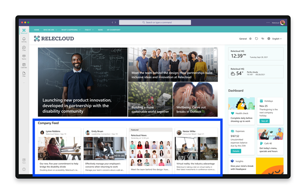
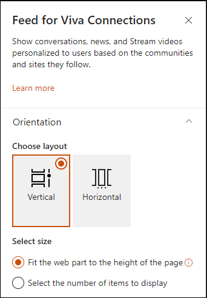
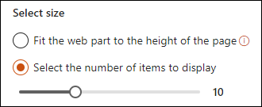

# Use the Feed web part for Viva Connections

The Feed web part is designed to collect and display content from sources across SharePoint, Yammer, and Stream (on SharePoint) into a single viewing experience. Each users’ Feed will look different because content displayed in the web part is personalized to the viewer based on the SharePoint sites and Yammer communities that they follow. [Learn more about where content in the Feed comes from](/viva/connections/faqs-viva-connections-feed).

> [!NOTE]
> - The Feed web part is not supported in IE11.
> - Individual content items in the Feed will display for a 30-day period.
> - Boosted news will display for up to 4 days in the feed.

## What is Viva Connections?

Viva Connections combines the power of your intelligent SharePoint intranet with chat and collaboration tools in Microsoft Teams to create a powerful employee experience. Viva Connections enables users to complete popular tasks, catch up on news, and discover relevant content from across the organization right from Teams. [Learn more about Viva Connections](/viva/connections/viva-connections-overview).

## What is the Feed for Viva Connections web part?

If you're using Viva Connections, the Feed web part brings organizational communication content from SharePoint, Yammer, Stream, Teams, and more into a single feed that [can be added to the home site](/viva/connections/home-site-plan). The Feed displays personalized content that will look different for each viewer. The hierarchy of content in the Feed can be influenced using tools like [News Boost](https://support.microsoft.com/en-us/office/boost-sharepoint-news-from-organization-news-sites-46ad8dc5-8f3b-4d81-853d-8bbbdd0f9c83). Learn more about [content in the Feed](/viva/connections/faqs-viva-connections-feed).

### Benefits of the web part include:

 - Users can view content from SharePoint, Stream, and Yammer in one place
 - For each piece of content, users can view the author and time it was posted
 - Users can react to and see the total number of reactions, user views, and comments on a content card
 - Users can share and navigate to find more content within the web part
 - Display the most important updates with the [boost news](https://support.microsoft.com/office/boost-news-from-organization-news-sites-46ad8dc5-8f3b-4d81-853d-8bbbdd0f9c83) feature
 

   
## Add the Viva Connections Feed web part to a site
You'll need site member permissions (or higher) to add and edit web parts to a SharePoint site.

 1. If you're not in edit mode already, select **Edit** at the top right of the page.

 2. Go to the section where you want to add the web part, hover your mouse near the top, and then select the  icon that appears.

 3. In the web part toolbox that appears, search for and then select the **Feed for Viva Connections** web part.
 
 4. Next, select either a vertical or horizontal orientation.

     

 5. Then, select the web part size.

    

    When vertical: Select **Fit web part to height of page** to automatically fit the web part to the hight of the page. Or, **Select the number of items to display** to determine the height of the web part.

 6. Select **Save** when you are done.
 
The feed will automatically populate with SharePoint news, Yammer community content, and Stream videos tailored to users based on the communities and sites they follow.

## Related articles

[Frequently asked questions about the Feed for Viva Connections](/viva/connections/faqs-viva-connections-feed)

[Guide to setting up Viva Connections](/viva/connections/guide-to-setting-up-viva-connections)

[Boost news from organizational news sites](https://support.microsoft.com/office/boost-news-from-organization-news-sites-46ad8dc5-8f3b-4d81-853d-8bbbdd0f9c83)

 
