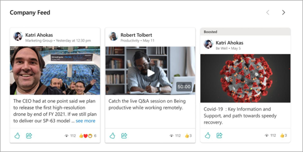

# Use the Feed web part for Viva Connections

This web part is specifically designed to aggregate and display corporate communication content from sources across SharePoint, Yammer, and Stream into a single coherent feed. [Learn more about where content in the Feed comes from](/viva/connections/faqs-viva-connections-feed).

> [!NOTE]
> The Feed web part is not supported in IE11.
> Individual content items in the Feed will display for a 30-day period.

## What is Viva Connections?

Viva Connections combines the power of your intelligent SharePoint intranet with chat and collaboration tools in Microsoft Teams. Viva Connections enables users to discover and search relevant content, sites, and news from across the organization right from the Team’s app bar. [Learn more about Viva Connections](/viva/connections/viva-connections-overview).

## What is the Viva Connections Company Feed web part?

If you're using Viva Connections, the Viva Connections Feed web part aggregates organizational communication content from sources across SharePoint, Yammer, Stream, Teams, and more into a single feed that can be added to SharePoint pages.

### Benefits of the web part include:

 - Users can view content from SharePoint, Stream, and Yammer

 - For each piece of content, users can view the author and time it was posted

 - Users can react to and see the total number of reactions, user views, and comments on a content card

 - Users can share and navigate to find more content within the web part

 - Display the most important updates with the [boost news](https://support.microsoft.com/office/boost-news-from-organization-news-sites-46ad8dc5-8f3b-4d81-853d-8bbbdd0f9c83) feature
 
   > [!NOTE]
   > At this time, it is not possible to edit layouts or change other settings. These features are coming soon.
   
## Add the Viva Connections Feed web part to a site

 1. If you're not in edit mode already, select **Edit** at the top right of the page. 

 2. Within the section where you want to add the web part, hover your mouse near the top, and then select the  that appears.

 3. In the web part toolbox that appears, search for and then select the **Feed for Viva Connections Feed web part**.
 
    The feed will automatically populate with conversations, news, and Stream videos tailored to users based on the communities and sites they follow.

## Related articles

[Frequently asked questions about the Feed for Viva Connections](/viva/connections/faqs-viva-connections-feed)

[Guide to setting up Viva Connections](/viva/connections/guide-to-setting-up-viva-connections)

[Boost news from organizational news sites](https://support.microsoft.com/office/boost-news-from-organization-news-sites-46ad8dc5-8f3b-4d81-853d-8bbbdd0f9c83)

 
