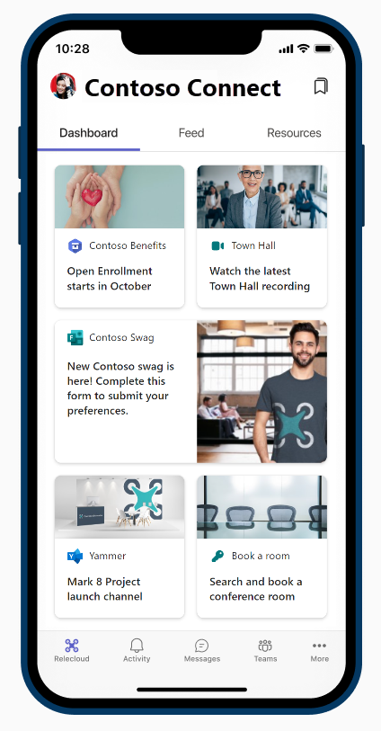
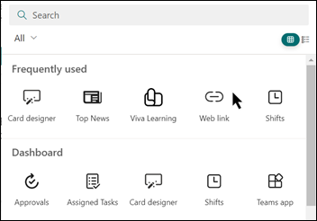
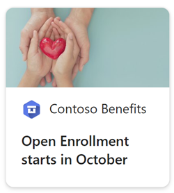
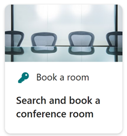
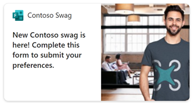
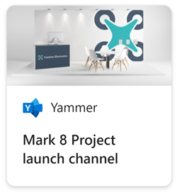
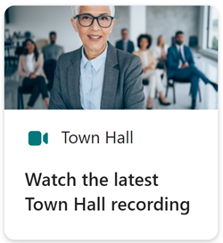

# Use the Web link card to integrate existing content into the Viva COnnections Dashboard. 

The [Viva Connection’s Dashboard](/viva/connections/create-dashboard) is where people in your organization get easy access to popular tools and resources that are relevant to their everyday work. The [Web link card](/viva/connections/create-dashboard#add-a-web-link-card) is a simple yet powerful option to incorporate existing content from across your Microsoft 365 environment and elsewhere into Viva Connections to offer a seamless employee experience. 

Learn more about how you can use the Web link card to integrate SharePoint content, PowerApps, Microsoft Forms, Yammer, or Stream into the Viva Connections Dashboard. The Web link card can also be used to link to experiences outside of your M365 environment. 
 

**This article includes:**
- [Link to a SharePoint page](#Link-to-a-SharePoint-page)
- [Link to PowerApps](#Link-to-PowerApps)
- [Link to a Form](#Link-to-a-Form)
- [Link to a Yammer community](#Link-to-a-Yammer-community)
- [Link to Stream content](#Link-to-Stream-content)
- [Considerations for the navigation experience](#Considerations-for-the-navigation-experience)

## How to access the Viva Connection’s Dashboard and the Web link card 
Learn more about how to add the Web link card and access the settings panel where you can customize the card’s design and content.

>[!NOTE]
> You must be a site owner (or higher) to the home site to edit Dashboard content. 

1.	Start by navigating to your organization’s [home site](/viva/connections/create-sharepoint-home-site-for-viva-connections) in SharePoint.
2.	Select the **Settings** panel and then **Manage Viva Connections**.
3.	Select **Create Dashboard** or **Edit Dashboard** and then select **Edit** in the top-right.
4.	Select **+ Add card** and then select the **Web link card**.
5.	Select the **Edit** (pencil icon) to open the settings panel where you can edit the card size, web link, thumb nail, icon, and content.
6.	Apply [audience targeting](/viva/connections/create-dashboard#apply-audience-targeting-to-cards) to personalize and [preview the experience](/viva/connections/create-dashboard#preview-your-dashboard-to-see-how-it-will-display-for-different-audiences) for mobile and desktop devices before sharing it with others.

### Link to a SharePoint page
[SharePoint sites and pages](https://support.microsoft.com/office/create-and-use-modern-pages-on-a-sharepoint-site-b3d46deb-27a6-4b1e-87b8-df851e503dec) can be accessed on the Viva Connection’s Dashboard by using the Web link card. Use audience targeting to ensure this card is surfaced to people who have access to the SharePoint site or page. Consider testing the viewing experience on a mobile device for SharePoint sites and pages before linking to the Viva Connections Dashboard. 

**In this example, Contoso links to an open enrollment page:**

1.	Add a Web link card and select **Edit** (pencil icon).
2.	In the **Settings** panel, paste the site or page URL into the Link field. This URL can be copied from the top of the site or page web browser.
3.	Specify other details like the card’s content, imagery, and icon (all of these can be customized).
4.	Apply **Audience targeting** so that people with access to the site or page will see this card on their Dashboard. 
5.	**Preview** the experience before **Republishing** to share with others. 

### Link to PowerApps
[Power Apps is a suite of apps, services, and connectors](/power-apps/powerapps-overview), as well as a data platform, that provides a rapid development environment to build custom apps for your business needs. Link to PowerApps using the Web link card to create a custom experience. Use audience targeting to ensure this card is surfaced to people who have access to PowerApps. 

**In this example, Contoso links to a PowerApps that books conference rooms:**

1.	Add a **Web link** card and select **Edit** (pencil icon).
2.	In the **Settings** panel, paste the PowerApps URL into the Link field. This URL can be copied from the [PowerApps details page](/power-apps/teams/manage-your-apps#app-details).
3.	Specify other details like the card’s content and imagery.
4.	Apply **Audience targeting** so that people with access to the site or page will see this card on their Dashboard. 
5.	**Preview** the experience before **Republishing** to share with others. 

### Link to a Form
[Microsoft Forms](https://support.microsoft.com/office/create-a-form-with-microsoft-forms-4ffb64cc-7d5d-402f-b82e-b1d49418fd9d) can be used to create surveys, polls, quizzes, and easily see results as they come in. Link to a form to collect responses or generate feedback. Use audience targeting to ensure this card surfaces to the groups of people who should respond to the form.

**In this example, Contoso links to a Form to collect clothing sizes:**

1.	Add a **Web link** card and select **Edit** (pencil icon).
2.	In the Settings panel, paste the Yammer community URL into the Link field. This URL can be copied from the Form’s sharing link. 
3.	Specify other details like the card’s content and imagery. Use the Forms icon by selecting Card icon > Custom image > Change > Web search and search for “Microsoft Forms logo”.
4.	Apply **Audience targeting** so that people with access to the community will see this card on their Dashboard. 
5.	**Preview** the experience before **Republishing** to share with others. 

### Link to a Yammer community
Yammer is a social and engagement experience that connects leaders, communicators, and employees to build communities, share knowledge, and engage everyone. Link to Yammer community using the Web link card. Use audience targeting to ensure this card is surfaced to people who have access to the Yammer community.

**In this example, Contoso links to a Yammer community for a specific project:**

1.	Add a **Web link** card and select **Edit** (pencil icon).
2.	In the **Settings** panel, paste the Yammer community URL into the Link field. This URL can be copied from the top of the web browser. 
3.	Specify other details like the card’s content and imagery. Use the Yammer icon by selecting Card icon > Custom image > Change > Web search and search for “Microsoft Yammer logo”.
4.	Apply **Audience targeting** so that people with access to the community will see this card on their Dashboard. 
5.	**Preview** the experience before **Republishing** to share with others. 

### Link to Stream content
[Microsoft Stream is video service](/stream/streamnew/new-stream) where people in your organization can upload, view, and share videos securely. Link to videos in Stream to highlight important meetings, news, and announcements in the Viva Connections Dashboard. Use audience targeting to ensure this card is surfaced to the appropriate group.

**In this example, Contoso links to a meeting recording from the last Town Hall:**

1.	Add a **Web link** card and select **Edit** (pencil icon).
2.	In the **Settings** panel, paste the Stream video sharing link into the Link field. This URL can be copied from the sharing link. 
3.	Specify other details like the card’s content and imagery.
4.	Apply **Audience targeting** so that people with access to the community will see this card on their Dashboard. 
5.	**Preview** the experience before **Republishing** to share with others. 

## Considerations for the navigation experience
When the user clicks on the link from the link card to navigate to the content, depending on the target URL and the device (Viva Connections on Teams mobile vs. Viva Connections on Teams desktop), the behavior might be different as described in the table below.

The best experiences will be achieved if the service does not require authentication and is anonymously accessible. For content that is stored in M365, authentication is automatically handled. For third-party services requiring authentication, the recommendation is to [use a Dashboard card built by the third-party](/viva/connections/create-dashboard#add-a-third-party-card-or-microsoft-app) which will handle authentication.

| **Opens URL to…**  | **On Teams mobile**   | **On Teams desktop**     |
| :------------------- | :------------------- |:---------------|
| SharePoint Link  | Page opens within Teams and user doesn’t need to authenticate again.| Page opens within Teams and user doesn’t need to authenticate again. |
| Teams App | Teams apps (like Shifts, Approvals, or Kudos) opens within Teams and user doesn’t need to authenticate again.  | Teams apps (like Shifts, Approvals, or Kudos) opens within Teams and user doesn’t need to authenticate again.  |
| Forms  | Form opens within Teams, user is asked to sign-in on the first time, and user doesn’t need to authenticate again if they stay signed in. | Form opens within Teams, user is asked to sign-in on the first time, and user doesn’t need to authenticate again if they stay signed in.            |
| Yammer | Yammer opens within Teams, user is asked to sign-in on the first time and user doesn’t need to authenticate again if they stay signed in.  | Opens a web browser session and the user might need to re-authenticate depending on browser and machine settings. |
| PowerApps  | PowerApps opens within Teams, user is asked to sign-in on the first time and user doesn’t need to authenticate again if they stay signed in. | Opens a web browser session and the user might need to re-authenticate depending on browser and machine settings. |
| Power Portals  | Power portals opens within Teams, user is asked to sign-in on the first time and user doesn’t need to authenticate again if they stay signed in.  | Opens a web browser session and the user might need to re-authenticate depending on browser and machine settings.  |
| Stream   | Stream opens within Teams, user is asked to sign-in on the first time and user doesn’t need to authenticate again if they stay signed in.   | Opens a web browser session and the user might need to re-authenticate depending on browser and machine settings. |
| External Links  | Web view opens within Teams and the user might need to authenticate again (depending on the site.)  | Opens a web browser session and the user might need to re-authenticate depending on browser and machine settings.  |

## Learn more

[Create the Viva Connections Dashboard](/viva/connections/create-dashboard)

[Use audience targeting in Viva Connections to personalize the experience](/viva/connections/use-audience-targeting-in-viva-connections)

