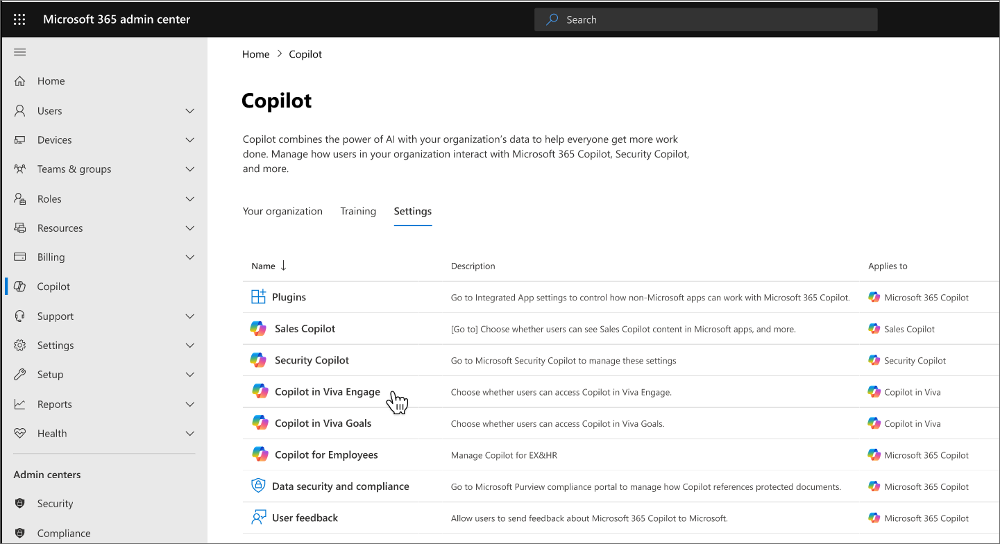

# Control access to Copilot in Viva

You can control which users in your organization have access to Copilot in each applicable Viva app. You can turn access on or off for everybody, or choose specific people or groups to give access to. If you want to learn how to control access to other Viva features, see [feature access management](../feature-access-management.md).

## Turn Copilot access on or off for everyone in your organization

1. From your Microsoft 365 admin center, select **Copilot**.
2. Then choose the app for which you want to control access.
    
3. Your **Org-wide setting** shows whether access is enabled for your entire organization.
4. To change turn this setting on or off, choose **Manage**.
5. Select **On** to enable access for everyone, or **Off** to disable access for everyone.
6. Select **Save**.

Your change can take up to 24 hours to go into effect.

## Enable access for select people or groups

You can enable or disable Copilot in Viva apps for individuals or groups. You can create multiple custom policies to suit your organization's needs.

1. Go to the Copilot settings page in your Microsoft 365 admin center.
1. Choose the app for which you want to control access.
1. Under **Custom policies for people and groups** select **Create policy**.
1. Give your policy a descriptive name. For example, "Disable for users in office X".
1. Choose **Off for specific people** if you want to disable access to Copilot in the Viva app for only people you select. Choose **On for specific people** if you want to enable access to Copilot in Viva app for only the people you select.
1. Add the people or groups you want the policy to apply to.
1. Select **Save**.

Your change can take up to 24 hours to go into effect.

You can view the details of your policy by selecting it from the list in the Manage access pane. View everyone your policy applies to by selecting **View details**.

### Edit an existing custom policy

1. Go to the Copilot settings page in your Microsoft 365 admin center.
1. Choose the app for which you want to edit an existing custom policy.
1. Select the ellipses next to the policy you want to edit.
1. Select **Edit**.
1. Make any changes and select **Save**.

### Delete an existing custom policy

1. Go to the Copilot settings page in your Microsoft 365 admin center.
1. Choose the app for which you want to edit an existing custom policy.
1. Select the ellipses next to the policy you want to edit.
1. Select **Delete**.
1. When prompted, select **Delete**.
