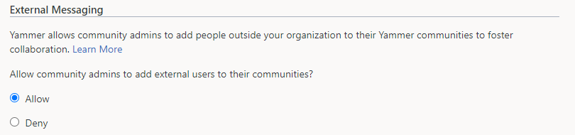
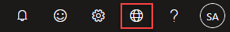
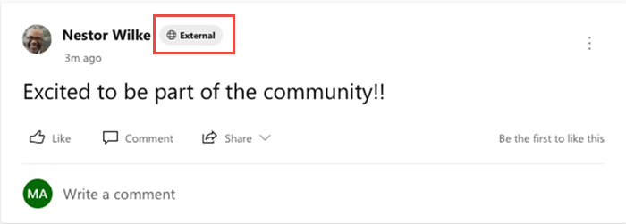
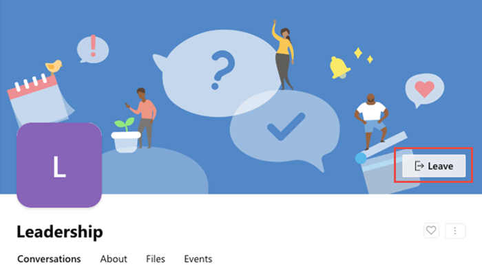

# Work with Azure Active Directory-B2B guests in Viva Engage communities

The Viva Engage guests feature allows organizations to call in experts such as vendors, suppliers, or consultants from outside the organization to supercharge collaboration. Viva Engage tenants aligned to native mode use the Azure Active Directory Business-Business (Azure AD-B2B) guest framework to power guests. Azure Active Directory (Azure AD)-B2B is a secure, compliant external collaboration framework used by many apps in the Microsoft 365 suite like Microsoft SharePoint, Microsoft Outlook, and Microsoft Teams. 

Any Microsoft 365 user who is not part of your organization can be added as guest to a Viva Engage community by a Community admin.  AzureAD-B2B guests in Viva Engage communities are covered by the same compliance and auditing protection as the rest of Microsoft 365, and can be managed within Azure AD. Guest access is subject to Azure AD and Microsoft 365 service limits.

## Pre-requisites for adding an external user as AzureAD-B2B guest to a Viva Engage community

A Viva Engage tenant should be aligned to native mode before inviting an external user as an AzureAD-B2B guest to a Viva Engage community. Inviting a guest requires configuring settings in Viva Engage and other Microsoft 365 services, including settings in Azure AD, Microsoft 365 Groups, and SharePoint. 

If your organization is ready to start inviting guests to Viva Engage communities, then configure the following settings.

Engage admins can enable guest access on their networks from the Engage admin center. Within the Engage admin center, navigate to the **Compliance & Governance** tab and click on **Manage data**. You will be redirected to the Yammer admin webpage, where you can enable guest access by navigating to **Security settings** and selecting **External Messaging**.

> [!div class="mx-imgBorder"]
> 

This setting is a Viva Engage tenant-wide setting. Enabling guest access here will allow community admins to add guests to any Viva Engage community in the network. You can control guest access to individual Viva Engage communities [by using sensitivity labels](/microsoft-365/compliance/sensitivity-labels-teams-groups-sites)

External collaboration is a key ingredient for the success of any organization. Viva Engage guests allow you to call in experts, such as consultants or vendors, from outside your organization. Users can invite guests to a community and quickly start a rich conversation by sharing access to community resources like files. This ease-of-use makes external collaboration one of the most used features in Viva Engage today.

> [!NOTE]
> If your Viva Engage tenant was provisioned after December 15th, 2020, then AzureAD-B2B guest functionality is already enabled by default for your organization.

To configure Azure AD, Microsoft 365 Groups, and SharePoint settings, see [Collaborate with guests in a team](/microsoft-365/solutions/collaborate-as-team).

## How to invite an external user as guest to a Viva Engage community

1.	A community admin can add a guest to a Viva Engage community by entering the email address of the guest in the **Add Member** panel of the community.

2.	The guest receives a welcome email message. This message includes information about the Viva Engage community to which the user is being invited, and the name of the community admin inviting the guest. The guest must accept the invitation by selecting **Go To Community** in the email message before accessing the Viva Engage community.

    

3.	By visiting the **Go to Community** link, the guest accepts the invitation. After accepting the invitation, the guest can participate in the Viva Engage community.

4. The network switcher located in the suite header can be used to switch between the home Viva Engage network, any external Viva Engage communities the user is a guest in and External networks.

    

5.	Everyone in the Viva Engage community can identify easily who is a guest. An External badge appears next to the guest in Viva Engage community posts, comments, community membership page, and search results. The Viva Engage community with guests will also have a Globe icon next to it. 

    

    The Viva Engage community with guests will also have a Globe icon next to it.

    

6. Guests can leave the Viva Engage community at any time by hovering over the Joined button in the community header.

     

    > [!NOTE]
    > Leaving the Viva Engage community doesn't remove the guest account from your organization's directory. This must be done by a Microsoft 365 global admin or an Azure AD admin.

## Guest user capabilities and limitations

The guest experience has limitations by design. Following is a list of limitations that applies to AzureAD-B2B guests in Viva Engage communities.

- Guests cannot discover communities. Guests can access only the communities that they are invited into.

- Guests cannot create new communities.

- Guests cannot be a community admin and cannot change community settings. Settings guests cannot change include:
  - Adding new members to the community and removing membership
  - Promoting and demoting the owners
  - Editing community info
  - Adding related groups
  - Adding connectors
  - Adding pinned files or links (they can view the pinned files and links)
  - Viewing community or group insights

## Licensing for guest access

Guest access is included with all Microsoft 365 Business Standard, Microsoft 365 Enterprise, and Microsoft 365 Education subscriptions. No other Microsoft 365 license is necessary. Viva Engage doesn't restrict the number of guests you can add. However, the total number of guests that can be added to your tenant may be restricted by the paid features of Azure AD. For more information, see [Billing model for Azure AD External Identities](/azure/active-directory/external-identities/external-identities-pricing).

## What features are not supported for Guests?

We are working hard to bring all Viva Engage functionality to the new B2B guests in Viva Engage. Below is the list of features still in progress:
- **Personal email, non-Microsoft 365 business email, and phone number-based legacy accounts** – Users with Microsoft 365 Business email accounts can be added as guests. Other email domains like Gmail or Yahoo mail etc. will not be supported in this release. 
- **Cross-Geography guests** – Today we enable organizations to host Viva Engage in two data centers – Europe and North America. With this new guest support, users will be able to add guests from their same geography. Check [the Yammer public roadmap](https://go.microsoft.com/fwlink/?linkid=2132131) to see timelines for Cross-Geography support.

- **Private messages** – Private messages are disabled for B2B guests in Viva Engage.
- **Live events** – Currently guest users will not be able to participate in live events because guests are not yet supported by Microsoft Stream. To learn more about when these features will be available, see the [Microsoft 365 roadmap](https://go.microsoft.com/fwlink/?linkid=2132131).
-	**Adding guests during community creation** – Community owners can invite guest users by using edit membership flow for any community. In the current release, community owners will not be able to add guest emails at the time of community creation.
- **Interactive Viva Engage email notifications in Outlook** – Interactive email notifications for B2B guests users will not be available in this preview. B2B Guest users will continue to receive the legacy email notifications from the communities that they are added to as guests, instead of the new interactive email notifications. In the communities where these users are not guests, the interactive email notifications will work as expected.
- **Addition of Guests to the All Company community** – Guests cannot be added to the All Company community.

## FAQ

**Q: Is AzureAD-B2B guest experience in Viva Engage available for customers that have a Viva Engage network with EU data residency?**
A: Yes!

**Q: Can we invite AzureAD-B2B guests to Viva Engage External Networks?**

A: AzureAD-B2B guests cannot be invited to Viva Engage External Networks. External Networks will continue to work as-is with Viva Engage guest access.

**Q: Will Viva Engage guest settings be aligned to Microsoft 365 Groups settings?**

A: Yes. With Native Mode for Microsoft 365 for Viva Engage, all communities and users are supported via Microsoft 365 Groups. The Azure AD guest settings for Microsoft 365 Groups will now also apply to Viva Engage communities.

**Q: Can Viva Engage have dynamic membership groups include guests from a domain?**

A: Yes. Admins can create dynamic membership rules for guest users in a Viva Engage community via Azure portal. An example is: **user.userType -eq "Guest"** and user.email **-contains "@xyz.com"** - this rule will add all guest users from the domain xyz.com to the specified Viva Engage community.

**Q: I don’t want to allow guests in the Viva Engage communities of our network. How do I disable external users from participating in our communities?**

A: Viva Engage relies on and builds upon the [external collaboration settings](/azure/active-directory/external-identities/delegate-invitations) offered by Azure AD. We recommend that you use Azure AD controls to configure external collaboration settings.

If you want to deny external users from being added to Viva Engage communities while allowing external users to access the rest of Microsoft 365 apps, access the External messaging security settings described above to deny community admins from adding external users.

> [!NOTE]
> When you deny external users from being added to Viva Engage communities, community admins will not be able to add any new external users to the Viva Engage communities. Existing external users will not be removed from Viva Engage communities.

## Related articles

[VIva Engage admin Help](./admin-key-concepts.md)

[Native Mode for Viva Engage](./overview-native-mode.md)
