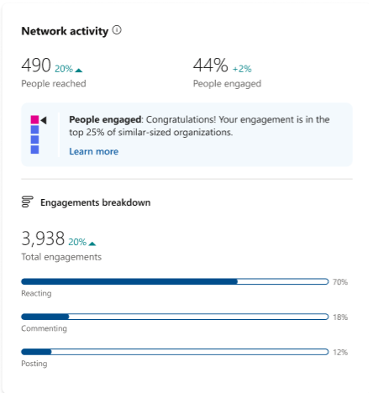
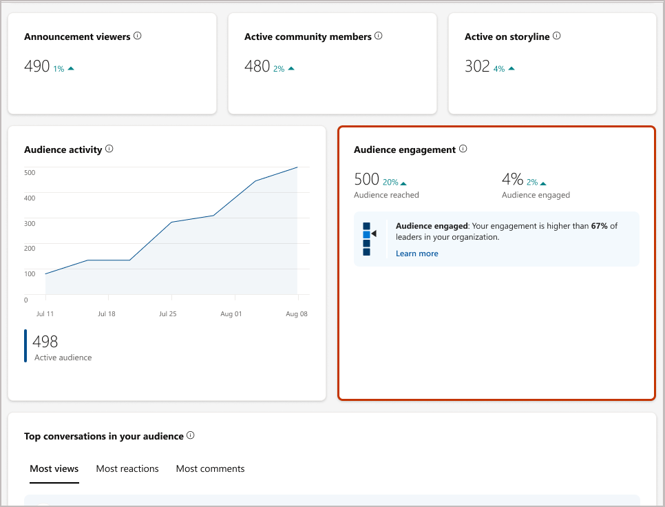

# Benchmarks in analytics

Benchmarking is a Viva Engage Premium feature that shows organizations how their metrics are performing in comparison to other organizations and audiences that use Viva Engage. Only verified and network admins can enable benchmarking features in Viva Engage.

Benchmarking provides a percentile that corresponds to your current _People Engaged_ metric within both Network and Audience analytics. For Audience analytics, this percentile tells you how engaged your audiences are compared to other audiences in your network. For Network analytics, your organization is compared to similar-sized organizations to determine engagement.

|||
|:-:|:-:|
|Benchmarking within Network Analytics|Benchmarking within Audience Analytics|

## Benchmarking calculations

Network Analytics benchmarks your company against similarly-sized organizations. Size sectors are determined by the number of active users within the organization and are displayed on the Network Analytics’ **Network Activity** card for network administrators and corporate communicators.

Audience Analytics uses peer benchmarking to rank the percentage of people engaged across all audiences in the same organization to produce the corresponding percentile. This percentile appears on the Audience Analytics’ **Audience Engagement** card for leaders, delegate managers, and delegates.

## Enable Benchmarking

Verified and Network admins can turn benchmarking features on and off from the Viva Engage admin center.

1. From the Viva Engage admin center, select **Setup & Configuration** > **Analytics and AI**.

1. To enable benchmarking for Network analytics, go to **Network Analytics** and use the toggle to turn the **Engagement Benchmarking** option on.
    When this toggle is enabled, you can see how your engagement compares to other networks that use Engage. Your network data may be included in our benchmarking calculations with data from other similar-sized organizations for the purpose of comparison only.

    >[!NOTE]
    > If less than 50% of the network’s users are licensed for *Viva Suite* or *Employee Communications and Communities* the Network Analytics dashboard will be unavailable.

1. To enable benchmarking for Audience analytics, go to **Audience Analytics** and use the toggle to turn the **Engagement Benchmarking** option on.
    When this toggle is enabled, you can see how your engagement compares to other leaders that use Engage in the same organization. Your audiences’ data may be included in our benchmarking calculations for the purpose of comparison only.

### Optimize engagement in your network

Network Administrators and Corporate Communicators can apply these best practices to the network to increase engagement, strengthen connections, and improve benchmark metrics for Network Analytics.

- Assign a peer as a corporate communicator to help moderate engagement across your organization.

- Assign additional leaders. Content posted by leaders tends to have higher engagement.

- Make a post about campaigns on your Storyline to boost engagement.

- Create posts about popular themes on your Storyline to boost engagement.

- Manage your campaigns to increase employee engagement.

- Encourage your leaders to post and interact with content.

### Optimize engagement in your audience

Leaders, Delegate Managers, and Delegates can apply best practices for content creation to increase engagement, strengthen connections, and improve benchmark metrics for Audience Analytics.

- Assign a member of your team as a delegate to engage on a leader’s behalf.

- Check out the most active communities across your audience. Posting in these communities can increase reach.

- Create Storyline posts. Leadership content can generate higher engagement than average posts.

- Share a Storyline announcement about popular themes to show employees you’re listening.

- Praise an employee for their contributions to develop two-way dialogue.

- Make a post about active campaigns on your Storyline to boost engagement.

## See also

[View and manage analytics in Viva Engage](/Viva/engage/analytics)
