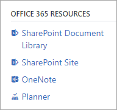

# Viva Engage and Microsoft 365 Groups

If your Viva Engage network is eligible, you can use communities connected to Microsoft 365 Groups in Viva Engage.

You can tell if a community in Viva Engage is connected to Microsoft 365 Groups when you see the **Microsoft 365 Resources** section in the right navigation of the Viva Engage community:
  


## Advantages of using communities connected to Microsoft 365 Groups

Communities connected to Microsoft 365 have many advantages over communities which are not connected:

- From within Viva Engage, access Microsoft 365 services, including a SharePoint Online team site and document library, a OneNote notebook, a plan in Planner. Microsoft 365 Groups also includes integration with services like Power BI and Stream.
- Create and host live events ([Live events in Yammer](../manage-yammer-groups/yammer-live-events.md))
- Use Microsoft 365 connectors to add apps to classic Yammer ([Add apps to Yammer](https://support.office.com/article/Add-apps-to-Yammer-bbb77f10-8779-4f3d-8096-db256f8653b8))
- Manage who can create Microsoft 365 Groups ([Manage who can create Groups](https://support.office.com/article/manage-who-can-create-office-365-groups-4c46c8cb-17d0-44b5-9776-005fced8e618))
- Use dynamic groups to automatically update group membership from Azure Active Directory ([Create a dynamic group](../manage-yammer-groups/create-a-dynamic-group.md))
- Edit group membership from various apps. Changes to membership made in one Microsoft 365 app apply to other Microsoft 365 apps.
- Use data classification to create your own classifications of Microsoft 365 Groups, such as unclassified, corporate confidential, or top secret. ([Configuring group settings](/azure/active-directory/users-groups-roles/groups-settings-cmdlets))
- See the group in the Global Address List (GAL) in Outlook.
- Monitor group usage with the Microsoft 365 groups activity report. ([Microsoft 365 Groups activity report](https://support.office.com/article/Office-365-Reports-in-the-admin-center-Office-365-groups-a27f1a99-3557-4f85-9560-a28e3d822a40))
- Create optional groups naming policies. ([Microsoft 365 Groups naming policy](/azure/active-directory/enterprise-users/groups-naming-policy))
- Use the optional group expiration policy to help clean up unused groups. See [Microsoft 365 Group Expiration Policy](/microsoft-365/admin/create-groups/office-365-groups-expiration-policy)
- Use planned additional features that will only be available with connected groups. This includes getting local data center residency for newly uploaded files that are stored in SharePoint. ([Microsoft 365 Roadmap](https://go.microsoft.com/fwlink/?LinkId=509914))
  
## Viva Engage configuration required to use communities connected to Microsoft 365 Groups

To use communities connected to Microsoft 365 Groups in Viva Engage, make sure your Viva Engage network meets the following requirements:

- You must [enforce Microsoft 365 identity](../configure-your-yammer-network/enforce-office-365-identity.md) for Yammer users. When you first enforce Microsoft 365 identity there is a seven-day trial period, after which the **Status** of your  **Microsoft 365 Identity Enforcement** changes to **Committed**.

- Since October 16, 2018, all Yammer networks must be in a 1:1 network configuration. This means you have one Yammer network that is associated with one Office 365 tenant. For more information, see [FAQ: Consolidating multiple Yammer networks](../configure-your-yammer-network/faq-consolidate-multiple-yammer-networks.md).

>[!NOTE]
> If you want to ensure that all of your communities are connected, align your network to Native Mode.  To learn more about Viva Engage in Native Mode, see [Overview of Native Mode](../configure-your-yammer-network/overview-native-mode.md).

Here's how the process works after your network becomes eligible for connected groups:

- About 24 hours after the **Status** in **Microsoft 365 Identity Enforcement** changes to **Committed**:
    - In the **Microsoft 365 (previously known as Office 365) Connected Viva Engage Groups** section, the **Status** for your network will change to **Enabled**.

    - Any new communities created in Viva Engage that are eligible will automatically be connected to Microsoft 365 Groups.  

- After about one week, existing eligible communities will be converted to communities connected to Microsoft 365 Groups.

 For a community to be eligible, the following criteria must be met:

- The community owner must have Microsoft 365 Group creation privileges. By default, all Microsoft 365 users have this privilege.

- The community must be a public or private internal community. Unlisted private groups and external groups can't be connected to Microsoft 365 Groups.

- The community must have an owner, and it must have members.

## What happens when you create a new Viva Engage community connected to Microsoft 365 Groups

When you create a Viva Engage community connected to Microsoft 365 Groups, in addition to your regular Viva Engage community features, the new Microsoft 365 group is created, and a new SharePoint site and document library, OneNote notebook, and Planner are created. These resources can be accessed from the Viva Engage community page in Viva Engage.

If your network has the Yammer files stored in SharePoint feature that began rollout in December 2018, new files added to the group are stored in SharePoint. To see where Yammer files are stored for your network, go to [How do I tell where my Yammer files are stored?](https://support.office.com/article/7a647cb4-6005-4350-a258-68f00a5f7b29)

>[!IMPORTANT]
> If you create a Microsoft 365 group from any other app such as Outlook, it won't include Viva Engage. To have the connected group include Viva Engage, you must create the group in Viva Engage.

## Viva Engage networks in Native Mode

When your Viva Engage community is a Microsoft 365 connected group, you can manage many aspects of your group through the Microsoft 365 admin center, in addition to managing them through Viva Engage as discussed above. All groups from Viva Engage networks that are in Native Mode will be manageable through these admin centers. Some of the management capabilities that can be done through the Microsoft 365 admin center include:

- Add or remove group members
- Manage group ownership
- Delete a group
- Restore a deleted group
- Rename the group
- Update the group description
- Change the group's privacy setting

## Email and Microsoft 365 connected groups

In a connected group set up from Viva Engage, you can have group conversations in Viva Engage or in Outlook. You can send an email to a group in Viva Engage and it will appear in the group's Viva Engage messages, or use the group's name from the Outlook global address list (GAL) to send email to the group that goes directly to Outlook.

Your company can continue to use groups in Viva Engage and groups in Outlook based on which group type better fits the scenario for a team.
  
Email notifications for Viva Engage messages may be sent to users depending on the preferences that they have set in their Viva Engage notification settings. This applies both to connected and non-connected groups.

## FAQ - Network eligibility

### Q: I'm an admin, how do I know if my Viva Engage network is configured correctly and eligible for Viva Engage communities connected to Microsoft 365 Groups?
  
A: In the Viva Engage admin center, go to **Network Admin** > **Security Settings**. In the **Microsoft 365 (previously known as Office 365) Connected Viva Engage Groups** section, the status for your network will show as **Enabled**.
  
### Q: Can I disable Viva Engage connected to Microsoft 365 Groups?
  
A: No, but you can [Manage who can create Microsoft 365 Groups](/office365/admin/create-groups/manage-creation-of-groups). These restrictions don't apply to tenant admins.

### Q: If I restrict who can create Microsoft 365 groups for my tenant, will the groups that restricted users create in Viva Engage be Microsoft 365 connected?
  
A: No. Groups created by people who you have restricted from creating Microsoft 365 groups won't be Microsoft 365 connected.
  
### Q: If I have multiple Viva Engage networks that are mapped to Microsoft 365, will the Microsoft 365 connected Viva Engage groups work?
  
A: No. The Microsoft 365 connected Viva Engage groups experience will work only for Microsoft 365 tenant that is associated with a single Viva Engage network. See [Network migration: Consolidate multiple Yammer networks](../configure-your-yammer-network/consolidate-multiple-yammer-networks.md) for information on how to consolidate your Yammer networks. This  is required for all Yammer networks as of October 16, 2018.
  
### Q: I don't want my existing groups to get connected to Microsoft 365. Can I turn this off?
  
A: No, but you can [Manage who can create Groups](/office365/admin/create-groups/manage-creation-of-groups), which will also apply to the conversion of existing groups. Only groups with at least one admin with group creation privileges can be connected to Microsoft 365.

If you apply new a creation policy, this won't retroactively change groups that are already connected to Microsoft 365. This will only impact new groups moving forward.

### Q: I have an unconnected group. How can I get it to be connected?

A: When your network first becomes eligible for connected groups, all groups that meet the criteria are converted to connected groups. After that, if a group that wasn't eligible becomes eligible, for example if your network has Microsoft group creation policies applied and you add a group admin with group creation permission, the group isn't automatically connected. To have a group connected, you can submit a support request to have all eligible groups in your network connected.

## FAQ - General

### Q: What type of Viva Engage communities can be connected to Microsoft 365 Groups?
  
A: Currently, only private and public internal communities can be connected to Microsoft 365 Groups.
  
### Q: Can I make my Microsoft 365 connected Viva Engage community private and not list it in the Group Directory (secret)?
  
A: No. That setting isn't available for Microsoft 365 connected Viva Engage communities.

### Q: Can I use an existing group or SharePoint site for a Microsoft 365 connected Viva Engage group?

A: No, a new group and resources specific to that new group are created when you create a Microsoft 365 connected community in Viva Engage. You can't connect a new Viva Engage community to an existing Microsoft 365 group, an existing SharePoint site or SharePoint document library, or an existing OneNote notebook.
  
### Q: Can I hide a Microsoft 365 connected group from the Global Address Book?

A: Yes. This requires using PowerShell. Use the following cmdlet:

```Set-UnifiedGroup -Identity [group_name] -HiddenFromAddressListsEnabled $true```

For more information about Set-UnifiedGroup, see [Set-UnifiedGroup](/powershell/module/exchange/set-unifiedgroup).

### Q: Where can I create Viva Engage communities that are connected to Microsoft 365 Groups?
  
A: Viva Engage communities that are connected to Microsoft 365 Groups can only be created in Viva Engage. Microsoft 365 groups created in other locations don't include a Viva Engage community.
  
### Q: Can I create a Viva Engage community connected to Microsoft 365 Groups from the Microsoft 365 admin center?
  
A: No, this will be added in later waves. However, for Viva Engage communities connected to Microsoft 365 Groups, you can manage members and delete groups from the Microsoft 365 admin center. Metadata updates can also be applied to groups from the admin center.
  
### Q: Can I add external users to Viva Engage communities connected to Microsoft 365 Groups?
  
A: No. This will cause a sync failure because external users aren't managed by Azure AD.
  
### Q: How many members can my group have?
  
A: Since the upper limit of membership depends on how members interact with the associated resources provisioned with the Microsoft 365 group, there is no documented upper limit. However, customers have used Viva Engage communities with memberships ranging from 1,000 to over 100,000 members. 
  
### Q: What happens if I delete a Viva Engage community connected to Microsoft 365 Groups?
  
A: All the Microsoft 365 content associated with the community is deleted. This includes the document library, OneNote notebook and Planner plans. These resources are soft-deleted, and can be restored by your administrator for up to 30 days.

For more information about deleting a community or group, see [Delete a community or group in Yammer](https://support.office.com/article/2a70a1f9-d081-488e-9fc7-0f7684e5a58b).

### Q: Does the Microsoft 365 group expiration policy apply to Viva Engage communities connected to Microsoft 365 Groups?

A: Yes. When a Microsoft 365 group is deleted because it expired, the Viva Engage community is deleted.

### Q: Can I have a Viva Engage community connected to Microsoft 365 Groups that uses  dynamic membership?

A: Yes. Any Microsoft 365 connected Viva Engage community can be converted to dynamic membership. See [Create a dynamic group](create-a-dynamic-group.md) for requirements and limitations.
  
### Q: In a connected group, I see there are Yammer Files and a SharePoint Online Doc Library, are these the same thing?
  
A: No, these are separate locations to store files but the members of the group have access to both locations. Files attached to Yammer messages or uploaded in a Yammer **Files** page are stored in Yammer cloud storage, and files uploaded directly to the groups SharePoint document library are stored in SharePoint.

We recommend storing content that needs the structure and management capabilities of SharePoint in the group document library. For easy, quick sharing of images and documents, or to stream videos in Yammer, we recommend continuing to use the default Yammer cloud storage.

>[!NOTE]
> As of December 2018, we are in process of rolling out Yammer files stored in SharePoint. When your network gets this new feature, new files uploaded to Yammer are stored in the group's SharePoint document library in the Apps/Yammer folder. Any files uploaded before your network gets this new feature remain in Yammer cloud storage. To see where Yammer files are stored for your network, go to [How do I tell where my Yammer files are stored?](https://support.office.com/article/7a647cb4-6005-4350-a258-68f00a5f7b29)
  
### Q: Do my Viva Engage communities connected to Microsoft 365 Groups follow my Microsoft 365 Groups naming policy?
  
A: Yes. Any new community created in Viva Engage will add the prefix and suffix from the group naming policy, and won't allow blocked words in the group name. For more information, see [Microsoft 365 Groups naming policy](https://support.office.com/article/6ceca4d3-cad1-4532-9f0f-d469dfbbb552).

Note that Viva Engage community names can't contain the following characters: @, #, [, ], <, or >. If the naming policy includes any of these characters, regular Viva Engage users won't be able to create communities in Viva Engage. Microsoft 365 admins can still create communities in Viva Engage.

### Q: Can I use my Viva Engage communities connected to Microsoft 365 Groups with Group-Based Licensing in Azure AD?

A: By default, Viva Engage communities connected to Microsoft 365 Groups aren't compatible with Azure AD Group Based Licensing since the groups aren't security enabled.

## FAQ - Troubleshooting

### Q: Only some of my communities were converted to Microsoft 365 groups. How do I get the rest of them converted?

When the automated conversion happened, it didn't convert communities that didn't meet the eligibility criteria. You can make the needed changes to make those communities eligible, and then [create a support ticket](/office365/admin/contact-support-for-business-products) to get them converted.

Before opening the support ticket:

- Make sure all groups have an owner, and the owners all have Microsoft 365 group creation privileges.

- Make sure all groups have members.

- If you have unlisted (secret) groups, change them to private or public groups.

To find this information, you can do a data export and look in the groups.csv file. You'll need to cross-reference the owner list with the list of people who have Microsoft 365 group creation privileges.

### Q: How long before changes to a Viva Engage community connected to Microsoft 365 Groupa take effect in Viva Engage?

Changes to connected communities can take up to 24 hours to take effect throughout your network. This includes changes to group membership, permissions, name, and other settings.

  
## Related articles

[Use and manage resources in my Yammer community or group](https://support.office.com/article/44af9221-503a-4736-9571-ef1353546077)

[Join and create a community or group in Yammer](https://support.office.com/article/60db6f14-fc5d-4ffb-8812-e3c0a4109e00)
  
[Manage a community or group in Yammer](https://support.office.com/article/12ce0216-0618-4576-b87a-a8c189cee0f8)

[Delete a community or group in Yammer](https://support.office.com/article/2a70a1f9-d081-488e-9fc7-0f7684e5a58b)

[Manage who can create Groups](/office365/admin/create-groups/manage-creation-of-groups)

[Export data from Yammer Enterprise](../manage-security-and-compliance/export-yammer-enterprise-data.md)
