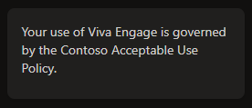
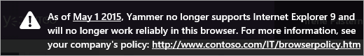
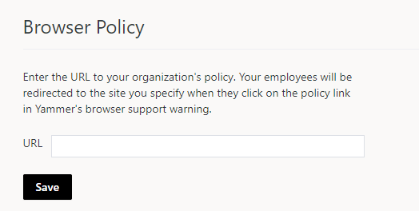

# Set up a Viva Engage usage policy

Creating a usage policy that users are required to accept can help ensure conversations on Viva Engage are positive, constructive, and in line with your company policies and culture. 
  
You can choose to have a link to the usage policy in the side bar in each user's Viva Engage home screen, and to display the policy as a pop-up that users must accept before entering the network.
  

  
## Set up or modify a Viva Engage usage policy

1. To create or modify your usage policy and its settings, navigate to the  Engage admin center. Select **Configure Tenant** under the **Setup & configuration** tab. This will redirect you to the Yammer admin center, where you can select **Usage Policy**.

2. Select when users should see the policy, and whether to display the reminder in the sidebar.

3. Enter your usage policy title and sidebar message.

4. Enter your usage policy text. You can use HTML code to format your usage policy. Basic HTML tags including links and basic formatting are allowed within the usage policy. JavaScript is not allowed.

    > [!TIP]
    > Use the [Sample Viva Engage usage policy](set-up-usage-policy.md#SampleUsePolicy) for ideas of what to include.
  
## Tips for creating your usage policy

For best results, we recommend that your usage policy:
  
- Is primarily positive and explanatory (and not just a list of "don'ts").

- Encourages usage by providing positive examples and suggestions.

- Requires that content be office‐appropriate.

- Includes a link for reporting inappropriate content.

You can include HTML links to relevant company policy information and to Viva Engage training resources.
  
## Sample Viva Engage usage policy 

Here's a sample usage policy for you to start with.
  
||
|:-----|
| Welcome to Viva Engage! Our goal is to provide a collaborative environment to connect with colleagues and bridge our departments and geographic locations to share meaningful information.     **Your activity in this network is governed by the following requirements:** - Everything in Viva Engage stays in Viva Engage! (No public posts or Tweets, and so on). - Do not post confidential information into the main feed. - Be respectful to other members. It is acceptable to disagree, but please do so in a respectful manner. - Add value with each post.  - You are responsible for the material you post to Viva Engage. - It is important to substantiate ideas, but please keep messages brief and to the point.  **Get started by following these best practices:** - When you first join, select the colleagues you want to follow. Posts from these colleagues will appear in your Following feed. To see all company posts, select **All**. - Fill out your profile information. Complete the **Expertise** and **Education** sections, and be sure to add a profile picture. - Customize your email preferences in the **Notifications** section. - Before asking a question, use the search bar and explore the Topics feed to explore existing content. This will help limit repetitive messages. - Browse the Group directory and join groups that you find relevant. If a specific group does not exist, start a new one and invite members of your team to contribute. For best results, use groups as a replacement for existing email listservs. - Add Topics, Links, pictures, and Events to posts when applicable. - Use the Viva Engage FAQs, and How To Guide to help clarify common concerns. - Take time to explore Viva Engage. You'll get the hang of it!  Post a question or send a private message to [Engage Admin] with any specific questions.   To report an inappropriate post, go to [link].    |

## Set up an Engage browser policy

You can add a custom link to your organization's browser policy. The link will be included in the banner that is automatically displayed for some obsolete browsers. Your organization's browser policy might include information such as restrictions on which current browser to use and where to get a current browser.
  
 For example, if the admin specifies the URL for the browser policy as http&#58;//www&#46;contoso&#46;com/IT/browserpolicy&#46;htm, this is what the user will see at the top of the page when they use an old browser:
  

  
## Add a link to your organization's browser policy
  
1. In the Viva Engage admin center, Engage admin center, select **Configure Tenant** under the **Setup & configuration** tab. This will redirect you to the Yammer admin center, where you can select **Usage Policy**. Then select **Set a custom browser policy URL within your company**.

    

2. Specify the URL where your organization's browser policy is defined.
