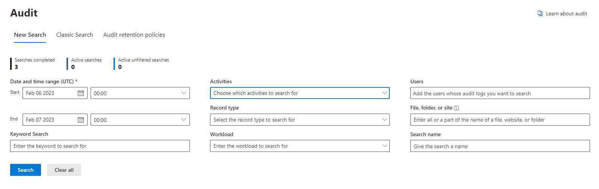

# Track Viva Engage events in the Microsoft 365 audit log and with the Management Activity API

To monitor security and compliance related Viva Engage events for your organization, turn on audit logging and view changes to users, groups, files, admins and network settings. The audit logs are available in the Microsoft 365 Security &amp; Compliance center or by using the Microsoft 365 Management Activity API.
  
You must have the Microsoft 365 global admin role or the Audit Logs role in Exchange online to audit events. You can view Viva Engage events from your home network, but not from external networks. The events you can search include the following categories:
  
- **Users** — including activating, suspending, and deleting a user.

- **Groups** — including creating and deleting of Microsoft 365 connected Yammer groups. This API does not provide data for legacy Yammer groups.

- **Files** — including creating, viewing, and deleting a file.

- **Admins** — including exporting data, triggering private content mode and forcing all users to log out.

- **Network settings** — including changing network usage policy and changing data retention policy.

## View the audit log in the Microsoft 365 Security &amp; Compliance center

Before you can view the audit log, you need to [Turn Microsoft 365 audit log search on or off](https://support.office.com/article/e893b19a-660c-41f2-9074-d3631c95a014). You only have to do this once. It takes a few hours after you turn it on before you can search the logs.
  
To view the audit log:
  
1. Go to the [Microsoft purview compliance center](https://sip.compliance.microsoft.com/homepage) and sign in using your work or school account.

2. In the left pane of the compliance portal, select **Audit**.

3. Follow the instructions for searching audit logs as described in [Search the audit log in the Microsoft 365 Security and Compliance Center](https://support.office.com/article/0d4d0f35-390b-4518-800e-0c7ec95e946c#run).

    
  
## Learn more about the Management API

You can use the Microsoft 365 Management Activity API to download various Viva Engage audit data. Read about how to register your application in Azure AD to get access to these features in [Get started with Microsoft 365 Management APIs](/office/office-365-management-api/get-started-with-office-365-management-apis). For the API reference see [Microsoft 365 Management Activity API schema](/office/office-365-management-api/office-365-management-activity-api-schema).
  
## Related articles

[Security FAQ](/yammer/manage-security-and-compliance/security-and-compliance#Security)
