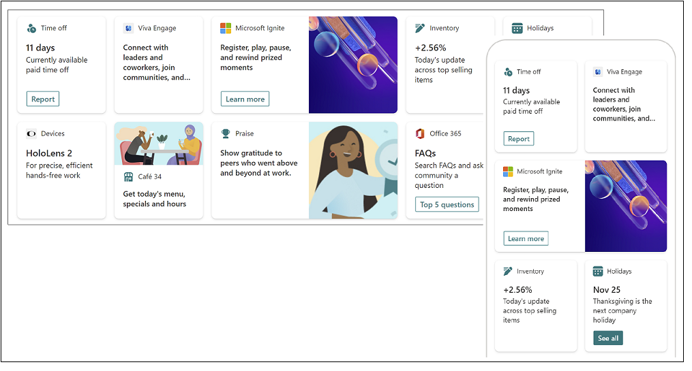
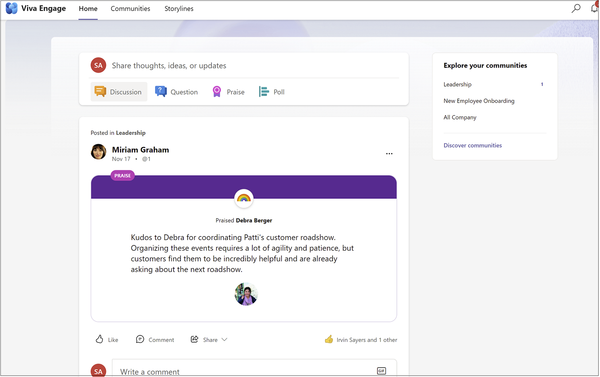
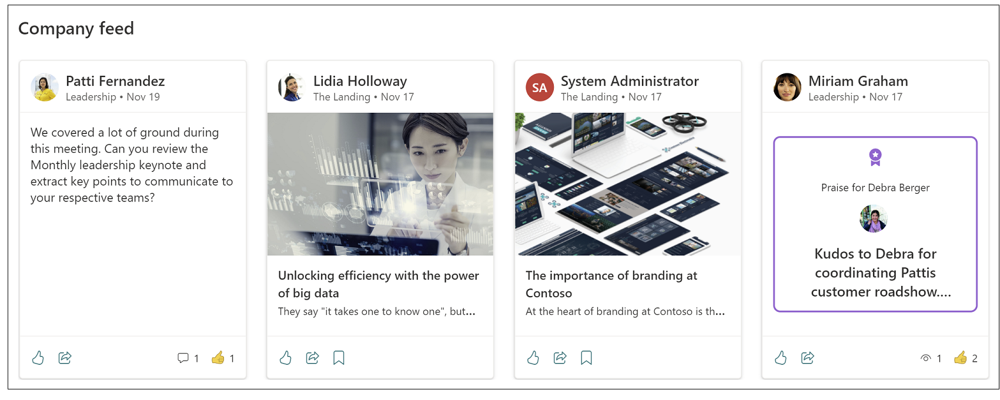
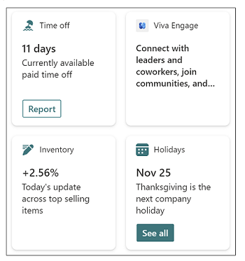

# Communications and Communities: Viva Engage, Viva Connections, and Viva Amplify

Energize your workforce by creating spaces for conversations, company news, and shared interests with Viva Connections, Viva Engage, and Viva Amplify. 

## Viva Amplify

Viva Amplify empowers organizational communication teams and leaders to elevate their message and energize their people. The app centralizes communication processes in a single space and offers writing guidance to help messages from every part of the organization, including leaders, corporate communications, and HR, resonate with employees. Communicators can then publish to multiple channels simultaneously, manage their campaigns from a central hub, and study resulting metrics to better plan future communications.

With Viva Amplify you get one place for campaign management, authoring and publishing, approvals, scheduling, and reporting and analytics.

[Learn more about Viva Amplify](/Viva/amplify/overview-viva-amplify)

## Viva Connections

Viva Connections is an employee experience app in Microsoft Teams that connects employees with tools, news, and resources. Content in the experience is tailored to the individual based on their role, region, and interests. Viva Connections is composed of three main parts: the dashboard, feed, and resources. Viva Connections integrates with other Viva experiences by surfacing content in the feed and through cards on the dashboard. For example, conversations from Viva Engage will surface in the Viva Connections feed. Additionally, in the example below, a dashboard card surfaces an entry point into the Viva Engage app.

Viva Connections is:

* A branded app experience in Microsoft Teams that is optimized to enable experiences for information workers and frontline workers.
* A gateway to employee experiences, with the ability for you to curate the content and tools you want to deliver through quick access to data and tasks, relevant news, communications, people, and resources.
* Built on existing capabilities in Microsoft 365 like SharePoint, Teams, Viva Engage, and Stream.

[Learn more about Viva Connections](/viva/connections/viva-connections-overview) including how to set it up and deploy it to your organization.

## Viva Engage

Viva Engage is integrated into Teams as an app and surfaces existing and new employee experiences powered by Viva Engage services. Viva Engage provides the right environment for community building, leadership engagement, knowledge sharing, and self-expression.

It features experiences for discovery of conversations, questions, and knowledge sharing happening across the organization, all within Teams Viva Engage app. Additionally, these conversations can be surfaced in the Viva Connections Feed.

Viva Engage is the place for conversations that connects people across the company — wherever and whenever they work — so that everyone is included and engaged.

[Learn more about Viva Engage](/viva/engage/overview) including how to set it up and use it in your organization.

## Viva Connections and Viva Engage: Better together

Viva Engage and Viva Connections can work together to surface relevant content and to empower employees to contribute, collaborate, work, and share. For example, one way an employee can discover a meaningful conversation is by seeing a conversation surfaced from Viva Engage in the  Viva Connections Feed. The Viva Connections Feed features relevant content from Viva Engage, including announcements, mentions (@ mentions), and storyline posts from people you follow. The Viva Connections feed includes content from other sources as well, including SharePoint news.

You can also add a card to your Viva Connections dashboard, which allows users to go directly to Viva Engage from their desktop or mobile device. To do this, you would add a Teams app card to your dashboard, and then find and add the Viva Engage app.

### Get started using Viva Engage and Viva Connections together

- To use this solution, start by [setting up Viva Connections](/viva/connections/viva-connections-setup-overview) if you haven't already. Content from Viva Engage will automatically show in the [Viva Connections Feed](/viva/connections/faqs-viva-connections-feed).

- To make Viva Engage quickly available to your employees on the go, add the [Teams app card with the Viva Engage app selected](/viva/connections/create-dashboard#add-a-teams-app-card) to your [Viva Connections dashboard](/viva/connections/create-dashboard).
