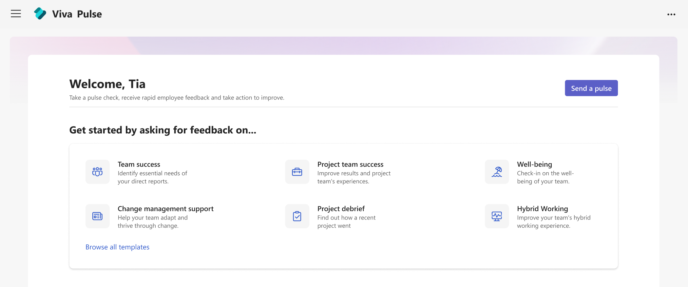

# Insight: Viva Insights, Viva Pulse, and Viva Glint

Continuously improve employee engagement and business performance using actionable insights from Viva Insights, Viva Pulse, and Viva Glint.

- [Viva Insights](#viva-insights-get-data-driven-actionable-insights) provides privacy-protected organization and team insights. You'll get data-driven, actionable insights to increase productivity and performance.
- [Viva Pulse](#viva-pulse-request-continuous-feedback) provides the ability to request ad-hoc feedback using research-backed templates to see team needs in the moment.
- [Viva Glint](#viva-glint-understand-the-employee-voice-with-organization-wide-surveys) provides tools for organization-wide surveys backed by People Science. Using the results, you can see and analyze strengths and opportunities and get suggested actions to drive business outcomes.

## Viva Insights: Get data-driven, actionable insights
Viva Insights includes a Microsoft Teams app and a web app with features and tools that help people and businesses use data-driven, privacy-protected insights. The app in Microsoft Teams and on the web shows personalized recommendations that help employees, teams, managers, and business leaders do their best work for themselves and for their teams. Get insights for building better work habits such as following through on commitments, meeting insights and suggestions, and protecting focus time in the day for uninterrupted work.

Insights are derived and summarized using the Microsoft 365 data you already have access to, such as emails, meetings, calls, and chats. Viva Insights complies with [data privacy](/viva/insights/advanced/privacy/privacy) applicable laws and regulations, and personal data is private unless a user chooses to share it.

**Learn more about Viva Insights**

[Introducing Viva Insights](/viva/insights/introduction)

[Environment requirements for Viva Insights](/viva/insights/advanced/setup-maint/environment-requirements)

[Data privacy](/viva/insights/advanced/privacy/privacy)

## Viva Pulse: Request continuous feedback

With Viva Pulse, managers and project leads can request ad-hoc feedback on topics to better understand their team’s needs and address them in the moment. Pre-populated, research-validated survey templates help zero in on important topics such as change management or work situations. Managers and leads can also customize templates to meet their unique team needs.

**Get timely analysis**

Viva Pulse provides a snapshot of team sentiment to help managers and project leads get quick feedback and adjust actions, if needed. Survey senders can leverage automatic sentiment analysis which saves time and helps them focus on areas of opportunity for the team. To ensure employee confidentiality, managers and project leads receive an aggregated view of survey results.

**Make necessary changes with recommended actions**

Leads will receive suggested learning resources and suggested next steps based on the Viva Pulse feedback results. These actionable recommendations enable managers and project leads to make sure employees’ perspectives are being heard.

**Learn more about Viva Pulse**

[Introduction to Viva Pulse](/viva/pulse/introduction-to-viva-pulse)

[Prerequisites](/viva/pulse/setup-admin-access/prerequisites-and-admin-roles)

## Viva Glint: Understand the employee voice with organization-wide surveys
Viva Glint provides a comprehensive approach to understanding employee voice and related signals such as social sentiment and collaboration patterns. With Viva Glint, you have the platform to capture the broadest set of direct and indirect signals and leverage next-generation AI to recommend actions to improve engagement and business performance. Viva Glint helps connect the dots from insight to action and offer recommendations based on feedback from Viva Glint surveys.

With Viva Glint, you have the platform to capture the broadest set of direct and indirect signals and leverage next-generation AI to recommend actions to improve engagement and business performance. Viva Glint helps connect the dots from insight to action and offer recommendations based on feedback from Viva Glint surveys.

**How Viva Glint empowers leaders with insights to better understand and improve engagement**

Viva Glint equips HR, business leaders and managers with comprehensive tools to understand and support their employees. As with any successful engagement program, Viva Glint starts with seeking and understanding employees’ needs through a robust people science methodology. Viva Glint is designed to analyze results in real-time, leveraging natural language processing, and enabling data-driven change by empowering leaders and managers with action planning tools to improve team and business outcomes. The result enables every organization to shape a tailored engagement strategy aligned with its unique goals.

**Learn more about Viva Glint**

[Introduction to Viva Glint](/Viva/glint/introduction-viva-glint)

[Four stages of Viva Glint programs](/viva/glint/start/four-stages-glint-program)
