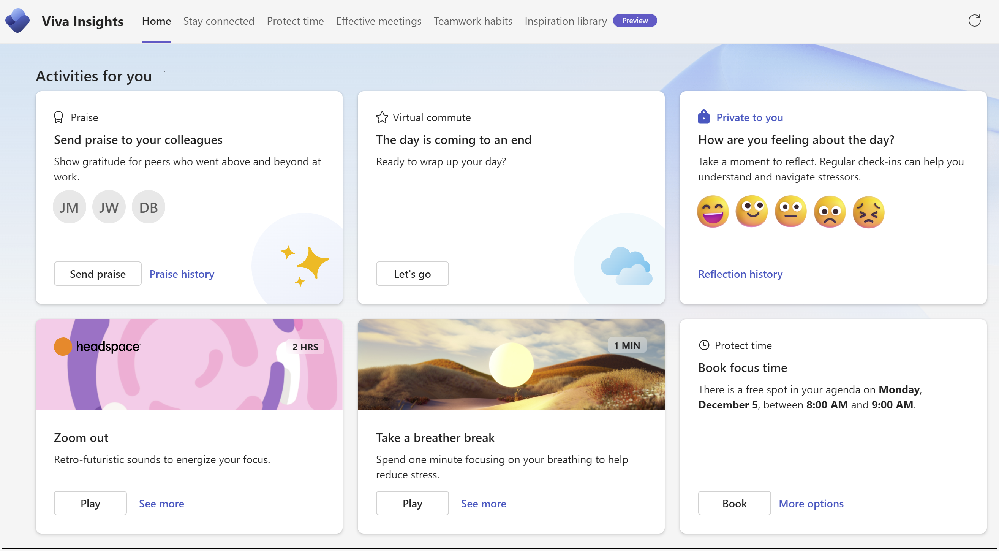

# Insight: Viva Insights

Viva Insights includes a Microsoft Teams and web app, along with web features and tools that help people and businesses use data-driven, privacy-protected insights. The app in Microsoft Teams and on the web shows personalized recommendations that help employees, teams, managers, and business leaders do their best work for themselves and for their teams. Get insights for building better work habits such as following through on commitments, meeting insights and suggestions, and protecting focus time in the day for uninterrupted work.

Insights are derived and summarized using your Microsoft 365 data – data that you already have access to – such as emails, meetings, calls, and chats. Viva Insights complies with [data privacy](/viva/insights/advanced/privacy/privacy) applicable laws and regulations, and personal data is private unless a user chooses to share it.

### Learn how Viva Insights works:

[Personal insights](/viva/insights/personal/teams/viva-teams-app) - Employees can get personal insights that only they can see. Insights, like those in the Viva Insights app, in a Briefing email in Outlook, or in a personal Dashboard, help employees learn about how they work and what they can change. They'll get recommendations such as protecting time in the day for regular breaks, using focus time, and staying connected with colleagues. They'll have the ability to book things like focus time within Viva Insights.

[Teamwork habits](/viva/insights/org-team-insights/teamwork-habits) - Teamwork habits gives visibility into work habits that might lead to burnout and stress. These habits include regular after-hours work, meeting overload, or too little focus time. Team managers can use these insights to help their teams strike a balance between productivity and wellbeing. They can also learn how their habits impact their team while getting suggestions on how to foster team culture.

[Organization trends](/viva/insights/org-team-insights/org-trends) - Organization trends helps qualifying managers and business leaders see how their work culture is affecting aspects of employee wellbeing and productivity. They can use the recommendations on the Outcomes page to see opportunities where a change could improve their business outcomes.

[Advanced insights](/viva/insights/advanced/introduction-to-advanced-insights) - Similar to Organization trends, Advanced insights can also help business leaders address critical questions about organizational resiliency and work culture with insight into how work impacts their people and their business. Leaders can see opportunities where a change in process could improve business outcomes and take steps to protect employee wellbeing.

[Data privacy](/viva/insights/advanced/privacy/privacy) - Learn how Viva Insights complies with applicable laws and regulations and how to protect and keep personal data private.