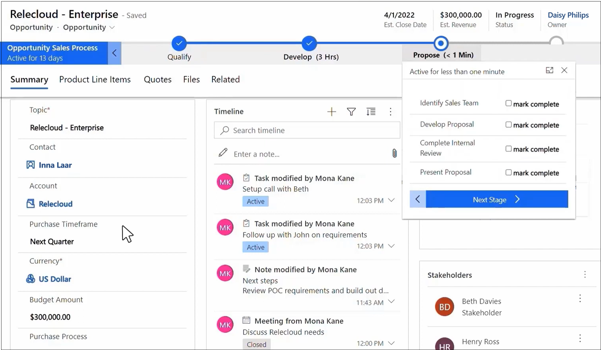

# Role-based experiences in Microsoft Viva

The first role-based experience in Microsoft Viva is Viva Sales. More role-based apps are coming soon.

### Viva Sales

Microsoft Viva Sales is a seller experience application that uses Microsoft 365 and Microsoft Teams to automatically capture, access, and register data into any customer relationship management (CRM) system. It eliminates manual data entry and gives sellers more time to focus on selling. By enriching the data set with customer engagement data from Microsoft 365 and the power of AI, Viva Sales empowers sellers with sales intelligence that helps them deeply understand their customers for faster deal closure.

For more information on how to implement and use Viva Sales, see [Introduction to Microsoft Viva Sales](/viva/sales/introduction).
