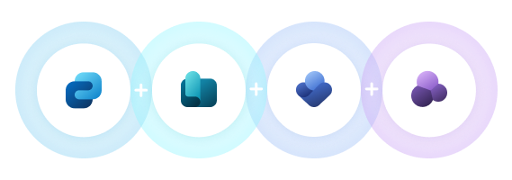
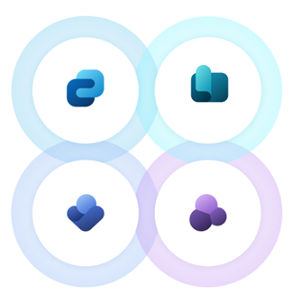
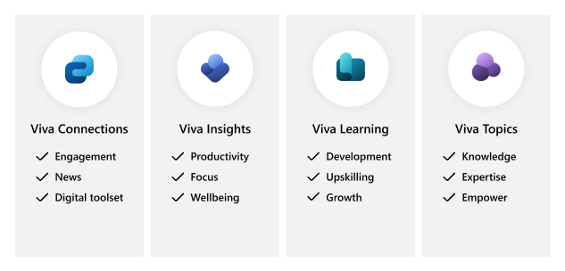

# Getting started with Microsoft Viva

With the growth in hybrid work, it's more important than ever to connect employees with an experience that brings together communications, knowledge, learning, resources, and insights all in Microsoft Teams.

>[!NOTE] 
> New Microsoft Viva experiences have just been released or are coming soon. New Viva experiences will be incorporated into this solution for [Viva Engage](/engage/overview), [Viva Goals](/goals/intro-to-ms-viva-goals), and [Viva Sales](/sales/introduction). Learn more about [new Viva experiences](#learn-more-about-new-viva-experiences).

Microsoft Viva is an employee experience platform made up of four modules that can be used individually or combined to meet your organization’s needs. Microsoft Viva is customizable and extensible, accessible from anywhere you work, and integrates with tools you already use. It also supports various partner integrations to give you access to industry-leading apps in the natural flow of work.

## In this solution

|Identify your business scenario  |Learn more about requirements, setup, and roles |Get started planning and deploying  |
|:---------:|:---------:|:---------:|
|:::image type="icon" source="media/viva-discover1.png" border="false":::   Discover which Viva module, or combination of modules, is the right fit for your business scenario.    | :::image type="icon" source="media/viva-learn2.png" border="false":::   Understand requirements, learn more about change management, and end-user training.   |:::image type="icon" source="media/viva-get-started4.png" border="false":::   Get started planning your organization’s deployment of Viva.|

## Identify your business scenario

Viva modules can be used on their own or used together for a more cohesive employee experience. This document will help you understand which solutions are right for your organization.

### Use all Viva modules

Get guidance on how to prepare, plan, and [deploy all Viva modules.](plan-for-all-viva-modules.md)

### Discover how you can combine Viva modules

Viva modules become more powerful if used together. Viva can help your organization meet popular business scenarios like onboarding and helping employees with wellness in the workplace. [Learn how.](learn-how-to-combine-modules.md)

### Learn more about individual Viva modules

Get detailed descriptions of each Viva module and learn more about how they can be used to meet specific objectives. Then, review requirements and considerations for planning and deploying. [Learn how.](discover-more-about-each-viva-module.md)

## Summary of each Viva module

|Module  |Features and capabilities  |Microsoft 365 integration  |
|:---------:|---------|---------|
|:::image type="content" source="media/logos/connections-launch-c-64.svg" alt-text="Logo of Viva Connections":::   **Viva Connections** |- Build a modern employee experience on your existing infrastructure.  - Create a centralized destination that’s personalized for employees.   - Deliver a customized mobile and web application that includes your company branding.   - Provide a unified communications channel to aggregate and share essential information.   - Target communications and dashboard cards to individuals or groups based on job type, geo, or other targeting criteria.   - Boost critical news and announcements to maximize exposure.   - Integrate with third-party providers and human resources systems to leverage your current investments and systems.     | SharePoint   Microsoft Teams   Yammer   Stream  Microsoft Graph |
|:::image type="content" source="media/logos/learning-launch-c-64.svg" alt-text="Logo for Viva Learning":::   **Viva Learning**   | - Enable social learning by leveraging Teams chat and tabs- Aggregate learning from connected content providers, learning management systems, and your own company resources.   - Recommend learning content and track reported completion progress.   - Add learning to the calendar to prioritize personal growth and development.   - Get personalized learning suggestions based on your interests and trending content.   - Surface learning content in Microsoft Search across Bing.com, Office.com, and SharePoint.com.    | Microsoft Teams   SharePoint |
|:::image type="content" source="media/logos/insights-launch-c-64.svg" alt-text="Logo for Viva Insight":::   **Viva Insights**    |  - Personal insights help employees build better work habits with actionable recommendations, such as reserving time for focused work, taking regular breaks, and activities to reduce stress and improve focus.    - Manager insights show how your habits impact your team while getting suggestions on how to foster team culture.   - Leader insights show a snapshot into how your company is doing, including company-wide outcomes and leading indicators for each outcome.   - Advanced Insights has advanced analysis tools for deep diving into Viva Insights data and different ways of analyzing and reporting custom analysis to your company’s business leaders.|   Microsoft Teams   Outlook   Web-based apps |
|:::image type="content" source="media/logos/topics-launch-c-64.svg" alt-text="Logo of Viva Topics":::   **Viva Topics**   | - Use AI to automatically identify, process, and organize content, relevant conversations, and expertise across your organization.    - Make it easy for employees to find information and then put that information to work.   - Discover and display related topics and expertise from different sources.   - Show topic highlights and display topic cards in many Microsoft 365 apps.   - Cultivate knowledge using your experts and AI to refine topic pages. |  SharePoint   Microsoft Search   Microsoft Teams   Outlook   Office apps |

## Microsoft Viva license requirements

Learn more about [Microsoft Viva licensing](https://www.microsoft.com/en-us/microsoft-viva/pricing) and which Microsoft Viva features are available across Microsoft 365 plans in the Microsoft [Viva service description](/office365/servicedescriptions/microsoft-viva-service-description).

## Overview of steps 

|Step 1 |Step 2  |Step 3  |Step 4 |
|:---------:|:---------:|:---------:|:---------:|
|:::image type="icon" source="media/viva-discover1.png" border="false":::    **Discover**   | :::image type="icon" source="media/viva-learn2.png" border="false":::    **Learn** |:::image type="icon" source="media/viva-prepare3.png" border="false":::    **Prepare** |:::image type="icon" source="media/viva-get-started4.png" border="false":::    **Get started** |
|Overview of modules and key concepts.     | Learn more about requirements and roles.        | Get guidance on change management considerations and end-user training resources.         |   Get started planning for your organization.      |

## Steps to set up

1. **Discover what module to use and when**  
Get familiar with how each Viva module can help your organization achieve certain outcomes. Review features and functionality for each Viva module. 

2. **Learn more about requirements and roles**  
Get guidance on technical requirements, roles, and other considerations that will be a part of the planning process.

3. **Prepare your organization for your instance of Viva**  
Start organizing, auditing, and scoping how your organization will use Viva modules to reach certain audiences and outcomes.

4. **Get started deploying**  
Get specific guidance on how to get each Viva module, considerations for adoption, and best practices for launching new tools.

## End-user impact and change management guidance

Review how each Viva module will impact the day-to-day work of the rest of your organization and consider how to approach.

|Viva module  |Change management considerations   |Guidance  |
|:---------:|---------|---------|
|**Viva Connections**     | Helps end-users understand how to access popular common tasks and resources from the Viva Connections app in Microsoft Teams.        | [Viva Connections on your desktop](https://support.microsoft.com/office/viva-connections-on-your-desktop-3da30f39-684a-4bde-bb81-2e1407d59b52) 
 [Viva Connections on the go](https://support.microsoft.com/office/viva-connections-on-the-go-753e0607-0bfd-4712-ad7e-18490dd565a2)|
|**Viva Insights**     | Viva Insights includes personal, manager, leader, and advanced insights with custom analysis options for evaluating your specific organization’s work patterns with research-based recommendations about where to focus change management efforts.        | [Microsoft Viva Insights Learning modules](/learn/browse/?terms=viva%20insights) |
|**Viva Learning**  | Viva Learning allows employees to discover, share, and track formal and informal learning in the flow of work.  Users can engage in social learning with colleagues and set and track personal learning goals. Personalized learning helps users get relevant learning content based on their own interests or recommendations from colleagues.       |[Viva Learning](https://support.microsoft.com/office/viva-learning-01bfed12-c327-41e0-a68f-7fa527dcc98a)   [Social learning](https://support.microsoft.com/office/social-learning-6badc784-0948-4922-94cc-85cd987def0a)   [Personal learning](https://support.microsoft.com/office/personal-learning-ca774f08-6bed-441b-a74b-3aac15cd9019)     [Learning content](https://support.microsoft.com/office/learning-content-b1ef9cb6-c2b1-4c64-aaf9-72f598e42688) |
|**Viva Topics**     | Viva Topics compiles information on topics such as a short description and related people, sites, files, and pages. All of this occurs within the flow of your work in Microsoft 365 and Office sites and apps.        | [Understanding Viva Topics](https://support.microsoft.com/office/understanding-viva-topics-5bef3020-2679-4045-81cb-bcbc37218332)       |

## Learn more about new Viva experiences 
New Microsoft Viva experiences have just been released or are coming soon. New Viva experiences will be incorporated into this solution soon. Learn more about how each Viva experience can be incorporated into your organization's employee experience. 

| Module              | Features and capabilities | Overview          |
| :------------------- | :------------------- |:----------------|
| **Viva Engage**  | Viva Engage brings people together across the organization to connect with leaders, coworkers and communities; crowdsource answers and ideas; share their work and experience; and find belonging at work.| [Learn more about Viva Engage](/engage/overview) |
| **Viva Goals** | Viva Goals is a goal-alignment solution that connects teams to your organization’s strategic priorities, unites them around your mission and purpose, and drives business results. | [Learn more about Viva Goals](/goals/intro-to-ms-viva-goals)|
| **Viva Sales** | Viva Sales is available for select preview customers but will become generally available in the Fall. Viva Sales is an experience for sales representatives and uses Microsoft 365 and Teams to automatically capture, access, and register data into any customer relationship management (CRM) system. | [Learn more about Viva Sales](/sales/introduction) |

## Learn more

Learn more about which Viva module, or combination of modules, is the right fit for your business scenario. Then, get guidance on how to prepare, plan, and deploy the Viva solution for your organization.

[Microsoft Viva Overview](microsoft-viva-overview.md)

[Get all Microsoft Viva modules](plan-for-all-viva-modules.md)

[Combine Microsoft Viva modules for popular business scenarios](learn-how-to-combine-modules.md)

[Learn more about Microsoft Viva modules](discover-more-about-each-viva-module.md)
