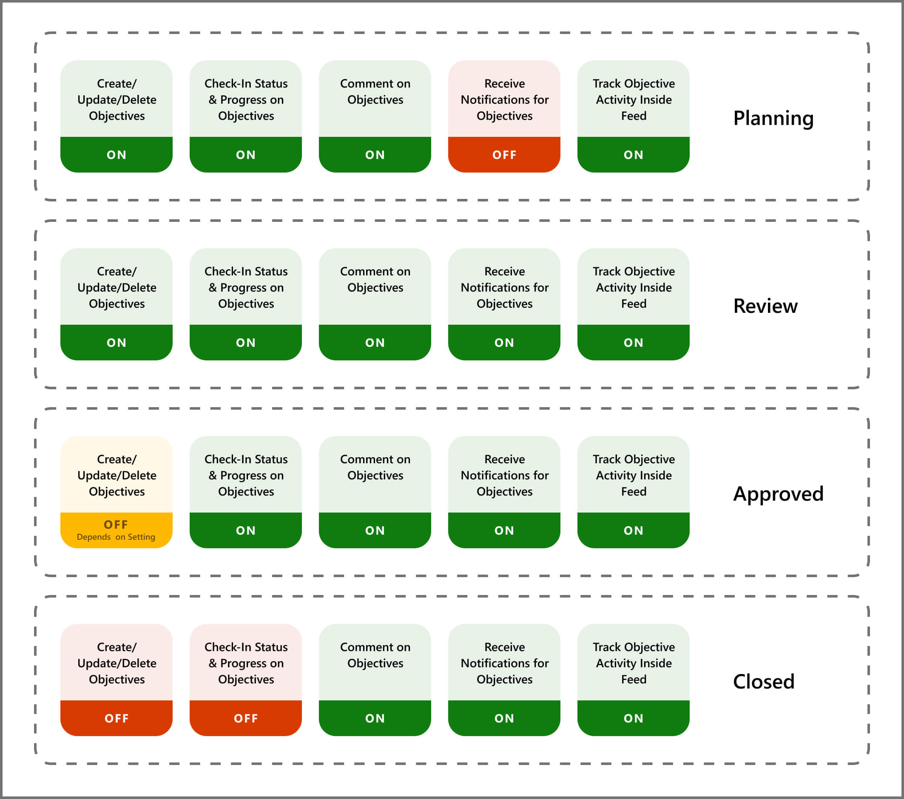

# Approval workflows 

The approval workflow in Viva Goals gives managers the ability to regulate OKR workflows in their organization. There are four stages in the OKR approval workflow:

1. Planning

2. Review

3. Approved

4. Closed

   
*Planning* and *Review*, which are similar, are used to indicate status. For example, an employee might plan out their OKRs and tell their manager when their OKRs are ready for review. The manager would then set them to the *Review* stage.

They would then have a discussion to finalize OKRs before the manager moves the OKRs to the *Approved* stage.

One they're approved, the OKRs are **locked** and can't be changed by the employee. In order for the manager (also called the approver) to make changes to the OKR, they'd need to move it back to the Review stage. 

## How to enable the approval workflow

Go to **Admin Tools -> OKRs & Initiatives -> OKR Workflow -> Enable Approval Workflow -> Save**.

When this feature is enabled, an extra option becomes available to block changes to OKRs after approval.
   
### Configure the approval workflow 

You can configure who can approve OKRs in Viva Goals. 

:::image type="content" source="../media/goals/enable-approval-workflows.png" alt-text="Screenshot shows where you configure the approval workflow in Viva Goals." lightbox="../media/goals/enable-approval-workflows.png":::

#### Approval of organization OKRs 

Only org owners and org admins can approve organization OKRs. 

#### Approval of team OKRs 

By default, team OKRs can be approved by managers of the team owners. Optionally, you can enable team owners and team admins to approve team OKRs. 

#### Approval of individual OKRs 

Individual OKRs can only be approved by the managers of the individuals. 

## How to change workflow statuses for an OKR 
  
1. After the Approval Workflow feature is enabled, go to the entity that you want to change the workflow status for.
  
2. In the upper-right corner of the screen, select the **...** button to view all possible actions for the current entity.

3. Select **Change Status**.
    
4. In the pop-up dialog that appears, select the status dropdown.
   
5. Select the status.
 
6. Select **Save**.
  
## Permissions available for each workflow stage

This setting allows for more regulation, although it requires more effort from the objective owner and the managers. Admins should consider this factor before they enable the feature.

It's best not to enable this setting while you're in the middle of an OKR period.

