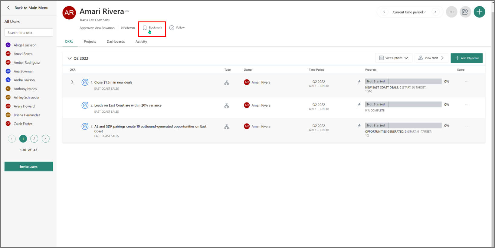

# Bookmarks 

You can bookmark users and teams in Viva Goals to access their Objectives and Key Results (OKRs) and other activities without having to browse through all users and teams.

To bookmark a user, go to **All users** and search for the particular user. Select the Bookmark symbol.

To bookmark a team, go to **All teams** and follow the same steps.

To access any bookmarked user or team, select bookmarks from the left navigation menu.

> [!NOTE]
> The **Bookmarks** option will only appear in the menu if you have one or more bookmarked items.
