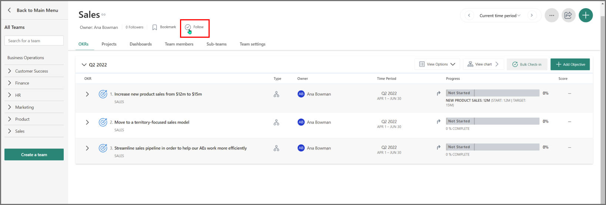
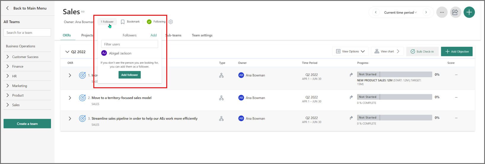
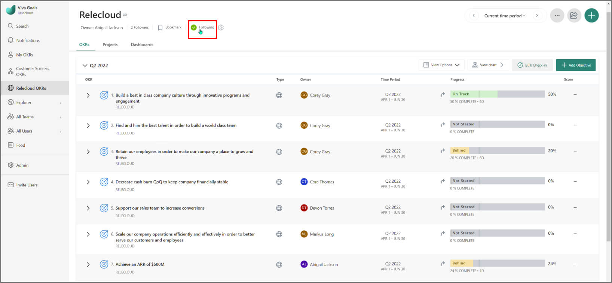
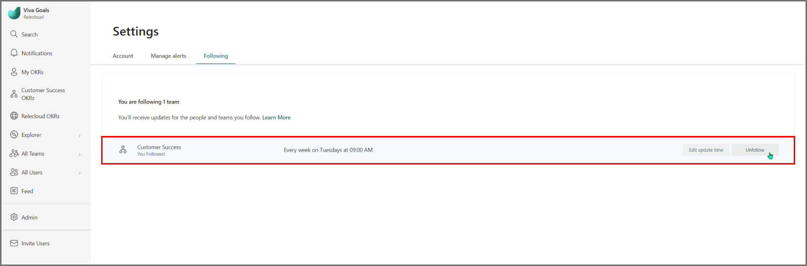

# Set up OKR business rhythms

## Key business rhythm #1: Weekly check-ins 

One of the most important parts of the OKR process is developing a weekly cadence to update, review, and track progress of your OKRs. 

We advise incorporating these items into your existing weekly stand-ups or team meetings. 

It's a good idea to set aside 15 minutes to discuss OKRs once a week. That habit will support OKR adoption and buy-in for your organization. 

### Update your OKRs

Ensure your OKRs have the latest information to discuss. Having check-in notifications set up will help keep your team up to date. You can learn more about setting up these notifications [here](check-in-reminders.md). 

It's best to have notifications go out at least 24 hours before meetings where you'll  discuss OKRs so your team is prepared.

### Review OKRs with the team

In your meetings, identify any OKRs marked "behind" or "at risk" in the past week, and drill down to understand details. Additionally you can engage directly with OKRs via likes and comments. For details, see [Check-ins and feedback](https://help.ally.io/en/articles/2107055-check-ins-and-feedback). 

### Compare progress to the previous week

Our "compare to previous" tool is a great feature that lets you quickly identify which OKRs are moving forward and which have stalled. We recommend that you use this tool in weekly review meetings. With two clicks, you'll have the necessary information at your finger tips. To enable this view, see [Compare to past](https://help.ally.io/en/articles/2632032-compare-to-past).

### Adjust as necessary

If everything is moving along as expected, great! If not, remember that OKRs sometimes need adjustments. Make [edits](https://help.ally.io/articles/3065314-q-can-i-edit-or-delete-a-okr) and reset expectations as necessary. 

In about 15 minutes, you've gained a clear picture into what's moved forward, what's behind, and what's been changed for the coming week for the critical aspects of the business. You've engaged on your team and company's biggest goals and your team can see their progress and how it's contributing.

## Key business rhythm #2: Summary updates

It takes frequent reminders and updates to keep goals front and center for your organization. Viva Goals let you send automated OKR progress and status updates by email to your company, individual teams, and individual contributors. 

### Get summary updates 

To get summary updates, follow the company, team, or individual. You can follow as many teams or individuals as you want. To do this, visit the relevant OKR dashboard page from the navigation menu.

You can also add other users as followers to make sure that they get summary updates for the company, team or individual. Select the **Followers** button and then select **Add**. 

### Customize summary update cadence and frequency

To customize the frequency and cadence of summary updates, select the "cog" icon next to the title pane of the dashboard. You can also select **change update time** in the alert that appears after you follow a company, team, or individual.

Select **Custom schedule** and choose the cadence, day, and time that you want to receive updates. Select **Done** to save your settings.

### Manage summary updates

View all teams and individuals that you follow on your profile settings page. Select your profile icon and go to **Account Settings**. From this page, you can change the cadence or unfollow the company, teams, and individuals you're following.  

To modify the cadence of summary updates, select **Edit Update Time** button, and then select the schedule you want to receive the weekly update from the pop-up dialog. 

To unfollow a company, team or individual, select the **Unfollow** button. You'll stop receiving the summary update for that company, team, or individual.

You can also unfollow a company, team or individual from the dashboard.

### Manually trigger summary and follower updates

You can also manually trigger summary and follower update emails from the Share Summary feature.

1. From the OKRs page, select the share icon in the upper-right corner of the page, and then select **Share Summary**.

2. In the **Recipients** field, enter the email addresses that you want to share the objectives with. You can also select the **Include followers** checkbox to share the update to all the users who follow the OKR.

3. Select **Add a personal note** if you want to add more context when you share the summary of objectives. You can select the option **Include objective progress changes in the last xx days** and set the number of days for the summary to cover.

To send yourself a preview of the message that will be shared, select **Send Preview**

4. When you're ready, select **Share**, and the objectives will be sent to the intended recipients via email.

## Key business rhythm #3: Quarterly OKR reviews 

OKRs are usually planned on an annual and quarterly basis, with more emphasis on the quarterly process. This cadence makes the quarterly review process critical. 

**Who needs to be involved:** The leader who owns an OKR and the team responsible for helping reach it. 

**What needs to happen:** The quarterly review happens at the end of the quarter. It's an opportunity for teams, managers, and individuals to review their progress and reflect on the performance of the previous quarter. In these meetings, OKRs are assessed and scored.  

**In the quarterly review, you should accomplish the following three things:** 

- Assess progress based on the team's OKRs and assign scores 
- Identify and discuss wins, losses, and lessons learned 
- Collaborate with other cross-functional teams in sharing graded OKRS and explaining results
- Outline adjustments for the next quarter 

## Key business rhythm #4: Annual planning

Annual planning is the most critical piece in setting up your company for success. With a concrete plan, you'll gain a clear idea of where your organization is headed, how you'll define success, and how you'll achieve your organization's biggest priorities. Annual planning consists of three phases. 

### One to three months before the new year 

**Who needs to be involved:** Senior-level leadership 

**What needs to happen:** Senior-level leadership meets and discusses annual company goals one to three months before the new year. This is also the time to discuss first-quarter company goals. 

**In this phase, you should ask the following questions:** 

- Which goals do we want to roll over for the new year? 
- What did we learn from the goals we reached this year, and from those we didn't reach? 
- What are our current gaps and problem areas? This should include market and industry, cross-functionality, team ability, and resourcing. 

### One month before the new year 

**Who needs to be involved:** Senior leadership and team leaders 

**What needs to happen:** By December, senior leadership should communicate with team leaders about annual company-level goals and how those will align with the team's quarterly goals. Discussion with team leaders ensures that every team understands the priorities for the upcoming year.

If team leaders need more training on OKRs, this is an ideal time to make sure they have the support and coaching they need about OKR best practices. Plan to run interactive workshops to help engage and educate teams during this time, if they aren't already familiar with the OKR framework.

**In this phase, you should accomplish the following things:** 

- Make sure team leaders understand the company mission, and vision and how those tie to the company-wide OKRs
- Give team leaders a chance to deliver feedback on company-wide OKRs
- Train team leaders on OKR best practices and Viva Goals 

### First week of the new year 

**Who needs to be involved:** The entire company 

**What needs to happen:** In the first few weeks of the new year, the senior leadership team shares the business-level OKRs with the company. Team leaders should roll out drafts of Q1 team OKRs and make sure to communicate expectations for the quarter.

This is the time to start scheduling regular check-ins and plan for reviews, following review and scoring of OKRs at the end of the previous quarter. The cycle repeats itself each quarter, with team and company-level quarterly OKRs always keeping alignment with the company's annual goals.

**In this phase, you should accomplish the following things:** 

- Draft team-wide OKRs and determine cross-team dependencies 
- Schedule regular OKR check-ins or include them in the agenda of already existing rhythms like team meetings and one-on-ones 
- Make sure relevant training materials are available to all employees
