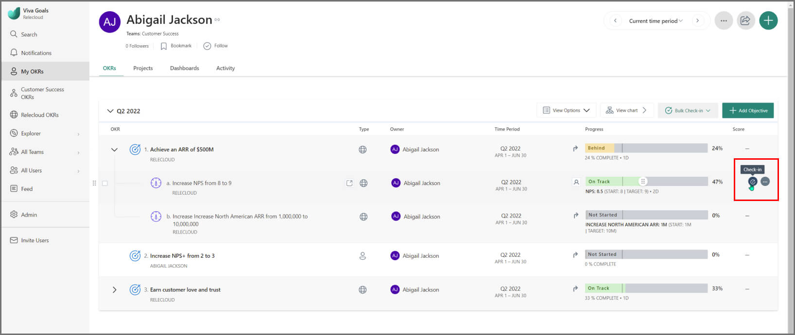
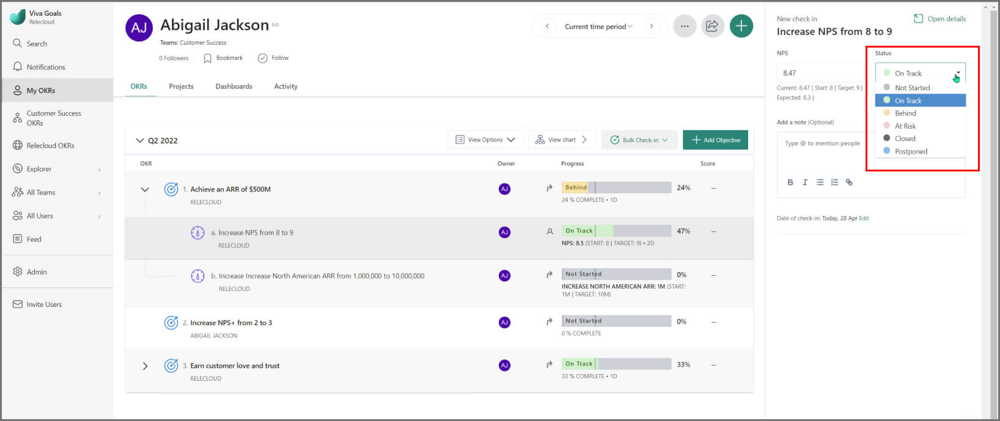
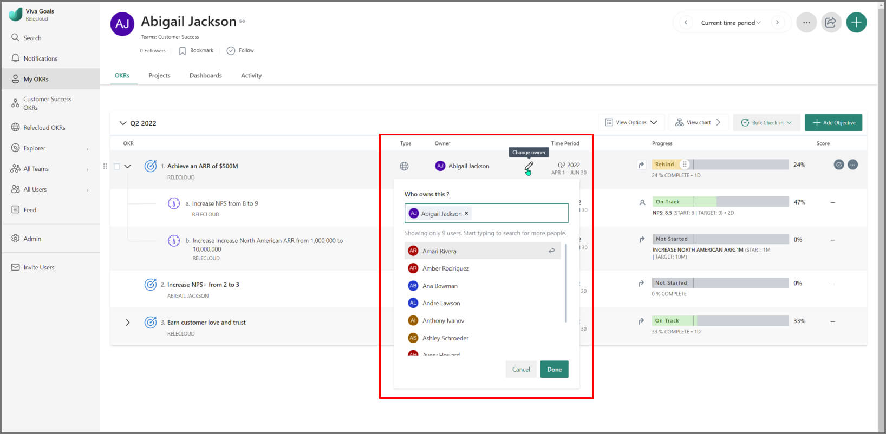
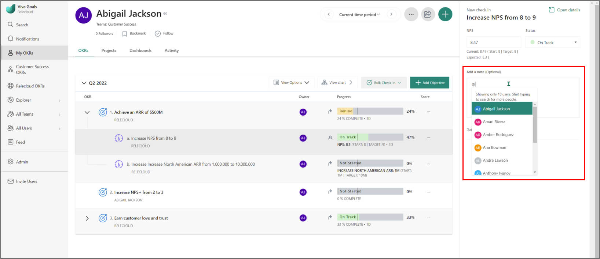
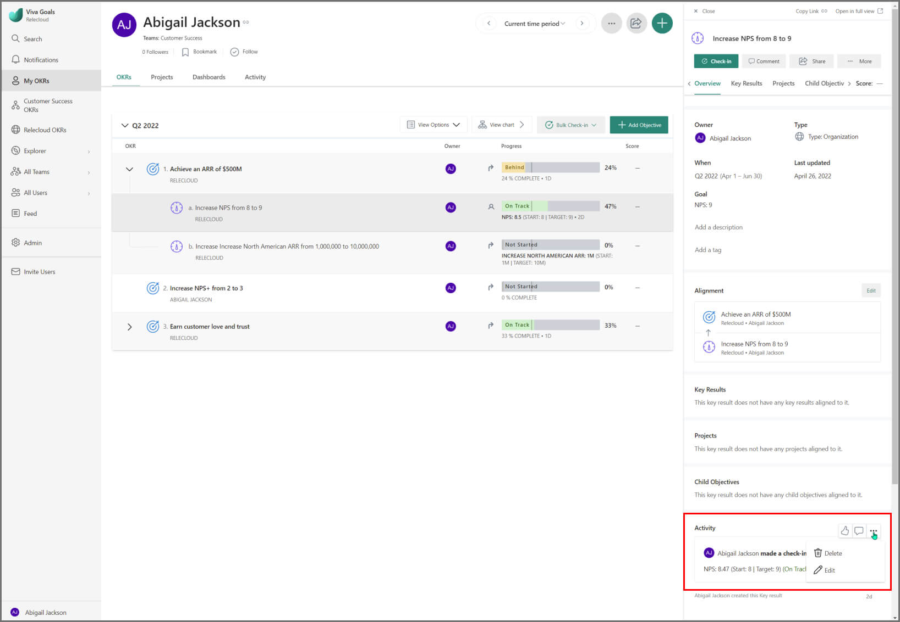
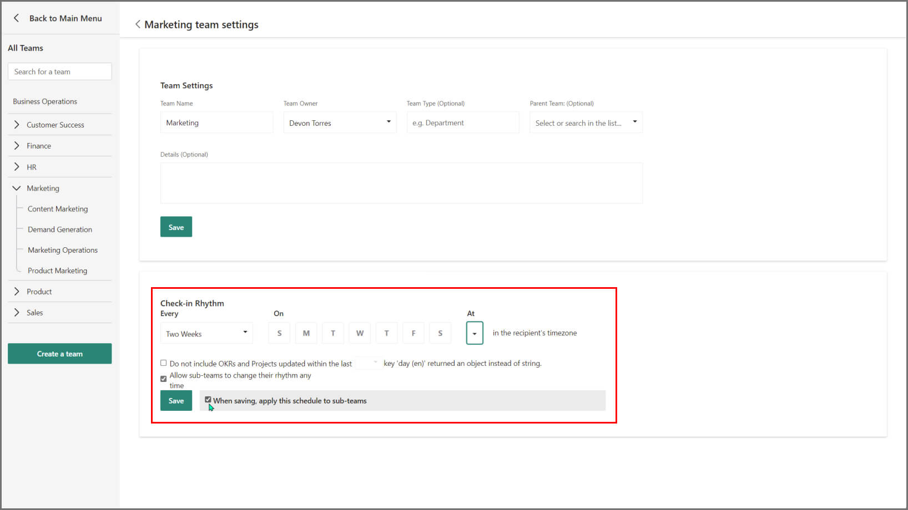

# Check-in and track progress on OKRs 

> [!IMPORTANT]
> Viva Goals is currently available only for private preview customers, and only in English. The features described here are subject to change. [Learn more about Viva Goals.](https://go.microsoft.com/fwlink/?linkid=2189933)

## How to check-in with Viva Goals 

Check-ins are updates that OKR owners make to the objectives and key results they are responsible for.

Regular check-ins prompt a constant, rhythmic review of OKRs. This helps your team stay on track, course-correct, make necessary changes to outdated or unachievable objectives, and most importantly, ensure teams are spending time on the work that really matters. 

The fact that all check-ins are visible to everyone in the organization maintains transparency and accountability in the OKR process. If your organization would prefer to keep some OKRs private, learn how to do that here:. 

To check-in quickly, go to your list of objectives and move the cursor over the objective or key result you want to update. Select the check-in option.

In the check-in sidebar:

1. **Tell your team the latest on your OKRs**: This is the place to contextualize your update with a brief note or comment. Be sure to cover any issues or challenges you're facing, as well as the progress you've made. Numbers don’t always tell the whole story. 

2. **Enter progress**: This could be the percentage completion of your task or KPIs met, depending on the metric of success you chose while adding the Objective. 

3. **Flag the overall status**: Is your Objective or KR On Track, Behind, At Risk, or have you Not Started yet? 

Keep it short and crisp; the OKR process doesn't require long explanations on every check-in.

After you make a check-in, you will notice that the statuses and progress of all parent Objectives update automatically. This roll-up reflects and maintains the alignment between different levels of OKRs.

> [!Note] One exception is objectives tracked by custom KPIs. Viva Goals can’t know how the progress of the key result will impact the aligned objectives, so Viva Goals won't automatically update progress. For objectives with custom KPIs, you will have to update the objective manually. 

## How to assign responsibility for check-ins

Use the **check-in responsibility** feature to understand who an OKR owner is and prompt them to check-in. The check-in owner will be able to check-in on the OKR manually or set up a data link for the OKR to automate the check-in process. Check-in owners will receive check-in reminders. 

In the case of multiple OKR owners, only the user set as **check-in responsible owner** will receive the reminders.

**How to assign responsibility for check-ins**:

1. Sign in to Viva Goals and select the **+** button on the top panel to create a new OKR.

2. Enter the Objective/ Key Result. To share it with another individual, choose owners from the **Owner option.** Here you can assign multiple owners for the OKR.

3. Select the user who will be responsible for making check-ins from the **Who is responsible for making check-ins?** drop-down.
Once you make the selection, the user will  start receiving the check-in reminders.

> [!Note] By default, the owner (the first owner if there are multiple owners) is set as the person responsible for check-in.

## How to engage with check-ins with likes and comments

OKRs and ongoing feedback make a great team. Leverage Viva Goals’s social features to foster a culture of ongoing feedback around your OKRs by liking and commenting on your team’s check-ins. 

To comment on a check-in, go to **Check-in** on the objective page or find it in the feed. Use ‘**@**’ followed by the name of a team member to mention them in a comment. This sends them an email notification, perfect for drawing attention to critical updates or opportunities.

## How to edit and delete check-ins 

If you need to change a check-in or remove one made in error, you may find the check-in on the objective page or feed, and select edit or remove to make the necessary changes.

## How to set reminders for check-ins 

Viva Goals sends reminders in three ways: 

- If an MS Teams integration is enabled, the notifications will be sent through MS Teams 

- If no integrations have been set up, Viva Goals will send a reminder as an email

**You can customize your reminder settings by:**

1. Frequency (every one, two, or three weeks, or monthly)

2. Days on which notifications are sent. 

3. Time at which notifications are sent.

4. Disable notifications for OKRs that have had check-ins in the past X days (select number of days)

5. Admins or managers of a team can control whether the subteams reporting to them can set their own check-in rhythm or should follow the parent team's cadence. 

**The two options that determine the cadence and cascading of check-in rhythms are:** 

1. Allow teams to change their rhythm anytime.

2. When saving, apply this schedule to teams. 

**Let's consider the following scenarios to better understand the usage of these configurations to set a check-in rhythm:**

1. A Chief of Staff is setting a check-in cadence for the People Operations department to receive notifications every month on the first Friday at 9AM PST. The Chief of Staff wants the subteams reporting into her to continue having a cadence of their own (preferably, a weekly cadence). Therefore, she won't cascade this cadence down to the reporting teams, and will let each team set their own check-in rhythm. 

2. The Head of Marketing is setting a bi-weekly cadence for the Marketing team to receive notifications on every Monday once every two weeks at 9AM PST. The Head of Marketing wants his reporting teams (say, Product Marketing, Demand Generation, and Customer Marketing) to have their own cadence, but highly recommends starting them with the same cadence as the marketing team. In this case, the cadence will cascade down the teams, however, the teams can change this schedule at any given point in time. 

3. The VP of Sales wants her team to have a weekly check-in cadence, and is setting a rhythm to receive notifications every Wednesday at 9AM PST. She wants all the subteams reporting into her to follow the same cadence, and doesn't want them to have a cadence of their own, to ensure everyone is caught upto speed every week, and is on the same page. Therefore, she'll set a cadence, cascade it cadence down to all her reporting teams, and not let them change this rhythm.

Team Owners and Team Admins can create a custom cadence for reminders for their departments and teams in **Admin -> Team Settings**. These cadences can differ from the organization-level cadence. 

If teams have to follow the parent team's check-in rhythm, the team owners and/or team admins won't be able to change the schedule.

## How to automate check-ins 

You can choose to make check-ins automatically by:

**- Integrating Viva Goals with MS Teams.** You can easily make check-ins and get a quick view of your OKR progress by pinning your organization, team or individual OKRs as a tab in any channel or chat. 
**- Rolling up your objective progress to your key result progress.** The roll-up of progress makes it easy to assess the impact a key result has on its objective and other objectives above that are in the hierarchy of OKRs. The objective’s progress will be the average of the progress of its key results. 

## How to manually override OKR progress and status

While it is highly recommended to automate OKR progress updates either through an integrated data source, or via rollup from children objectives, the OKR owner might have better context on progress. In such cases, you can manually override the automated progress and status, and set them as you see fit. 

1. To the left of the progress bar, you'll find an icon that is indicative of the current progress mode. 

2. Upon clicking this icon, you'll find the option to make a check-in. Here, you'll find the current progress and status of the objective based on the automatic update. Select ‘Edit progress and status’ to make a manual check-in. 

3. Set the progress and status as you see fit. If you want to continue making manual check-ins, and choose to stop the automatic updates for this objective, tick the checkbox that’s right underneath to stop updating via rollup from children or an integrated source. 

4. If you don't tick this checkbox, you're choosing to stay in the automated progress mode but you'll manually override the progress and status as a one-off instance. The next automatic update will override the manual check-in you're making. 

5. Save your check-in. 

When you manually override the progress and status and choose to stop the automatic updates, the next automatic update will not take effect unless you choose to do so. 

However, every time you make a check-in, Viva Goals will show you what the automatic values would be. You can decide whether to continue making manual check-ins or revert to the automated mode of updating progress.

### How to resume automatic updates

You can exit from the manual override mode and resume automatic updates by following these steps: 

1. Select the manual progress mode icon, and start a check-in.

2. You will be shown the automatic values, and you will see an option to resume the automated updates. 

3. Select **Resume updating automatically from key results** (in case of progress rolled up from children) or ‘Resume updating automatically from an integrated data source’ (in case progress is updated through the integration). 

4. The progress and status will take the automatic values, and the progress mode will be reverted to automated mode.

5. Save your check-in.

## How to manage objective status alerts 

Alerts automatically indicate when an objective needs attention or is at risk. Alerts are enabled for all objectives by default. Each user can manage how alerts are displayed for their account.

:::image type="content" source="../media/goals/3/35/goals-manage-alerts.png" alt-text="Image of Managing Alerts"::: 

To manage alerts, select your Avatar, then select **Account Settings** -> **Manage Alerts** and choose your preference. 

:::image type="content" source="../media/goals/goals-manage-alerts.png" alt-text="screenshot of managing alerts."::: 

### Status indicators

Alerts are displayed in orange or red for each objective. A solid indicator refers to the listed objective, and an outlined indicator refers to a child objective (or even a grandchild objective). 

Select the indicator to see the alert message. 

**Needs Attention**: Shows that an objective (or its child objectives) appear to fall outside of OKR best practices. Indicators include: 

- Not started yet, seven days past the start date.

- Not aligned to any objectives: 
    Objective doesn't have key results and is a team or individual level objective.

- Objective has too many results. Best practice is to have 3-5 key results.

- Score is higher than 0.8. Consider setting the goal higher next time.  

**At Risk**: Shows that an objective (or its child objectives) appear to have a significant issue with configuration or progress. Indicators include: 

- Progress off by more than 25% from expected progress based on start and due date of OKR.

- Objective is past its due date.

- Doesn't have an owner.

- Key Result and Objective time periods don't align.

- Objective dates don't align with period dates.
