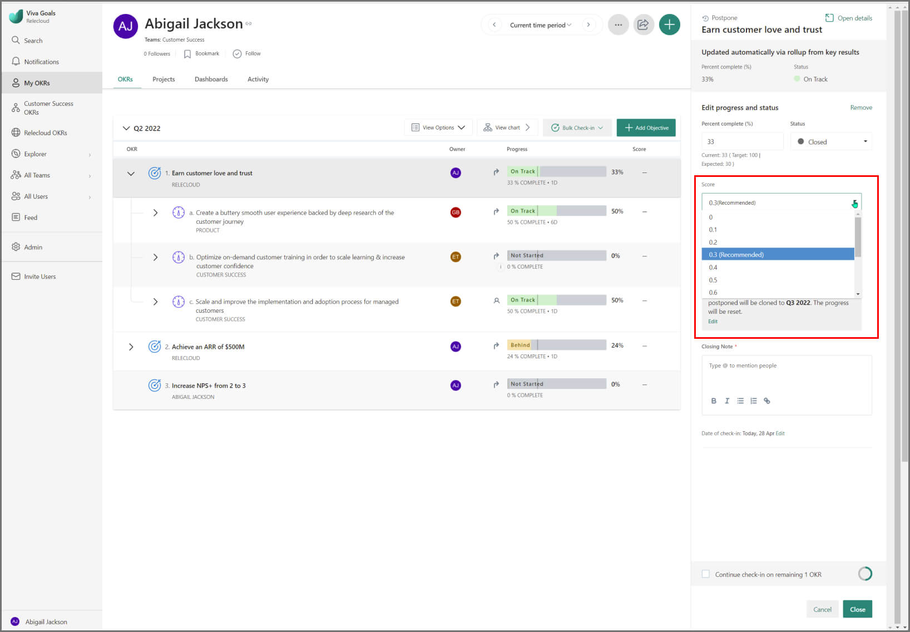
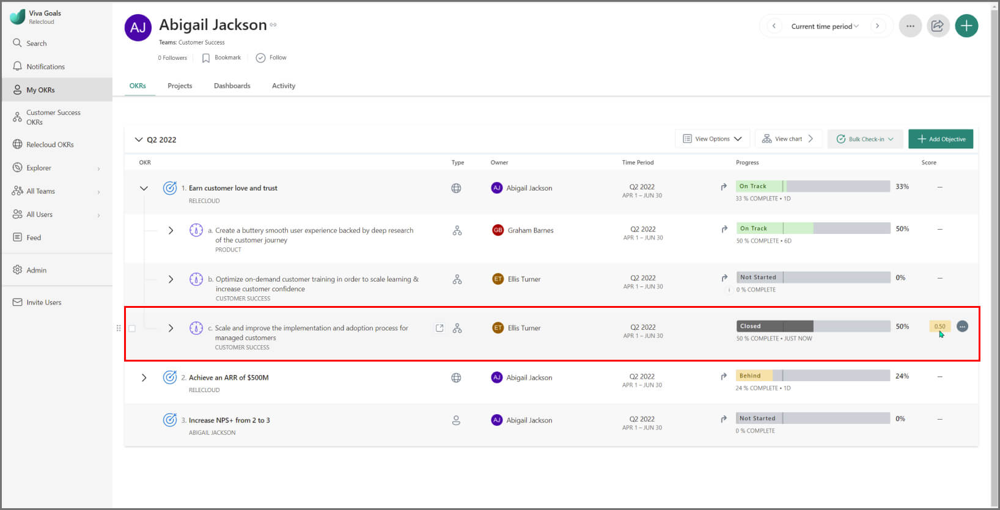
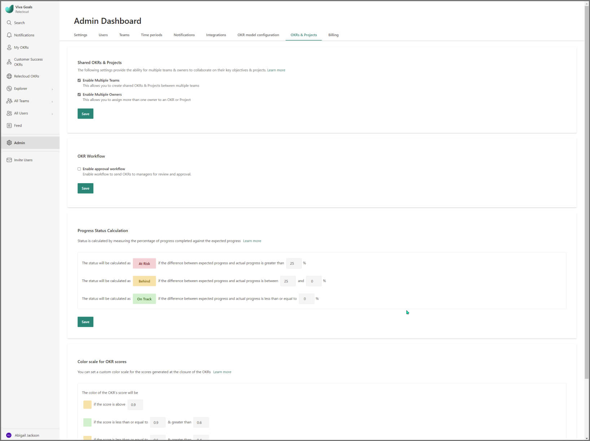
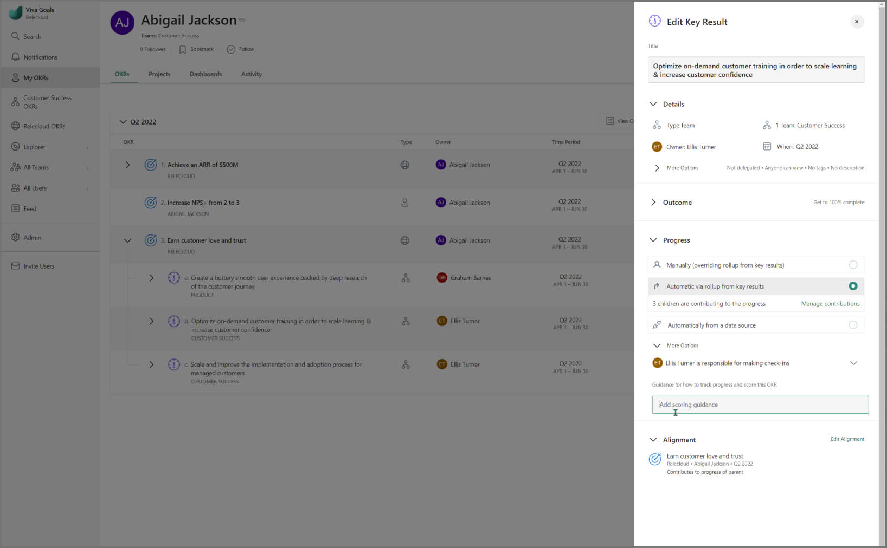
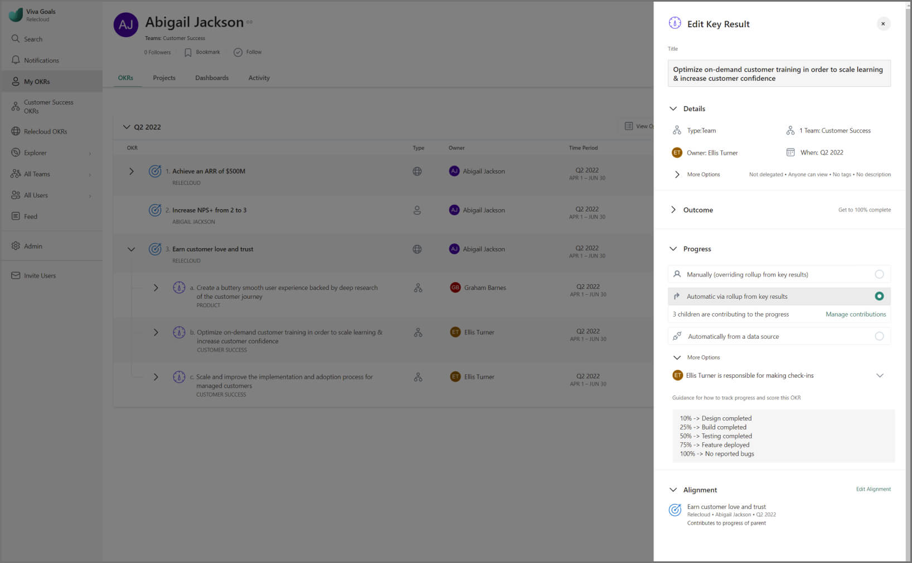
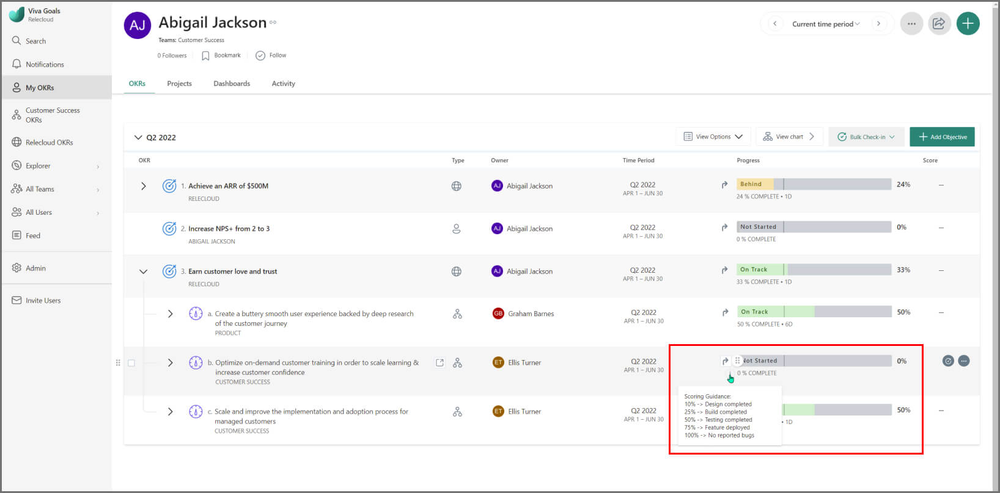
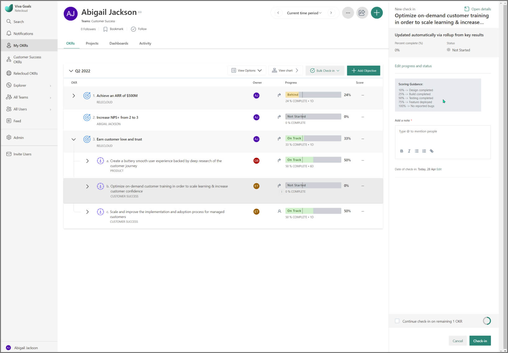
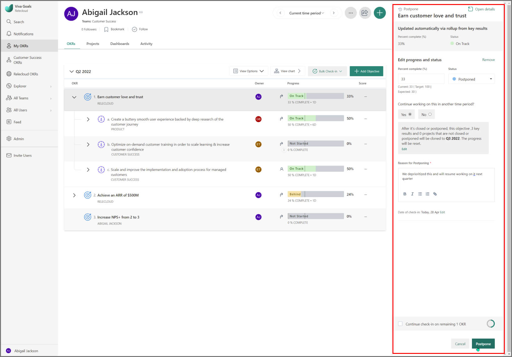
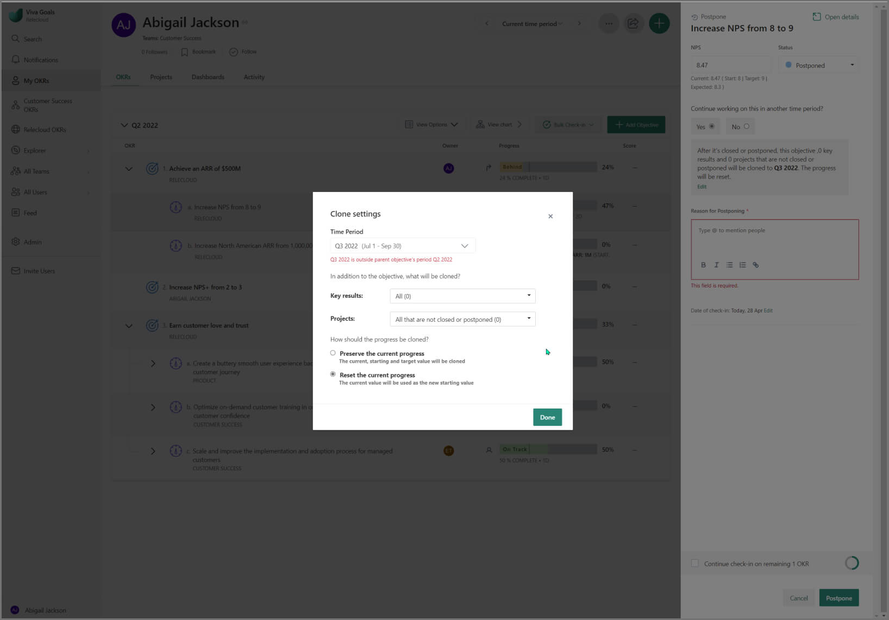

# Close and score OKRs

> [!IMPORTANT]
> Viva Goals is currently available only for private preview customers, and only in English. The features described here are subject to change. Viva Goals is only being released to WW tenants. It isn't being released to GCC, GCC High, or DoD environments. [Learn more about Viva Goals.](https://go.microsoft.com/fwlink/?linkid=2189933)

It's been a few months since your ambitious brainstorming session to set quarterly goals. Week after week you've stayed diligent with your check-ins. 

Now the quarter is ending and you get to find out how close you came to achieving the goals you set. 

## How to close out your OKRs

Closing an OKR in Viva Goals is when you reflect on how well you did in achieving an objective or key result. 

Your score is typically based on the progress of the success metric or progress of the key results. Users can also take into account other pieces of information (unexpected challenges, for example) and choose a different score.

**Timing**: The ideal time to score and close your OKRs is the final two weeks of the quarter, or if necessary, within the first few days of a new quarter.

In order to score your OKRs for your time period, you first have to begin the process of closing them. 

At Viva Goals, we recommend closing all KRs that roll up to an Objective, before closing the Objective. To begin the closing process for your OKRs:

1. Navigate to the Key Result you would like to close.

2. Select the **More Actions** drop down.

3. Select **Close**.

After Close is selected, a side panel will appear where you can begin the scoring process for your OKR.

## How to score OKRs 

Scores in Viva Goals reflect progress towards an objective or key result on a scale of 0-1. The score typically based on the progress of the success metric or key results, but users can also take into account other qualitative factors and manually override the suggested score. At the end of the relevant time period, a score in the range of 0.6 - 0.8 is a healthy place to be. 

Scores aren't meant to be a performance review, they typically signal whether the right Objectives were chosen. If an Objective gets consistently low scores, consider re-evaluating its relevance. On the flip side, if you consistently score high, try challenging yourself with more ambitious goals.

Once you've begun the closing process, you'll then be able to assign a score to your objective.

The following fields are displayed:

|Field  |Description  |
|---------|---------|
|**Metric***    |    This field pertains to the degree of completion that has been achieved for your OKR and may be represented by a KPI or a percent complete. In this field you will enter your final number.     |
|**Overall Status**    |    By default, Viva Goals will set your status to closed. In order to successfully close the OKR, this status will need to remain closed.     |
|**Score**  |    Based on the above inputs, Viva Goals will recommend a score for your OKR, which is a simple calculation of your completed percentage mapped to a score between 0 and 1. You can choose to go with Viva Goals recommended score, or override it with a number of your preference based on the perceived outcome.     |
|**Continue working on this in another time period?**  |   This is a field where you can decide whether or not you want to move this objective to another time period in order to keep working on it. This will essentially postpone the completion of this OKR until the next quarter. Select Yes or No based on preference.    |
|**Closing Note**  |   This is a note about the OKRs you're closing. At Viva Goals, we recommend putting your final assessment of the success/failure of the OKR here and any suggestions you might have for including it in future time periods. |  

Once all of the fields have been filled out, selecting **Close** will save the update, and the OKR dashboard will update to show your final status, a greyed out OKR, and a number at the end of the row. 

You may be wondering why a score of 1.0 is orange? After all, you completed 100% of the objective! Well, remember that the ideal OKR should be challenging but attainable. A score of 1.0 may indicate a need for more ambitious objectives. 

Objectives in Viva Goals get scored automatically once all key results under them are scored. The score allocated is obtained by averaging the percentage completion rates of its associated key results. However, sometimes the sum is greater or lesser than the parts. You can change the calculated score from the admin dashboard under the OKRs & projects tab.

### When to modify your score

When you score and close your OKRs, Viva Goals automatically generates a score for you. Let's say your objective was "Secure the next round of funding for my startup" and your KR was "Meet with 10 potential investors for coffee this month."

Standard scoring would look like this:

- If you met with 8 investors this month, your score would be .8

- If you met with only 2 investors this month, your score would be .2

Why would you want to modify your score?

If you met with 8 investors, and 2 of them ended the meeting early, 4 of them turned you down, and 2 of them not only turned you down, but said that your company idea would never work, then you might downgrade your score from a "successful" .8 to a more realistic .3. You went to a lot of meetings, but you are far away from getting funding.

On the other hand, if you met with only 2 investors, and one of them thought your idea was promising, and the second one agreed to give you $1 million in funding, you could certainly upgrade your score from a "failed" .2 to a "mission accomplished": 1.0. 

In other words, you can modify your score to focus on the outcomes, not the outputs. 

### Scoring Guidance

The Viva Goals Scoring Guidance feature allows users to add guidance for others to see how progress should be tracked and/or how a score should be calculated.

If your organization has Scoring Guidance enabled, users will be able to define how they're tracking progress of an Objective and how to score it at the end of the time period. 

This promotes further transparency and understanding throughout your organization and the progress of your OKRs. 

#### How to add Scoring Guidance

Scoring Guidance can be added to a new or existing objective when adding or editing takes place. Select **Add Scoring Guidance**.

Then type out your objectives guide for progress and scoring. Below, we identified milestones included in shipping a new feature and corresponding percentages of completion.

Once you have set scoring guidance for an Objective, you can view it by selecting the information icon next to the name or the time period. 

When making Check-ins the Scoring Guidance will be displayed for user reference.

If you have an enterprise subscription and would like to have this enabled for your organization, please have an admin account and reach out to support@xxxxx.com with the request. 

## Best practices for closing and scoring OKRs

**- Keep the evaluation simple.** If your objective is to increase traffic to your website by 20%, and you increased it by 15%, give yourself a 0.75.

**- Low scores don't always equate to low performance, and vice versa.** Both extremely low and high scoring have something to teach your organization.  OKRs which score low help you learn and improve future processes; high scores open questions about whether you are setting ambitious enough goals as an organization, or playing it too safe. In either case, you have a solid benchmark of where to go and what to do next. 

**- Review OKRs with your team.** If you're a manager, here are the steps to take at the end of the OKR cycle: 

- Close out all team OKRs and review the assessment on the team OKRs with all of your team members, both at the next team meetings and in 1:1's
- Share your notes on why team OKRs were given the scores they were and invite team members to provide feedback, reflections, and ideas for how this cycle's lessons can be applied for the next OKR cycle. 

If you're an individual contributor, review your assessment, share your observations with your manager and get their feedback.

## How to roll over unfinished objectives

Sometimes objectives don't get completed. Evaluate the objective to see whether it is still relevant and attainable. If it is, you can easily [rollover the Objective](cloning-objectives.md) to the next time period. 

## How to postpone objectives 

Sometimes, due to unforeseen circumstances, a business may need to pivot and reprioritize goals for the quarter. With Viva Goals, you have the ability to postpone objectives and deprioritize them during the current time period, while allowing them to remain visible for later on.

1. Navigate to the objective you want to postpone.

2. Select the **check-in** symbol towards the right of the progress bar. If the current progress is 0, the status will be **Postpone** by default. Anything other than a 0, the status will be **Closed** by default.

3. You'll have an option to **Continue working on this in another time period**. Choose **Yes**.

4. The chosen objective, its key results, and projects will be postponed to the next quarter, which implies that it will be cloned automatically to the next quarter.

5. Provide the **closing note**, and select **Close** to close this objective, and continue working on it in the next quarter.

   

   - If you want to postpone it, select the **More actions** symbol. You'll be able to find the option to postpone.

   - Provide a **reason for postponing**, and select  **Postpone** to finish the process.

### How to measure progress to-date on postponed objectives

There are two methods of measuring progress in Viva Goals: **Percent completed** and **KPI (success metric)**. Progress will be reset by default when an objective is postponed to the following time period. You can choose to preserve the progress you have made prior to postponement. 

***Percent completed***

When the objective is postponed to the next time period, you start working on it from the ground up in terms of progress.

***KPI***

Progress will be reset to the current value. For instance, you want to publish 10 blogs, and you've published five blogs this quarter. When you postpone this to the next quarter, your starting value will be 5, not 0.

## How to decide whether to close or postpone an objective 

***When the progress is 0***

If the current progress is 0, the status will be **Postponed** by default. A progress of 0 potentially means you haven't started working on the objective, or the work you did hasn't moved the needle on the objective.

***When the progress is anything but 0***

If the current progress is anything greater than 0, the status will be **Closed** by default. This is owing to the fact that there's a substantial amount of progress made, and you might want to close the objective with the progress you're it at that given point in time. However, you also have the option to postpone this objective to chart progress toward the desired goal.
