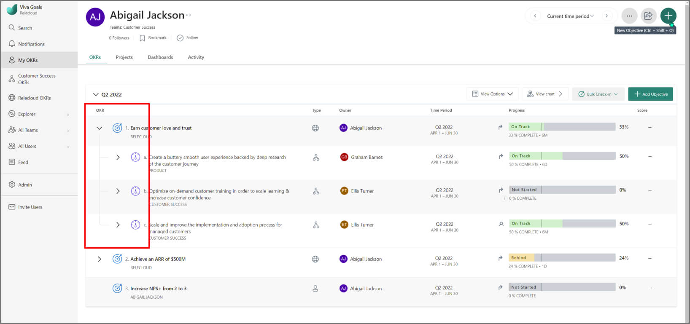

# Manage OKRs in Viva Goals

> [!IMPORTANT]
> Viva Goals is currently available only for private preview customers, and only in English. The features described here are subject to change. Viva Goals is only being released to WW tenants, and that it is not being released to GCC, GCC High, and DoD environments. [Learn more about Viva Goals.](https://go.microsoft.com/fwlink/?linkid=2189933)

## How to manage OKR contribution

The Viva Goals OKR contribution feature provides users (objective owners and creators) more flexibility and customizability in specifying weights and measuring progress. Users will now be able to define and control contribution at the parent level. 

All the contributions add up to a total of 100% and objective owners/creators have an option to mark a child’s contribution as "fixed". This feature is available only for OKRs that've progress mode as **Updated via roll-up from key results**.

Users who have "edit" permissions for the OKR (including check-in owners) can edit the contributions of child objectives.

You can set or edit your OKRs’ contribution from the **More actions** dropdown list. To do this, perform the following steps:

1. Select the **Manage children’s contribution** option.

   > [!NOTE]
   > You can also open the **Manage children's contribution** modal from the objective quick view by selecting the objective's title and also from the objective's detail view, as depicted in the following two images, respectively.

   The **Manage contributions** dialog box is displayed.

2. Add or edit the contributions of the children (objectives, key results, or projects)

   > [!NOTE]
   > You can enable or disable the **New children should start contributing by default** toggle. By enabling this toggle (which is enabled by default), you'll allow a newly created child to contribute to the parent. This enablement will readjust the contributions you’d have assigned to each child.

3. Select **Save** to save all the changes.

### Key points to note for OKR contribution

1. OKR contribution is available only for OKRs that have progress mode as **Updated via roll-up from key results**.

1. All the contributions will add up to a total of 100%. The default contribution is automatically assigned by Viva Goals to all the children equally. For example, if an objective has three key results (children), the default contribution assigned to each child will be 33.33%.

1. As soon as a child’s contribution is edited, the contribution is considered as “fixed”. This rule means, if a new child gets added or if an existing child gets removed, the contributions marked as "fixed" won't be adjusted. For example, if an objective has three key results (children), and the contribution of the first key result is edited as 50%, the contributions of second and third key results will be automatically adjusted to 25% each. In future, if there's a fourth key result that gets added, only the contribution of the second and third key results will be adjusted.

1. You can reset all the custom contributions to default by selecting the **Reset to default** option.

## How to customize OKR contributions using KPIs

You can use a KPI metric when you want to set customized "start" and "target" values for your OKR, as opposed to just going from 0-100% progress. Doing so gives you a much more accurate idea of progress while executing your OKRs.

KPI metrics in Viva Goals support two types of units - Numeric (No unit) and % (Percentage)

1. Select the **Add Objective** option and fill in your objective title and other details like type, owner, time period.

2. Expand the **Outcome** pane and enter the name of the metric you would like to achieve under **Metric name**.

3. Under **Target** click the **Increase to** drop down if you want to switch to **Decrease to** as the type of metric you'd like to track.

4. Click on the drop down next to **%** to change the unit. You can use the following units:

a. No unit 
b. % Percentage
   
5. If the starting value needs to be changed, click on the **Edit** button next to **Starting from: 0%**.

6. Once you have added details about how you would like to measure progress, select **Create**.

### Progress roll-up for objectives using KPIs

Objectives tracked using KPI metrics are associated with "Units". Units represent the method of measuring an objective’s progress. Viva Goals supports two types of units: **Numeric** and **% based**. The roll-up of progress for each of these units is calculated differently.

The calculation methods are described in the following table:

|Method  |Description  |
|---------|---------|
|Numeric Units     |     For objectives tracked based on a numeric unit, the progress of the objective will be the **sum of numeric key results**.     |
|% Units |    For objectives tracked based on the % unit, the progress of the objective will be calculated as the **weighted average of all key results**, whether they're metric based, or are just going to reach 100% completion. You can also set individual key results that don't contribute to the parent.     |

### Objectives measured based on numeric unit

Progress for objectives that are tracked based on numeric units is calculated as the **sum of all the key results**. 

To create an objective that is tracked by a numeric KPI, perform the following steps:

1. Select the **Add Objective** option and fill in your objective title and other details like type, owner, and time period.

2. In the **Outcome** pane, select the **Add a metric** option to give details about the metric you’d like to measure, the starting value, and the target you’d like to achieve. You can also select a unit based on how you’d like to measure progress.

3. Once you have added details about the metric, select **Automatic via rollup from key results** as the progress mode under the **Progress**' pane, and select **Save**.

### Objectives measured based on % unit

Progress of objectives tracked based on % unit will be calculated as the **weighted average**. You can also set the % completion arbitrarily as per your requirement. This will work for both manual progress updates and automated updates from integrations. 

- Objectives that are tracked by % complete KPIs can have key results that are tracked either by % metric or by the numeric metric.

- An objective’s completion doesn’t mean it has to hit a 100%. You can choose to set your objective’s completion % as 60 and update progress manually or connect your objective with an integration that will allow you to measure the progress based on % completion.

Say, for example, your Marketing team has an objective to **achieve record-breaking engagement to increase paying customers**’ from 30% to 60%. This objective has the following key results that contribute to the parent’s progress.

**Objective:** Achieve record-breaking engagement to increase paying customers
**Metric:** Paying customers
**Target:**: 60
**Starting**: 30
**Unit**: %

**Key Result #1**: Increase monthly trial signups from 25% to 40%
**Metric**: Trial signups
**Target**: 40
**Starting**: 25
**Unit**: %

**Key result #2**:Boost NPS score from 7 to 8
**Metric**: NPS
**Target**: 8
**Starting**: 7
**Unit**: Numeric

**Key result #3**: Increase monthly conversion of new paid customers from 15% to 35%
**Metric**: MoM Conversion
**Target**: 35
**Starting** 15
**Unit**: %

Whenever there is a check-in, the actual progress made will be displayed under the progress bar and the scaled progress is shown next to the progress bar. 

**Here is how Viva Goals calculates the scaled progress of a key result:**

Let **S** be the "starting" metric and **T** be the "target" you’d like to achieve. **P** is the value of the progress you’ve made so far.

In this example, there is a check-in made on a key result at 20%.

S = 15 (Starting value) 
T = 35  (Target) 
P = 20  (Progress made) 

The formula used to determine scaled progress is:[P−S/T−S]∗100

For this key result, the scaled progress would be [5/20]∗100 =25% 

If you don’t want a key result measured by a numeric value to contribute to an objective that’s measured by % complete KPI, you can open the **Edit weight and progress roll up** menu and select the **Doesn't contribute towards the progress of the parent** option.

The objective’s progress is the weighted average of the key results that contribute to the parent.

**Here is how Viva Goals calculates the scaled progress of an objective, from its key results:**

Let KR1 be the scaled progress of key result 1, KR2 be the scaled progress of key result 2 and so on, and ‘n’ be the total number of key results.

Scaled progress of Objective = ([KR1 + KR2 + KR3+ KRn] / n)*100

In this example, the following inputs are available:

- Scaled progress of KR1 = 0%
- Scaled progress of KR 2 = 25%
- Scaled progress of KR 3 = 20%

Based on these inputs, the scaled progress of the objective is: [(0+25+20/3)*100]  = 15% 

The actual progress of the objective is calculated by the product of the scaled progress and the difference between the target and the starting metric value added to the started metric.

Actual progress of the objective = [Scaled progress of the objective * Difference between the target and starting metric] + Starting metric.

Actual progress of the objective = [(15/100)*(60-30)] = 4.5+30 = 34.5%

## How to share OKRs with multiple teams and owners 

The Shared OKRs/Projects feature in Viva Goals is a great method for multiple teams and owners to collaborate on their key initiatives with equal ownership—and ensure alignment. 

### When to create shared OKRs/Projects 

When an OKR is a key priority for two or more functional teams and the team leads need to have shared accountability as the exact contribution cannot be proportioned or separately broken down between them. 

When both the teams are supposed to commonly own and work toward the outcomes, it's good to tag multiple stakeholders and not just a single team/owner as accountable.

   **Example #1:**
    OBJECTIVE: Enhance the onboarding strategy.
    KEY RESULT: Implement a new program to increase the repeat rate of 1st-time bookers. 
    TEAM(S): CRM Team and Marketing Team
    OWNER(s): CRM Lead and Marketing Lead
    
   **Example #2:** 
    OBJECTIVE: Build a world class Engineering org.
    KR/INITIATIVE: Invest in 2 Training & Development sessions + Capstone Projects for all 4 engg. teams this quarter
    TEAM(S): Engineering Department
    OWNER(S): VP Engineering and All Engineering Managers

Viva Goals' flexible shared OKR model makes it so you don't have to create duplicate and redundant OKRs for every team or individual when they are supposed to be commonly owned, worded, and measured.

### What different types of Shared OKRs are possible in Viva Goals?

|Shared OKRs |Description  |
|---------|---------|
|OKRs at an organizational level     |   These OKRs can have multiple owners.      |
|OKRs at team level     |    These OKRs can have multiple teams tagged and respective Team administrators/members tagged as owners.     |
|OKRs at individual level    |    These OKRs can have multiple users assigned as owners.     |

### How to enable the Shared OKRs feature for your organization

OKR administrators can turn on the "Shared OKRs" feature from the **OKR & Projects** tab within the admin settings.

### How to create shared OKRs for multiple teams

1. Log in to Viva Goals and create a new OKR.
1. Once you enter the objective/key result and want to share it with another team, select **Team** from the dropdown list under **Type**. 
1. Scroll down or search in the search bar for the team of choice.
1. Select the team and save the objective/key result. You'll start sharing the OKR with that team.

Users can also assign multiple teams to projects by implementing this procedure.

### How to create shared OKRs with multiple users as owners

1. Log in to Viva Goals and create a new OKR.
1. Once you enter the objective/key result and want to share it with another individual, select **Owners** from dropdown list under **Owners**. Here, you can assign multiple owners for the OKR.
1. Once you select the owner, save the objective/key result. You'll start sharing the OKR with that individual, and the user who has been assigned as the owner will also receive an in-app notification of the assignation.

### How to assign check-in responsibility for OKRs with multiple owners 

If there is just one owner or multiple owners assigned to an OKR and you would want a user within the organization to check in and update the progress of the OKR, you can use the "check-in responsibility" feature. 

The check-in owner will be able to check-in on the OKR (manual check-in) and set up a data link on the OKR (to auto-check-in). 

This user will be receiving the check-in reminders. In the case of multiple owners, this feature will prevent all of the owners from receiving reminders, and only the user set as 'check-in responsible owner' will receive the reminders.

**To assign responsibility for check-ins, perform the following steps:**

1. Log in to Viva Goals and select the **+** button on the top panel to create a new OKR.
1. Once you enter the objective/key result and want to share it with another individual, select **Owners** from dropdown list under **Owners**. Here, you can assign multiple owners for the OKR.
1. Once you assign an owner, select the user who will be responsible for making check-ins from the **Who is responsible for making check-ins?** drop-down. Once you make the selection, the user will start receiving the check-in reminders.

By default, the owner (the first owner in the case of multiple owners) is set as the person responsible for check-in and users need not explicitly choose, unless necessary.

## How to reorder OKRs with drag and drop 

**To drag and drop an objective, perform the following steps:**

1. Hover your mouse left of the objective name until you see the display of the icon depicted in the following image:

2. Click and hold your cursor to grab the objective.

3. Drag it to the desired location and alignment.

To make an objective become a key result, drag the cursor to the **+ Add key result** icon under the objective.

You can just as easily drag a key result out from under an objective to make it become an objective itself. Both examples are covered in the video below.

> [!NOTE]
> Drag-and-drop is available at the organizational, team, and individual levels. 
