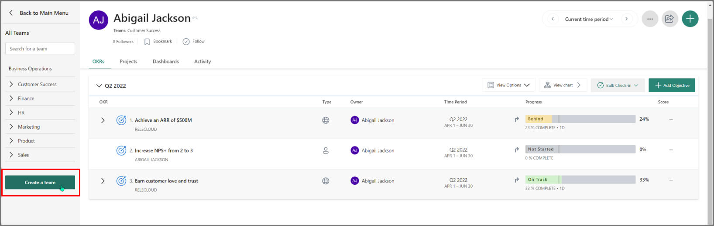
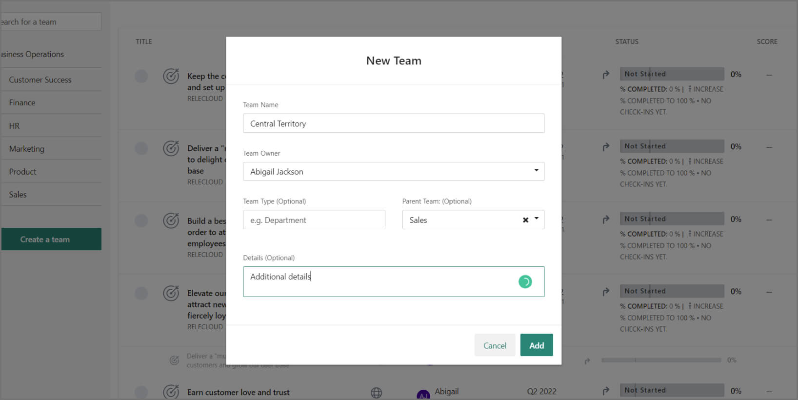
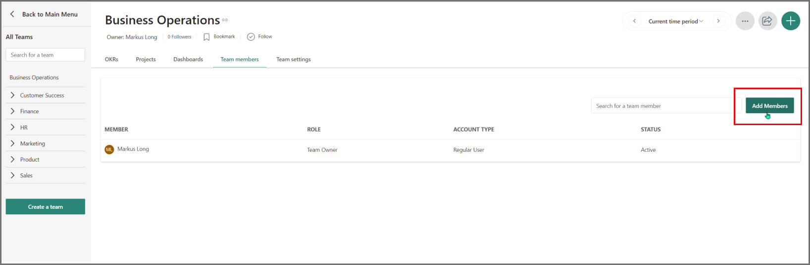
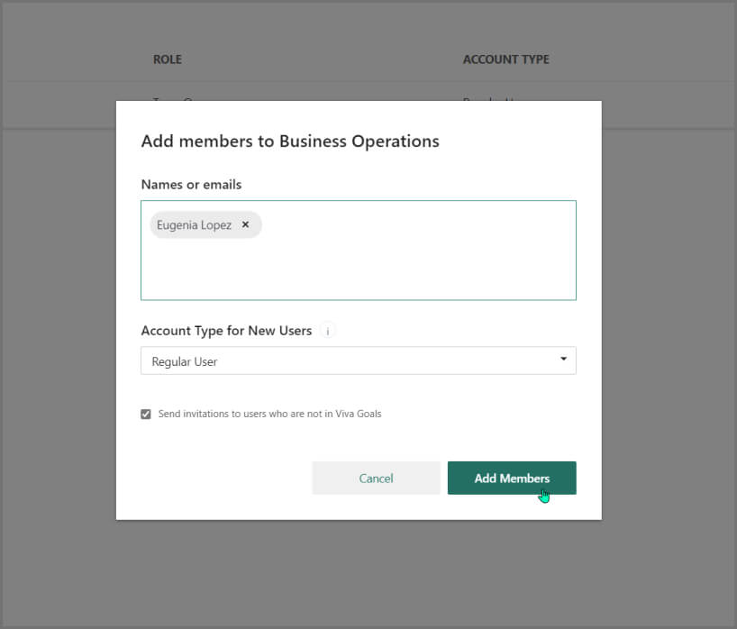
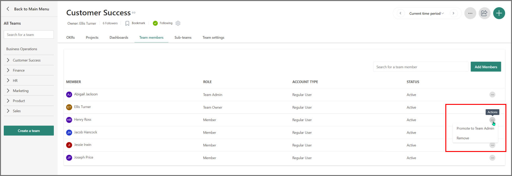
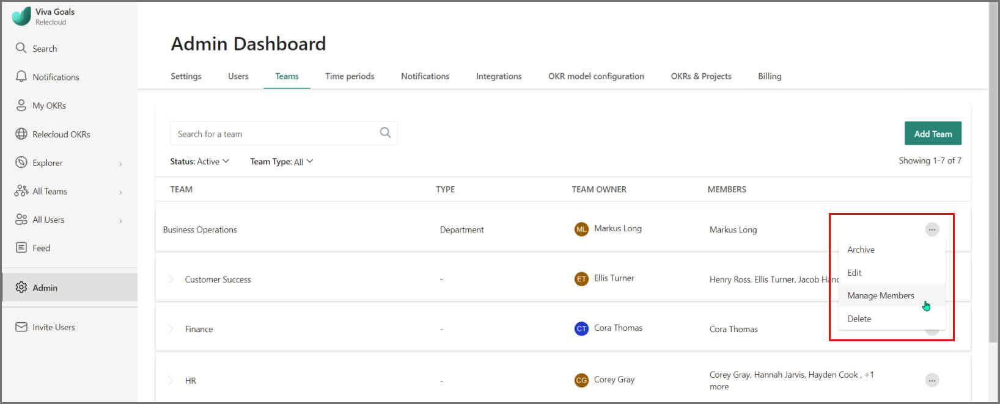
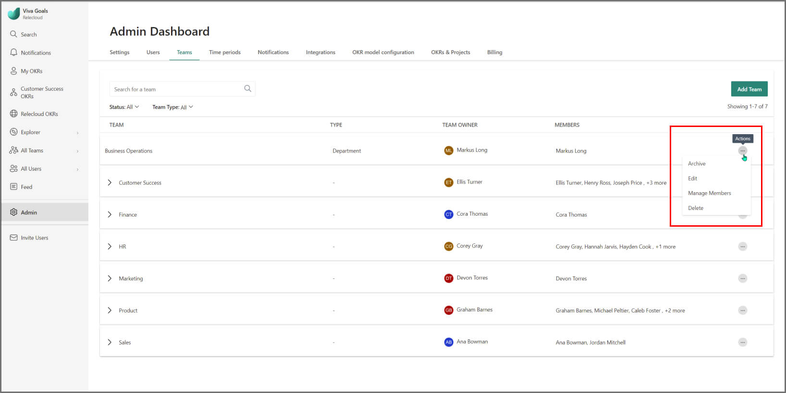
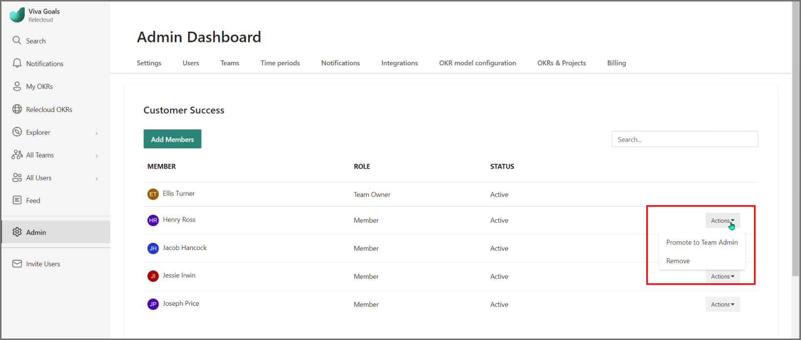
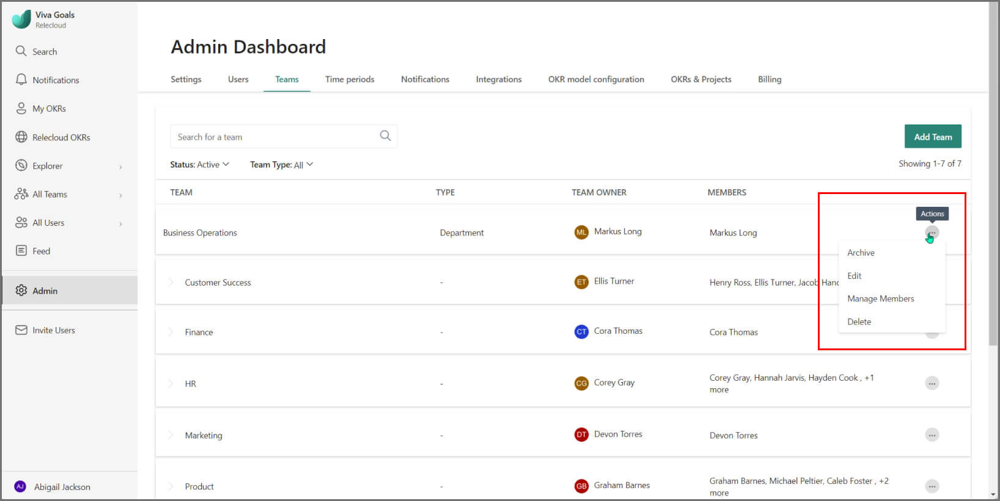
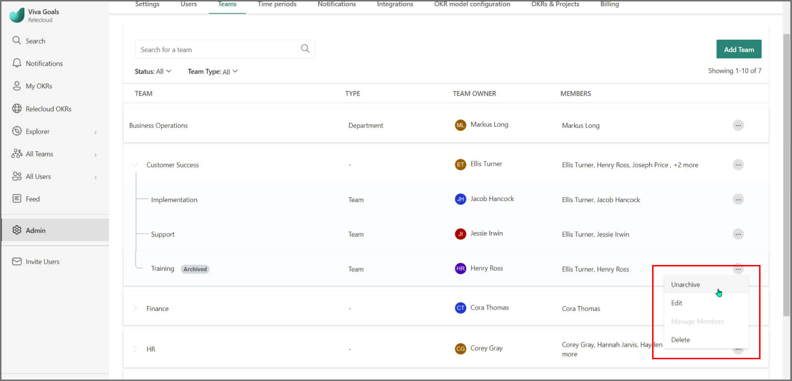

# Create and edit teams 

Viva Goals supports multiple levels of hierarchy, from department level down to individual teams and functional units. To achieve this setup, you can use the teams and subteams functionality.

## How to create teams 

1. To create a team, go to **All Teams** > **Create a new team** or alternatively, **Admin** > **Teams** > **Add Team**.

    
   
1. In the dialog box that follows, follow these steps:

   - Enter a team name.
   - Designate a team owner from the **Team Owner** dropdown list.
   - If this team is a subteam, division, or department, select a primary team.
   - Enter a team type and more details, if necessary.

In this example, we'll set up a sales territory "Central Territory" (from the **Team Name** dropdown list), under the overarching Sales Department (from the **Parent Team: (Optional)** dropdown list).

To view all subteams, go to the **Parent Team** page and select the **Sub-teams** tab. Using subteams, you can easily replicate the structure of your organization and view how each department, division, and team contribute to organization goals.

## How to add members to a team 

Team owners and administrators can set up their team by adding team members.

- To add existing Viva Goals users as team members, follow these steps:

   1. Go to the **Team OKR** page.
   1. Select the **Team Members** tab.
   1. Select the **Add Members** button.
   1. Start typing the name or email of the existing Viva Goals user. Auto-complete will suggest matching users.
   1. Select the name or email of the user, which is returned as a result.

      

   
   1. Select the **Add Members** button. The user is added to the team as a member.

- To add people who aren't currently in Viva Goals, you can use the same dialog box. Make sure that the **Send invitations to users who are not in Viva Goals** checkbox is selected.

  

When you set up a team, it's useful to add a second team administrator to make sure that the team-setup process isn't dependent on one person.

To assign team administrator permissions to a team member, follow these steps:

1. Select the **Team Members** tab. For every user listed, there's an **Actions** dropdown list in the last column.

1. Select the **Actions** dropdown list, and then select **Promote to Team Admin**.

   

## How to promote team owners and administrators

You can promote or remove any team member as a team owner or administrator from the **Admin** menu on the **Admin Dashboard** page.

### How to update team owners

1. To update the team owner, go to the **Teams** section of the **Admin** menu, select **...**, and then select **Edit**.

    

1. From the edit teams dialog, select the **Team Owner** dropdown menu to select and update the team owner.

1. Select **Save**.

### How to update team administrators

1. From the **Teams** section of the **Admin** menu, select **...**, and then select **Manage Members**.

    

1. Select the **Action** dropdown list to the right of the person's name, and you'll be able to edit their member status.

   
 
## How to archive and delete teams

As an Viva goals administrator, we give you support to manage your teams. Sometimes, teams are dissolved or retired due to an organizational change. In that case, you have the following two options in Viva Goals.
- [Delete a team](#how-to-delete-a-team)
- [Archive a team](#how-to-archive-a-team)

### How to delete a team

Deleting a team is permanent. Once the team is deleted, it can't be restored. Delete with caution. 

To delete a team, follow these steps:

1. Select **Admin** > **Teams** tab > **Actions**.
1. Select the **Delete** option corresponding to the team that you want to delete.

Alternately, you can navigate to the team's OKR page and delete the team from the options in the upper-right corner.

> [!NOTE]
> To delete a team from the team's OKR page, you must be an organization administrator or the team owner. Team administrators can't delete a team.

A team can only be deleted if it has no objectives assigned to it. If there are objectives assigned to the team, you can instead archive the team.

### How to archive a team 

We recommend you archive teams that are no longer in service. To archive a team, follow these steps:

1. Select **Admin** > **Teams** tab > **Actions**.
1. Select **Archive** for the team that you want to archive.

Alternately, you can navigate to the team's OKR page, and archive the team from the options in the upper-right corner.

Once a team has been archived, it will be marked as **Archived** on the **Teams** tab in the Admin console. It won't be visible anywhere else. Any objectives that were owned by this team will remain unchanged. But you can't assign new objectives to the team.

Archiving a team isn't permanent. You can restore an archived team. To restore an archived team:

1. Select **Admin** > **Teams** tab > **Actions**.
1. Select **Unarchive** for the team you want to restore.

   
   
### What happens when I archive a team?

Once a team is archived, you can no longer create OKRs and projects under that team, and no users will be a part of the team. Additionally, any subteams become independent teams in Viva Goals. All OKRs that were previously assigned to the archived teams will still be accessible for actions to be performed on them, such as check-ins.

Even though you won't be able to see the archived team under **All Teams** now, you can see the assigned OKRs by expanding the parent OKRs that they're aligned to. You can also view those OKRs/projects in the Explorer by applying the type filter and selecting the archived team name.

Activities related to the archived team are halted, including assigning team members and team-level notifications. To resume these activities, you would unarchive the team. 
