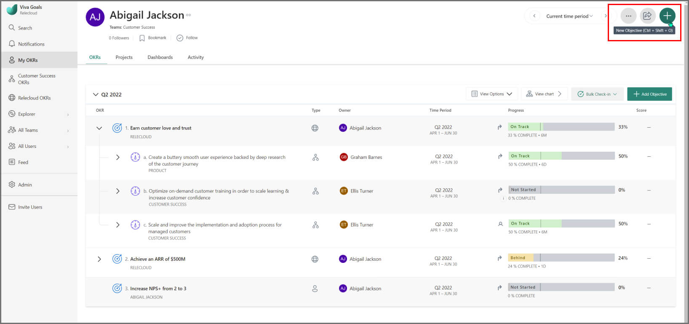
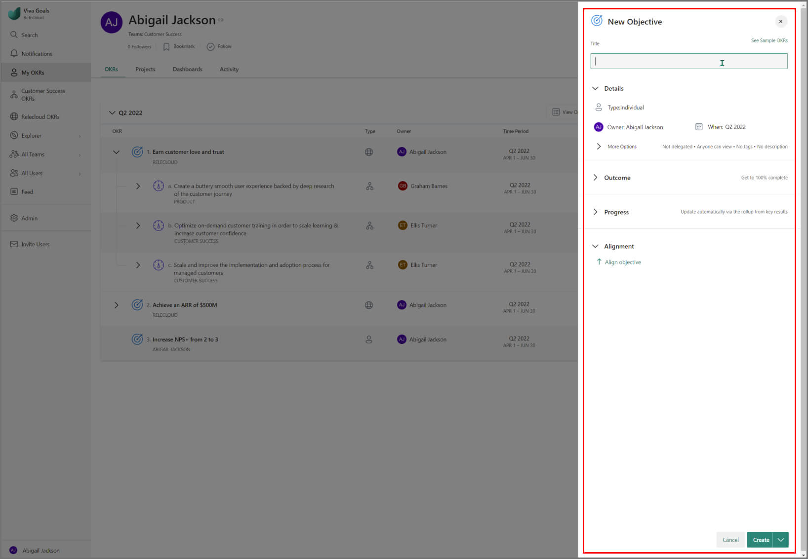
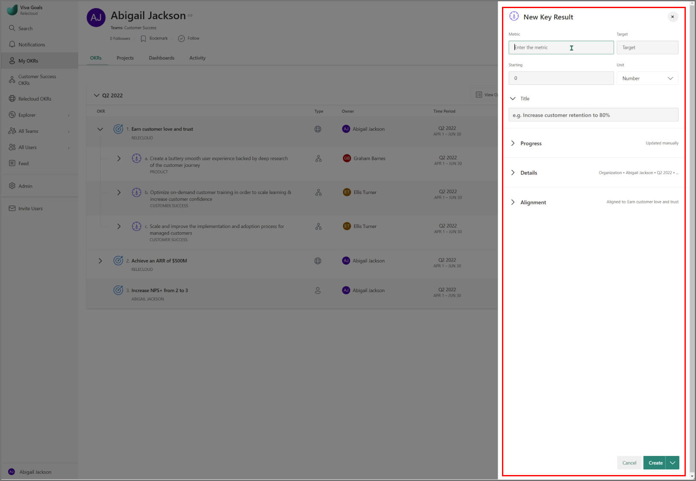
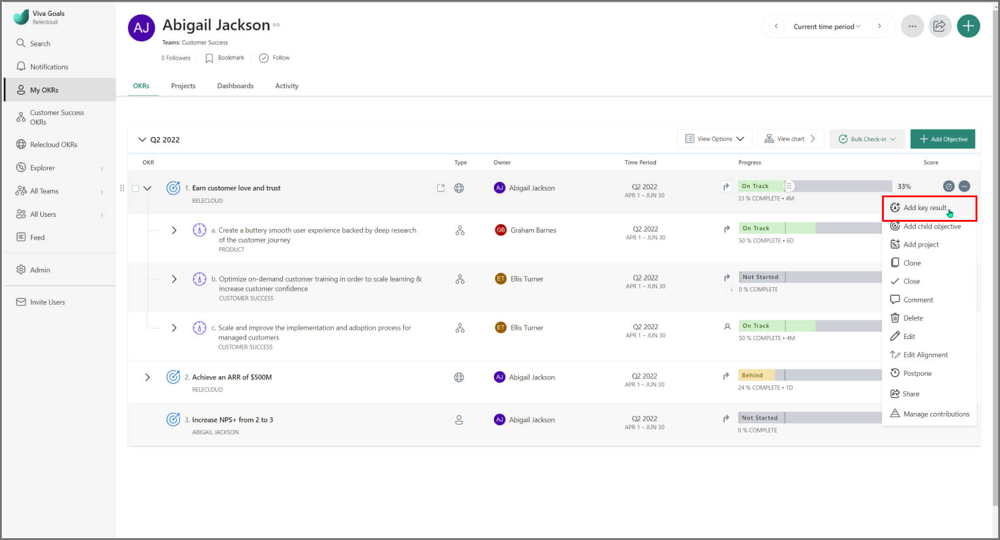
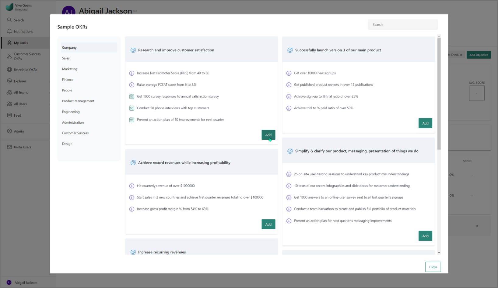
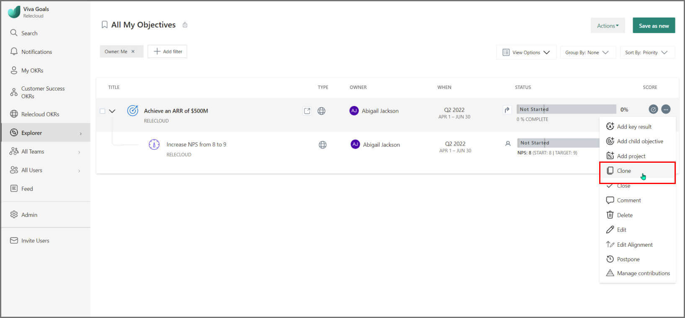
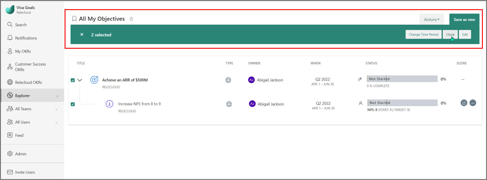
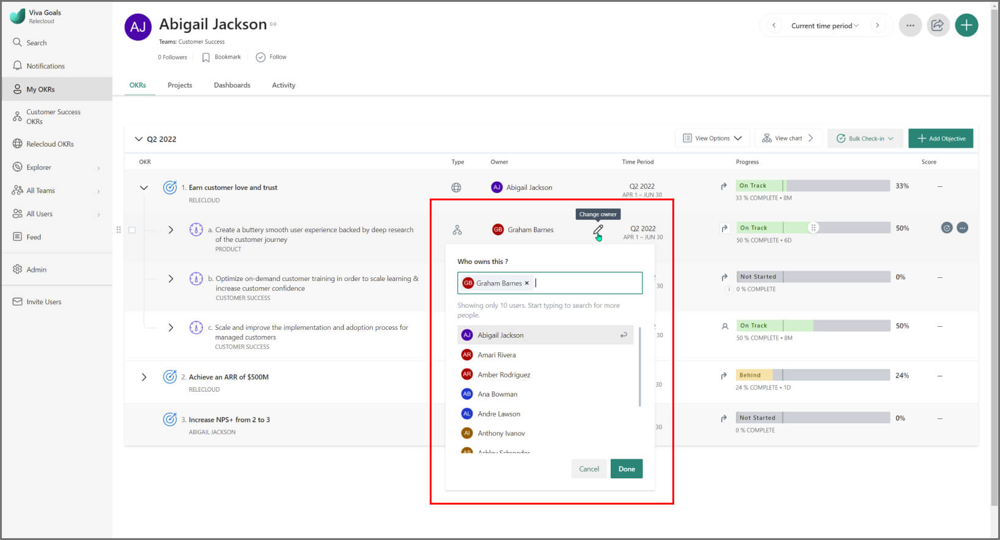
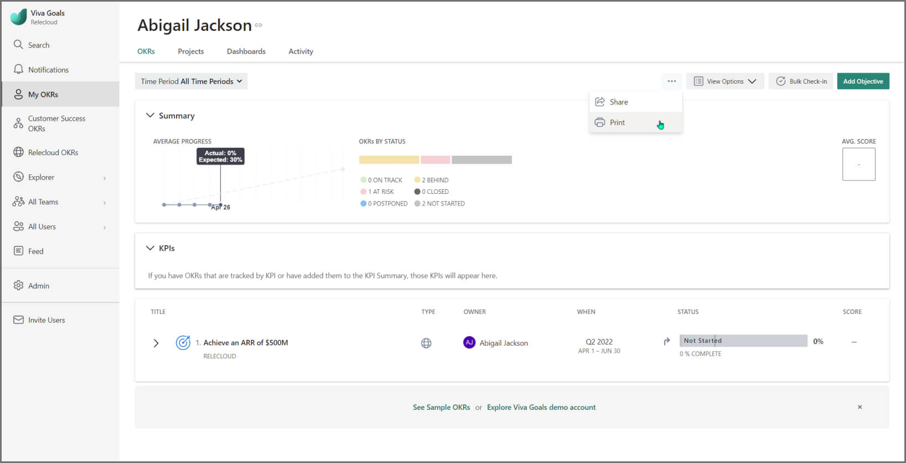

# Create OKRs 

> [!IMPORTANT]
> Viva Goals is currently available only for private preview customers, and only in English. The features described here are subject to change. [Learn more about Viva Goals.](https://go.microsoft.com/fwlink/?linkid=2189933)

## 1. Understand OKR fundamentals 

Using OKRs effectively to achieve results usually takes a few cycles. As you embark on defining OKRs for the new quarter or year, remember: 

- **OKRs should be data-driven, measurable, and committed, but your team should also be able to pivot (meaning delete, add, or modify OKRs) if circumstances change mid-cycle.** This is especially true for your first few OKR cycles as you learn how to set OKRs in your organization. 
- **For improved focus, limit objectives at any levels to at most five.** And no objective should have more than five key results.
- **Most team and individual OKRs will be cascaded from top-level organizational OKRs to ensure company-wide alignment.** But you should also empower team members to define their own OKRs, including key initiatives and projects, based on organizational priorities, and make sure you're including individual team members in the collaborative process of writing team OKRs. 

**Here are three steps to start defining OKRs for your OKR cycle:** 

|Step  |Description  |
|---------|---------|
|Step 1: Leadership drafts organization's OKRs  |   Involve key stakeholders to draft organization-level objectives and key results for the new cycle. Use your organization's mission, annual objectives and previous OKRs for context in drafting company OKRs. Publish OKRs and invite teams and individuals to craft their OKRs based on these top-level OKRs. Ensure everyone understands that you are seeking their input through the OKR process before the top-level OKRs are finalized.      |
|Step 2: Teams and individuals draft their OKRs    |      Teams and individuals should draft their OKRs based on top-level, organizational OKRs. In addition to looking at the top-level OKRs, they should collaborate with peers to identify any assumptions and dependencies, and resolve them.   |
|Step 3: Review process for all OKRs     |    Alignment is crucial to the OKR process. As long as your work lines up across the organizational network - vertically and horizontally, the company can make huge strides during any given time period. That is why it is essential to review OKRs with cross-functional teams. Once reviewed, make adjustments, lock your OKRs and go into execution mode!    |

## 2. Create an objective 

You can create an objective from:

1. The individual, team, and organization pages
1. The list page
1. Template - "Sample OKRs"

**To create an objective, perform the following steps:**

1. Navigate to the individual, team, or organization that the objective is for. Select the **+** button.

2. In the dialog box that pops up, specify the following values:

    1. A short but descriptive name for the objective
    1. Edit the details in the following table, if necessary:
     
       
       |Item  |Description  |
       |---------|---------|
       |Type     |    Specify the type as individual, team, or organization level corresponding to where the objective fits in the organization.    |
       |Owner     |    The user who owns this objective. Every OKR should have a clear owner.     |
       |Time Period     |   The quarter or custom time period this objective belongs to.      |

Viva Goals contextually fills in the following details: 
   
1. Select create when you are done. 

**Note:** The **Key results** dialog box will look a little different if you've chosen to configure your OKRs by selecting the **Objectives are always aspirational, key results are always measurable** option. You'll notice that the **Create Objective** view will just have the **Progress** pane. This is because when you configure your objectives to be aspirational and key results to be measurable, the progress of your objectives will be updated by roll-up from the progress of key results or manually. 

## 3. Create key results

Key results contribute to achieving your objective. If all key results are accomplished, then the objective is achieved, so choose your key results accordingly. Find the objective you just made and select **Add Key Result**. This selection will allow you to edit inline.

You can also hover over it and select **Add key result** from **More options**, which brings up a more detailed dialog box.

The dialog box that opens will look familiar. 

**Note**: The **New key result** dialog box will look a little different if you have chosen to configure your OKRs by **selecting the Objectives are always aspirational, key results are always measurable** option. 

## 4. Jumpstart your OKR process with templates 

Viva Goals makes it easy to jumpstart the OKR process by providing templates for common objectives across different verticals in an organization. To create an objective from a template, select **See Sample OKRs** and choose from our extensive library of presets ranging from sales and marketing objectives to people and product Management.
 

From here, you can tweak the template objectives, or any other objective, to your company’s specifications by using the handy "edit" functions available on the objectives page. You can also hover your cursor over the objective to find the **Edit** option.

## Advanced options for creating OKRs

There are several advanced options you can leverage in creating OKR with Viva Goals. 

### Specify how to track your objective's progress

For example, you can expand the **Progress** section and specify how to track your objective’s progress. You can choose from any of the following options:

- **Measured as a goal towards 100% completion**: Viva Goals will show the progress in terms of percent completed.

- **Add a metric**: This option gives you more control to set a custom KPI. You can define the metric, the target, and the starting point yourself.

### Leverage Viva Goals integrations

Viva Goals allows you to automatically update the progress of your objectives by integrating with tools like Jira, Smartsheet, or VSTS. 

For more information about these integrations, see our detailed articles [here](https://help.ally.io/en/collections/30526-integrations).

### Other advanced options 

All your advanced customization options are available under **More Options**, no matter where you are in Viva Goals.

|Option  |Description  |
|---------|---------|
|Tags and Descriptions     |   Add tags to group similar OKRs together and enter a short description of the objective if necessary. For more information aboout tags, see [here](https://help.ally.io/en/articles/2620794-tags).      |
|Private objectives and key results     |   Control who can see your OKRs. For more information, see [here](https://help.ally.io/en/articles/3152440-private-objectives-key-results).      |
|Objective Delegation   |   Designate another individual to keep this objective up-to-date. For more information, see [here](https://help.ally.io/en/articles/3152131-objective-delegation).      |

## Best practices for creating OKRs 

The process of goal-setting with OKRs is flexible and adjustable along the way. However, a few best practices go a long way in ensuring that teams have a set of unambiguous and focused set of goals to work toward.

- **Start by defining Objectives at the organization level.** These are the top strategic goals that require collaboration and link various departments and teams within the organization.
- **Stick to three to five objectives at every level.** Too many objectives distract us from attaining the ones that matter.
- **Objectives must be actionable, yet aspirational.** They are stretch goals that should make you feel slightly uncomfortable.
- **Every objective should have three to five key results.** Together, key results must help realize the objective.
- **Every key result should be measurable.** This ensures you can see progress, understand what worked and what didn't at the end of your OKR cycle, and use these lessons to drive more growth for your organization. 
-**Alignment is a key aspect of the OKR process.** With Viva Goals, team objectives can be easily aligned to company-level objectives. This is a key value of the OKR process. 

**Note:** Key results of company-level objectives will cascade down to act as objectives at the team level only when you've chosen the option **Objectives and key results can be used interchangeably** in the OKR Model Configuration section in your Admin Dashboard.

Remember that OKRs aren't a to-do list mandated by leadership. The OKRs you create in Viva Goals should be part of a collaborative process between leadership, departments, teams and individuals in deciding where to focus and why, during any given time period. 

## Setting annual objectives

### What are annual Objectives?

Annual objectives are specific, measurable statements of what a business is expected to achieve within an annual period. These objectives are usually one part or phase of the organization’s longer-term goals—for example, the first-year objectives of a three-year growth strategy. This characteristic puts annual objectives in contrast to quarterly objectives which tend to have a narrower focus and shorter-term deliverables.

Many companies following the OKR process find it valuable to set annual objectives to keep their broader vision at the forefront while using quarterly objectives to execute the steps toward that vision. 

### Writing annual objectives

Writing annual objectives should feel different from writing quarterly goals. The larger scope lends itself to broad objectives, for example, "Raise market share by 5%." It's a good practice to set annual objectives at the organization level and use them in combination with quarterly objectives.

**Each annual objective should have 3-5 quarterly key results.** These quarterly key results should be department- or team-level (depending on the size of your company)objectives, maintaining alignment through the casccading hierarchy.

**Team and individual OKRs are best left at a quarterly cadence.** However, team and individual OKRs should be aligned to annual objectives. 

### Implementing annual OKRs in Viva Goals

**1. First, navigate to the appropriate annual time period.** By default, Viva Goals features annual time periods in the format **Jan 1-Dec 31 20XX**, but if your company follows a different cadence, you can set up a custom time period from **Admin > Time Periods**.

**1. Write your organization-level objectives and key results.** Write 3-5 key results per objective. Set the time period of each key result to the relevant quarter. For example, KR1 might belong to Q1 20XX while KRs 2 and 3 belong to Q2, until you have charted the entire progress of key results leading up to the top-level objective. 

**1. Proceed as normal by setting up team and individual-level quarterly OKRs.** As team members make check-ins, Viva Goals will automatically calculate progress toward your annual objectives. Maintain a bird’s-eye view with our dashboards and use views or the objective explorer to drill down and generate reports when necessary. 

**An example**: In the screenshot below, we have the broad organization-level objective ‘Double revenue to $20M’ in the annual 2021 time period. The KRs are set up as follows:

- Q1 2021:  "Increase ARR to $14M". Notice how this is the most ambitious of the key results.
- Q2 2021: "Increase ARR to $17M".
- Q3 2021: "Increase ARR to 19M".
- Q4 2021: Finally, the last KR, "Increase ARR to $20M", which was the annual objective.

This setup breaks down a lofty goal into manageable, actionable pieces. The successful completion of all four key results distributed over the quarters will result in the completion of the overall annual goal.

:::image type="content" source="../media/goals/implementing-annual-okrs.png" alt-text="Implementing annual OKRs":::

 With your new annual objectives, you won't have to choose between the tactical value and focus of quarterly objectives and the strategic value and ambition of annual objectives. 

## Creating committed vs. aspirational OKRs in Viva Goals

The OKR methodology supports two types of goals which are described in the following table 

|Goal Name |Description  |
|---------|---------|
|Committed OKRs     |   These OKRs are the ones that your organization or team has agreed to execute. These OKRs have a clear action plan on how they would be achieved.      |
|Aspirational OKRs     |    These OKRs are more visionary. These OKRs are stretch goals, and teams are not likely to fully achieve them.    |

Within Viva Goals, users can now switch between aspirational and committed OKRs, though OKRs created by default remain aspirational. Committed goals have the tag ‘committed’ which differentiates them from aspirational goals.

**For committed objectives...** 100% completion ensures a score of 1 and the range is marked in "green", indicating that the user has completed the target which they have committed to achieve.

**For aspirational objectives...** If a team attains 100% of the target and thus closes an objective with a score of 1, the goal isn’t ambitious enough and is marked orange. An ideal aspirational OKR or a stretch goal should be challenging but attainable, and a score of 0.7-0.9 is recommended.

## Customizing your scoring system in Viva Goals

Viva Goals has an administrator setting in which the organization administrator can override the default ranges for the color schemes we have provided to signify OKR progress. Here, the administrator can configure the scoring ranges against which the color schemes will be mapped.

## Copying or duplicating objectives 

### How to copy or duplicate a single objective 

To copy or duplicate a single objective, perform the following steps:

1. Hover over the objective and select **Clone** from the dropdown on the far right. You can also copy from the objective page by selecting **Actions > Clone**. A dialogue box is displayed.
1. Edit the time period, owner, and the option to copy the objective and key results, or simply the objective.

By default, the cloned objective with all its key results will appear in the same time period as the original. The progress will not be copied over. 

### How to copy or duplicate multiple objectives

To copy or duplicate multiple objectives, perform the following steps:

1. From your dashboard, select the objectives you wish to copy by selecting the checkboxes to the left of the objectives. Only open objectives can be cloned in bulk; objectives that have already been closed must be cloned on an individual basis.

1. Select the **Clone** button in the message bar that appears above the list of objectives. You can then select the options from the dialogue box.

## Changing the OKR owner 

The owner of an OKR can be changed from the OKR list view, quick view, or the full view page. Select the **Owner** field to assign the OKR to a new owner.

- If you would like more than a single person to own an OKR, you can assign [multiple owners](https://help.ally.io/en/articles/4601340-shared-okrs-projects-multiple-teams-owners).
- If there is just one owner or multiple owners assigned to an OKR and you want a user within the organization to check-in and update the progress of the OKR, you can use the "check-in responsibility" feature. The "check-in" owner can check in manually or set up an integration to automate this process.
- With Viva Goals' **Delegation** option, you can assign another individual to check in on OKRs that are not owned by them. A delegate gets permissions to edit all aspects of an OKR and also work on behalf of the OKR owner on a specific objective. They'd not be able to change ownership though.

## Editing or deleting OKRs 

If you need to change an OKR or remove one made in error, find those options in the menu dropdown in the top-right corner of your screen. Select **Edit** or **Delete** to make the necessary changes.

**Note:** An objective cannot be edited or deleted if it is **Postponed** or **Closed**. In those cases, the objective would need to be reopened in order to edit or delete.

## Printing an OKR 

On the desired OKR page, expand the **ellipsis** (3 dots) icon and select **Print OKRs**. Viva Goals also gives you the ability to export a .csv file from the Explorer.

**Note:** You won't see the **Print** option when multiple time periods are selected.
