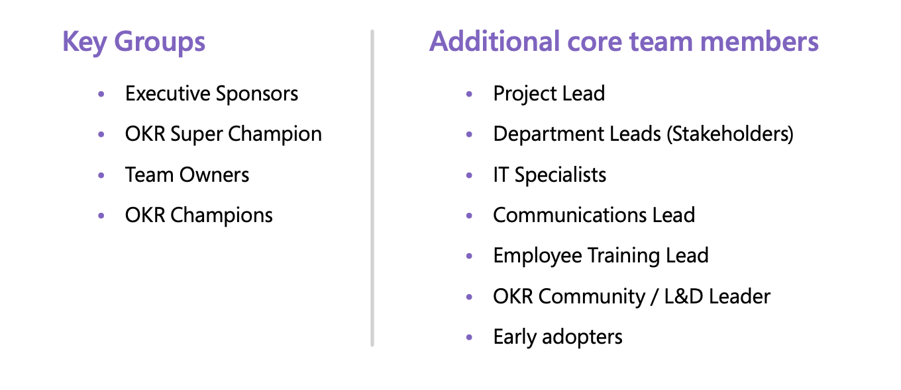
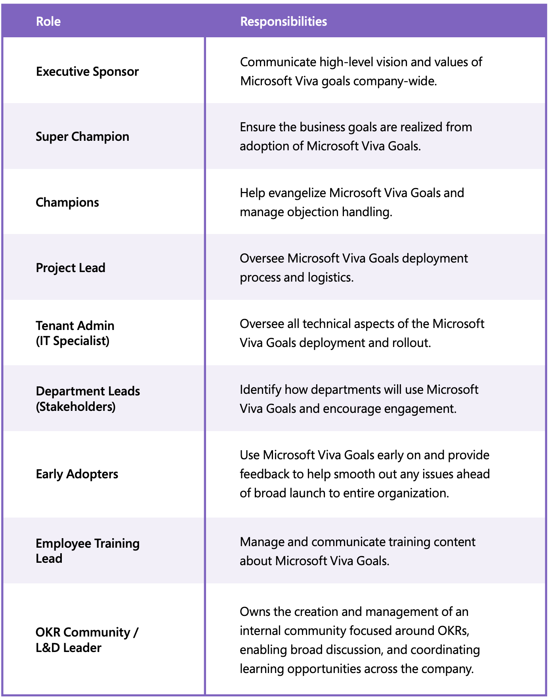

# Define your team

> [!IMPORTANT]
> Viva Goals is currently available only for private preview customers, and only in English. The features described here are subject to change. [Learn more about Viva Goals.](https://go.microsoft.com/fwlink/?linkid=2189933)

## Key OKR stakeholders and their functions

Adopting new technology and methodology requires buy-in and support from across the business. 

Below are key groups and team members who can help bridge the technology and business outcomes that matter to your organization. Each group or member has a specific role in implementation and adoption and should be engaged early and often. 

Here are the responsibilities for each role. 

