# Explorer

The Explorer can generate preset views and create custom views. Use the Explorer to filter out Objectives and Key Results (OKRs) and projects of interest, and save commonly viewed filters to quickly access them again in the future.

## Default views in Explorer

The Explorer’s default views are designed to provide a strategic glimpse into your organization’s OKRs, projects and their respective progress. You can choose from one of these handy preset views:

| View  | What it shows |
|---------|---------|
| All Objectives | All company objectives in one place |
| All My Objectives | All your objectives in one place |
| Overdue OKRs | OKRs that are past their due date. They need not be at risk or behind to be past their due date. |
| Not updated in the last seven days | OKRs that haven't had a check-in for the last seven days or longer. |
| OKRs that haven't had a check-in for the last seven days or longer. | OKRs marked with status **at risk** or **behind** |
| Recently completed OKRs | OKRs that have been closed within the last seven days |
| Unaligned OKRs | OKRs that aren't aligned to a parent objective |

## How to create custom views in Explorer 

Viva Goals allows you to create custom views and save the filters you use often.

1. To get started, select **Explorer** from the side navigation bar and select **Create a new view**.

2. Your new view can now be customized by adding filters.

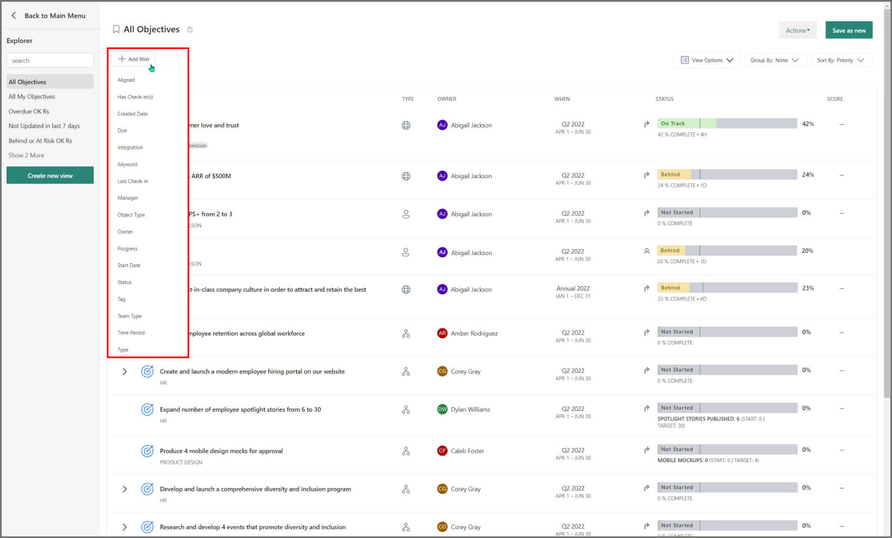

The following filters are available:

| Available Filters | Filters By |
|---------|---------|
| Aligned | Aligned to any or a specific objective. This filter can also pull out unaligned objectives. |
| Check-in Date | Check in date of the OKR/Project. Filters by the exact check-in date, after or before a specific date, more or less than x number of days. |
| Created Date | Created-in date of the OKR/Project. Filters by the exact created date, after or before a specific date, more or less than x number of days. |
| Due | Due date of the OKR/Project. Find overdue OKRs/projects or view all OKRs/projects due within a particular time. Filters by overdue, after or before a specific date, more or less than x number of days. |
| Integration | The integration connected with the OKR/Project. |
| Keyword | Keywords in the Objective/Project's title. Filter based on the product name, campaign name or other keywords unique to your organization. |
| Last Updated | Time at which the OKR/Project received an update. Find OKRs/projects that are falling behind on check-ins, or get a snapshot of activity during a specific timeframe. |
| Time period | The time period the OKR/Project belongs to |
| Manager | Manager of the OKR/Project owner. |
| Object Type | Filters by Objective or Key Result or Project. |
| Owner | Owner of the OKR/Project. This filter can also locate unassigned OKRs/projects. |
| Progress | Percentage completion. This filter is specifically handy in combination with the due date filter. |
| Start Date | The start date of the OKR/Project. |
| Status | Objective/Project's current status. Select from Not Started, On Track, Behind, At Risk, Closed, Postponed, Reopened. |
| Tag |  Search by tags added while creating OKRs/Projects. |
| Team Type | The Team Type of the OKR/Project. Team Type is described by creating teams in the admin dashboard. |
| Time Period | The time period the OKR/Project belongs to. |
| Type | Organization-level, team-level, or individual-level OKRs/Projects |

Filters are better together. Create meaningful and relevant views by combining several filters at once. Here’s an example view using a combination of the time period, type, and created date filters:

By default, Views list out objectives, key results and projects. To view only top-level objectives, check the box in the upper right-hand corner.

## How to save and export

Save and Export views for future reference or to share insight with your team. To save a view, select the **Save View** button in the upper right-hand corner. You'll be prompted to name the view and select a sharing option.

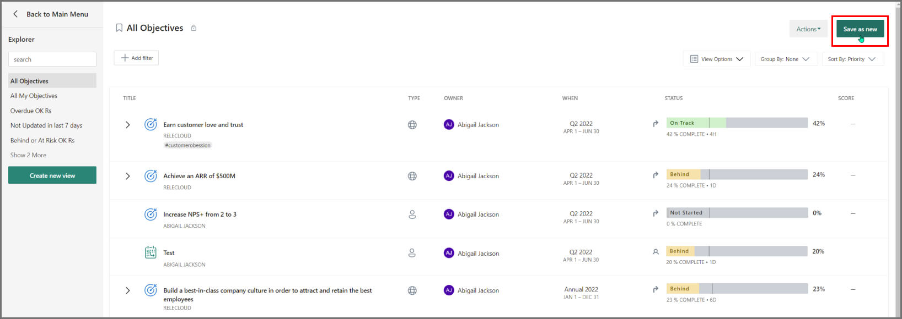

If you would prefer not to share the view with your team, you can change the security setting to **Only Me**. Hit save to save your view.

You should now be able to find the saved view in your explorer. If you made it available to everyone, they'll be able to find it here too.

If you’d rather Export the view, go to **Actions -> Export** from the top right. The Export file will be emailed to your account. You can also remove the view from the **Actions** if you’ve saved it and are now done using it.

We have included additional settings to the **Export** feature:

- You can select the format of the export - CSV or XLSX.

- You can select the exact fields needed in the export file

- You can also include Key Results/Projects along with the Objectives exported. In this case, first level of key results/children will be exported along with each objective.

- You can choose to export tags in separate columns in the file.

Any changes to these additional settings will be preserved for every user for subsequent exports.

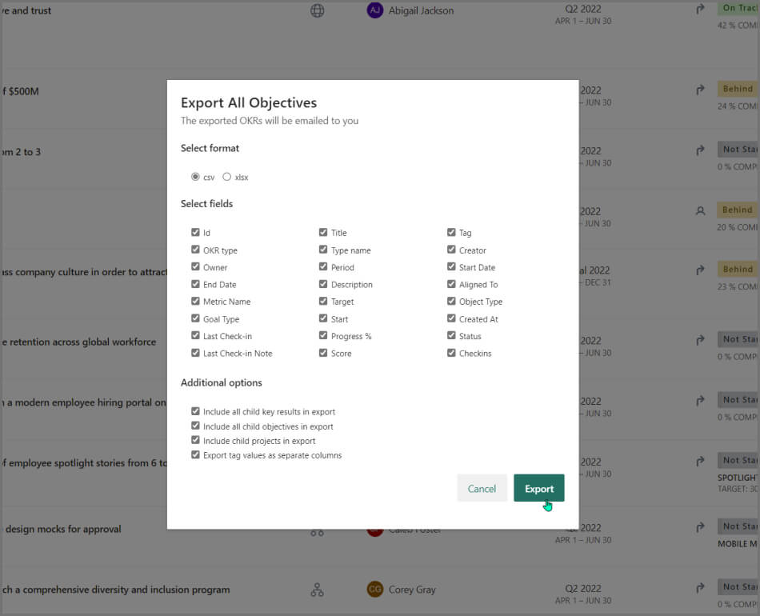

## How to rename a view

Users have the ability to rename a view once it has been saved. Select **Actions -> Rename View** to make edits to the Saved View Name.

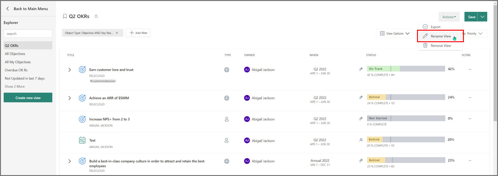

## How to use an existing view to create a similar view

Viva Goals gives you the ability to edit a saved view and save it as a new view with changes.

To do this, open a saved view, make all appropriate changes to filters and select the dropdown on the right of **Save**. You'll be prompted with an option to update the current view or save it as a new view.

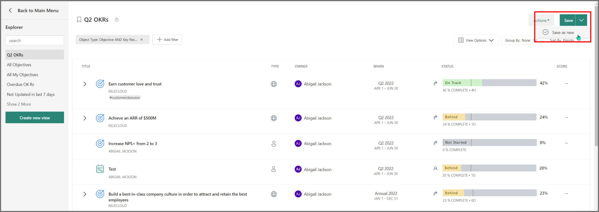

Example: I want to create specific views for each of my employees or teams. I've created a view for John with the appropriate filters set and have saved it. I then would edit the filter for **Owner** from John to Jordan and save it as a new view.

The explorer makes navigating and forming and sharing insights a breeze. Go on and get exploring!
    
## How to sort your OKRs in Explorer
    
You can sort your Objectives and Key Results (OKRs) in order of your priority in Explorer.

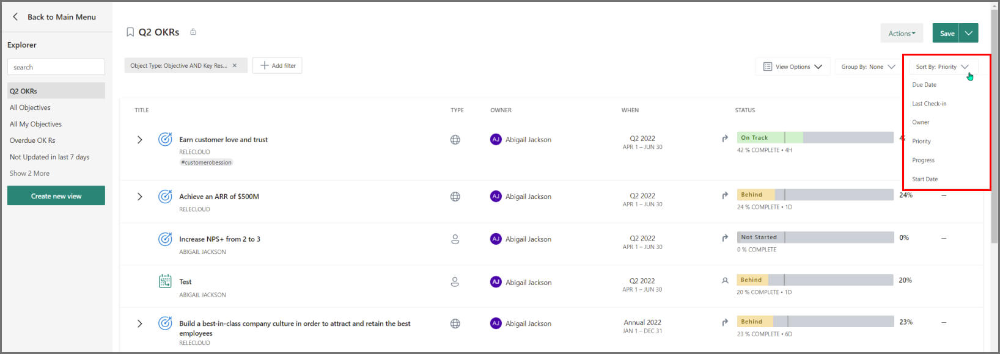

This refers to the order in which the OKRs are arranged i.e. their order in the Entity (Organization/Team/Individual) OKR view. For example: If you have OKRs arranged in a certain manner on your page and want to see the same priority order in Explorer, you can use this option.  

## Frequently asked questions 

**1. How do I view all OKRs in Explorer?**

Navigate to the Explorer and select the **All Objectives** preset view.

**2. How do I view all projects?**

Navigate to the Explorer and apply the filter for **Object Type** as **Project** to view all projects.

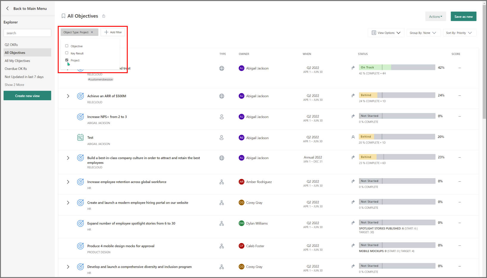

**3. How do I export my data?**

Use filters to pull up the data you want, then go to **Actions -> Export**. You will receive an email with a link to download your OKRs and projects as a csv/excel file. Remember to uncheck **Show only top-level objectives** if you need the KRs too.

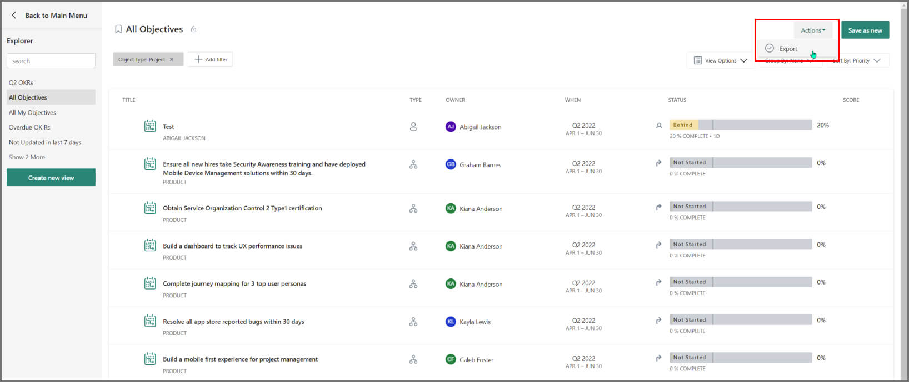

**4. How do I save a view?**

To save a view for easy access, select **Save view** in the upper right. Give it a name and select a visibility option. Once saved, you can quickly access this view again from the Explorer menu.

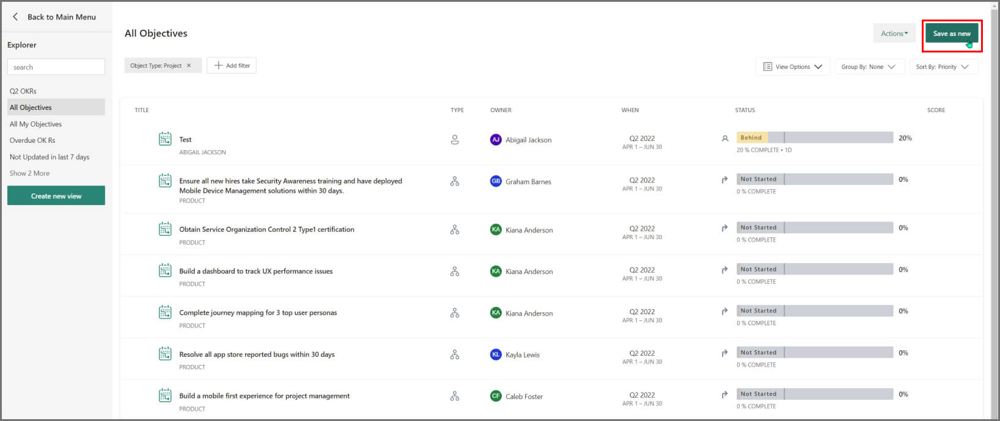

**5. How do I delete a view?**

To delete a saved view go to **Actions -> Remove view**.

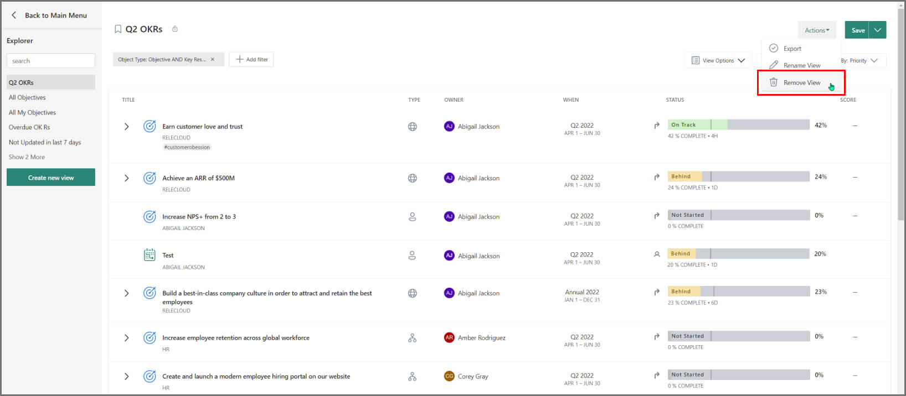

**6. Who can access my view?**

That depends on the availability configuration you chose when saving the view. There are two options:

- Private: Only you can access the view
- Public: Everyone in the organization can access the view

To change this setting, select **Save view**, then change the availability setting and save it again.

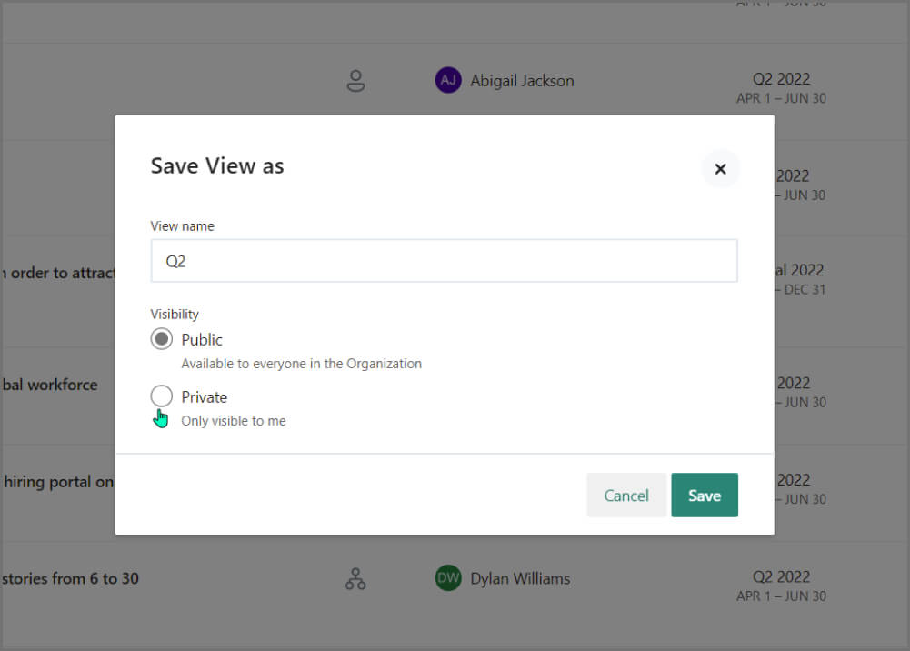

**7. What does exporting tags as a separate field mean?**

If an objective, key result or project has more than one tag, then the field can be exported as separate columns instead of comma-separated values in the CSV/Excel file.

**8. How do I export my OKRs and projects?**

You can use Explorer to export OKRs and projects. Navigate to the Explorer from the main menu. You may use the **All objectives** view if you would like to export all your OKRs or apply any desired filters, like time period or owner.

> [!NOTE]
> By default, the explorer only displays top-level objectives. If you need the KRs/projects, you can either use the flat-list view or choose to include the child key results/child projects while exporting.

**Flat-list view:**

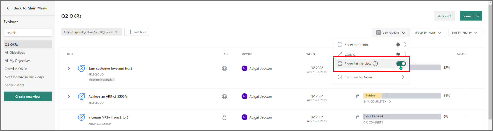

Once your view is tweaked to your requirements, go to **Actions -> Export** to export it. You'll receive an email with your download shortly. To learn more about the explorer, see [Explorer](https://help.ally.io/en/articles/5845706-explorer).

**9. How do I filter OKRs by team in Explorer?**

You can use the **Type** filter to refine the OKRs by teams or individuals.

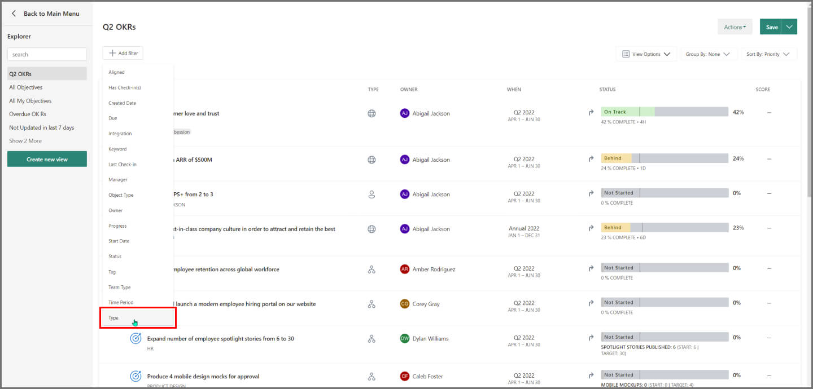

Apply the changes and save the view for future reference.
