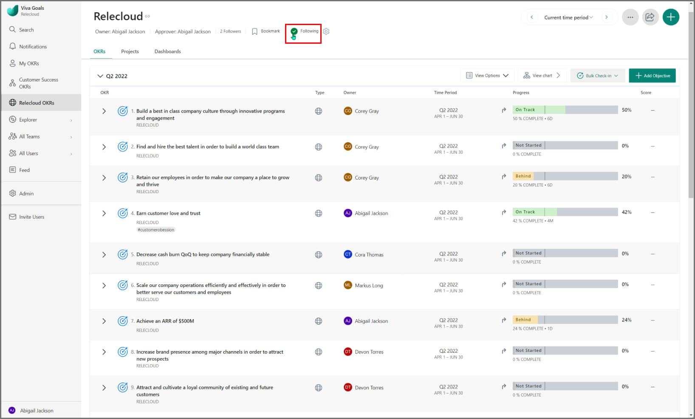
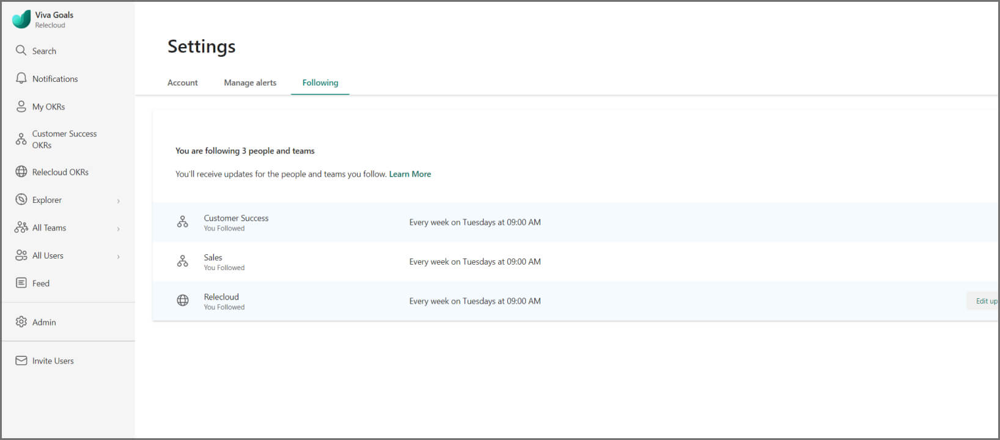

# Follow organizations, teams, and users 

> [!IMPORTANT]
> Viva Goals is currently available only for private preview customers, and only in English. The features described here are subject to change. Viva Goals is only being released to WW tenants. It isn't being released to GCC, GCC High, or DoD environments. [Learn more about Viva Goals.](https://go.microsoft.com/fwlink/?linkid=2189933)

To help you keep track of OKRs that are relevant to you, Viva Goals provides a two-step process that delivers this information right to your inbox.

## Step 1: Follow

To follow organizations, teams, and users that are important to you, select the **Follow** icon on one of these entities.

For example, you can follow East Coast Sales to receive updates from that team. The icon will turn green to indicate you're **Following** it.

By default, Viva Goals will have you follow:

- The organization

- Teams you're part of

- Teams you own

- Parent teams of your teams

- Teams owned by your reporters

## Step 2: Get updates

Once you're following one or more organizations, teams, or users, Viva Goals automatically emails you a weekly progress update showing Objective activity, what's going well, and what's not going well.

To view or unfollow an organizations, team, or user:

1. Select your user name.

2. Select **Edit settings**.

3. Select the **Following**.

4. Select the **Unfollow** button. You can then adjust which organizations, teams, and users you receive get updates about.
