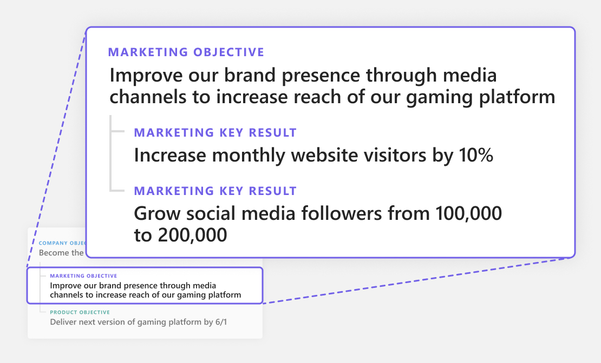

# Get to know OKRs

## What are OKRs?

Objectives and key results (OKRs) are a proven goal-setting framework for creating alignment and focus and building a highly productive and engaged work culture to drive your business outcomes.  

OKRs align your entire organization to strategy, shifting focus from output—the everyday work of your team—to outcomes, which are the results of that work. This mindset shift keeps your team highly engaged with a clear sense of purpose and understanding of how everyone is contributing to forward momentum.

**Objectives** are simply what you and your team want to accomplish. What is your definition of success?

Objectives added at the organizational and team levels are depicted in the following image:

:::image type="content" source="../media/goals/1/11/a.jpg" alt-text="Chart shows a sample of O K R objectives at organizational and teams levels.":::

**Key results** describe how you'll measure your success in accomplishing these goals.

For best results, teams and individuals should be aligned well in a hierarchy. Key results at one level become objectives of the next level.

**Projects** are focused efforts that help you achieve your key results. 

When delineating projects in Viva Goals...

**Stay realistically optimistic.** Make sure you have the ability (resources and timeline) to execute the projects and key initiatives under your OKRs. That's what makes an objective realistically optimistic and not a pipe dream.  

**Ask yourself:** What could get in the way of our projects and key initiatives?  

Incorporating projects in your OKR program ensures alignment between company-wide OKRs and the work prioritized by every department in your organization.

**Check-ins** are updates you make to share progress on your OKRs. When you update progress on a key result, it automatically updates the status of the parent objectives as appropriate.

The keys to success with OKRs are transparency and alignment. Right from the CEO to managers and colleagues, an employee can view anyone's OKRs in the system. This transparency fosters openness and removes conflicts and redundancies with work. OKRs are also aligned vertically and horizontally, allowing employees to see how their work connects with the organization's overall strategic goals.

## What are the benefits of OKRs?

Massive global enterprise companies have adopted OKRs, and so have 10-20 person companies. OKRs give companies of any size a strategic advantage for many reasons. They can be adopted by individuals in any role.

**OKRs shift focus from output to impact:** By starting with OKRs at the center of business planning, the focus inherently shifts from the outputs your team delivers to the impact they make on the business. In addition to reducing burnout from a lack of clarity around the purpose of that work, this shift in focus helps move the business forward more effectively.

**OKRs create cross-functional cooperation to unify direction and improve collaboration.** When each individual, team, and department goal are aligned to the company’s broader strategy, teams  have a lens through which their work, and the impact it’s intended to have, is prioritized.  

**OKRs help organizations navigate rapid change and reduce risk.** This has been a key benefit of OKRs as companies square off against the pressures of COVID-19. The OKR framework gives a level of visibility into where efforts are focused. It helps leaders proactively manage risk, identifying themes and changes in diverse data sets that might have gone unnoticed without a unifying system. This framework, in turn, helps companies shift focus from activity and output to outcomes, making the right changes at the right time to stay competitive.

**OKRs create clarity that is documented, measurable, and owned.** The OKR framework provides accountability that's tracked and measured in the OKR software or document that a company uses to manage the process. This accountability works two ways: with each individual responsible for their OKRs and company leadership responsible for enabling their pursuit.

**OKRs inspire stretch and foster involvement**. When done well and made the driving force in the company’s strategic rhythm, OKRs can keep every  employee connected to the broader mission and make sure they’re invested in their own contribution to it.  

**OKRs offer clear, contextual communication with continual progress reviews.** The OKR framework doesn't stop when your goals are written. It's designed to create a business rhythm around the most important outcomes that your company is pursuing. It should influence every interaction and drive a review process that pushes for continuous improvement.

## What are the benefits of OKRs for executives, team owners and managers, and individual contributors?

OKRs drive alignment, agility, and impact in your organization. Here are the most impactful benefits of adopting OKRs for executives, team owners, and individual contributors.

**Executives want to establish a high-performing team with a growth mindset that consistently drives stronger business results. OKRs provide these benefits to executives:**

- Full visibility into progress of business initiatives across all levels of the organization 
- Stronger collaboration between departments and teams 
- High-performing, empowered, and engaged employees 
- Clear connection between daily work and overarching organizational goals 
- More autonomous, focused teams 

**Team owners, or anyone in a position where they need to make decisions on behalf of a larger group, will have similar benefits to executives. Here are a few of the greatest benefits team owners and managers will experience when adopting OKRs:**

- Priorities are more focused, so team members are more autonomous
- More efficient team meetings with actionable outcomes
- Full transparency and increased collaboration with cross-functional partners
- Clear alignment between daily work and larger business initiatives
- Defined accountability and clear ownership of OKRs
- Improved ability to allocate resources effectively

**For individual contributors, the benefits of OKRs are strongly related to engagement and purpose. Here are the major benefits of OKRs for individual contributors:**  

- Priorities are more focused, so team members have clarity into what they should be doing and why
- Visibility into top priorities for the entire organization, their own team, and cross-functional teams
- Ability to better prioritize work, so less time is wasted on non-business-critical initiatives
- Improved autonomy and ownership of their piece of the business  
- Greater alignment to every team member

## What are the OKR superpowers?

OKRs provide a framework to allow large and small companies set goals, stay agile, and ensure employees are on board with the latest strategy through the five superpowers that are described in the following table.

|Superpower name  |Description  |
|---------|---------|
|Focus     |    OKRs require the selection of just 3-5 goals per quarter, pushing organizations to focus on only the work that matters and to make hard choices to eliminate tasks that *don't* matter.     |
|Alignment     |   OKRs help align company goals from top to bottom so that everyone is rowing in the same direction.       |
|Tracking     |   OKRs are data-driven. Today's most successful companies use data to inform action and guide strategic decisions.      |
|Transparency     |   A core tenant of OKRs is that employees can view goals and progress at every level, from CEO to individual contributor, fostering accountability and collaboration.      |
|Stretch   |    When employees are encouraged to set,  stretch goals to achieve what might not seem possible and are supported by a growth-mindset culture, learning and innovation accelerate.     |

## How can I ensure OKR program success at my company?

You can ensure OKR program success at your company by following the recommended strategies in the [Viva Goals Adoption Guide](https://go.microsoft.com/fwlink/?linkid=2193441). At a high level, OKR success requires the following three components.

|Core component  |Description  |
|---------|---------|
|OKR champions     |      OKR champions take initial ownership of OKR implementation internally and ensure its success on a continual and consistent basis. Typical OKR champions hold the roles of chief of staff, operations lead, and team manager, but anyone can be an OKR champion. Enterprise organizations typically need several OKR champions for a successful rollout.   |
|Leadership support     |    The most successful OKR programs have full support from the leadership team and strong executive sponsors. It's critical that senior leaders educate their respective organizations on the value of OKRs, explain why they're being implemented, reflect on their current culture, and identify key stakeholders.     |
|The right tools     |     OKRs are the best way to set goals, and Viva Goals is the best tool to manage your OKRs. Unlike spreadsheets or manual processes that become unwieldy, Viva Goals scales with your business and provides transparency across your organization.    |
