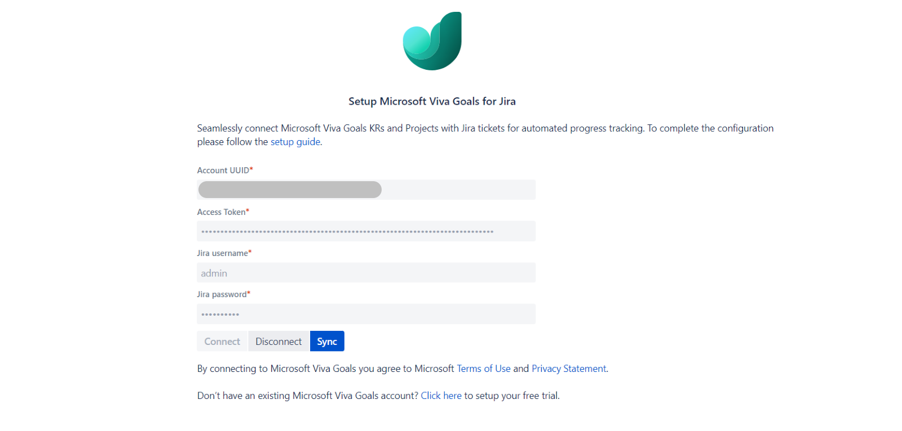

# Jira Server and Data Center integration for Viva Goals

Jira Server and Jira Data Center enable automatic tracking of key result and initiative progress in Viva Goals from Jira user stories and epics. Any updates on linked Jira user stories, epics, or projects will automatically update the progress of linked Viva Goals key results and initiatives. This ensures that your OKR process isn't waiting on manual check-ins and any progress is updated in real time on Viva Goals.

**Note:** A tenant administrator must enable both Jira and Jira Server integration from [Viva Goals tenant settings](vg-integrations-administration-overview.md) before it will be visible on the Viva Goals integration section for your Viva Goals organization.

:::image type="content" source="../media/goals/jira-enable.png" alt-text="Enable Jira from the Viva Goals tenant settings page" lightbox="../media/goals/jira-enable.png":::

## Configure a Jira Server or Data Center connection

1. In the left-hand navigation in Viva Goals, select **Admin** > **Integrations**.

1. On the Integrations page, go to Jira and select **Enable**. Once Jira has been enabled, or if it is already enabled, select **Manage**.

1. Select **New Connection** and add the following details in the pop-up dialog:

    - **Connection name:** Give your connection a name.

    - **Server:** Add your Jira Server URL.

    - **How is this Jira instance hosted?:** Select the **Jira Server** option.

    :::image type="content" source="../media/goals/jira-integration/jira-server-with-details.png" alt-text="Screenshot of how to fill in the settings for a Jira server integration." lightbox="../media/goals/jira-integration/jira-server-with-details.png":::

1. Save the connection by selecting **Next**.
    :::image type="content" source="../media/goals/jira-integration/connection-added.png" alt-text="Screenshot of a successfully connected Jira integration." lightbox="../media/goals/jira-integration/connection-added.png":::

1. Open the connection by selecting **Edit**.
    :::image type="content" source="../media/goals/jira-integration/edit-connection.png" alt-text="Screenshot of how to edit a Jira integration once created." lightbox="../media/goals/jira-integration/edit-connection.png":::

1. Switch to Jira Server or Data Center to [install and configure Microsoft Viva Goals for Jira](#install-and-set-up-microsoft-viva-goals-for-jira-from-the-atlassian-marketplace).

    > [!NOTE]
    > You'll need to use the **Account UUID** and **Access token** in the Jira configuration after you install the **Microsoft Viva Goals for Jira** app from the Atlassian Marketplace.

## Install and set up Microsoft Viva Goals for Jira from the Atlassian Marketplace

1. As a Jira Server or Data Center administrator, search for the **Microsoft Viva Goals for Jira** app from the **Find new Apps** page in Jira.

1. Select **Install** next to Microsoft Viva Goals for Jira and follow the steps in the "confirm app installation" popup.

1. Once the installation is finished, select **Get Started**.

1. Enter the Account UUID and Access Token copied from Viva Goals, as well as the Jira service account details, then select **Connect**. The Jira service account is required so that the Microsoft Viva Goals for Jira app can access Jira project details on behalf of Viva Goals. Add these two pieces of information for the service account:

    - **Jira username:** The service account's Jira username.

    - **Jira password:** The respective Jira password.

    :::image type="content" source="../media/goals/jira-integration/jira-app-filled-details.png" alt-text="Screenshot of the Jira app filled out." lightbox="../media/goals/jira-integration/jira-app-filled-details.png":::

    :::image type="content" source="../media/goals/jira-integration/connected.png" alt-text="Screenshot of the Jira app successfully connected." lightbox="../media/goals/jira-integration/connected.png":::

   > [!IMPORTANT]
   > The Jira service account user should have access to the Jira projects you want to connect with Viva Goals so that the Microsoft Viva Goals for Jira app has access to the Jira Server or Data Center project details. The JQL entered during integration setup will consider this service user account for execution.

1. Switch back to Viva Goals and confirm the connection setup was successful by checking for a **Verified** on the connection's popup.
    :::image type="content" source="../media/goals/jira-integration/verfied.png" alt-text="Screenshot of a verified Jira to Viva Goals integration." lightbox="../media/goals/jira-integration/verfied.png":::

## Use the Jira integration

For information on how to connect a Jira integration to a goal, see [Jira integration](jira-integration.md).

## Manually sync the progress of all goals integrated with a specific Jira server

To manually sync the progress of all the goals integrated with a specific Jira server:

1. Go to your Jira Server app.

1. Navigate to the Viva Goals app in that server.

1. Select **Sync**.

## Current limitations of Jira Server and Data Center integration

- Progress is not synced immediately, but the first sync will happen automatically within 10 minutes of connecting Jira with a specific goal. However, you can manually refresh to pull in all the updates by selecting the **Sync** button in your Jira Server app.

- Jira Server and Data Center integration supports progress computation based on ticket count and story points.

- A Jira Server instance can only be connected to one Viva Goals organization at a time. If you need to connect the same Jira Server instance to another Viva Goals organization, you'll need to disconnect the instance from the current Viva Goals organization first.

You can find more about the latest Jira Server version updates [here](https://www.atlassian.com/migration/assess/journey-to-cloud).

## Frequently asked questions

### What should I do if I'm getting an invalid credentials error despite using the correct credentials?

Check your service account permissions.

1. Sign in as the service account user on Jira and ensure the Jira project(s) you want to query are accessible.

1. Check the permissions by invoking the following query from one (or all) of the Jira nodes. Note that the command below is a sample curl command: use the real credentials of the service account or appropriate user. Also replace `https://test.com/rest/api/2/search?jql=project=ATP` with the Jira server's URL and the project's JQL.

    `curl -u username:password -X GET -H "Content-Type: application/json" https://test.com/rest/api/2/search?jql=project=ATP`

> [!IMPORTANT]
> We recommend enabling verbose logging for the Microsoft Viva Goals plugin by following the steps below:
> 1. On the Jira Server, navigate to **Administration > System**.
> 1. Select **Logging and profiling**.
> 1. Scroll down to the **Default loggers** section.
> 1. Select **Configure logging level for another package**.
> 1. Enter "io.ally" as the package name and TRACE as the logging level.
> 1. Restart the Jira nodes.
> 1. Grep the logs using the following string: `tail –f log/atlassian-jira.log | grep "io\.ally"`
