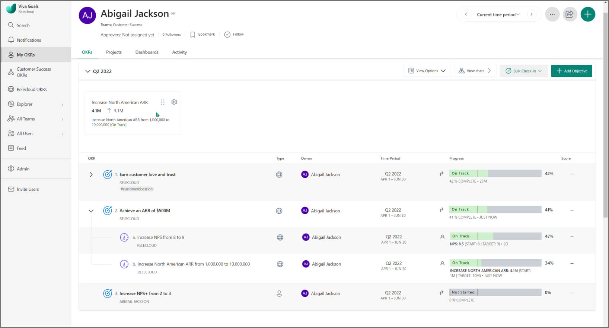
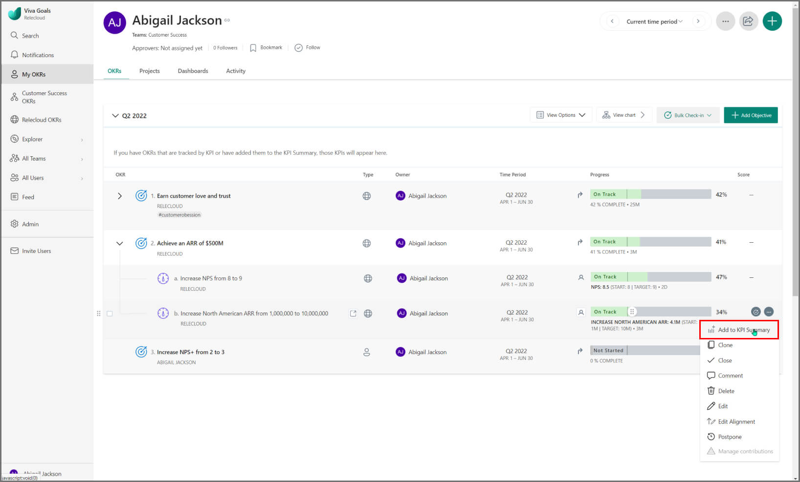
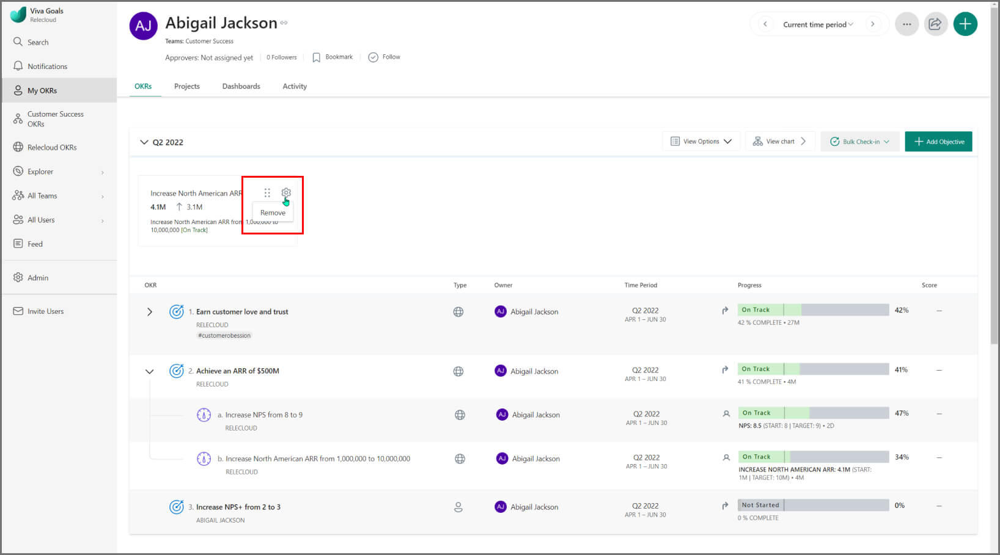

# Key Performance Indicator (KPI) Summary

> [!IMPORTANT]
> Viva Goals is currently available only for private preview customers, and only in English. The features described here are subject to change. Viva Goals is only being released to WW tenants. It isn't being released to GCC, GCC High, or DoD environments. [Learn more about Viva Goals.](https://go.microsoft.com/fwlink/?linkid=2189933)

The Viva Goals KPI Summary enables users to view one or many KPIs in a single view.

If your organization has the KPI Summary option enabled, it will be found on all dashboards in Viva Goals, and can be configured differently for each team.

## KPI Summary

The KPI Summary contains all top-level objectives that are set as KPIs. It displays the alignment (if there's any), the status given at last check-in, and the current value. The summary also shows the progress from the start value in small gray text.

## Who can manage KPI summaries? 

A KPI summary can be managed by anyone who has administrator permissions for the view.

A Viva Goals administrator or organization owner can manage the organization-level summary.

A team owner or team administrator can manage their team's KPI Summary.

Individual contributors can manage the KPI Summary for objectives they own.

## How to add more KPIs to the KPI Summary

If an objective has key results below it or there are other key results set as KPIs, users can manually add those to the KPI Summary by using the action button.

There's no limit on the number of KPIs you can include. But we suggest you include only your business's most critical KPIs to ensure a digestible view.

## Remove a KPI from the KPI Summary
  
To remove a KPI from the KPI Summary, section **Remove from KPI Summary** from the action dropdown.

## Rearrange KPIs in your KPI Summary

To move a KPI tile, drag and drop it into the new position. The previous KPIs will move up to fill the space. 
