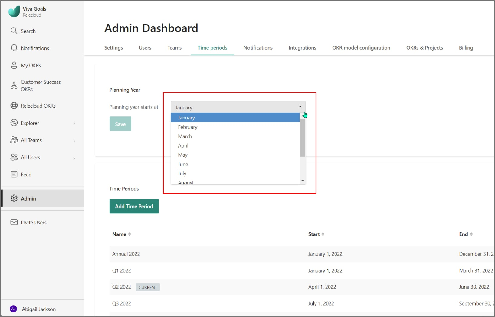
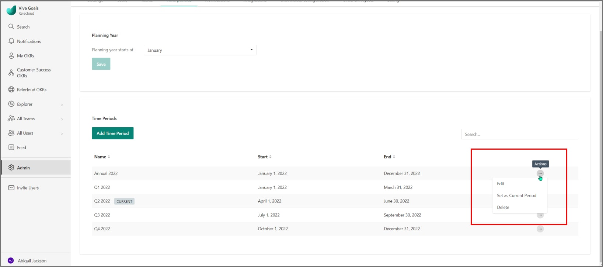

# Manage OKR time periods

> [!IMPORTANT]
> Viva Goals is currently available only for private preview customers, and only in English. The features described here are subject to change. [Learn more about Viva Goals.](https://go.microsoft.com/fwlink/?linkid=2189933)

## Time periods in Viva Goals

Viva Goals comes with both annual and quarterly time periods out of the box. Typically, organizations operate on an annual planning cadence and departments/teams operate on a quarterly planning cadence. 

The current time period in Viva Goals is where all OKR activity is happening and will be automatically managed by Viva Goals. 

When the current quarter ends and a new quarter begins, Viva Goals will automatically set the current time period for everyone in your organization to the new quarter. All users can see the current time period has changed to the new quarter.

As a Viva Goals administrator for your organization, you can manage the OKR time periods and customize them for your organization's requirements. Instead of the default quarterly periods, you can make time periods monthly or define a custom time period, and remove the default quarterly periods. 

When you switch to custom time period cadences, Viva Goals will no longer automatically switch the current time period. You will have to manually switch the current period whenever you are ready.

## How to manage time periods in Viva Goals

1. Navigate to the **Time Periods** section in your admin dashboard. Select and save the month when your planning year starts. It is set to January by default.  
 

    
2. Use the **Add Time Periods** option to add custom time periods.

3. Select **Actions** menu and Set **Custom** time period as **Current Time Period**.

## FAQs

**1. When are the time periods for my next planning year created?** 

The time periods for the next planning year(annual and quarterly) will be automatically created in Viva Goals on the first day of the fourth quarter(Q4) of your current planning year.

If you have already started planning for your next year's OKRs before Q4, you can add the next year time periods from the **Admin > Time Periods dashboard** and start adding your OKRs right away!

**2. Why is my current time period not automatically switching after the last day of the period?**

When the administrator adds custom time periods, auto switching of the current time period no longer happens. Users will have to manually change the current time period every time.
