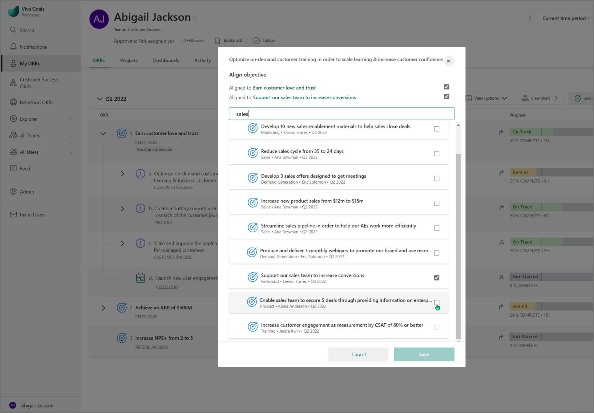

# Multiple Alignment

Viva Goals recognizes that the modern workplace is often made up of non-linear organizational structures and goal matrixes. The Multiple Alignment feature helps with this. 

## What is Multiple Alignment? 

The Multiple Alignment feature in Viva Goals allows users to align a single OKR to two or more above it in the organization.

Multiple Aligned objectives are easy to distinguish from the rest; just look for the double arrow icon.

## How to use Multiple Alignment

If Multiple Alignment is enabled, you'll be able to align in the same manner as single alignment, but you'll be able to select multiple objectives.

In this image, you can see the alignment to both **Culture Communication** and **Deliver Project Y by first week of December**.

If an objective is aligned to multiples above, the progress roll-up will cascade normally—you're simply contributing to both objectives at a higher level. 

## When to use Multiple Alignment

- Users can use Multiple Alignment if there's an individual objective that contributes to two separate team objectives.

- Users can also use Multiple Alignment to group similar individual objectives that are separately aligned to teams above into a single individual objective, further improving the focus of their personal dashboard.

## Multiple Alignment and Private Objectives

Viva Goals now allows enabling both the Multiple Alignment and [Private Objectives & Key Results](private-objectives-key-results.md) features at the same time, with the following restrictions:

- Users can make Private a Multiple Alignment Public OKR, but first the process will remove all alignment.

- No Key Result of a Private Objective will be allowed to use Multiple Alignment.
