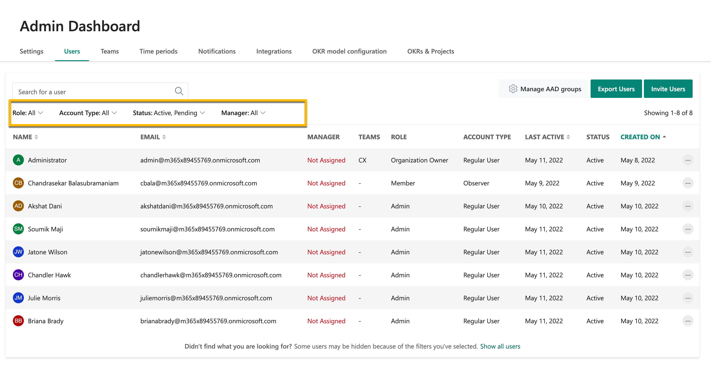

# Navigate the Admin Dashboard

> [!IMPORTANT]
> Viva Goals is currently available only for private preview customers, and only in English. The features described here are subject to change. [Learn more about Viva Goals.](https://go.microsoft.com/fwlink/?linkid=2189933)

Organization Admins have direct access to the Microsoft Viva Goals admin dashboard, customized settings that can be applied specifically for your organization, creating efficiency and confidence in your instance of Microsoft Viva Goals.

Like other employees, you’ll need to be familiar with:  
- The OKR framework  
- How to write great OKRs  
- Viva Goals software training 

Please review the [Get Started with Viva Goals Learning path](/learn/paths/viva-goals-get-started) to dive deeper into these topics.  

## How to access the Admin Dashboard and what to do there 

To access the Viva Goals Admin Dashboard, navigate toward the bottom of the left side panel and select “Admin” next to the gear icon.  

Organization Admins configure the Viva Goals instance and have access to settings in the Admin dashboard to set up users, teams, time periods, notifications, integrations, and OKRs & Projects. 

Navigating the Admin Dashboard is the first thing you should do in our recommended first five steps as an Organization Admin:  

1. Navigate your settings in the Admin Dashboard, and configure the instance according to your business rhythms 

1. [Invite users](/viva/goals/inviting-and-removing-a-user)

1. [Create teams and assign users to them](/viva/goals/reate-and-edit-teams-and-subteams) 

1. [Add OKRs](/viva/goals/creating-okrs) 

1. [Set up integrations](/viva/goals/integrations-overview) 
 
## Overview of the tabs in the Admin Dashboard 

### Settings 

The Settings tab allows you to control general settings such as the people and teams in your organization.  

- Who Can Join This Organization controls who is allowed to join your instance of Viva Goals and view your organization.  

- Account Type for New Users controls the default account type for new users. Viva Goals supports two account types: Regular User and Observer. For more information on these account types, visit our Roles and Permissions article here. Whatever you choose can be changed later.  

- Invite Policy controls who can add users to your Viva Goals instance.  

- Team Creation is a feature that allows you to segment your organization into different workgroups and then add employees to those groups in Viva Goals. These groups will own team-level OKRs, and this particular setting controls who can create teams.  

- Tag Creation is a feature that allows you to categorize OKRs in buckets that you can later filter in a report.  
 
### Users  

Within the Users tab you will find a list of all the individuals that have been added to your instance. This page also serves as a report and you can use the export button to download a CSV file with people information.  

All of the information can be filtered using drop down menus such as role, account type, status and Manager.  

For example, if one of your users is not sure if they got an invite, you could filter for users with a status of Pending.  

As admin, you can use the action menu, marked by the three dots, to modify various settings. 

- Cancel Invite will retract an email that you sent.  
- Resend Invite will resend an invitation to join your instance. 
- Deactivate will deactivate a user, essentially locking them out of Viva Goals. All of their OKRs and historical information will remain, but they will not be able to log in to Viva Goals. You might consider using this for someone that has left the company. You can reactivate them if needed. You will not be billed for deactivated users.  
- Edit allows you to view basic information about the employee such as name and email, and assign teams from this view.  
- Make Admin lets you add or remove privileges from a user.  
- Delete allows you to permanently delete a user from Viva Goals. 
- Change to Observer allows you to change the type of user to observer or back to a regular user.  

### Teams 

This tab shows all the teams you have set up, plus the team owner and members. You can add new teams by selecting the “Add Team” button. To modify team settings, select the ellipses next to a given team. Read more in the [Create and Edit Teams article](/viva/goals/create-and-edit-teams-and-subteams).

### Notifications 

The Notifications tab lets you customize the notifications sent to employees. As an admin, this is a critical feature that helps drive the rhythm of the business. In a perfect world, every employee consistently checks in their OKRs, but we know from experience that sometimes it takes a little nudge. Learn more in the [Check In and Track Progress article](/viva/goals/check-ins-and-progress-status).

### Integrations 

The Integrations tab lets you manage integrations in three categories:  

- Messaging integrations: MS Teams 
- Data integrations: Asana, Jira, Salesforce, and more  
- Authentication integrations: AAD only  

To learn more, read our Integrations [Overview article here](/viva/goals/integrations-overview).

There are two steps required to start using most integrations. As an example, let’s say your company wants to integrate with Excel. 

- **Step 1: The Excel integration must be enabled in the Admin Dashboard.** This is a one-time, organization-level setting that essentially says “I authorize the company to use Excel as an integration with Ally.” 

- **Step 2: The Excel integration can now be used at the individual level.** This is a one-time, user-level setting that essentially says “I want a certain OKR to pull data from Excel as an integration with Viva Goals.” 

As an admin, you have the ability to oversee and manage these integrations. Continuing our Excel example, you can disable the integration for the whole company, add a new connection, or view existing connections and re-authenticate, edit, or delete them. 

For a messaging integration like MS Teams, you can add, edit, or delete notifications. Let’s say you want to ring a virtual bell every time the sales team lands a sale. You can add a notification that does the following: 

- For the sales team… 
- Every time there’s a new check in 
- Post that message to a specific sales team channel 

You can also enable private group notifications between users and their managers. 

As a best practice, it’s a good idea to take a crawl, walk, run approach with integrations. While it may be tempting to see our long list of options and turn several on right off the bat, first make sure your employees are comfortable with writing OKRs and using Viva Goals. From there, it can be useful to start with one group, such as Jira for the product team, before rolling integrations out to a larger audience.

### Time Periods 

Viva Goals comes with both annual and quarterly time periods out of the box. Typically, organizations operate on an annual planning cadence and departments/teams operate on a quarterly planning cadence.  

Admins can manage the OKR time periods and customize them for your organization's requirements. Instead of the default quarterly periods, you can make time periods monthly or define a custom time period, and remove the default quarterly periods. 

To learn more, visit our [Manage OKR Time Periods](/viva/goals/managing-okr-time-periods) article.

### OKR Model Configuration 

Viva Goals understands every business has its own set of processes and lets you configure and create your own OKR rules to fit your business needs.

To learn more, visit our [Configure Your OKR Model in Viva Goals](/viva/goals/configure-okr-model) article.

### OKRs & Projects 

Admins can determine whether they want to allow multiple teams and OKR owners to collaborate on key objectives and projects. Admins can also establish OKR approval settings here.  

To learn more about Projects, visit our [Projects](/viva/goals/projects) article. 