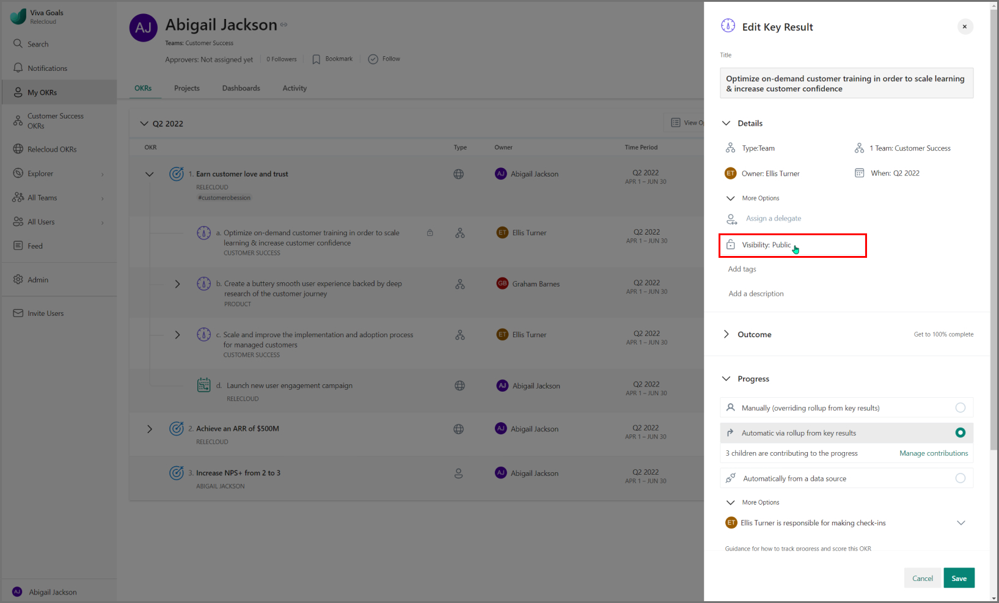
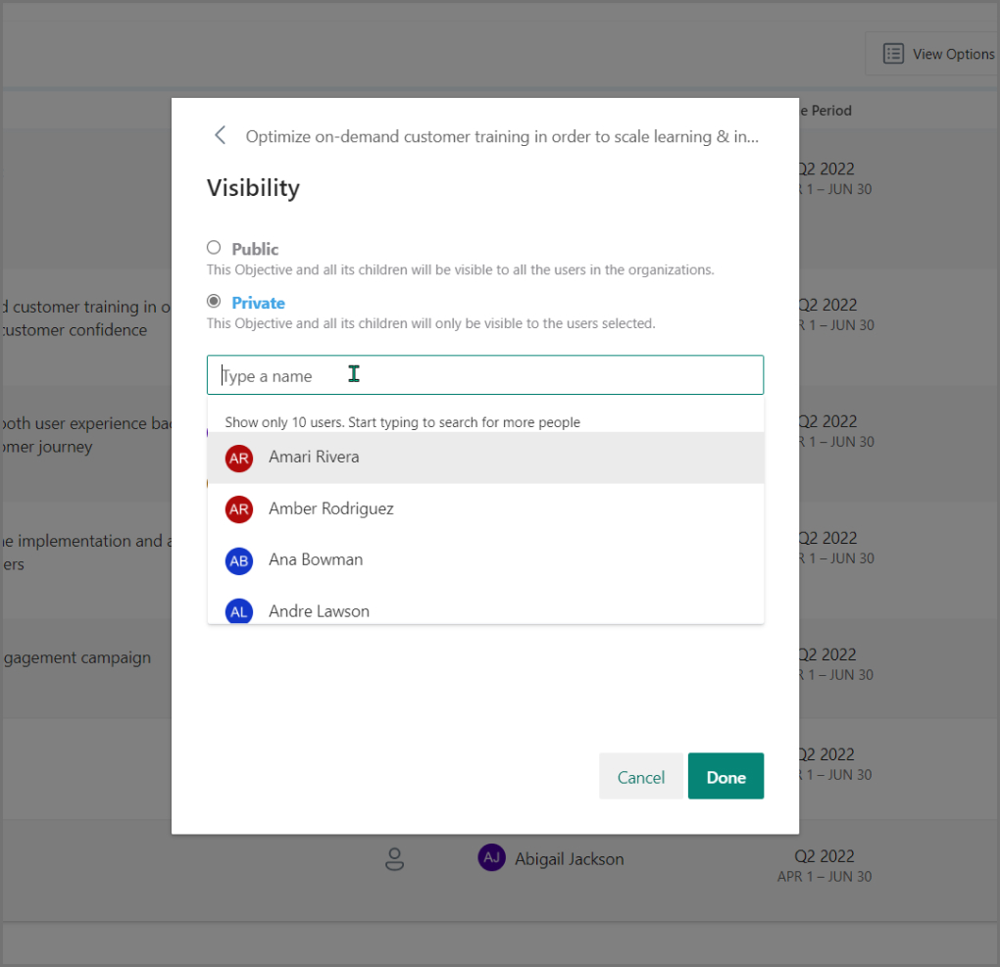
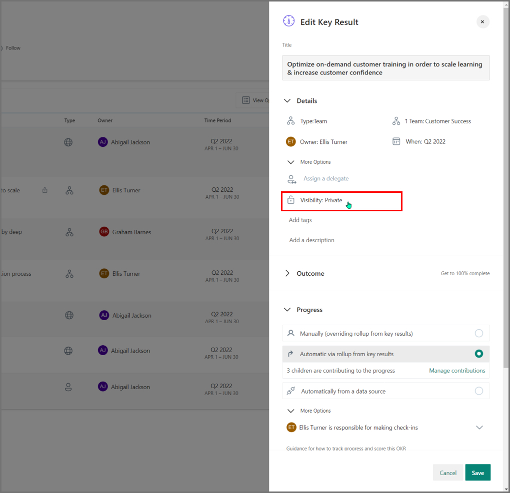

# Private Objectives 

> [!IMPORTANT]
> Viva Goals is currently available only for private preview customers, and only in English. The features described here are subject to change. Viva Goals is only being released to WW tenants. It isn't being released to GCC, GCC High, or DoD environments. [Learn more about Viva Goals.](https://go.microsoft.com/fwlink/?linkid=2189933)

While the OKR methodology promotes transparency across the entire organization, Viva Goals recognizes that large enterprises often have sensitive objectives that require a limited audience.

## What are private objectives?

The Private Objectives feature in Viva Goals allows users to make certain objectives visible only to themselves and designated individuals.

Private objectives are distinguished from others by a padlock icon. Hover over the icon to display the list of users who can see the objective. This icon also lets the owner manage this list of users.

- Private objectives are only visible in Objective Explorer to this list of users.

- A private objective's comments, likes, and check-ins are only visible to the designated list of viewers.

- Private objectives can be set at the organization, team, or individual levels.

## How to make an objective private

If your organization has this feature enabled, the option is available when you create or edit an objective.

By default, all objectives are visible to the entire organization unless you follow these steps to mark them as private:

1. Select **Who can view** in the **Add/Edit Objective** window.

2. Select **Choose who has access** to make it private to only specified people, and select **Done**.

    > [!NOTE]
    > This users on the list will also be able to see any key results below the objective.

   

3. Now the user can see this objective is private to them and one other person.

The owner of the object can modify privacy of that objective.

## Key considerations for private objectives

- Making an objective private automatically confers the same privacy settings to its key results.
- An objective can't be made private if any of its key results are in multiple alignments.  
- The key results of a private objective can't be multi-aligned to more than one private objective.
- By default, private OKRs can't be aligned to public OKRs.
- If your organization wants to be able to have public objectives with private key results, we can enable that functionality.

